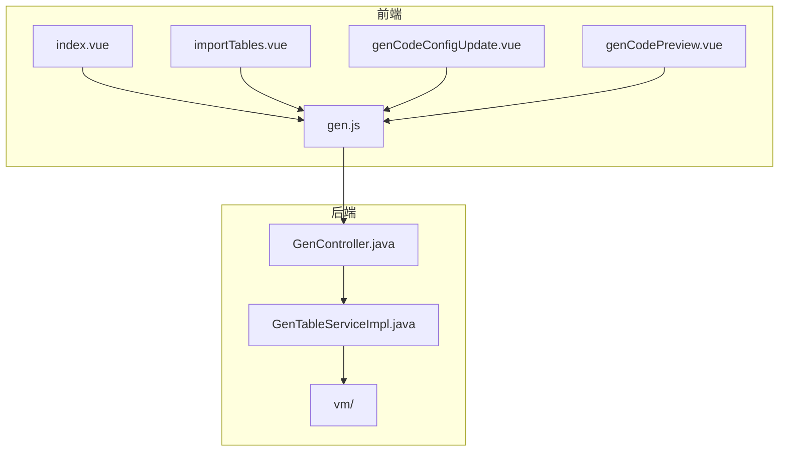
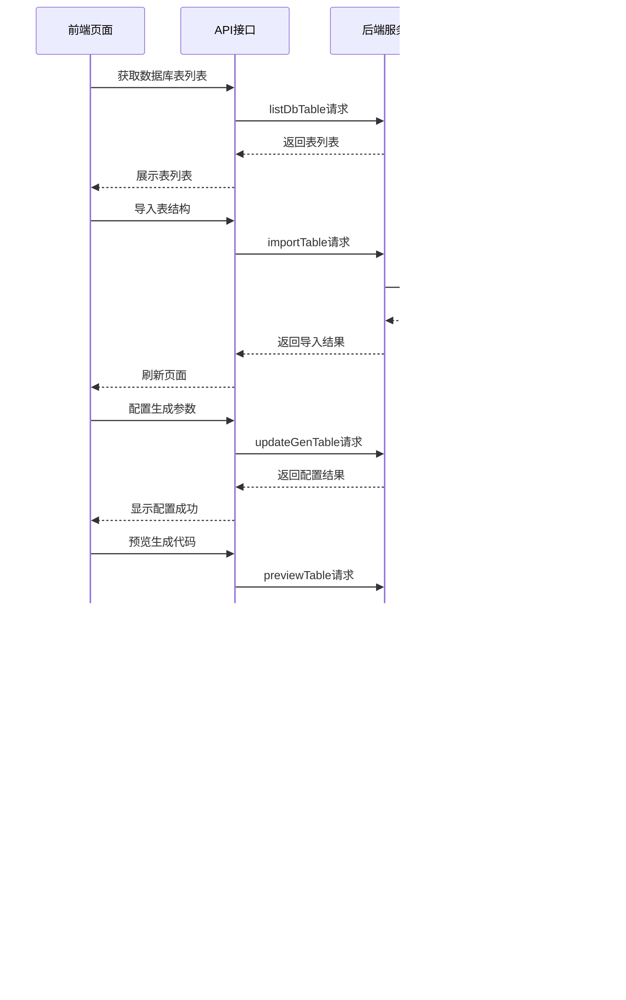
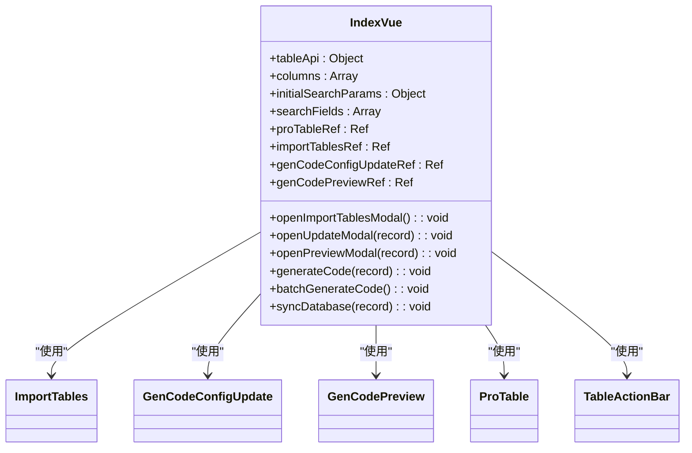
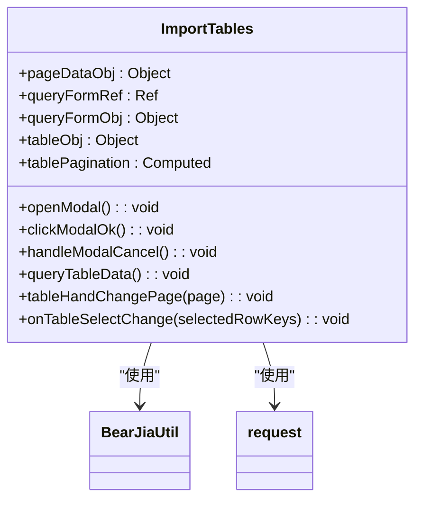
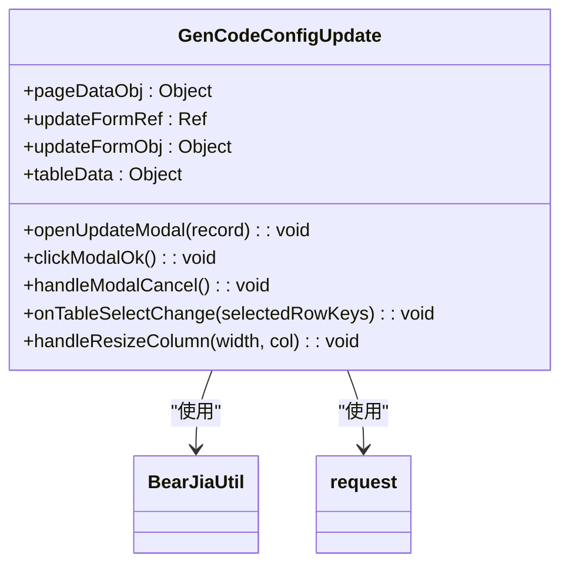
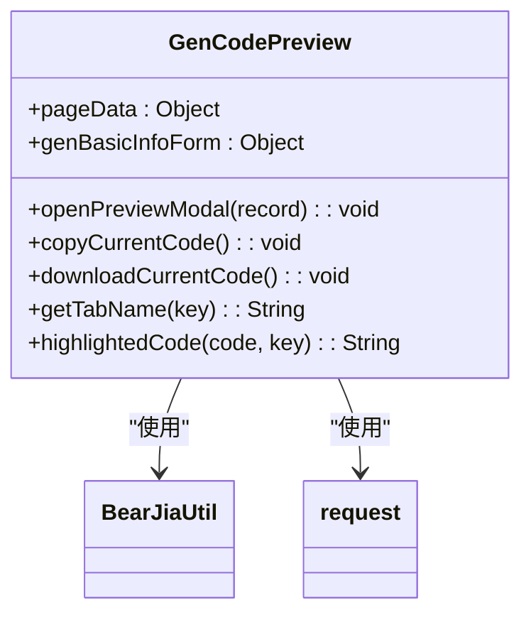
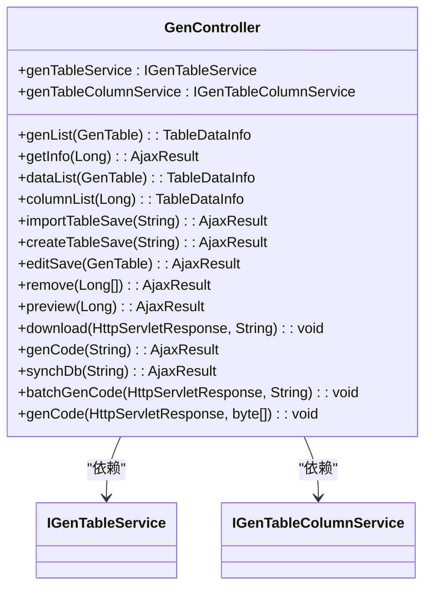
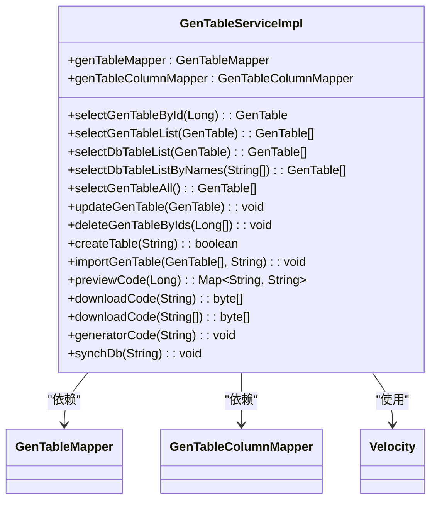
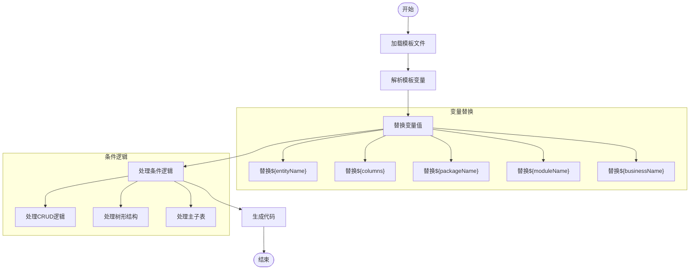
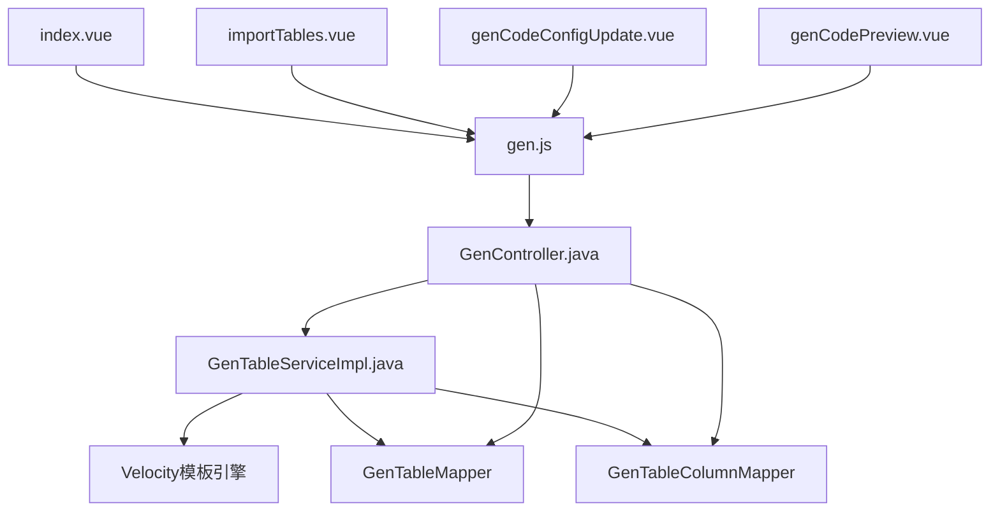

# 代码生成器

<cite>
**本文档引用文件**   
- [index.vue](file://bear-jia-vue3\src\views\tool\gen\index.vue)
- [importTables.vue](file://bear-jia-vue3\src\views\tool\gen\importTables.vue)
- [genCodeConfigUpdate.vue](file://bear-jia-vue3\src\views\tool\gen\genCodeConfigUpdate.vue)
- [genCodePreview.vue](file://bear-jia-vue3\src\views\tool\gen\genCodePreview.vue)
- [gen.js](file://bear-jia-vue3\src\api\tool\gen.js)
- [GenController.java](file://bearjia-admin-backend\src\main\java\com\javaxiaobear\module\tool\gen\controller\GenController.java)
- [GenTableServiceImpl.java](file://bearjia-admin-backend\src\main\java\com\javaxiaobear\module\tool\gen\service\GenTableServiceImpl.java)
- [domain.java.vm](file://bearjia-admin-backend\src\main\resources\vm\java\domain.java.vm)
- [controller.java.vm](file://bearjia-admin-backend\src\main\resources\vm\java\controller.java.vm)
- [index.vue.vm](file://bearjia-admin-backend\src\main\resources\vm\antdv\index.vue.vm)
- [index.vue.vm](file://bearjia-admin-backend\src\main\resources\vm\bearjia\index.vue.vm)
- [README.md](file://bearjia-admin-backend\src\main\resources\vm\README.md)
</cite>

## 目录
1. [简介](#简介)
2. [项目结构](#项目结构)
3. [核心组件](#核心组件)
4. [架构概述](#架构概述)
5. [详细组件分析](#详细组件分析)
6. [依赖分析](#依赖分析)
7. [性能考虑](#性能考虑)
8. [故障排除指南](#故障排除指南)
9. [结论](#结论)

## 简介
本文档详细介绍了代码生成器的前后端协同工作机制。系统通过前端页面与后端服务的紧密配合，实现了从数据库表结构到完整前后端代码的自动化生成。前端提供直观的用户界面，包括表列表展示、参数配置和代码预览功能；后端则负责元数据处理和代码生成，使用Velocity模板引擎根据预定义模板生成高质量的代码文件。整个系统支持主子表关联生成、自定义业务逻辑注入，并提供了批量生成的性能优化策略。

## 项目结构
代码生成器项目采用前后端分离架构，前端基于Vue3和Ant Design Vue组件库，后端采用Spring Boot框架。系统通过RESTful API进行通信，实现了完整的代码生成功能。

**图表来源**
- [index.vue](file://bear-jia-vue3\src\views\tool\gen\index.vue)
- [importTables.vue](file://bear-jia-vue3\src\views\tool\gen\importTables.vue)
- [genCodeConfigUpdate.vue](file://bear-jia-vue3\src\views\tool\gen\genCodeConfigUpdate.vue)
- [genCodePreview.vue](file://bear-jia-vue3\src\views\tool\gen\genCodePreview.vue)
- [gen.js](file://bear-jia-vue3\src\api\tool\gen.js)
- [GenController.java](file://bearjia-admin-backend\src\main\java\com\javaxiaobear\module\tool\gen\controller\GenController.java)
- [GenTableServiceImpl.java](file://bearjia-admin-backend\src\main\java\com\javaxiaobear\module\tool\gen\service\GenTableServiceImpl.java)

**章节来源**
- [index.vue](file://bear-jia-vue3\src\views\tool\gen\index.vue)
- [importTables.vue](file://bear-jia-vue3\src\views\tool\gen\importTables.vue)
- [genCodeConfigUpdate.vue](file://bear-jia-vue3\src\views\tool\gen\genCodeConfigUpdate.vue)
- [genCodePreview.vue](file://bear-jia-vue3\src\views\tool\gen\genCodePreview.vue)
- [gen.js](file://bear-jia-vue3\src\api\tool\gen.js)

## 核心组件
代码生成器的核心组件包括前端的四个主要Vue组件和后端的控制器与服务实现。前端组件负责用户交互和界面展示，后端组件处理业务逻辑和代码生成。系统通过API调用实现前后端数据交换，前端页面通过配置参数控制代码生成行为，后端服务使用Velocity模板引擎生成最终代码文件。

**章节来源**
- [index.vue](file://bear-jia-vue3\src\views\tool\gen\index.vue)
- [importTables.vue](file://bear-jia-vue3\src\views\tool\gen\importTables.vue)
- [genCodeConfigUpdate.vue](file://bear-jia-vue3\src\views\tool\gen\genCodeConfigUpdate.vue)
- [genCodePreview.vue](file://bear-jia-vue3\src\views\tool\gen\genCodePreview.vue)
- [GenController.java](file://bearjia-admin-backend\src\main\java\com\javaxiaobear\module\tool\gen\controller\GenController.java)
- [GenTableServiceImpl.java](file://bearjia-admin-backend\src\main\java\com\javaxiaobear\module\tool\gen\service\GenTableServiceImpl.java)

## 架构概述
代码生成器采用典型的前后端分离架构，前端负责用户界面和交互逻辑，后端提供RESTful API服务。系统通过模板引擎实现代码的动态生成，支持多种前端框架和后端架构的代码生成。

**图表来源**
- [index.vue](file://bear-jia-vue3\src\views\tool\gen\index.vue)
- [importTables.vue](file://bear-jia-vue3\src\views\tool\gen\importTables.vue)
- [genCodeConfigUpdate.vue](file://bear-jia-vue3\src\views\tool\gen\genCodeConfigUpdate.vue)
- [genCodePreview.vue](file://bear-jia-vue3\src\views\tool\gen\genCodePreview.vue)
- [gen.js](file://bear-jia-vue3\src\api\tool\gen.js)
- [GenController.java](file://bearjia-admin-backend\src\main\java\com\javaxiaobear\module\tool\gen\controller\GenController.java)
- [GenTableServiceImpl.java](file://bearjia-admin-backend\src\main\java\com\javaxiaobear\module\tool\gen\service\GenTableServiceImpl.java)

## 详细组件分析

### 前端页面分析
前端页面通过Vue组件实现了代码生成器的完整用户界面。系统包含四个主要组件：主页面、导入表、配置更新和代码预览。

#### 主页面组件

**图表来源**
- [index.vue](file://bear-jia-vue3\src\views\tool\gen\index.vue)

**章节来源**
- [index.vue](file://bear-jia-vue3\src\views\tool\gen\index.vue)

#### 导入表组件

**图表来源**
- [importTables.vue](file://bear-jia-vue3\src\views\tool\gen\importTables.vue)

**章节来源**
- [importTables.vue](file://bear-jia-vue3\src\views\tool\gen\importTables.vue)

#### 配置更新组件

**图表来源**
- [genCodeConfigUpdate.vue](file://bear-jia-vue3\src\views\tool\gen\genCodeConfigUpdate.vue)

**章节来源**
- [genCodeConfigUpdate.vue](file://bear-jia-vue3\src\views\tool\gen\genCodeConfigUpdate.vue)

#### 代码预览组件

**图表来源**
- [genCodePreview.vue](file://bear-jia-vue3\src\views\tool\gen\genCodePreview.vue)

**章节来源**
- [genCodePreview.vue](file://bear-jia-vue3\src\views\tool\gen\genCodePreview.vue)

### 后端服务分析
后端服务采用Spring Boot框架，通过RESTful API提供代码生成功能。系统包含控制器和业务服务两个主要组件。

#### 控制器组件

**图表来源**
- [GenController.java](file://bearjia-admin-backend\src\main\java\com\javaxiaobear\module\tool\gen\controller\GenController.java)

**章节来源**
- [GenController.java](file://bearjia-admin-backend\src\main\java\com\javaxiaobear\module\tool\gen\controller\GenController.java)

#### 服务实现组件

**图表来源**
- [GenTableServiceImpl.java](file://bearjia-admin-backend\src\main\java\com\javaxiaobear\module\tool\gen\service\GenTableServiceImpl.java)

**章节来源**
- [GenTableServiceImpl.java](file://bearjia-admin-backend\src\main\java\com\javaxiaobear\module\tool\gen\service\GenTableServiceImpl.java)

### 模板引擎分析
代码生成器使用Velocity模板引擎实现代码的动态生成。系统包含多种模板文件，支持前后端代码的生成。

#### 模板变量替换逻辑

**图表来源**
- [domain.java.vm](file://bearjia-admin-backend\src\main\resources\vm\java\domain.java.vm)
- [controller.java.vm](file://bearjia-admin-backend\src\main\resources\vm\java\controller.java.vm)
- [index.vue.vm](file://bearjia-admin-backend\src\main\resources\vm\antdv\index.vue.vm)
- [index.vue.vm](file://bearjia-admin-backend\src\main\resources\vm\bearjia\index.vue.vm)

**章节来源**
- [domain.java.vm](file://bearjia-admin-backend\src\main\resources\vm\java\domain.java.vm)
- [controller.java.vm](file://bearjia-admin-backend\src\main\resources\vm\java\controller.java.vm)

## 依赖分析
代码生成器系统的组件依赖关系清晰，前后端通过API接口进行通信，后端服务依赖模板引擎实现代码生成。

**图表来源**
- [index.vue](file://bear-jia-vue3\src\views\tool\gen\index.vue)
- [importTables.vue](file://bear-jia-vue3\src\views\tool\gen\importTables.vue)
- [genCodeConfigUpdate.vue](file://bear-jia-vue3\src\views\tool\gen\genCodeConfigUpdate.vue)
- [genCodePreview.vue](file://bear-jia-vue3\src\views\tool\gen\genCodePreview.vue)
- [gen.js](file://bear-jia-vue3\src\api\tool\gen.js)
- [GenController.java](file://bearjia-admin-backend\src\main\java\com\javaxiaobear\module\tool\gen\controller\GenController.java)
- [GenTableServiceImpl.java](file://bearjia-admin-backend\src\main\java\com\javaxiaobear\module\tool\gen\service\GenTableServiceImpl.java)

**章节来源**
- [index.vue](file://bear-jia-vue3\src\views\tool\gen\index.vue)
- [importTables.vue](file://bear-jia-vue3\src\views\tool\gen\importTables.vue)
- [genCodeConfigUpdate.vue](file://bear-jia-vue3\src\views\tool\gen\genCodeConfigUpdate.vue)
- [genCodePreview.vue](file://bear-jia-vue3\src\views\tool\gen\genCodePreview.vue)
- [gen.js](file://bear-jia-vue3\src\api\tool\gen.js)
- [GenController.java](file://bearjia-admin-backend\src\main\java\com\javaxiaobear\module\tool\gen\controller\GenController.java)
- [GenTableServiceImpl.java](file://bearjia-admin-backend\src\main\java\com\javaxiaobear\module\tool\gen\service\GenTableServiceImpl.java)

## 性能考虑
代码生成器在批量生成时采用了多种性能优化策略。系统通过异步处理和流式传输避免内存溢出，使用缓存机制减少重复计算，并通过并行处理提高生成效率。后端服务在生成大量代码文件时，采用分批处理和压缩流的方式，确保系统稳定性和响应速度。

**章节来源**
- [GenTableServiceImpl.java](file://bearjia-admin-backend\src\main\java\com\javaxiaobear\module\tool\gen\service\GenTableServiceImpl.java)
- [GenController.java](file://bearjia-admin-backend\src\main\java\com\javaxiaobear\module\tool\gen\controller\GenController.java)

## 故障排除指南
当代码生成器出现问题时，可以按照以下步骤进行排查：

1. **检查API连接**：确保前后端服务正常运行，API接口可访问
2. **验证模板文件**：检查vm目录下的模板文件是否存在且格式正确
3. **检查参数配置**：确认生成参数配置正确，特别是包路径和模块名称
4. **查看日志信息**：检查后端服务日志，定位具体错误原因
5. **验证数据库连接**：确保数据库连接正常，表结构信息可正确读取

**章节来源**
- [GenController.java](file://bearjia-admin-backend\src\main\java\com\javaxiaobear\module\tool\gen\controller\GenController.java)
- [GenTableServiceImpl.java](file://bearjia-admin-backend\src\main\java\com\javaxiaobear\module\tool\gen\service\GenTableServiceImpl.java)

## 结论
代码生成器通过前后端协同工作机制，实现了从数据库表结构到完整前后端代码的自动化生成。系统采用模块化设计，前后端职责分明，通过RESTful API进行通信。前端提供友好的用户界面，支持表结构导入、参数配置和代码预览；后端使用Velocity模板引擎，根据预定义模板生成高质量的代码文件。系统支持主子表关联生成、自定义业务逻辑注入，并提供了批量生成的性能优化策略，大大提高了开发效率。