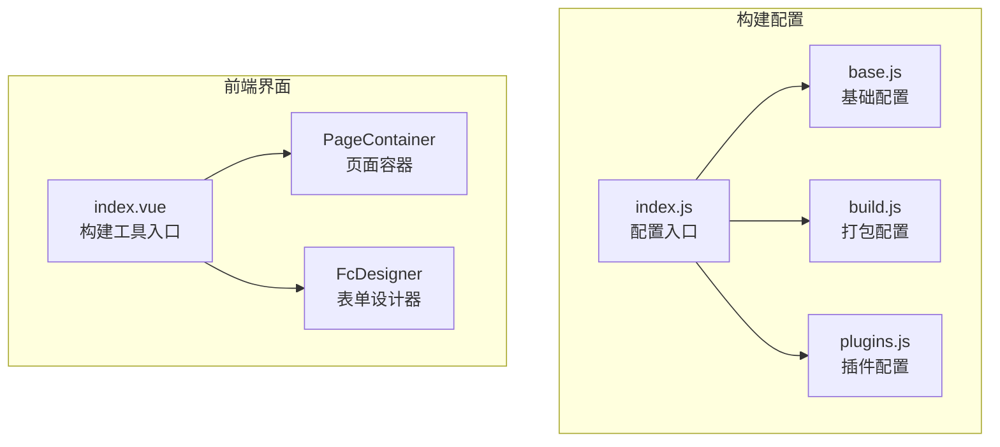
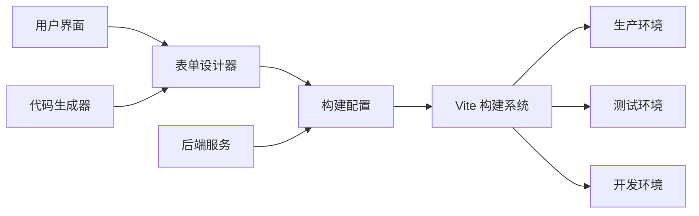
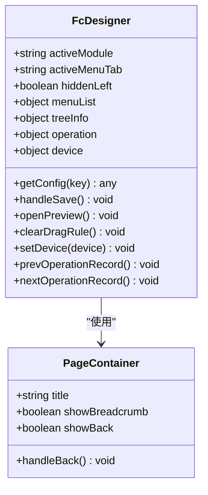
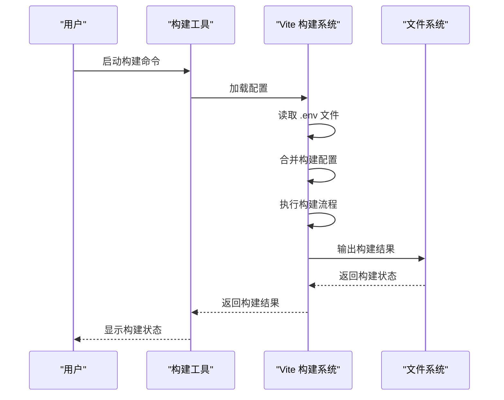
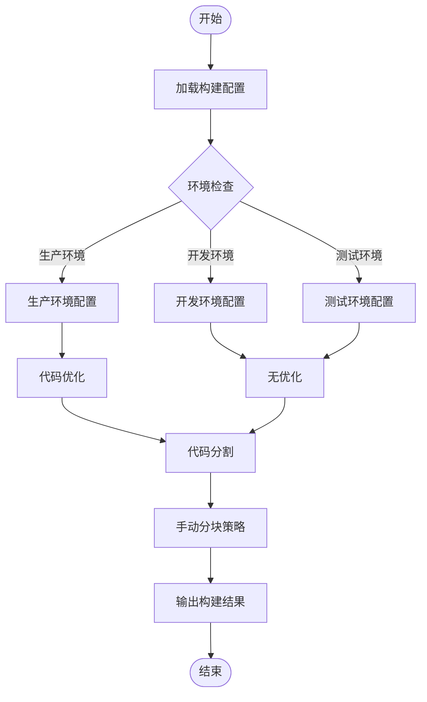
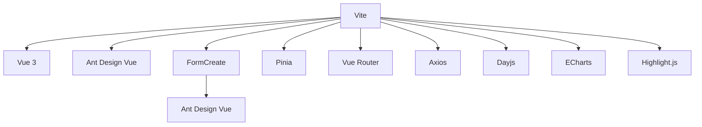

# 构建工具

<cite>
**本文档引用文件**  
- [index.vue](file://bear-jia-vue3/src/views/tool/build/index.vue)
- [FcDesigner.vue](file://bear-jia-vue3/node_modules/@form-create/antd-designer/src/components/FcDesigner.vue)
- [build.js](file://bear-jia-vue3/config/vite/build.js)
- [index.js](file://bear-jia-vue3/config/vite/index.js)
- [package.json](file://bear-jia-vue3/package.json)
- [main.js](file://bear-jia-vue3/src/main.js)
- [.env](file://bear-jia-vue3/.env)
- [.env.test](file://bear-jia-vue3/.env.test)
</cite>

## 目录
1. [简介](#简介)
2. [项目结构](#项目结构)
3. [核心组件](#核心组件)
4. [架构概述](#架构概述)
5. [详细组件分析](#详细组件分析)
6. [依赖分析](#依赖分析)
7. [性能考虑](#性能考虑)
8. [故障排除指南](#故障排除指南)
9. [结论](#结论)

## 简介
本文档详细说明了构建工具在系统中的集成方式与实际使用场景。重点描述前端界面的功能布局与用户交互流程，包括构建配置的输入、验证与提交机制。同时解释该工具与后端服务的接口通信方式，如何触发系统构建流程或执行特定运维任务。结合项目实际，说明构建工具与代码生成器的协作关系，例如在代码生成后自动触发前端构建流程。文档包含配置参数说明、常见使用案例（如环境打包、静态资源优化）、错误处理机制，并提供调试建议和性能监控指标，帮助用户高效利用该工具完成系统集成与部署任务。

## 项目结构
构建工具主要位于 `bear-jia-vue3` 项目的 `src/views/tool/build` 目录下，通过 Vite 构建系统进行配置和打包。项目使用模块化配置方式，将构建配置分离到不同的文件中。

**图源**  
- [build.js](file://bear-jia-vue3/config/vite/build.js)
- [index.js](file://bear-jia-vue3/config/vite/index.js)
- [index.vue](file://bear-jia-vue3/src/views/tool/build/index.vue)

**节源**  
- [build.js](file://bear-jia-vue3/config/vite/build.js)
- [index.js](file://bear-jia-vue3/config/vite/index.js)
- [index.vue](file://bear-jia-vue3/src/views/tool/build/index.vue)

## 核心组件
构建工具的核心是表单设计器（FcDesigner），它提供了一个可视化界面来创建和编辑表单。该组件支持拖拽操作、实时预览、JSON 导出等功能。构建配置通过 Vite 的模块化配置实现，支持不同环境的构建参数设置。

**节源**  
- [FcDesigner.vue](file://bear-jia-vue3/node_modules/@form-create/antd-designer/src/components/FcDesigner.vue)
- [build.js](file://bear-jia-vue3/config/vite/build.js)

## 架构概述
构建工具采用前后端分离架构，前端使用 Vue 3 和 Ant Design Vue 组件库，后端提供 API 接口。构建过程通过 Vite 实现，支持代码分割、压缩优化、静态资源处理等特性。

**图源**  
- [FcDesigner.vue](file://bear-jia-vue3/node_modules/@form-create/antd-designer/src/components/FcDesigner.vue)
- [build.js](file://bear-jia-vue3/config/vite/build.js)
- [index.js](file://bear-jia-vue3/config/vite/index.js)

## 详细组件分析

### 表单设计器分析
表单设计器是构建工具的核心组件，提供可视化表单创建功能。用户可以通过拖拽方式添加表单元素，实时预览效果，并导出 JSON 配置。

#### 对象导向组件

**图源**  
- [FcDesigner.vue](file://bear-jia-vue3/node_modules/@form-create/antd-designer/src/components/FcDesigner.vue)
- [index.vue](file://bear-jia-vue3/src/views/tool/build/index.vue)

**节源**  
- [FcDesigner.vue](file://bear-jia-vue3/node_modules/@form-create/antd-designer/src/components/FcDesigner.vue)
- [index.vue](file://bear-jia-vue3/src/views/tool/build/index.vue)

### 构建配置分析
构建配置通过 Vite 的模块化方式实现，支持不同环境的构建参数设置。配置文件分离了基础配置、打包配置和插件配置，提高了可维护性。

#### API/服务组件

**图源**  
- [build.js](file://bear-jia-vue3/config/vite/build.js)
- [index.js](file://bear-jia-vue3/config/vite/index.js)
- [.env](file://bear-jia-vue3/.env)

**节源**  
- [build.js](file://bear-jia-vue3/config/vite/build.js)
- [index.js](file://bear-jia-vue3/config/vite/index.js)
- [.env](file://bear-jia-vue3/.env)

### 复杂逻辑组件
构建工具的代码分割策略采用了优化的分块策略，将不同类型的代码分割到不同的 chunk 中，以提高加载性能。

#### 流程图

**图源**  
- [build.js](file://bear-jia-vue3/config/vite/build.js)
- [index.js](file://bear-jia-vue3/config/vite/index.js)

**节源**  
- [build.js](file://bear-jia-vue3/config/vite/build.js)

## 依赖分析
构建工具依赖于多个第三方库和内部模块，通过合理的依赖管理确保系统的稳定性和可维护性。

**图源**  
- [package.json](file://bear-jia-vue3/package.json)
- [main.js](file://bear-jia-vue3/src/main.js)

**节源**  
- [package.json](file://bear-jia-vue3/package.json)
- [main.js](file://bear-jia-vue3/src/main.js)

## 性能考虑
构建工具在性能方面进行了多项优化，包括代码分割、压缩优化、静态资源处理等。生产环境构建时会移除 console.log 语句，减少包大小。同时通过合理的 chunk 分割策略，提高页面加载性能。

## 故障排除指南
当构建工具出现问题时，可以按照以下步骤进行排查：
1. 检查环境变量配置是否正确
2. 确认依赖包是否安装完整
3. 查看构建日志中的错误信息
4. 检查网络连接是否正常
5. 验证配置文件语法是否正确

**节源**  
- [.env](file://bear-jia-vue3/.env)
- [.env.test](file://bear-jia-vue3/.env.test)
- [package.json](file://bear-jia-vue3/package.json)

## 结论
构建工具通过集成表单设计器和 Vite 构建系统，提供了一套完整的前端开发解决方案。它不仅支持可视化表单创建，还提供了灵活的构建配置和优化策略。与代码生成器的协作使得开发流程更加高效，能够快速生成和部署应用。通过合理的架构设计和性能优化，构建工具能够满足不同规模项目的需求。