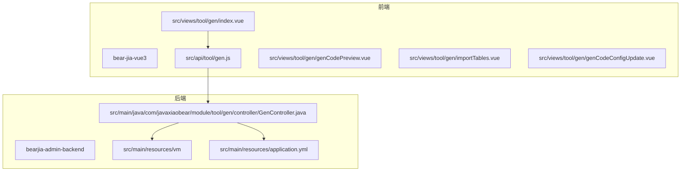
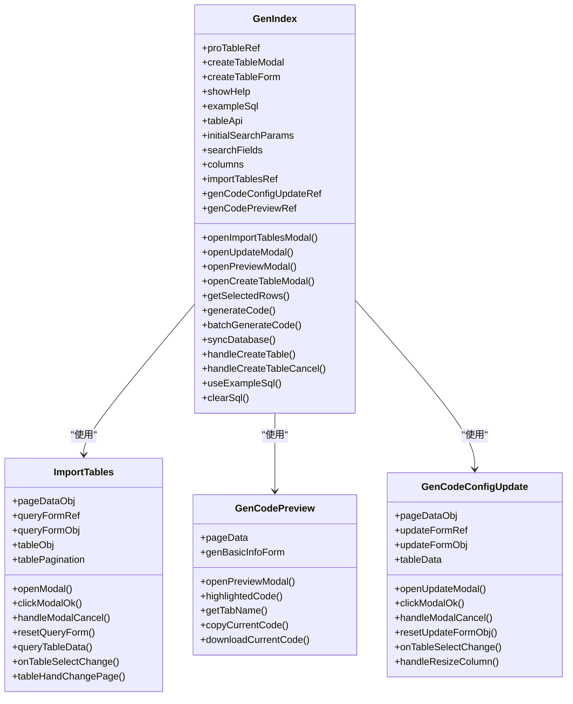
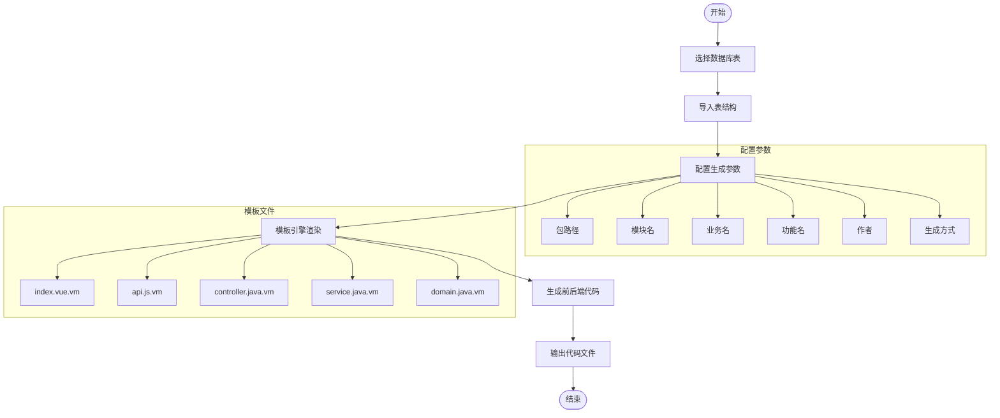
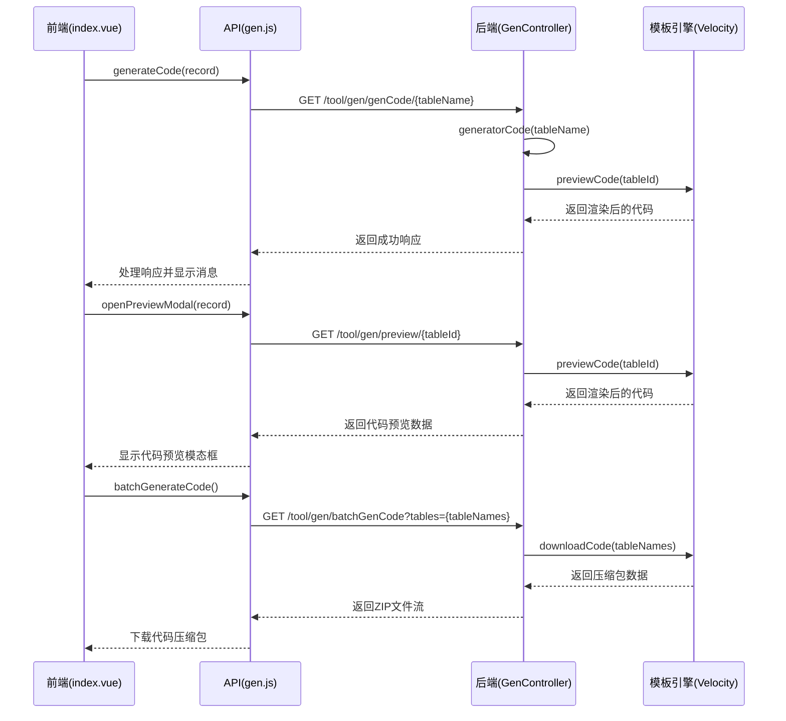
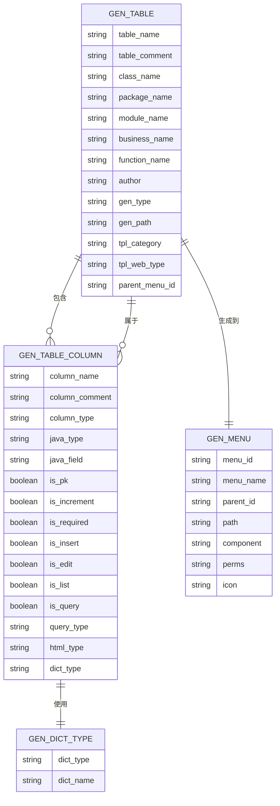

# 系统工具

<cite>
**本文档引用文件**  
- [index.vue](file://bear-jia-vue3\src\views\tool\gen\index.vue)
- [gen.js](file://bear-jia-vue3\src\api\tool\gen.js)
- [GenController.java](file://bearjia-admin-backend\src\main\java\com\javaxiaobear\module\tool\gen\controller\GenController.java)
- [index.vue.vm](file://bearjia-admin-backend\src\main\resources\vm\bearjia\index.vue.vm)
- [api.js.vm](file://bearjia-admin-backend\src\main\resources\vm\bearjia\api.js.vm)
- [controller.java.vm](file://bearjia-admin-backend\src\main\resources\vm\java\controller.java.vm)
- [genCodePreview.vue](file://bear-jia-vue3\src\views\tool\gen\genCodePreview.vue)
- [importTables.vue](file://bear-jia-vue3\src\views\tool\gen\importTables.vue)
- [genCodeConfigUpdate.vue](file://bear-jia-vue3\src\views\tool\gen\genCodeConfigUpdate.vue)
- [application.yml](file://bearjia-admin-backend\src\main\resources\application.yml)
- [BearJiaUtil.js](file://bear-jia-vue3\src\utils\BearJiaUtil.js)
</cite>

## 目录
1. [简介](#简介)
2. [项目结构](#项目结构)
3. [代码生成器核心组件](#代码生成器核心组件)
4. [系统接口构建工具](#系统接口构建工具)
5. [代码生成器工作流程](#代码生成器工作流程)
6. [模板引擎与变量替换机制](#模板引擎与变量替换机制)
7. [前后端交互逻辑](#前后端交互逻辑)
8. [高级配置选项](#高级配置选项)
9. [性能优化建议](#性能优化建议)
10. [结论](#结论)

## 简介
本系统工具文档详细介绍了代码生成器和系统接口构建工具的功能与实现。代码生成器基于Velocity模板引擎，能够根据数据库表结构自动生成前后端代码，包括Vue组件、API接口、Java实体类、Service层、Controller层等。系统接口构建工具则提供了Swagger集成，用于API文档的可视化展示和测试。整个系统通过前后端分离架构实现，前端使用Vue3和Ant Design Vue组件库，后端采用Spring Boot框架。

## 项目结构
系统工具主要包含两个核心模块：代码生成器（gen）和系统接口（swagger）。代码生成器位于前端`bear-jia-vue3/src/views/tool/gen`目录和后端`bearjia-admin-backend/src/main/java/com/javaxiaobear/module/tool/gen`目录中。系统接口工具通过集成Swagger实现，相关配置在后端`application.yml`文件中定义。



**图表来源**
- [index.vue](file://bear-jia-vue3\src\views\tool\gen\index.vue)
- [gen.js](file://bear-jia-vue3\src\api\tool\gen.js)
- [GenController.java](file://bearjia-admin-backend\src\main\java\com\javaxiaobear\module\tool\gen\controller\GenController.java)
- [application.yml](file://bearjia-admin-backend\src\main\resources\application.yml)

**章节来源**
- [index.vue](file://bear-jia-vue3\src\views\tool\gen\index.vue)
- [GenController.java](file://bearjia-admin-backend\src\main\java\com\javaxiaobear\module\tool\gen\controller\GenController.java)

## 代码生成器核心组件
代码生成器由多个核心组件构成，包括主界面、导入表功能、代码预览功能和配置更新功能。主界面`index.vue`提供了表的列表展示和操作按钮，包括导入表、创建表、批量生成和删除功能。导入表组件`importTables.vue`允许用户从数据库中选择表进行导入。代码预览组件`genCodePreview.vue`提供了生成代码的预览功能，支持复制和下载单个文件。配置更新组件`genCodeConfigUpdate.vue`允许用户修改生成配置，包括包路径、模块名、业务名等。



**图表来源**
- [index.vue](file://bear-jia-vue3\src\views\tool\gen\index.vue)
- [importTables.vue](file://bear-jia-vue3\src\views\tool\gen\importTables.vue)
- [genCodePreview.vue](file://bear-jia-vue3\src\views\tool\gen\genCodePreview.vue)
- [genCodeConfigUpdate.vue](file://bear-jia-vue3\src\views\tool\gen\genCodeConfigUpdate.vue)

**章节来源**
- [index.vue](file://bear-jia-vue3\src\views\tool\gen\index.vue)
- [importTables.vue](file://bear-jia-vue3\src\views\tool\gen\importTables.vue)
- [genCodePreview.vue](file://bear-jia-vue3\src\views\tool\gen\genCodePreview.vue)
- [genCodeConfigUpdate.vue](file://bear-jia-vue3\src\views\tool\gen\genCodeConfigUpdate.vue)

## 系统接口构建工具
系统接口构建工具通过集成Swagger实现API文档的自动生成和可视化展示。在系统菜单配置中，"系统接口"菜单项（菜单ID 117）对应路径`tool/swagger/index`，权限标识为`tool:swagger:list`。该工具允许开发者和测试人员在线查看API接口文档，进行接口测试和调试。Swagger的集成配置在后端`application.yml`文件中定义，通过Springfox或Springdoc OpenAPI实现。用户可以通过该工具查看所有RESTful API的详细信息，包括请求方法、URL、参数、请求体和响应格式等。

**章节来源**
- [application.yml](file://bearjia-admin-backend\src\main\resources\application.yml)

## 代码生成器工作流程
代码生成器的工作流程从数据库表选择开始，经过生成配置设置、模板引擎渲染，最终输出前后端代码文件。用户首先在代码生成页面选择需要生成代码的数据库表，然后可以导入表结构或直接使用现有表。接下来，用户配置生成参数，包括包路径、模块名、业务名、生成功能名等。配置完成后，系统通过Velocity模板引擎渲染预定义的模板文件，生成对应的前后端代码。最后，用户可以选择下载生成的代码压缩包或预览生成的代码内容。



**图表来源**
- [index.vue](file://bear-jia-vue3\src\views\tool\gen\index.vue)
- [GenController.java](file://bearjia-admin-backend\src\main\java\com\javaxiaobear\module\tool\gen\controller\GenController.java)
- [index.vue.vm](file://bearjia-admin-backend\src\main\resources\vm\bearjia\index.vue.vm)
- [api.js.vm](file://bearjia-admin-backend\src\main\resources\vm\bearjia\api.js.vm)
- [controller.java.vm](file://bearjia-admin-backend\src\main\resources\vm\java\controller.java.vm)

**章节来源**
- [index.vue](file://bear-jia-vue3\src\views\tool\gen\index.vue)
- [GenController.java](file://bearjia-admin-backend\src\main\java\com\javaxiaobear\module\tool\gen\controller\GenController.java)

## 模板引擎与变量替换机制
代码生成器使用Velocity模板引擎进行代码生成，模板文件位于`bearjia-admin-backend/src/main/resources/vm`目录下。模板文件中包含大量Velocity变量和指令，用于动态生成代码。变量替换机制通过后端`GenController`中的`previewCode`和`downloadCode`方法实现，这些方法将数据库表结构信息和用户配置参数注入Velocity上下文，然后渲染模板生成最终代码。

```mermaid
classDiagram
class VelocityTemplate {
+packageName
+moduleName
+businessName
+functionName
+author
+datetime
+table
+columns
+className
+className
+pkColumn
+permissionPrefix
+isInsert
+isEdit
+isList
+isQuery
+isRequired
+htmlType
+dictType
+queryType
+tplCategory
+treeCode
+treeParentCode
+treeName
}
class IndexVueVM {
+template
+script
+style
+tableApi
+columns
+searchFields
+initialSearchParams
+exportConfig
+handleAdd()
+handleEdit()
+handleDelete()
+refreshTable()
}
class ApiJsVM {
+list${BusinessName}()
+get${BusinessName}()
+add${BusinessName}()
+update${BusinessName}()
+del${BusinessName}()
}
class ControllerJavaVM {
+${ClassName}Controller
+list()
+export()
+getInfo()
+add()
+edit()
+remove()
}
VelocityTemplate <|-- IndexVueVM
VelocityTemplate <|-- ApiJsVM
VelocityTemplate <|-- ControllerJavaVM
```

**图表来源**
- [index.vue.vm](file://bearjia-admin-backend\src\main\resources\vm\bearjia\index.vue.vm)
- [api.js.vm](file://bearjia-admin-backend\src\main\resources\vm\bearjia\api.js.vm)
- [controller.java.vm](file://bearjia-admin-backend\src\main\resources\vm\java\controller.java.vm)

**章节来源**
- [index.vue.vm](file://bearjia-admin-backend\src\main\resources\vm\bearjia\index.vue.vm)
- [api.js.vm](file://bearjia-admin-backend\src\main\resources\vm\bearjia\api.js.vm)
- [controller.java.vm](file://bearjia-admin-backend\src\main\resources\vm\java\controller.java.vm)

## 前后端交互逻辑
代码生成器的前后端交互逻辑通过RESTful API实现。前端页面`index.vue`通过`gen.js`中的API函数与后端`GenController`进行通信。当用户执行操作时，前端调用相应的API函数，后端处理请求并返回结果。例如，当用户点击"生成代码"按钮时，前端调用`genCode`函数，该函数发送GET请求到`/tool/gen/genCode/{tableName}`，后端接收到请求后生成代码并返回成功响应。



**图表来源**
- [index.vue](file://bear-jia-vue3\src\views\tool\gen\index.vue)
- [gen.js](file://bear-jia-vue3\src\api\tool\gen.js)
- [GenController.java](file://bearjia-admin-backend\src\main\java\com\javaxiaobear\module\tool\gen\controller\GenController.java)
- [genCodePreview.vue](file://bear-jia-vue3\src\views\tool\gen\genCodePreview.vue)

**章节来源**
- [index.vue](file://bear-jia-vue3\src\views\tool\gen\index.vue)
- [gen.js](file://bear-jia-vue3\src\api\tool\gen.js)
- [GenController.java](file://bearjia-admin-backend\src\main\java\com\javaxiaobear\module\tool\gen\controller\GenController.java)

## 高级配置选项
代码生成器提供了丰富的高级配置选项，以满足不同项目的需求。用户可以在生成配置中设置主子表关联生成，通过选择主表和子表，系统会生成相应的主子表管理界面和关联逻辑。自定义业务逻辑注入功能允许用户在生成的代码中添加特定的业务逻辑，例如在Service层添加特定的验证规则或在Controller层添加特定的处理逻辑。此外，用户还可以配置生成模板、前端模板类型、菜单权限等。



**图表来源**
- [genCodeConfigUpdate.vue](file://bear-jia-vue3\src\views\tool\gen\genCodeConfigUpdate.vue)
- [GenController.java](file://bearjia-admin-backend\src\main\java\com\javaxiaobear\module\tool\gen\controller\GenController.java)

**章节来源**
- [genCodeConfigUpdate.vue](file://bear-jia-vue3\src\views\tool\gen\genCodeConfigUpdate.vue)

## 性能优化建议
为了提高代码生成器的性能，特别是在批量生成时，建议采取以下优化措施：首先，在后端实现中，使用流式处理和分块写入来减少内存占用；其次，对模板渲染过程进行缓存，避免重复解析相同的模板文件；再次，优化数据库查询，使用批量查询和连接查询减少数据库访问次数；最后，在前端实现中，使用虚拟滚动技术处理大量数据的展示，避免DOM节点过多导致的性能问题。

**章节来源**
- [GenController.java](file://bearjia-admin-backend\src\main\java\com\javaxiaobear\module\tool\gen\controller\GenController.java)
- [index.vue](file://bear-jia-vue3\src\views\tool\gen\index.vue)

## 结论
本系统工具文档全面介绍了代码生成器和系统接口构建工具的功能与实现。代码生成器通过Velocity模板引擎实现了前后端代码的自动化生成，大大提高了开发效率。系统接口构建工具通过集成Swagger提供了API文档的可视化展示和测试功能。两个工具共同构成了一个完整的开发辅助系统，能够显著提升开发团队的工作效率和代码质量。未来可以进一步扩展代码生成器的功能，支持更多类型的模板和更复杂的业务逻辑生成。