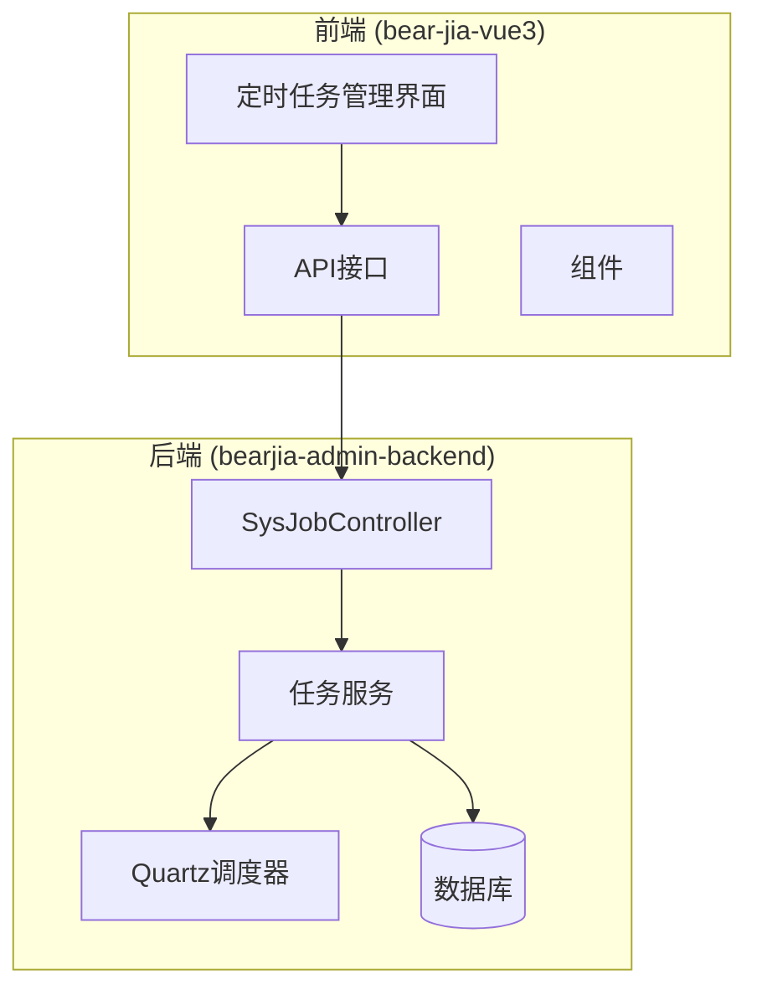
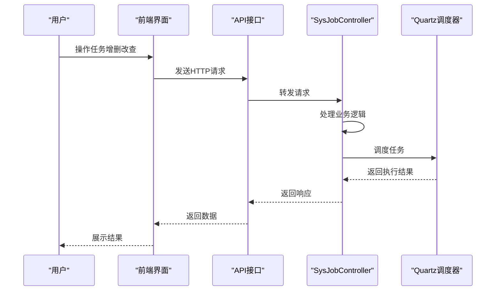
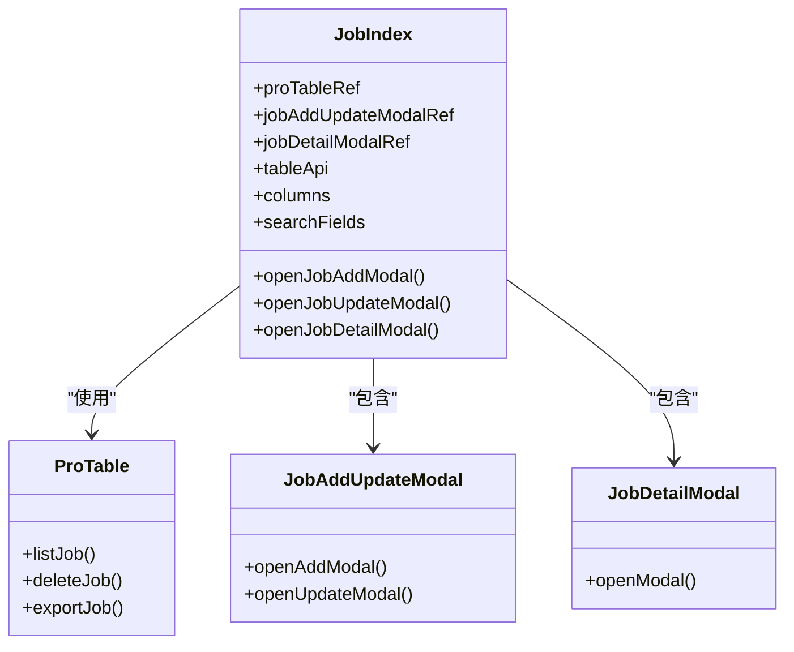
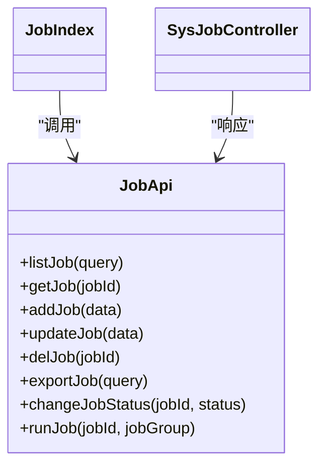
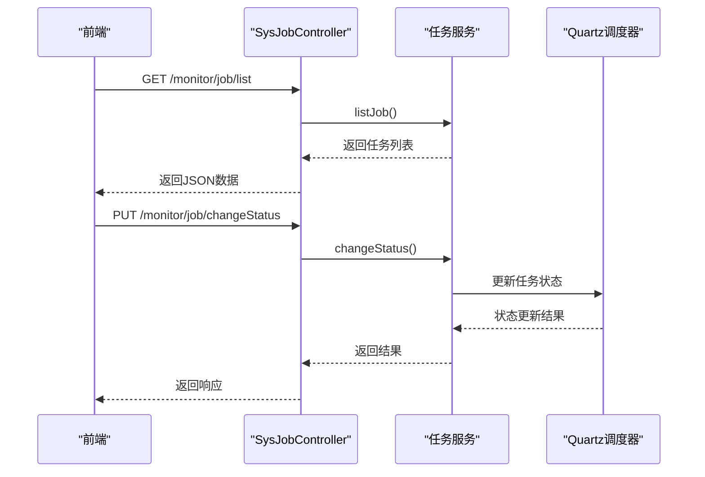
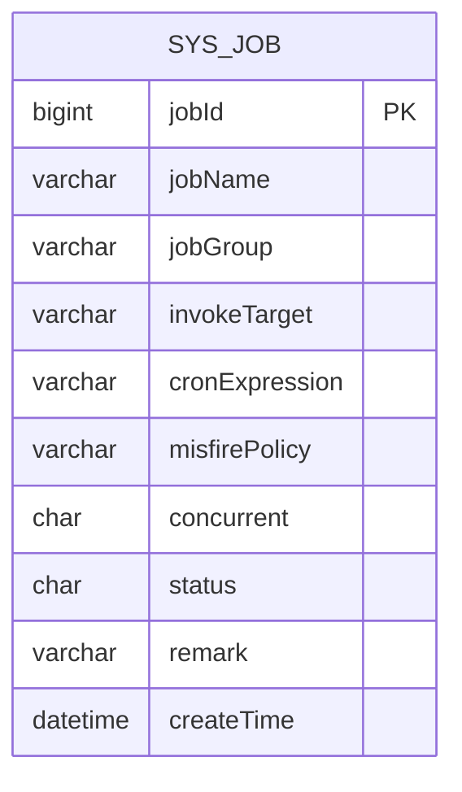
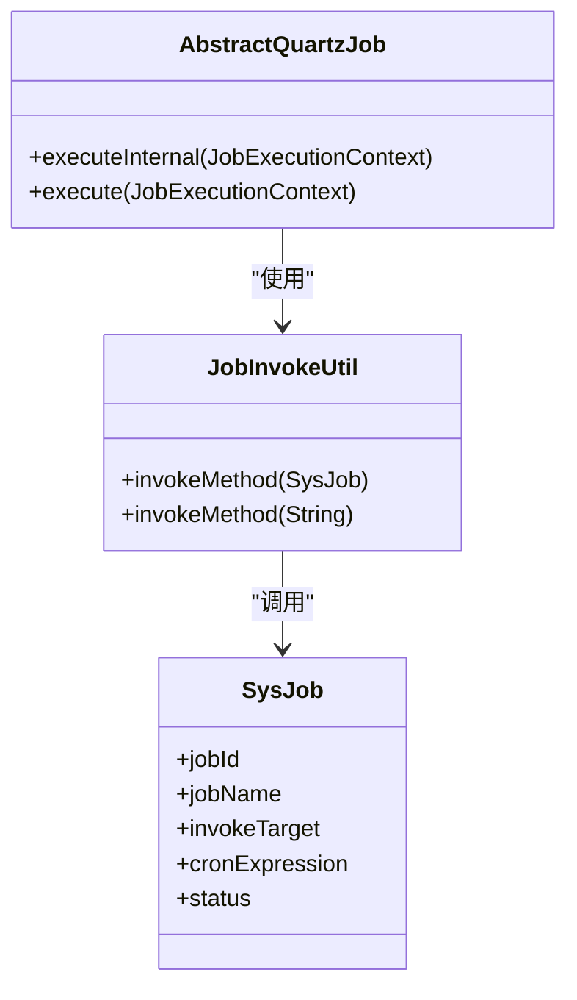
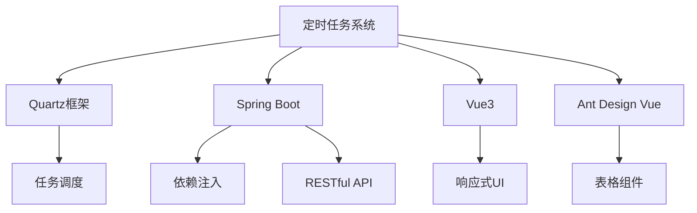

# 定时任务

<cite>
**本文档引用的文件**  
- [index.vue](file://bear-jia-vue3\src\views\monitor\job\index.vue)
- [job.js](file://bear-jia-vue3\src\api\monitor\job.js)
- [SysJobController.java](file://bearjia-admin-backend\src\main\java\com\javaxiaobear\module\monitor\controller\SysJobController.java)
- [SysJob.java](file://bearjia-admin-backend\src\main\java\com\javaxiaobear\module\monitor\domain\SysJob.java)
- [AbstractQuartzJob.java](file://bearjia-admin-backend\src\main\java\com\javaxiaobear\base\common\utils\job\AbstractQuartzJob.java)
- [JobInvokeUtil.java](file://bearjia-admin-backend\src\main\java\com\javaxiaobear\base\common\utils\job\JobInvokeUtil.java)
</cite>

## 目录
1. [简介](#简介)
2. [项目结构](#项目结构)
3. [核心组件](#核心组件)
4. [架构概述](#架构概述)
5. [详细组件分析](#详细组件分析)
6. [依赖分析](#依赖分析)
7. [性能考虑](#性能考虑)
8. [故障排除指南](#故障排除指南)
9. [结论](#结论)

## 简介
本文档全面介绍了基于Quartz框架的定时任务调度系统。系统提供了完整的定时任务管理功能，包括增删改查、状态切换和立即执行等操作。前端通过Vue3实现用户界面，后端采用Java Spring Boot框架与Quartz集成，实现了稳定可靠的定时任务调度能力。系统支持Cron表达式配置，可灵活定义各种复杂的时间调度规则。

## 项目结构
定时任务模块分布在前后端两个主要项目中，前端位于`bear-jia-vue3`项目中，后端位于`bearjia-admin-backend`项目中。前后端通过RESTful API进行通信，实现了清晰的职责分离。

**Diagram sources**
- [index.vue](file://bear-jia-vue3\src\views\monitor\job\index.vue)
- [SysJobController.java](file://bearjia-admin-backend\src\main\java\com\javaxiaobear\module\monitor\controller\SysJobController.java)

**Section sources**
- [index.vue](file://bear-jia-vue3\src\views\monitor\job\index.vue)
- [job.js](file://bear-jia-vue3\src\api\monitor\job.js)

## 核心组件
定时任务系统的核心组件包括前端任务管理界面、API接口层、后端控制器、任务执行抽象类和任务调用工具类。这些组件协同工作，实现了完整的任务调度功能。前端界面提供用户友好的操作体验，后端系统确保任务的可靠执行和状态管理。

**Section sources**
- [index.vue](file://bear-jia-vue3\src\views\monitor\job\index.vue)
- [SysJobController.java](file://bearjia-admin-backend\src\main\java\com\javaxiaobear\module\monitor\controller\SysJobController.java)
- [AbstractQuartzJob.java](file://bearjia-admin-backend\src\main\java\com\javaxiaobear\base\common\utils\job\AbstractQuartzJob.java)

## 架构概述
系统采用典型的前后端分离架构，前端负责用户界面展示和交互，后端负责业务逻辑处理和任务调度。Quartz框架作为任务调度的核心引擎，提供了强大的定时任务管理能力。系统通过RESTful API进行前后端通信，确保了良好的可维护性和扩展性。

**Diagram sources**
- [index.vue](file://bear-jia-vue3\src\views\monitor\job\index.vue)
- [job.js](file://bear-jia-vue3\src\api\monitor\job.js)
- [SysJobController.java](file://bearjia-admin-backend\src\main\java\com\javaxiaobear\module\monitor\controller\SysJobController.java)

## 详细组件分析

### 前端任务管理界面分析
前端任务管理界面基于Vue3构建，使用ProTable组件实现任务列表的展示和操作。界面提供了任务的增删改查功能，以及状态切换和立即执行等特殊操作。通过字典标签组件，实现了任务组名、状态等字段的友好显示。

**Diagram sources**
- [index.vue](file://bear-jia-vue3\src\views\monitor\job\index.vue)

**Section sources**
- [index.vue](file://bear-jia-vue3\src\views\monitor\job\index.vue)

### API接口层分析
API接口层定义了与后端通信的所有接口，包括任务列表查询、任务增删改查、状态修改和立即执行等功能。每个接口都封装了相应的HTTP请求，简化了前端调用。

**Diagram sources**
- [job.js](file://bear-jia-vue3\src\api\monitor\job.js)

**Section sources**
- [job.js](file://bear-jia-vue3\src\api\monitor\job.js)

### 后端控制器分析
后端控制器SysJobController处理所有定时任务相关的HTTP请求，提供了RESTful API接口。控制器负责接收前端请求，调用相应的服务方法，并返回处理结果。

**Diagram sources**
- [SysJobController.java](file://bearjia-admin-backend\src\main\java\com\javaxiaobear\module\monitor\controller\SysJobController.java)

**Section sources**
- [SysJobController.java](file://bearjia-admin-backend\src\main\java\com\javaxiaobear\module\monitor\controller\SysJobController.java)

### 数据模型分析
SysJob数据模型定义了定时任务的所有属性，包括任务名称、任务组、Cron表达式、调用目标等关键字段。每个字段都有明确的含义和用途，确保了任务配置的完整性和准确性。

**Diagram sources**
- [SysJob.java](file://bearjia-admin-backend\src\main\java\com\javaxiaobear\module\monitor\domain\SysJob.java)

**Section sources**
- [SysJob.java](file://bearjia-admin-backend\src\main\java\com\javaxiaobear\module\monitor\domain\SysJob.java)

### 任务执行机制分析
AbstractQuartzJob抽象类定义了任务执行的基本框架，所有具体任务都继承此类。JobInvokeUtil工具类负责实际的任务调用，通过反射机制执行指定的目标方法。

**Diagram sources**
- [AbstractQuartzJob.java](file://bearjia-admin-backend\src\main\java\com\javaxiaobear\base\common\utils\job\AbstractQuartzJob.java)
- [JobInvokeUtil.java](file://bearjia-admin-backend\src\main\java\com\javaxiaobear\base\common\utils\job\JobInvokeUtil.java)

**Section sources**
- [AbstractQuartzJob.java](file://bearjia-admin-backend\src\main\java\com\javaxiaobear\base\common\utils\job\AbstractQuartzJob.java)
- [JobInvokeUtil.java](file://bearjia-admin-backend\src\main\java\com\javaxiaobear\base\common\utils\job\JobInvokeUtil.java)

## 依赖分析
定时任务系统依赖于多个关键组件和框架，包括Quartz调度框架、Spring Boot、Vue3等。这些依赖关系确保了系统的稳定运行和功能完整性。

**Diagram sources**
- [pom.xml](file://bearjia-admin-backend\pom.xml)
- [package.json](file://bear-jia-vue3\package.json)

## 性能考虑
定时任务系统在设计时考虑了多种性能优化策略。通过合理的线程池配置，确保了任务调度的高效性。Cron表达式的解析经过优化，减少了计算开销。数据库查询使用了索引优化，提高了任务列表的加载速度。系统还实现了任务执行日志的异步写入，避免了对主流程的阻塞。

## 故障排除指南
当定时任务出现问题时，可以按照以下步骤进行排查：
1. 检查任务状态是否为"正常"，非正常状态的任务不会被执行
2. 验证Cron表达式是否正确，错误的表达式会导致任务无法按预期执行
3. 检查调用目标字符串是否正确，确保方法存在且可访问
4. 查看系统日志，寻找可能的异常信息
5. 确认Quartz调度器是否正常运行

**Section sources**
- [AbstractQuartzJob.java](file://bearjia-admin-backend\src\main\java\com\javaxiaobear\base\common\utils\job\AbstractQuartzJob.java)
- [JobInvokeUtil.java](file://bearjia-admin-backend\src\main\java\com\javaxiaobear\base\common\utils\job\JobInvokeUtil.java)

## 结论
基于Quartz框架的定时任务系统提供了一套完整、可靠的任务调度解决方案。系统通过清晰的前后端分离架构，实现了易用的用户界面和稳定的后台服务。通过合理的数据模型设计和执行机制，确保了任务的准确调度和执行。系统支持灵活的Cron表达式配置，可以满足各种复杂的定时任务需求，如每日数据备份、定时清理过期缓存等典型应用场景。