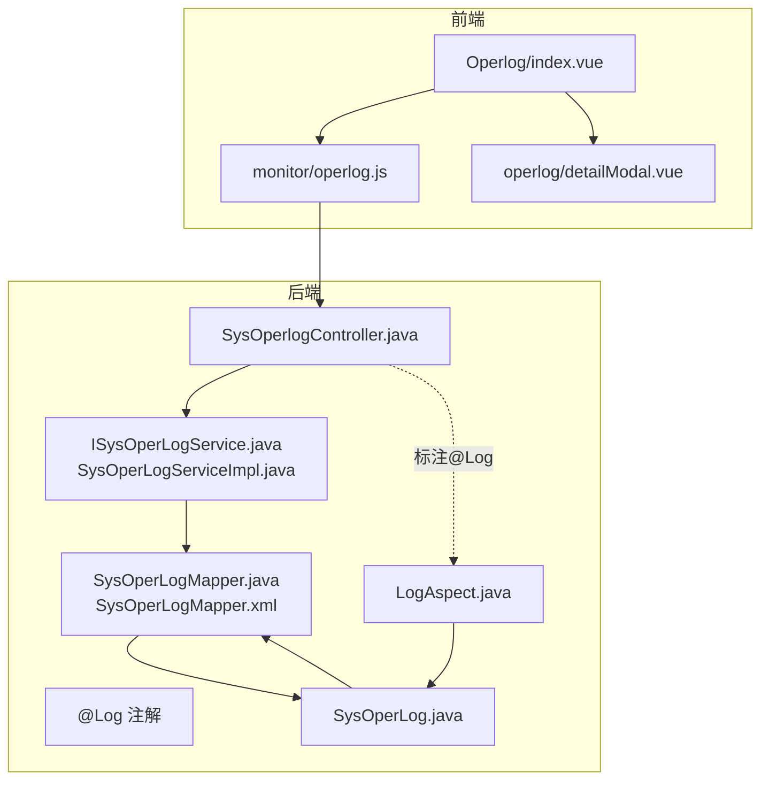
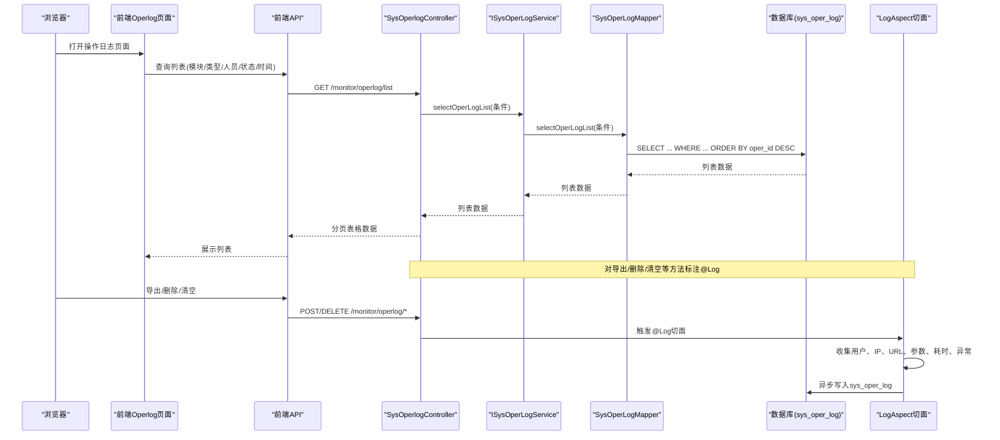
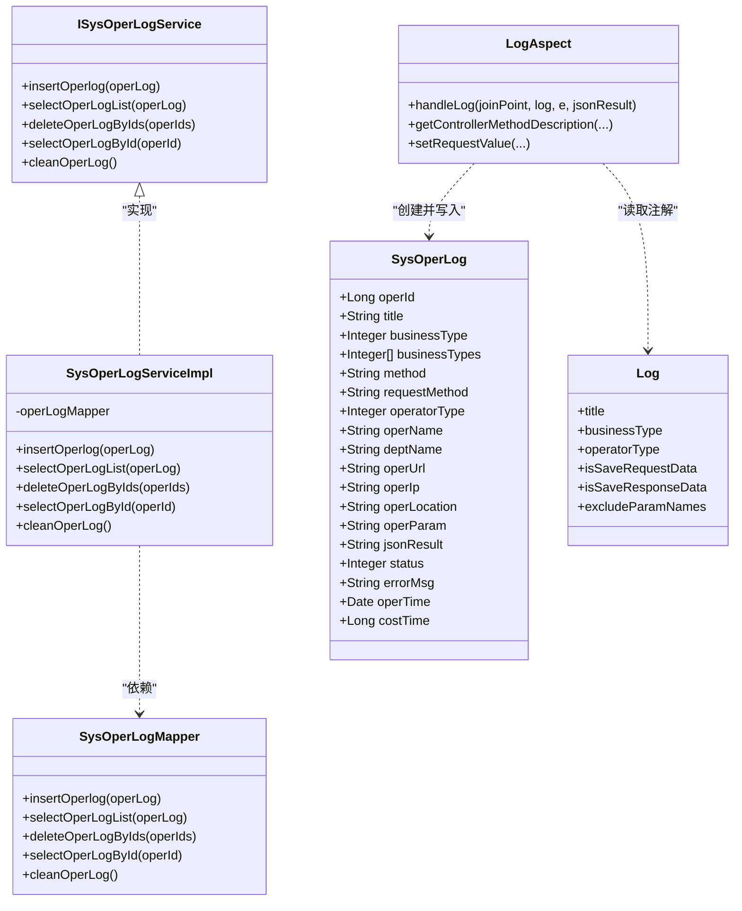
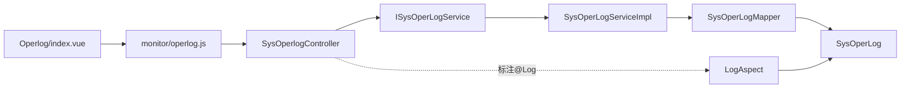

# 操作日志

<cite>
**本文引用的文件**
- [index.vue](file://bear-jia-vue3/src/views/monitor/operlog/index.vue)
- [operlog.js](file://bear-jia-vue3/src/api/monitor/operlog.js)
- [detailModal.vue](file://bear-jia-vue3/src/views/monitor/operlog/detailModal.vue)
- [LogAspect.java](file://bearjia-admin-backend/src/main/java/com/javaxiaobear/base/framework/aspectj/LogAspect.java)
- [Log.java](file://bearjia-admin-backend/src/main/java/com/javaxiaobear/base/framework/aspectj/lang/annotation/Log.java)
- [BusinessType.java](file://bearjia-admin-backend/src/main/java/com/javaxiaobear/base/framework/aspectj/lang/enums/BusinessType.java)
- [OperatorType.java](file://bearjia-admin-backend/src/main/java/com/javaxiaobear/base/framework/aspectj/lang/enums/OperatorType.java)
- [SysOperLog.java](file://bearjia-admin-backend/src/main/java/com/javaxiaobear/module/monitor/domain/SysOperLog.java)
- [ISysOperLogService.java](file://bearjia-admin-backend/src/main/java/com/javaxiaobear/module/monitor/service/ISysOperLogService.java)
- [SysOperLogServiceImpl.java](file://bearjia-admin-backend/src/main/java/com/javaxiaobear/module/monitor/service/impl/SysOperLogServiceImpl.java)
- [SysOperLogMapper.java](file://bearjia-admin-backend/src/main/java/com/javaxiaobear/module/monitor/mapper/SysOperLogMapper.java)
- [SysOperLogMapper.xml](file://bearjia-admin-backend/src/main/resources/mybatis/monitor/SysOperLogMapper.xml)
- [SysOperlogController.java](file://bearjia-admin-backend/src/main/java/com/javaxiaobear/module/monitor/controller/SysOperlogController.java)
- [application.yml](file://bearjia-admin-backend/src/main/resources/application.yml)
- [bear_jia.sql](file://bearjia-admin-backend/src/main/resources/sql/bear_jia.sql)
</cite>

## 目录
1. [简介](#简介)
2. [项目结构](#项目结构)
3. [核心组件](#核心组件)
4. [架构总览](#架构总览)
5. [组件详解](#组件详解)
6. [依赖关系分析](#依赖关系分析)
7. [性能与优化建议](#性能与优化建议)
8. [故障排查指南](#故障排查指南)
9. [结论](#结论)
10. [附录](#附录)

## 简介
本文件围绕“操作日志”功能，系统阐述从前端页面到后端切面拦截与持久化的完整链路，包括：
- 前端Operlog/index.vue如何展示操作日志列表并支持按模块、类型、人员、状态与时间范围查询；
- 后端通过LogAspect切面拦截带有@Log注解的方法调用，自动记录SysOperLog日志；
- SysOperLog数据模型字段定义与用途；
- 日志存储优化、查询性能提升与安全审计最佳实践；
- 典型使用场景与追溯策略。

## 项目结构
操作日志功能涉及前后端协作：
- 前端：monitor/operlog 页面负责展示、筛选、导出与清空；API封装了列表、删除、清空与导出接口。
- 后端：LogAspect切面统一拦截@Log注解，填充SysOperLog并异步入库；SysOperlogController提供查询、导出、删除与清空接口；MyBatis映射SQL完成条件查询与排序。

图表来源
- [index.vue](file://bear-jia-vue3/src/views/monitor/operlog/index.vue#L1-L119)
- [operlog.js](file://bear-jia-vue3/src/api/monitor/operlog.js#L1-L35)
- [SysOperlogController.java](file://bearjia-admin-backend/src/main/java/com/javaxiaobear/module/monitor/controller/SysOperlogController.java#L29-L69)
- [LogAspect.java](file://bearjia-admin-backend/src/main/java/com/javaxiaobear/base/framework/aspectj/LogAspect.java#L28-L200)
- [Log.java](file://bearjia-admin-backend/src/main/java/com/javaxiaobear/base/framework/aspectj/lang/annotation/Log.java#L1-L51)
- [SysOperLog.java](file://bearjia-admin-backend/src/main/java/com/javaxiaobear/module/monitor/domain/SysOperLog.java#L1-L270)
- [SysOperLogMapper.xml](file://bearjia-admin-backend/src/main/resources/mybatis/monitor/SysOperLogMapper.xml#L1-L87)

章节来源
- [index.vue](file://bear-jia-vue3/src/views/monitor/operlog/index.vue#L1-L119)
- [operlog.js](file://bear-jia-vue3/src/api/monitor/operlog.js#L1-L35)
- [SysOperlogController.java](file://bearjia-admin-backend/src/main/java/com/javaxiaobear/module/monitor/controller/SysOperlogController.java#L29-L69)
- [LogAspect.java](file://bearjia-admin-backend/src/main/java/com/javaxiaobear/base/framework/aspectj/LogAspect.java#L28-L200)
- [SysOperLogMapper.xml](file://bearjia-admin-backend/src/main/resources/mybatis/monitor/SysOperLogMapper.xml#L1-L87)

## 核心组件
- 前端Operlog页面：提供查询条件（模块、类型、人员、状态、时间范围）、表格列展示、查看详情弹窗、批量删除、清空与导出。
- 前端API：封装列表、删除、清空、导出四个接口。
- 后端控制器：提供分页查询、导出、删除、清空接口，并在导出/删除/清空等关键操作上标注@Log以记录审计日志。
- 切面LogAspect：统一拦截@Log注解，收集请求上下文、用户信息、请求参数、响应结果、异常信息、耗时等，异步入库。
- 实体与映射：SysOperLog定义字段，MyBatis映射XML实现条件查询、排序与清空。

章节来源
- [index.vue](file://bear-jia-vue3/src/views/monitor/operlog/index.vue#L1-L119)
- [operlog.js](file://bear-jia-vue3/src/api/monitor/operlog.js#L1-L35)
- [SysOperlogController.java](file://bearjia-admin-backend/src/main/java/com/javaxiaobear/module/monitor/controller/SysOperlogController.java#L29-L69)
- [LogAspect.java](file://bearjia-admin-backend/src/main/java/com/javaxiaobear/base/framework/aspectj/LogAspect.java#L28-L200)
- [SysOperLog.java](file://bearjia-admin-backend/src/main/java/com/javaxiaobear/module/monitor/domain/SysOperLog.java#L1-L270)
- [SysOperLogMapper.xml](file://bearjia-admin-backend/src/main/resources/mybatis/monitor/SysOperLogMapper.xml#L1-L87)

## 架构总览
下图展示了从浏览器到数据库的日志采集与查询路径，以及@Log注解驱动的自动记录流程。

图表来源
- [index.vue](file://bear-jia-vue3/src/views/monitor/operlog/index.vue#L1-L119)
- [operlog.js](file://bear-jia-vue3/src/api/monitor/operlog.js#L1-L35)
- [SysOperlogController.java](file://bearjia-admin-backend/src/main/java/com/javaxiaobear/module/monitor/controller/SysOperlogController.java#L29-L69)
- [LogAspect.java](file://bearjia-admin-backend/src/main/java/com/javaxiaobear/base/framework/aspectj/LogAspect.java#L28-L200)
- [SysOperLogMapper.xml](file://bearjia-admin-backend/src/main/resources/mybatis/monitor/SysOperLogMapper.xml#L1-L87)

## 组件详解

### 前端：Operlog/index.vue
- 查询条件：模块(title)、操作类型(businessType)、操作人员(operName)、状态(status)、时间范围(operTimeRange)。
- 列表字段：模块、类型、请求方式、操作人员、操作地址、操作地点、状态、操作时间、操作列（查看）。
- 操作能力：删除选中、清空全部、导出Excel。
- 查看详情：打开detailModal.vue展示更详细信息。

章节来源
- [index.vue](file://bear-jia-vue3/src/views/monitor/operlog/index.vue#L1-L119)
- [operlog.js](file://bear-jia-vue3/src/api/monitor/operlog.js#L1-L35)
- [detailModal.vue](file://bear-jia-vue3/src/views/monitor/operlog/detailModal.vue#L30-L62)

### 前端API：monitor/operlog.js
- list(query)：GET /monitor/operlog/list
- delOperlog(operId)：DELETE /monitor/operlog/{operId}
- cleanOperlog()：DELETE /monitor/operlog/clean
- exportOperlog(query)：GET /monitor/operlog/export

章节来源
- [operlog.js](file://bear-jia-vue3/src/api/monitor/operlog.js#L1-L35)

### 后端：SysOperlogController
- GET /monitor/operlog/list：分页查询，调用服务层selectOperLogList。
- POST /monitor/operlog/export：导出Excel，标注@Log记录导出行为。
- DELETE /monitor/operlog/{operIds}：批量删除，标注@Log记录删除行为。
- DELETE /monitor/operlog/clean：清空日志，标注@Log记录清空行为。

章节来源
- [SysOperlogController.java](file://bearjia-admin-backend/src/main/java/com/javaxiaobear/module/monitor/controller/SysOperlogController.java#L29-L69)

### 切面：LogAspect
- 拦截点：@annotation(controllerLog)，分别在前置、返回与异常时触发。
- 关键信息采集：
  - 用户：登录用户、部门名称。
  - 请求：IP、URL、请求方式、方法签名。
  - 参数：请求参数（POST/PUT时取方法参数，否则取请求参数Map），可排除敏感字段。
  - 结果：响应JSON（可选）。
  - 异常：异常消息（可选）。
  - 耗时：基于ThreadLocal计时。
- 异步入库：通过AsyncManager与AsyncFactory异步写入数据库。

章节来源
- [LogAspect.java](file://bearjia-admin-backend/src/main/java/com/javaxiaobear/base/framework/aspectj/LogAspect.java#L28-L200)
- [Log.java](file://bearjia-admin-backend/src/main/java/com/javaxiaobear/base/framework/aspectj/lang/annotation/Log.java#L1-L51)

### 注解：@Log
- 字段：title（模块）、businessType（业务类型枚举）、operatorType（操作人类别枚举）、isSaveRequestData（是否保存请求参数）、isSaveResponseData（是否保存响应参数）、excludeParamNames（排除参数名）。
- 作用：在控制器方法上标注，驱动LogAspect采集并记录。

章节来源
- [Log.java](file://bearjia-admin-backend/src/main/java/com/javaxiaobear/base/framework/aspectj/lang/annotation/Log.java#L1-L51)
- [BusinessType.java](file://bearjia-admin-backend/src/main/java/com/javaxiaobear/base/framework/aspectj/lang/enums/BusinessType.java#L1-L60)
- [OperatorType.java](file://bearjia-admin-backend/src/main/java/com/javaxiaobear/base/framework/aspectj/lang/enums/OperatorType.java#L1-L25)

### 实体与服务：SysOperLog
- 字段概览（节选）：operId、title、businessType、method、requestMethod、operatorType、operName、deptName、operUrl、operIp、operLocation、operParam、jsonResult、status、errorMsg、operTime、costTime。
- 服务层：ISysOperLogService定义新增、查询列表、批量删除、按ID查询、清空。
- 实现层：SysOperLogServiceImpl委托Mapper执行。
- 映射层：SysOperLogMapper接口与SysOperLogMapper.xml实现条件查询、排序、删除、清空。

章节来源
- [SysOperLog.java](file://bearjia-admin-backend/src/main/java/com/javaxiaobear/module/monitor/domain/SysOperLog.java#L1-L270)
- [ISysOperLogService.java](file://bearjia-admin-backend/src/main/java/com/javaxiaobear/module/monitor/service/ISysOperLogService.java#L1-L48)
- [SysOperLogServiceImpl.java](file://bearjia-admin-backend/src/main/java/com/javaxiaobear/module/monitor/service/impl/SysOperLogServiceImpl.java#L1-L76)
- [SysOperLogMapper.java](file://bearjia-admin-backend/src/main/java/com/javaxiaobear/module/monitor/mapper/SysOperLogMapper.java#L1-L48)
- [SysOperLogMapper.xml](file://bearjia-admin-backend/src/main/resources/mybatis/monitor/SysOperLogMapper.xml#L1-L87)

### 数据模型类图

图表来源
- [SysOperLog.java](file://bearjia-admin-backend/src/main/java/com/javaxiaobear/module/monitor/domain/SysOperLog.java#L1-L270)
- [ISysOperLogService.java](file://bearjia-admin-backend/src/main/java/com/javaxiaobear/module/monitor/service/ISysOperLogService.java#L1-L48)
- [SysOperLogServiceImpl.java](file://bearjia-admin-backend/src/main/java/com/javaxiaobear/module/monitor/service/impl/SysOperLogServiceImpl.java#L1-L76)
- [SysOperLogMapper.java](file://bearjia-admin-backend/src/main/java/com/javaxiaobear/module/monitor/mapper/SysOperLogMapper.java#L1-L48)
- [LogAspect.java](file://bearjia-admin-backend/src/main/java/com/javaxiaobear/base/framework/aspectj/LogAspect.java#L28-L200)
- [Log.java](file://bearjia-admin-backend/src/main/java/com/javaxiaobear/base/framework/aspectj/lang/annotation/Log.java#L1-L51)

### 查询流程与条件映射
前端查询参数与后端SQL条件映射如下：
- operIp：LIKE %ip%
- title：LIKE %title%
- businessType：等于
- businessTypes：IN (集合)
- status：等于
- operName：LIKE %name%
- params.beginTime：>= oper_time
- params.endTime：<= oper_time
- 排序：ORDER BY oper_id DESC

```mermaid
flowchart TD
Start(["进入查询"]) --> BuildWhere["构建WHERE条件"]
BuildWhere --> CheckIp{"operIp存在？"}
CheckIp --> |是| AddIp["AND oper_ip LIKE %ip%"]
CheckIp --> |否| CheckTitle["检查title"]
AddIp --> CheckTitle
CheckTitle --> CheckTitleEmpty{"title存在？"}
CheckTitleEmpty --> |是| AddTitle["AND title LIKE %title%"]
CheckTitleEmpty --> |否| CheckType["检查businessType"]
AddTitle --> CheckType
CheckType --> CheckTypeVal{"businessType存在？"}
CheckTypeVal --> |是| AddType["AND business_type = ?"]
CheckTypeVal --> |否| CheckTypes["检查businessTypes"]
AddType --> CheckTypes
CheckTypes --> CheckTypesArr{"businessTypes非空？"}
CheckTypesArr --> |是| AddTypes["AND business_type IN (...)"]
CheckTypesArr --> |否| CheckStatus["检查status"]
AddTypes --> CheckStatus
CheckStatus --> CheckStatusVal{"status存在？"}
CheckStatusVal --> |是| AddStatus["AND status = ?"]
CheckStatusVal --> |否| CheckName["检查operName"]
AddStatus --> CheckName
CheckName --> CheckNameEmpty{"operName存在？"}
CheckNameEmpty --> |是| AddName["AND oper_name LIKE %name%"]
CheckNameEmpty --> |否| CheckBegin["检查beginTime"]
AddName --> CheckBegin
CheckBegin --> CheckBeginEmpty{"beginTime存在？"}
CheckBeginEmpty --> |是| AddBegin["AND oper_time >= ?"]
CheckBeginEmpty --> |否| CheckEnd["检查endTime"]
AddBegin --> CheckEnd
CheckEnd --> CheckEndEmpty{"endTime存在？"}
CheckEndEmpty --> |是| AddEnd["AND oper_time <= ?"]
CheckEndEmpty --> |否| OrderBy["ORDER BY oper_id DESC"]
AddEnd --> OrderBy
OrderBy --> End(["返回结果"])
```

图表来源
- [SysOperLogMapper.xml](file://bearjia-admin-backend/src/main/resources/mybatis/monitor/SysOperLogMapper.xml#L1-L87)

章节来源
- [SysOperLogMapper.xml](file://bearjia-admin-backend/src/main/resources/mybatis/monitor/SysOperLogMapper.xml#L1-L87)

## 依赖关系分析
- 控制器依赖服务层接口，服务层依赖Mapper接口，Mapper依赖实体类。
- LogAspect依赖@Log注解、业务枚举、工具类与异步管理器。
- 前端依赖API模块与ProTable组件，使用字典组件渲染状态与类型。

图表来源
- [index.vue](file://bear-jia-vue3/src/views/monitor/operlog/index.vue#L1-L119)
- [operlog.js](file://bear-jia-vue3/src/api/monitor/operlog.js#L1-L35)
- [SysOperlogController.java](file://bearjia-admin-backend/src/main/java/com/javaxiaobear/module/monitor/controller/SysOperlogController.java#L29-L69)
- [ISysOperLogService.java](file://bearjia-admin-backend/src/main/java/com/javaxiaobear/module/monitor/service/ISysOperLogService.java#L1-L48)
- [SysOperLogServiceImpl.java](file://bearjia-admin-backend/src/main/java/com/javaxiaobear/module/monitor/service/impl/SysOperLogServiceImpl.java#L1-L76)
- [SysOperLogMapper.java](file://bearjia-admin-backend/src/main/java/com/javaxiaobear/module/monitor/mapper/SysOperLogMapper.java#L1-L48)
- [SysOperLog.java](file://bearjia-admin-backend/src/main/java/com/javaxiaobear/module/monitor/domain/SysOperLog.java#L1-L270)
- [LogAspect.java](file://bearjia-admin-backend/src/main/java/com/javaxiaobear/base/framework/aspectj/LogAspect.java#L28-L200)

## 性能与优化建议
- 异步落库：LogAspect通过异步任务写入数据库，避免阻塞请求主线程，提高接口吞吐。
- 参数裁剪：请求参数与响应结果均限制长度，防止超长文本占用存储与网络带宽。
- 敏感字段排除：@Log注解支持排除参数名，LogAspect内置敏感字段白名单，降低泄露风险。
- 索引与查询：根据查询条件建立合适索引（如oper_time、oper_name、business_type），减少全表扫描。
- 分页与排序：默认按主键倒序，结合分页可有效控制结果集规模。
- 存储清理：提供清空接口，定期清理历史日志，控制表膨胀。
- 导出优化：导出时仅选择必要字段，避免一次性拉取过多数据。

章节来源
- [LogAspect.java](file://bearjia-admin-backend/src/main/java/com/javaxiaobear/base/framework/aspectj/LogAspect.java#L28-L200)
- [SysOperLogMapper.xml](file://bearjia-admin-backend/src/main/resources/mybatis/monitor/SysOperLogMapper.xml#L1-L87)
- [SysOperlogController.java](file://bearjia-admin-backend/src/main/java/com/javaxiaobear/module/monitor/controller/SysOperlogController.java#L29-L69)

## 故障排查指南
- 日志未记录
  - 检查控制器方法是否标注@Log且权限校验通过。
  - 确认LogAspect已启用（Spring AOP代理生效）。
  - 查看异步任务队列与数据库连接是否正常。
- 查询无结果
  - 核对查询条件是否正确传递（模块、类型、人员、状态、时间范围）。
  - 检查SQL映射条件是否匹配（LIKE、IN、范围比较）。
- 导出异常
  - 确认导出接口权限与@Log标注。
  - 检查Excel导出工具与响应头设置。
- 清空失败
  - 确认清空接口权限与@Log标注。
  - 检查truncate语句执行权限与事务隔离级别。

章节来源
- [LogAspect.java](file://bearjia-admin-backend/src/main/java/com/javaxiaobear/base/framework/aspectj/LogAspect.java#L28-L200)
- [SysOperLogMapper.xml](file://bearjia-admin-backend/src/main/resources/mybatis/monitor/SysOperLogMapper.xml#L1-L87)
- [SysOperlogController.java](file://bearjia-admin-backend/src/main/java/com/javaxiaobear/module/monitor/controller/SysOperlogController.java#L29-L69)

## 结论
该操作日志体系通过“前端查询+后端AOP自动记录+MyBatis条件查询”的组合，实现了对关键业务操作的可追溯与审计。前端提供灵活的筛选与导出能力，后端以@Log注解为核心，统一采集上下文与参数，异步入库保障性能。配合合理的索引与清理策略，可在保证可观测性的同时兼顾系统性能与安全。

## 附录

### SysOperLog字段定义与用途
- operId：日志主键
- title：操作模块
- businessType/businessTypes：业务类型（新增/修改/删除/授权/导出/导入/强退/生成代码/清空数据）
- method：请求方法（类名.方法名()）
- requestMethod：HTTP请求方式（GET/POST/PUT/DELETE）
- operatorType：操作人类别（后台用户/手机端用户/其他）
- operName/deptName：操作人与部门
- operUrl/operIp/operLocation：请求URL、IP与地点
- operParam/jsonResult：请求参数与响应结果（受长度限制）
- status/errorMsg：状态（正常/异常）与错误消息
- operTime：操作时间
- costTime：耗时（毫秒）

章节来源
- [SysOperLog.java](file://bearjia-admin-backend/src/main/java/com/javaxiaobear/module/monitor/domain/SysOperLog.java#L1-L270)
- [BusinessType.java](file://bearjia-admin-backend/src/main/java/com/javaxiaobear/base/framework/aspectj/lang/enums/BusinessType.java#L1-L60)
- [OperatorType.java](file://bearjia-admin-backend/src/main/java/com/javaxiaobear/base/framework/aspectj/lang/enums/OperatorType.java#L1-L25)

### 典型使用场景
- 审计合规：通过模块、类型、人员、时间范围快速定位某次操作，核对请求参数与响应结果。
- 追溯数据变更：结合业务类型（新增/修改/删除）与操作人，回溯关键数据的历史轨迹。
- 安全事件调查：利用IP、地点、异常状态与错误消息定位可疑行为。
- 运维排障：通过耗时与异常消息定位慢查询与错误接口。

章节来源
- [index.vue](file://bear-jia-vue3/src/views/monitor/operlog/index.vue#L1-L119)
- [SysOperLogMapper.xml](file://bearjia-admin-backend/src/main/resources/mybatis/monitor/SysOperLogMapper.xml#L1-L87)

### 权限与菜单
- 菜单：监控 -> 操作日志
- 权限：monitor:operlog:list、monitor:operlog:remove、monitor:operlog:export
- SQL：初始化菜单与权限数据

章节来源
- [bear_jia.sql](file://bearjia-admin-backend/src/main/resources/sql/bear_jia.sql#L458-L508)