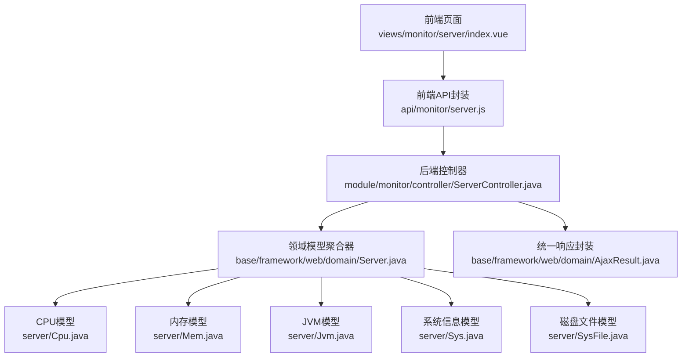
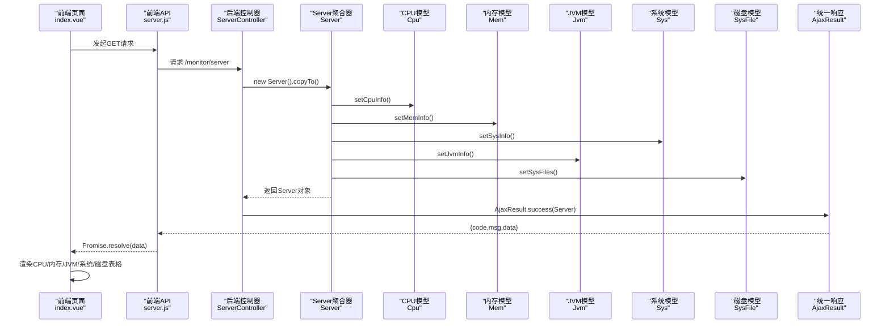
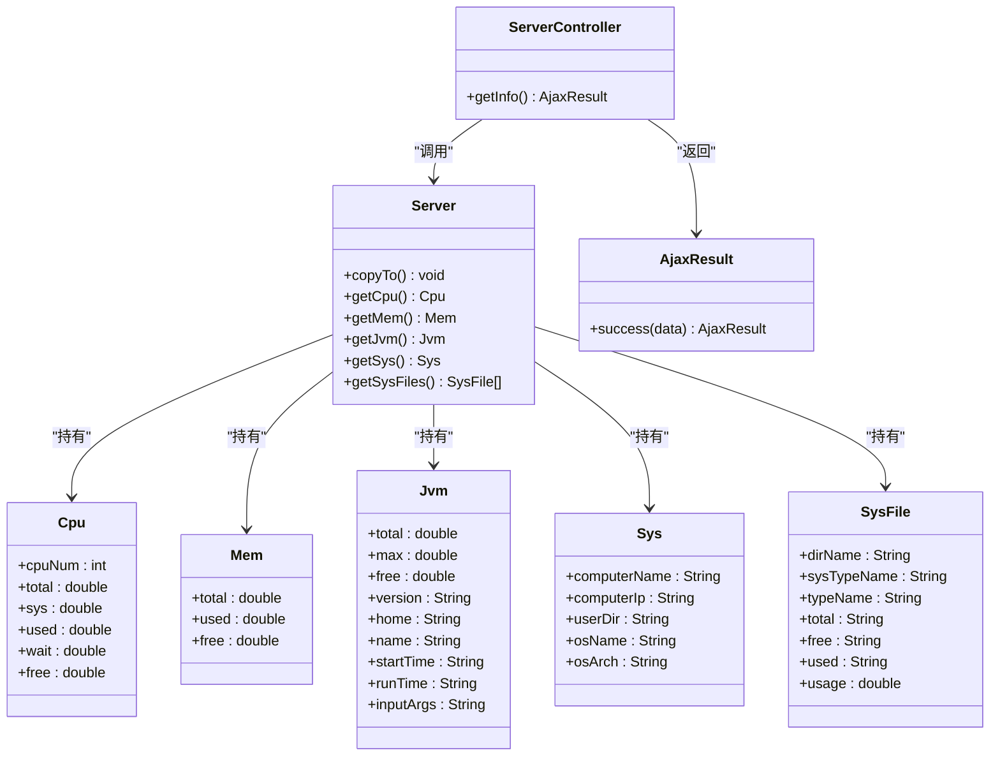

# 服务监控

<cite>
**本文引用的文件**
- [index.vue](file://bear-jia-vue3/src/views/monitor/server/index.vue)
- [server.js](file://bear-jia-vue3/src/api/monitor/server.js)
- [ServerController.java](file://bearjia-admin-backend/src/main/java/com/javaxiaobear/module/monitor/controller/ServerController.java)
- [Server.java](file://bearjia-admin-backend/src/main/java/com/javaxiaobear/base/framework/web/domain/Server.java)
- [Cpu.java](file://bearjia-admin-backend/src/main/java/com/javaxiaobear/base/framework/web/domain/server/Cpu.java)
- [Mem.java](file://bearjia-admin-backend/src/main/java/com/javaxiaobear/base/framework/web/domain/server/Mem.java)
- [Jvm.java](file://bearjia-admin-backend/src/main/java/com/javaxiaobear/base/framework/web/domain/server/Jvm.java)
- [Sys.java](file://bearjia-admin-backend/src/main/java/com/javaxiaobear/base/framework/web/domain/server/Sys.java)
- [SysFile.java](file://bearjia-admin-backend/src/main/java/com/javaxiaobear/base/framework/web/domain/server/SysFile.java)
- [AjaxResult.java](file://bearjia-admin-backend/src/main/java/com/javaxiaobear/base/framework/web/domain/AjaxResult.java)
- [Arith.java](file://bearjia-admin-backend/src/main/java/com/javaxiaobear/base/common/utils/Arith.java)
- [application.yml](file://bearjia-admin-backend/src/main/resources/application.yml)
</cite>

## 目录
1. [简介](#简介)
2. [项目结构](#项目结构)
3. [核心组件](#核心组件)
4. [架构总览](#架构总览)
5. [组件详解](#组件详解)
6. [依赖关系分析](#依赖关系分析)
7. [性能与刷新机制](#性能与刷新机制)
8. [故障排查指南](#故障排查指南)
9. [结论](#结论)
10. [附录：常见使用场景](#附录常见使用场景)

## 简介
本文件面向服务监控模块，聚焦系统资源监控能力，包括CPU使用率、内存占用、JVM运行状态与系统信息的采集与展示。前端通过调用后端ServerController接口获取实时数据，后端基于OSHI硬件抽象层采集主机与JVM指标，并以统一的数据模型返回。本文将从架构、数据模型、采集逻辑、前端渲染、刷新策略、性能优化与典型场景等方面进行系统性说明。

## 项目结构
服务监控涉及前后端协作：
- 前端：位于Vue3工程中，负责UI展示与请求发起
- 后端：位于Spring Boot工程中，负责指标采集与封装

图表来源
- [index.vue](file://bear-jia-vue3/src/views/monitor/server/index.vue#L1-L286)
- [server.js](file://bear-jia-vue3/src/api/monitor/server.js#L1-L9)
- [ServerController.java](file://bearjia-admin-backend/src/main/java/com/javaxiaobear/module/monitor/controller/ServerController.java#L1-L27)
- [Server.java](file://bearjia-admin-backend/src/main/java/com/javaxiaobear/base/framework/web/domain/Server.java#L1-L187)
- [Cpu.java](file://bearjia-admin-backend/src/main/java/com/javaxiaobear/base/framework/web/domain/server/Cpu.java#L1-L78)
- [Mem.java](file://bearjia-admin-backend/src/main/java/com/javaxiaobear/base/framework/web/domain/server/Mem.java#L1-L61)
- [Jvm.java](file://bearjia-admin-backend/src/main/java/com/javaxiaobear/base/framework/web/domain/server/Jvm.java#L1-L130)
- [Sys.java](file://bearjia-admin-backend/src/main/java/com/javaxiaobear/base/framework/web/domain/server/Sys.java#L1-L85)
- [SysFile.java](file://bearjia-admin-backend/src/main/java/com/javaxiaobear/base/framework/web/domain/server/SysFile.java#L1-L115)
- [AjaxResult.java](file://bearjia-admin-backend/src/main/java/com/javaxiaobear/base/framework/web/domain/AjaxResult.java#L1-L217)

章节来源
- [index.vue](file://bear-jia-vue3/src/views/monitor/server/index.vue#L1-L286)
- [server.js](file://bearjia-vue3/src/api/monitor/server.js#L1-L9)
- [ServerController.java](file://bearjia-admin-backend/src/main/java/com/javaxiaobear/module/monitor/controller/ServerController.java#L1-L27)
- [Server.java](file://bearjia-admin-backend/src/main/java/com/javaxiaobear/base/framework/web/domain/Server.java#L1-L187)

## 核心组件
- 前端页面组件：负责展示CPU、内存、JVM、系统与磁盘信息，并在挂载时发起一次请求获取初始数据。
- 前端API封装：对后端接口进行轻量封装，便于复用与测试。
- 后端控制器：暴露REST接口，授权校验后触发采集流程并返回统一响应。
- Server聚合器：统一采集CPU、内存、JVM、系统与磁盘信息，作为返回体。
- 数据模型：Cpu、Mem、Jvm、Sys、SysFile分别承载对应指标字段与格式化方法。
- 统一响应：AjaxResult提供success/error/warn等静态工厂方法，规范接口返回结构。

章节来源
- [index.vue](file://bear-jia-vue3/src/views/monitor/server/index.vue#L178-L286)
- [server.js](file://bearjia-vue3/src/api/monitor/server.js#L1-L9)
- [ServerController.java](file://bearjia-admin-backend/src/main/java/com/javaxiaobear/module/monitor/controller/ServerController.java#L1-L27)
- [Server.java](file://bearjia-admin-backend/src/main/java/com/javaxiaobear/base/framework/web/domain/Server.java#L1-L187)
- [Cpu.java](file://bearjia-admin-backend/src/main/java/com/javaxiaobear/base/framework/web/domain/server/Cpu.java#L1-L78)
- [Mem.java](file://bearjia-admin-backend/src/main/java/com/javaxiaobear/base/framework/web/domain/server/Mem.java#L1-L61)
- [Jvm.java](file://bearjia-admin-backend/src/main/java/com/javaxiaobear/base/framework/web/domain/server/Jvm.java#L1-L130)
- [Sys.java](file://bearjia-admin-backend/src/main/java/com/javaxiaobear/base/framework/web/domain/server/Sys.java#L1-L85)
- [SysFile.java](file://bearjia-admin-backend/src/main/java/com/javaxiaobear/base/framework/web/domain/server/SysFile.java#L1-L115)
- [AjaxResult.java](file://bearjia-admin-backend/src/main/java/com/javaxiaobear/base/framework/web/domain/AjaxResult.java#L1-L217)

## 架构总览
下图展示了从前端到后端的完整调用链路与数据流。

图表来源
- [index.vue](file://bear-jia-vue3/src/views/monitor/server/index.vue#L248-L286)
- [server.js](file://bear-jia-vue3/src/api/monitor/server.js#L1-L9)
- [ServerController.java](file://bearjia-admin-backend/src/main/java/com/javaxiaobear/module/monitor/controller/ServerController.java#L1-L27)
- [Server.java](file://bearjia-admin-backend/src/main/java/com/javaxiaobear/base/framework/web/domain/Server.java#L108-L187)
- [Cpu.java](file://bearjia-admin-backend/src/main/java/com/javaxiaobear/base/framework/web/domain/server/Cpu.java#L1-L78)
- [Mem.java](file://bearjia-admin-backend/src/main/java/com/javaxiaobear/base/framework/web/domain/server/Mem.java#L1-L61)
- [Jvm.java](file://bearjia-admin-backend/src/main/java/com/javaxiaobear/base/framework/web/domain/server/Jvm.java#L1-L130)
- [Sys.java](file://bearjia-admin-backend/src/main/java/com/javaxiaobear/base/framework/web/domain/server/Sys.java#L1-L85)
- [SysFile.java](file://bearjia-admin-backend/src/main/java/com/javaxiaobear/base/framework/web/domain/server/SysFile.java#L1-L115)
- [AjaxResult.java](file://bearjia-admin-backend/src/main/java/com/javaxiaobear/base/framework/web/domain/AjaxResult.java#L62-L103)

## 组件详解

### 前端：Server页面与API
- 页面职责
  - 展示CPU核心数、用户使用率、系统使用率、空闲率
  - 展示内存总量、已用、剩余及使用率；同时对比JVM的总量、已用、剩余与使用率
  - 展示服务器名称、操作系统、IP、架构等系统信息
  - 展示各磁盘分区的路径、类型、总大小、可用、已用与使用率
  - 初次加载时自动拉取一次数据，随后保持手动刷新
- 数据绑定与渲染
  - 使用统计卡片与表格组件进行数据展示，内存与JVM对比通过同一表格列进行对比渲染
  - 对高使用率场景进行视觉提示（颜色与图标）
- 请求与响应
  - 通过API封装发起GET请求至后端接口
  - 将返回的Server对象拆解为页面所需的数据结构

章节来源
- [index.vue](file://bear-jia-vue3/src/views/monitor/server/index.vue#L1-L176)
- [index.vue](file://bear-jia-vue3/src/views/monitor/server/index.vue#L178-L286)
- [server.js](file://bearjia-vue3/src/api/monitor/server.js#L1-L9)

### 后端：ServerController与Server聚合器
- 控制器
  - 接口路径：/monitor/server
  - 权限注解：@PreAuthorize("@ss.hasPermi('monitor:server:list')")，确保具备监控权限才可访问
  - 返回：AjaxResult.success(server)，统一响应结构
- 聚合器Server
  - 负责调用OSHI采集CPU、内存、系统、JVM与磁盘信息，并填充到对应的子模型
  - 关键采集步骤：
    - CPU：两次采样间隔1秒，计算用户、系统、等待、空闲等占比
    - 内存：直接读取物理内存总量与可用量，推导已用量
    - 系统：主机名、IP、操作系统名、架构、用户工作目录
    - JVM：JVM总内存、最大内存、空闲内存、版本、安装路径、启动时间、运行时长、输入参数
    - 磁盘：遍历文件系统，汇总各分区的容量与使用率

章节来源
- [ServerController.java](file://bearjia-admin-backend/src/main/java/com/javaxiaobear/module/monitor/controller/ServerController.java#L1-L27)
- [Server.java](file://bearjia-admin-backend/src/main/java/com/javaxiaobear/base/framework/web/domain/Server.java#L108-L187)

### 数据模型：Cpu、Mem、Jvm、Sys、SysFile
- Cpu
  - 字段：cpuNum、total、sys、used、wait、free
  - 计算：通过OSHI两次tick差值计算使用率，提供getTotal/getUsed/getSys/getFree等格式化访问器
- Mem
  - 字段：total、used、free
  - 计算：提供getTotal/getUsed/getFree/getUsage等格式化访问器，单位换算为GB
- Jvm
  - 字段：total、max、free、version、home、name、startTime、runTime、inputArgs
  - 计算：total/free/max均以MB为单位，提供getUsed/getUsage等格式化访问器
- Sys
  - 字段：computerName、computerIp、userDir、osName、osArch
- SysFile
  - 字段：dirName、sysTypeName、typeName、total、free、used、usage
  - 用途：磁盘分区信息，用于表格展示

章节来源
- [Cpu.java](file://bearjia-admin-backend/src/main/java/com/javaxiaobear/base/framework/web/domain/server/Cpu.java#L1-L78)
- [Mem.java](file://bearjia-admin-backend/src/main/java/com/javaxiaobear/base/framework/web/domain/server/Mem.java#L1-L61)
- [Jvm.java](file://bearjia-admin-backend/src/main/java/com/javaxiaobear/base/framework/web/domain/server/Jvm.java#L1-L130)
- [Sys.java](file://bearjia-admin-backend/src/main/java/com/javaxiaobear/base/framework/web/domain/server/Sys.java#L1-L85)
- [SysFile.java](file://bearjia-admin-backend/src/main/java/com/javaxiaobear/base/framework/web/domain/server/SysFile.java#L1-L115)

### 数值精度与格式化：Arith工具
- 作用：提供精确的加减乘除与四舍五入，避免浮点误差
- 使用场景：Cpu/Mem/Jvm在getTotal/getUsed/getUsage等访问器中进行单位换算与百分比计算

章节来源
- [Arith.java](file://bearjia-admin-backend/src/main/java/com/javaxiaobear/base/common/utils/Arith.java#L1-L115)

### 统一响应：AjaxResult
- 作用：统一返回结构，包含code/msg/data等标签，便于前端一致化处理
- 使用：控制器返回AjaxResult.success(server)

章节来源
- [AjaxResult.java](file://bearjia-admin-backend/src/main/java/com/javaxiaobear/base/framework/web/domain/AjaxResult.java#L1-L217)

## 依赖关系分析
- 前端依赖
  - index.vue依赖server.js发起请求
  - server.js依赖通用request封装
- 后端依赖
  - ServerController依赖Server聚合器与AjaxResult
  - Server聚合器依赖OSHI硬件抽象层与Arith工具
  - Server聚合器组合Cpu/Mem/Jvm/Sys/SysFile模型

图表来源
- [ServerController.java](file://bearjia-admin-backend/src/main/java/com/javaxiaobear/module/monitor/controller/ServerController.java#L1-L27)
- [Server.java](file://bearjia-admin-backend/src/main/java/com/javaxiaobear/base/framework/web/domain/Server.java#L1-L187)
- [Cpu.java](file://bearjia-admin-backend/src/main/java/com/javaxiaobear/base/framework/web/domain/server/Cpu.java#L1-L78)
- [Mem.java](file://bearjia-admin-backend/src/main/java/com/javaxiaobear/base/framework/web/domain/server/Mem.java#L1-L61)
- [Jvm.java](file://bearjia-admin-backend/src/main/java/com/javaxiaobear/base/framework/web/domain/server/Jvm.java#L1-L130)
- [Sys.java](file://bearjia-admin-backend/src/main/java/com/javaxiaobear/base/framework/web/domain/server/Sys.java#L1-L85)
- [SysFile.java](file://bearjia-admin-backend/src/main/java/com/javaxiaobear/base/framework/web/domain/server/SysFile.java#L1-L115)
- [AjaxResult.java](file://bearjia-admin-backend/src/main/java/com/javaxiaobear/base/framework/web/domain/AjaxResult.java#L62-L103)

## 性能与刷新机制
- 采集频率
  - CPU采用两次tick采样间隔1秒的方式计算使用率，属于短周期采样，开销可控
- 前端刷新策略
  - 当前实现为一次性加载，未内置定时轮询
  - 若需自动刷新，可在页面mounted后使用定时器定期调用getList，注意清理定时器避免内存泄漏
- 后端性能
  - Server.copyTo仅做本地系统信息采集，不涉及远程IO，单次调用耗时较低
  - 可通过缓存策略减少重复采集（例如在Controller层增加短期缓存），但需考虑数据实时性需求
- 前端渲染优化
  - 使用响应式ref与v-if条件渲染，避免不必要的DOM更新
  - 表格列使用scopedSlots进行条件样式渲染，减少额外组件开销

章节来源
- [Server.java](file://bearjia-admin-backend/src/main/java/com/javaxiaobear/base/framework/web/domain/Server.java#L124-L148)
- [index.vue](file://bear-jia-vue3/src/views/monitor/server/index.vue#L248-L286)

## 故障排查指南
- 权限不足
  - 现象：接口返回无权限或被拦截
  - 处理：确认用户是否具备monitor:server:list权限
- 网络异常
  - 现象：前端请求超时或返回非2xx
  - 处理：检查后端服务是否正常、防火墙与代理配置
- 数据为空
  - 现象：页面显示加载中或部分字段为空
  - 处理：确认后端OSHI依赖是否可用、JVM参数是否正确、磁盘枚举是否受限
- 单位与精度
  - 现象：百分比或容量显示异常
  - 处理：核对Arith工具的单位换算与精度设置

章节来源
- [ServerController.java](file://bearjia-admin-backend/src/main/java/com/javaxiaobear/module/monitor/controller/ServerController.java#L1-L27)
- [Arith.java](file://bearjia-admin-backend/src/main/java/com/javaxiaobear/base/common/utils/Arith.java#L1-L115)

## 结论
该服务监控模块通过前后端清晰的职责划分，实现了对CPU、内存、JVM、系统与磁盘的统一采集与展示。后端基于OSHI进行系统级指标采集，前端以直观的卡片与表格呈现关键指标。当前实现为一次性加载，若需持续监控可扩展自动刷新机制；同时可结合缓存策略进一步提升性能。

## 附录：常见使用场景
- 诊断内存泄漏
  - 观察JVM使用率与堆内存变化趋势，若持续上升且GC无法回收，结合应用日志定位热点对象
- CPU负载过高
  - 分析用户使用率与系统使用率占比，判断是否为用户态热点或内核态瓶颈，必要时扩容或优化算法
- 磁盘空间预警
  - 监控磁盘使用率阈值，提前清理日志与临时文件，避免业务中断
- 系统稳定性评估
  - 结合系统信息（操作系统、架构、IP）与JVM运行参数，评估部署环境一致性与合规性