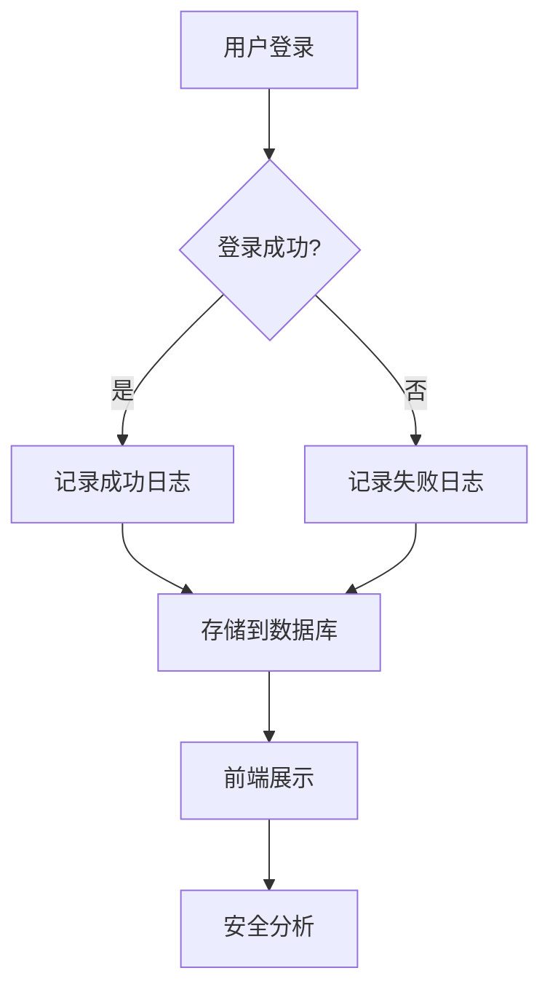
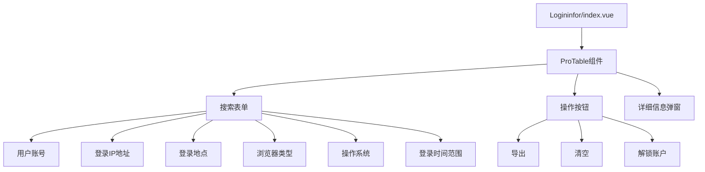
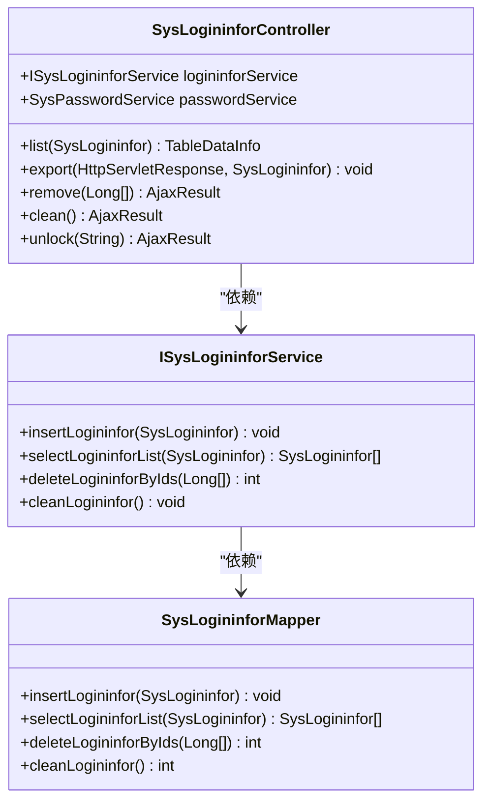
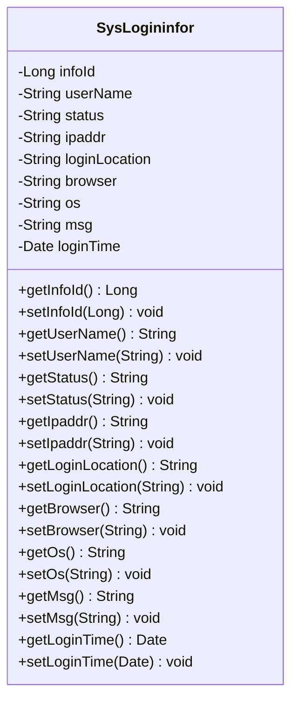
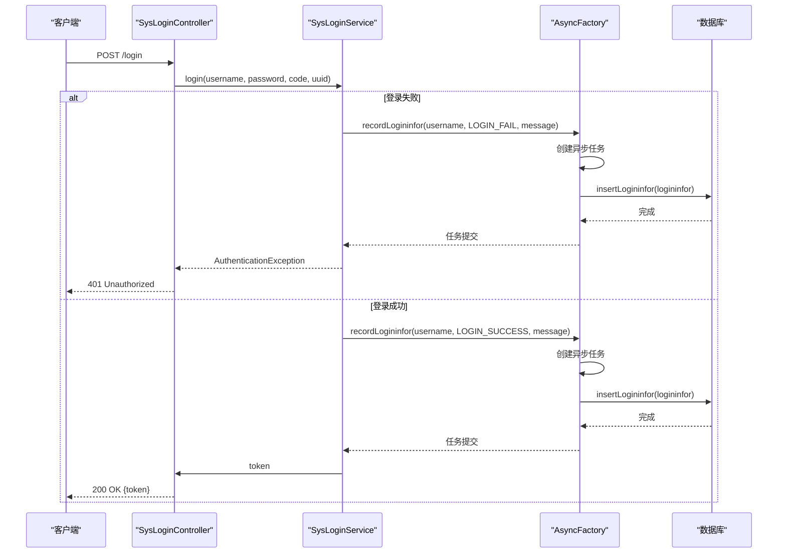
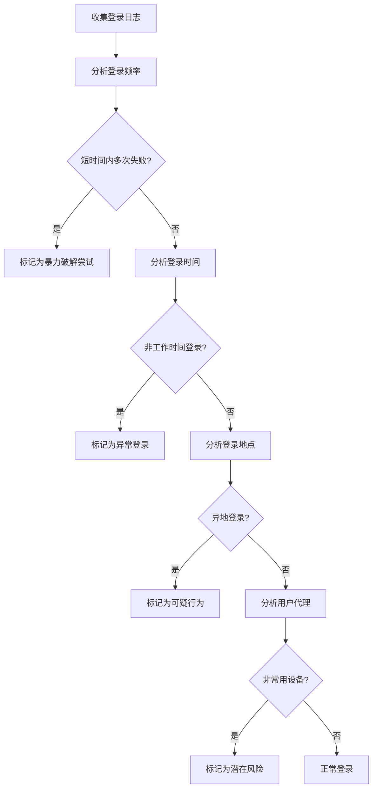

# 登录日志

<cite>
**本文档引用的文件**   
- [SysLogininfor.java](file://bearjia-admin-backend\src\main\java\com\javaxiaobear\module\monitor\domain\SysLogininfor.java)
- [SysLogininforController.java](file://bearjia-admin-backend\src\main\java\com\javaxiaobear\module\monitor\controller\SysLogininforController.java)
- [AsyncFactory.java](file://bearjia-admin-backend\src\main\java\com\javaxiaobear\base\framework\manager\factory\AsyncFactory.java)
- [SysLoginService.java](file://bearjia-admin-backend\src\main\java\com\javaxiaobear\base\framework\security\service\SysLoginService.java)
- [logininfor.js](file://bear-jia-vue3\src\api\monitor\logininfor.js)
- [index.vue](file://bear-jia-vue3\src\views\monitor\logininfor\index.vue)
- [detailModal.vue](file://bear-jia-vue3\src\views\monitor\logininfor\detailModal.vue)
- [bear_jia.sql](file://bearjia-admin-backend\src\main\resources\sql\bear_jia.sql)
</cite>

## 目录
1. [登录日志模块概述](#登录日志模块概述)
2. [前端登录日志展示](#前端登录日志展示)
3. [后端登录日志管理](#后端登录日志管理)
4. [登录日志实体设计](#登录日志实体设计)
5. [登录失败事件记录机制](#登录失败事件记录机制)
6. [异常登录检测与安全威胁识别](#异常登录检测与安全威胁识别)
7. [日志分析最佳实践](#日志分析最佳实践)
8. [典型使用场景](#典型使用场景)

## 登录日志模块概述

登录日志模块是系统安全监控的重要组成部分，用于记录和分析用户的登录行为。该模块通过前端页面展示、后端服务管理和数据库存储三个层面，实现了对用户登录行为的全面监控。系统能够记录登录时间、IP地址、登录状态（成功/失败）、浏览器类型、操作系统等关键信息，为安全审计和异常行为检测提供数据支持。

**图源**
- [SysLoginService.java](file://bearjia-admin-backend\src\main\java\com\javaxiaobear\base\framework\security\service\SysLoginService.java)
- [AsyncFactory.java](file://bearjia-admin-backend\src\main\java\com\javaxiaobear\base\framework\manager\factory\AsyncFactory.java)

## 前端登录日志展示

前端通过Logininfor/index.vue页面展示登录日志信息，提供了一个完整的用户界面来查看和管理登录记录。页面使用了ProTable组件来展示数据，并支持多种查询条件和操作功能。

**图源**
- [index.vue](file://bear-jia-vue3\src\views\monitor\logininfor\index.vue)
- [detailModal.vue](file://bear-jia-vue3\src\views\monitor\logininfor\detailModal.vue)

### 页面功能特性

登录日志页面提供了丰富的功能，包括：

- **多条件查询**：支持按用户账号、IP地址、登录地点、浏览器类型、操作系统和登录时间范围进行查询
- **数据导出**：可以将登录日志导出为Excel文件
- **日志清理**：支持批量删除或清空所有登录日志
- **账户解锁**：对于因多次登录失败而被锁定的账户，管理员可以进行解锁操作
- **详细信息查看**：点击记录可以查看详细的登录信息

**页面源**
- [index.vue](file://bear-jia-vue3\src\views\monitor\logininfor\index.vue)

## 后端登录日志管理

后端通过SysLogininforController类管理登录日志数据，提供了RESTful API接口来支持前端的各种操作需求。

**图源**
- [SysLogininforController.java](file://bearjia-admin-backend\src\main\java\com\javaxiaobear\module\monitor\controller\SysLogininforController.java)
- [ISysLogininforService.java](file://bearjia-admin-backend\src\main\java\com\javaxiaobear\module\monitor\service\ISysLogininforService.java)
- [SysLogininforMapper.java](file://bearjia-admin-backend\src\main\java\com\javaxiaobear\module\monitor\mapper\SysLogininforMapper.java)

### API接口说明

后端提供了以下API接口：

| 接口路径 | HTTP方法 | 功能描述 | 权限要求 |
|--------|--------|--------|--------|
| /monitor/logininfor/list | GET | 查询登录日志列表 | monitor:logininfor:list |
| /monitor/logininfor/export | POST | 导出登录日志 | monitor:logininfor:export |
| /monitor/logininfor/{infoIds} | DELETE | 删除指定的登录日志 | monitor:logininfor:remove |
| /monitor/logininfor/clean | DELETE | 清空所有登录日志 | monitor:logininfor:remove |
| /monitor/logininfor/unlock/{userName} | GET | 解锁指定用户账户 | monitor:logininfor:unlock |

**接口源**
- [SysLogininforController.java](file://bearjia-admin-backend\src\main\java\com\javaxiaobear\module\monitor\controller\SysLogininforController.java)

## 登录日志实体设计

SysLogininfor实体类定义了登录日志的数据结构，包含了用户登录行为的所有关键信息。

**图源**
- [SysLogininfor.java](file://bearjia-admin-backend\src\main\java\com\javaxiaobear\module\monitor\domain\SysLogininfor.java)

### 实体字段说明

| 字段名 | 类型 | 描述 | 备注 |
|-------|-----|------|------|
| infoId | Long | 访问ID | 主键，自增 |
| userName | String | 用户账号 | 记录登录的用户名 |
| status | String | 登录状态 | 0=成功，1=失败 |
| ipaddr | String | 登录IP地址 | 记录用户登录的IP地址 |
| loginLocation | String | 登录地点 | 通过IP解析的地理位置 |
| browser | String | 浏览器类型 | 用户使用的浏览器 |
| os | String | 操作系统 | 用户使用的操作系统 |
| msg | String | 提示消息 | 登录结果的详细信息 |
| loginTime | Date | 访问时间 | 登录发生的时间 |

**实体源**
- [SysLogininfor.java](file://bearjia-admin-backend\src\main\java\com\javaxiaobear\module\monitor\domain\SysLogininfor.java)
- [bear_jia.sql](file://bearjia-admin-backend\src\main\resources\sql\bear_jia.sql)

## 登录失败事件记录机制

系统在认证入口AuthenticationEntryPointImpl中记录登录失败事件，通过异步机制确保日志记录不会影响主业务流程的性能。

**图源**
- [SysLoginService.java](file://bearjia-admin-backend\src\main\java\com\javaxiaobear\base\framework\security\service\SysLoginService.java)
- [AsyncFactory.java](file://bearjia-admin-backend\src\main\java\com\javaxiaobear\base\framework\manager\factory\AsyncFactory.java)

### 异步记录流程

1. 当用户尝试登录时，系统会调用SysLoginService的login方法
2. 如果登录失败，系统会捕获AuthenticationException异常
3. 通过AsyncManager执行AsyncFactory.recordLogininfor异步任务
4. 异步任务中创建SysLogininfor对象，填充相关信息
5. 调用ISysLogininforService.insertLogininfor方法将日志写入数据库
6. 整个过程异步执行，不影响主业务流程的响应速度

**流程源**
- [SysLoginService.java](file://bearjia-admin-backend\src\main\java\com\javaxiaobear\base\framework\security\service\SysLoginService.java)
- [AsyncFactory.java](file://bearjia-admin-backend\src\main\java\com\javaxiaobear\base\framework\manager\factory\AsyncFactory.java)

## 异常登录检测与安全威胁识别

系统通过分析登录日志可以识别多种安全威胁，包括暴力破解尝试、异常登录行为等。

**图源**
- [SysLogininfor.java](file://bearjia-admin-backend\src\main\java\com\javaxiaobear\module\monitor\domain\SysLogininfor.java)
- [AsyncFactory.java](file://bearjia-admin-backend\src\main\java\com\javaxiaobear\base\framework\manager\factory\AsyncFactory.java)

### 安全检测规则

系统可以基于以下规则进行安全威胁识别：

- **暴力破解检测**：同一IP地址在短时间内（如5分钟内）连续多次登录失败
- **异地登录检测**：用户在短时间内从地理位置相距较远的两个地点登录
- **非工作时间登录**：在非正常工作时间（如深夜）的登录行为
- **非常用设备检测**：使用不常见的浏览器或操作系统登录
- **高频登录检测**：同一用户账号在短时间内频繁登录和登出

**检测源**
- [SysLogininfor.java](file://bearjia-admin-backend\src\main\java\com\javaxiaobear\module\monitor\domain\SysLogininfor.java)

## 日志分析最佳实践

为了有效利用登录日志进行安全监控，建议遵循以下最佳实践：

### 数据保留策略

- **短期保留**：保留最近30天的详细登录日志，用于日常监控和故障排查
- **长期归档**：将超过30天的日志归档到低成本存储中，保留180天
- **合规保留**：根据法律法规要求，某些关键日志需要保留更长时间

### 监控告警设置

- **登录失败告警**：当单个IP地址在5分钟内出现5次以上登录失败时触发告警
- **账户锁定告警**：当重要账户被锁定时立即通知安全管理员
- **异地登录告警**：当用户在短时间内从不同地理位置登录时触发告警
- **批量操作告警**：当大量账户同时出现异常登录行为时触发高级别告警

### 日志分析技巧

- **趋势分析**：定期分析登录成功率的变化趋势，及时发现潜在的安全问题
- **用户行为基线**：为每个用户建立正常的登录行为基线，便于识别异常
- **关联分析**：将登录日志与其他安全日志（如操作日志、访问日志）进行关联分析
- **地理可视化**：将登录IP地址映射到地图上，直观展示登录来源分布

**实践源**
- [SysLogininfor.java](file://bearjia-admin-backend\src\main\java\com\javaxiaobear\module\monitor\domain\SysLogininfor.java)
- [SysLogininforController.java](file://bearjia-admin-backend\src\main\java\com\javaxiaobear\module\monitor\controller\SysLogininforController.java)

## 典型使用场景

### 暴力破解尝试检测

通过分析登录日志，可以有效识别暴力破解尝试。例如，当系统检测到以下模式时，很可能正在遭受暴力破解攻击：

- 同一IP地址在短时间内尝试登录多个不同账户
- 同一账户在短时间内收到来自多个不同IP地址的登录尝试
- 登录失败的密码尝试呈现出规律性（如字典顺序）

系统可以通过以下措施应对暴力破解：
1. 自动锁定在短时间内多次登录失败的IP地址
2. 增加验证码难度或要求多因素认证
3. 通知受影响的用户可能存在安全风险

**场景源**
- [SysLogininfor.java](file://bearjia-admin-backend\src\main\java\com\javaxiaobear\module\monitor\domain\SysLogininfor.java)
- [AsyncFactory.java](file://bearjia-admin-backend\src\main\java\com\javaxiaobear\base\framework\manager\factory\AsyncFactory.java)

### 异常登录行为定位

当发现账户被盗用或可疑活动时，可以通过登录日志快速定位异常行为：

1. **时间分析**：检查登录时间是否符合用户的正常行为模式
2. **地点分析**：比较登录IP地址的地理位置与用户常用地点
3. **设备分析**：检查使用的浏览器和操作系统是否为用户常用设备
4. **行为分析**：分析登录后的操作行为是否与用户习惯一致

通过这些分析，安全团队可以快速判断是否发生了账户盗用，并采取相应的应对措施。

**场景源**
- [SysLogininfor.java](file://bearjia-admin-backend\src\main\java\com\javaxiaobear\module\monitor\domain\SysLogininfor.java)
- [SysLogininforController.java](file://bearjia-admin-backend\src\main\java\com\javaxiaobear\module\monitor\controller\SysLogininforController.java)