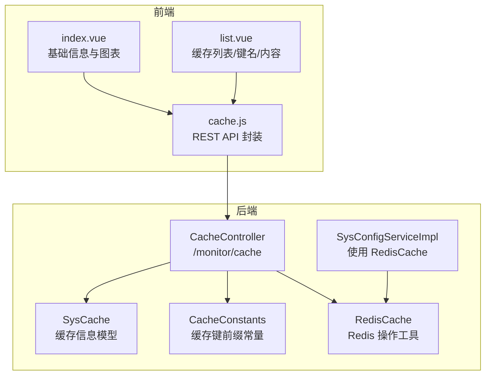
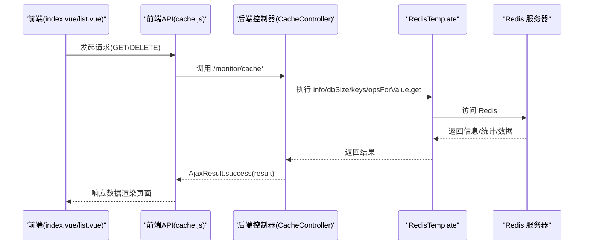
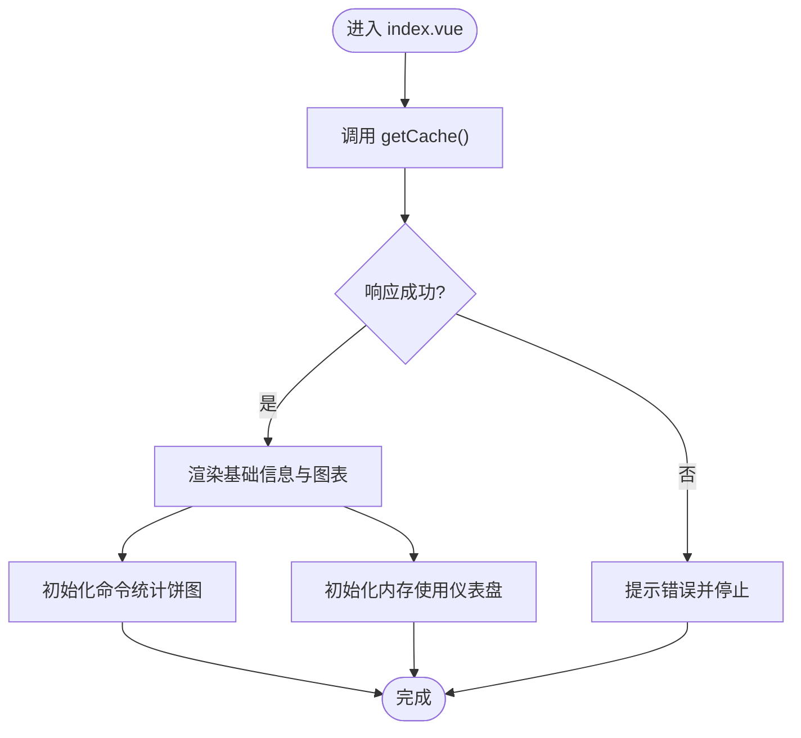
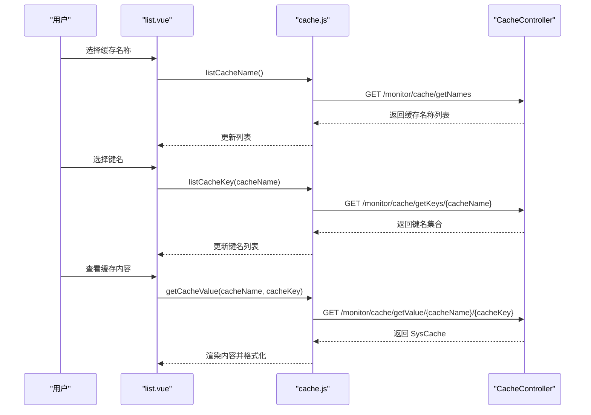
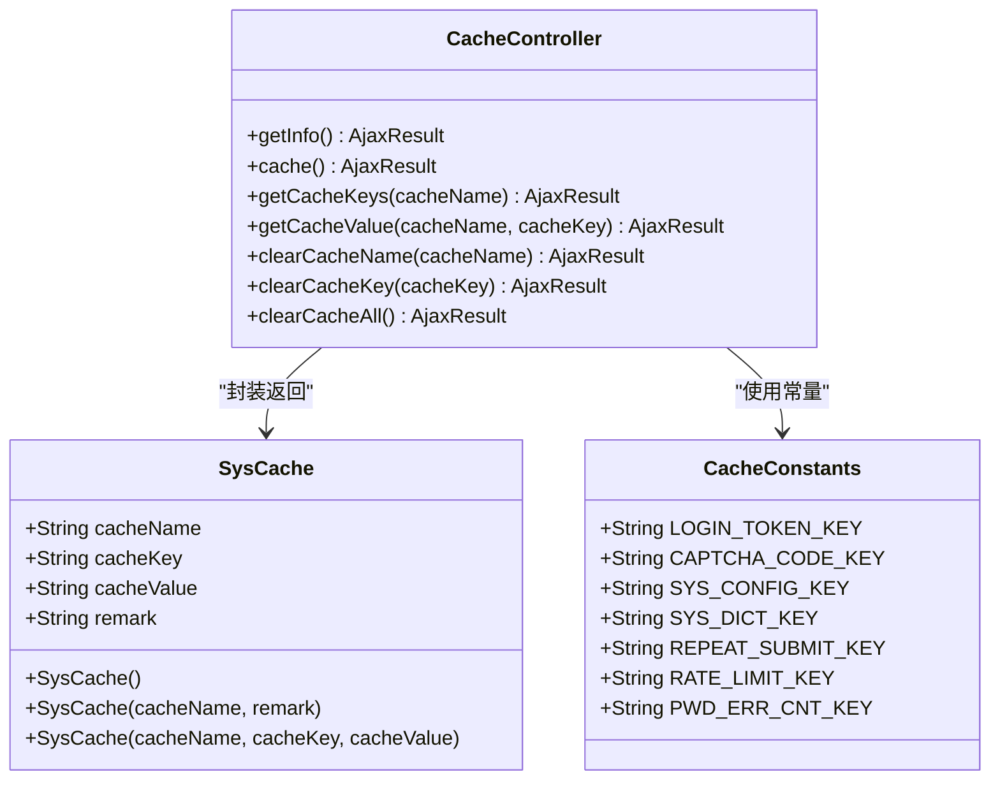
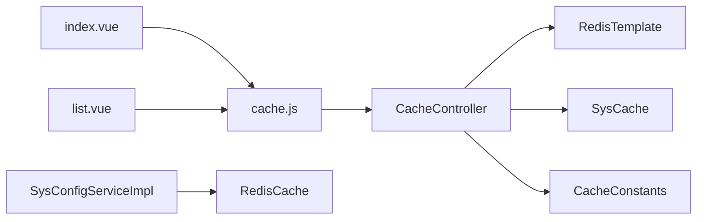

# 缓存监控

<cite>
**本文引用的文件**
- [CacheController.java](file://bearjia-admin-backend/src/main/java/com/javaxiaobear/module/monitor/controller/CacheController.java)
- [SysCache.java](file://bearjia-admin-backend/src/main/java/com/javaxiaobear/module/monitor/domain/SysCache.java)
- [RedisCache.java](file://bearjia-admin-backend/src/main/java/com/javaxiaobear/base/framework/redis/RedisCache.java)
- [CacheConstants.java](file://bearjia-admin-backend/src/main/java/com/javaxiaobear/base/common/constant/CacheConstants.java)
- [SysConfigServiceImpl.java](file://bearjia-admin-backend/src/main/java/com/javaxiaobear/module/system/service/impl/SysConfigServiceImpl.java)
- [cache.js](file://bear-jia-vue3/src/api/monitor/cache.js)
- [index.vue](file://bear-jia-vue3/src/views/monitor/cache/index.vue)
- [list.vue](file://bear-jia-vue3/src/views/monitor/cache/list.vue)
</cite>

## 目录
1. [简介](#简介)
2. [项目结构](#项目结构)
3. [核心组件](#核心组件)
4. [架构总览](#架构总览)
5. [组件详解](#组件详解)
6. [依赖关系分析](#依赖关系分析)
7. [性能考量](#性能考量)
8. [故障排查指南](#故障排查指南)
9. [结论](#结论)
10. [附录](#附录)

## 简介
本文件面向开发与运维人员，系统性阐述本项目的缓存监控能力，重点覆盖：
- 前端 Cache/index.vue 与后端 CacheController 的交互流程与数据展示
- Redis 监控指标（连接数、内存、Key 数、命令统计）采集与可视化
- SysCache 数据模型设计与 RedisCache 服务类的监控方法实现
- 缓存健康状态评估标准、性能瓶颈识别方法与优化建议
- 典型使用场景：通过监控命中率优化查询性能、依据内存使用调整缓存策略

## 项目结构
缓存监控功能由“前端视图 + 前端 API 封装 + 后端控制器 + Redis 服务”四部分组成，前后端职责清晰、边界明确：
- 前端：index.vue 展示 Redis 基础信息与命令统计、内存使用；list.vue 提供缓存列表、键名列表与内容查看，并支持清理操作
- 前端 API：封装 /monitor/cache 下的 REST 接口调用
- 后端控制器：CacheController 提供 Redis 信息、命令统计、Key 列表、内容读取与清理接口
- Redis 服务：RedisCache 提供通用的键值、列表、集合、哈希等操作；SysConfigServiceImpl 使用 RedisCache 进行配置缓存

**图表来源**
- [index.vue](file://bear-jia-vue3/src/views/monitor/cache/index.vue#L1-L133)
- [list.vue](file://bear-jia-vue3/src/views/monitor/cache/list.vue#L1-L120)
- [cache.js](file://bear-jia-vue3/src/api/monitor/cache.js#L1-L58)
- [CacheController.java](file://bearjia-admin-backend/src/main/java/com/javaxiaobear/module/monitor/controller/CacheController.java#L1-L120)
- [SysCache.java](file://bearjia-admin-backend/src/main/java/com/javaxiaobear/module/monitor/domain/SysCache.java#L1-L81)
- [CacheConstants.java](file://bearjia-admin-backend/src/main/java/com/javaxiaobear/base/common/constant/CacheConstants.java#L1-L45)
- [RedisCache.java](file://bearjia-admin-backend/src/main/java/com/javaxiaobear/base/framework/redis/RedisCache.java#L1-L269)
- [SysConfigServiceImpl.java](file://bearjia-admin-backend/src/main/java/com/javaxiaobear/module/system/service/impl/SysConfigServiceImpl.java#L1-L229)

**章节来源**
- [index.vue](file://bear-jia-vue3/src/views/monitor/cache/index.vue#L1-L133)
- [list.vue](file://bear-jia-vue3/src/views/monitor/cache/list.vue#L1-L120)
- [cache.js](file://bear-jia-vue3/src/api/monitor/cache.js#L1-L58)
- [CacheController.java](file://bearjia-admin-backend/src/main/java/com/javaxiaobear/module/monitor/controller/CacheController.java#L1-L120)
- [SysCache.java](file://bearjia-admin-backend/src/main/java/com/javaxiaobear/module/monitor/domain/SysCache.java#L1-L81)
- [CacheConstants.java](file://bearjia-admin-backend/src/main/java/com/javaxiaobear/base/common/constant/CacheConstants.java#L1-L45)
- [RedisCache.java](file://bearjia-admin-backend/src/main/java/com/javaxiaobear/base/framework/redis/RedisCache.java#L1-L269)
- [SysConfigServiceImpl.java](file://bearjia-admin-backend/src/main/java/com/javaxiaobear/module/system/service/impl/SysConfigServiceImpl.java#L1-L229)

## 核心组件
- 前端 API 封装（cache.js）
  - 提供查询缓存详情、缓存名称列表、键名列表、缓存内容、清理指定名称/键名/全部缓存等方法
- 前端视图
  - index.vue：展示 Redis 版本、运行模式、端口、客户端数、运行时间、使用内存、CPU、内存上限、AOF/RDB 状态、Key 数量、网络输入输出速率；命令统计以饼图展示，内存使用以仪表盘展示
  - list.vue：展示缓存名称列表、键名列表、缓存内容详情，支持复制、清理等操作
- 后端控制器（CacheController）
  - GET /monitor/cache：采集 Redis info、dbSize、commandstats 并组装返回
  - GET /monitor/cache/getNames：返回预置的缓存名称清单（来自 CacheConstants 常量）
  - GET /monitor/cache/getKeys/{cacheName}：按前缀匹配返回键名集合
  - GET /monitor/cache/getValue/{cacheName}/{cacheKey}：读取指定键值并封装为 SysCache
  - DELETE /monitor/cache/clearCacheName/{cacheName}、/clearCacheKey/{cacheKey}、/clearCacheAll：清理指定/全部缓存
- 数据模型（SysCache）
  - 字段：cacheName、cacheKey、cacheValue、remark；构造函数对键名进行清洗
- Redis 服务（RedisCache）
  - 提供 set/get/expire/delete、List/Set/Hash 操作、keys 等通用方法
- 常量（CacheConstants）
  - 定义登录令牌、验证码、系统配置、字典、防重提交、限流、密码错误次数等键前缀

**章节来源**
- [cache.js](file://bear-jia-vue3/src/api/monitor/cache.js#L1-L58)
- [index.vue](file://bear-jia-vue3/src/views/monitor/cache/index.vue#L1-L133)
- [list.vue](file://bear-jia-vue3/src/views/monitor/cache/list.vue#L1-L120)
- [CacheController.java](file://bearjia-admin-backend/src/main/java/com/javaxiaobear/module/monitor/controller/CacheController.java#L1-L120)
- [SysCache.java](file://bearjia-admin-backend/src/main/java/com/javaxiaobear/module/monitor/domain/SysCache.java#L1-L81)
- [RedisCache.java](file://bearjia-admin-backend/src/main/java/com/javaxiaobear/base/framework/redis/RedisCache.java#L1-L269)
- [CacheConstants.java](file://bearjia-admin-backend/src/main/java/com/javaxiaobear/base/common/constant/CacheConstants.java#L1-L45)

## 架构总览
下图展示从前端到后端再到 Redis 的完整调用链路与数据流向。

**图表来源**
- [index.vue](file://bear-jia-vue3/src/views/monitor/cache/index.vue#L64-L133)
- [list.vue](file://bear-jia-vue3/src/views/monitor/cache/list.vue#L144-L210)
- [cache.js](file://bear-jia-vue3/src/api/monitor/cache.js#L1-L58)
- [CacheController.java](file://bearjia-admin-backend/src/main/java/com/javaxiaobear/module/monitor/controller/CacheController.java#L47-L120)
- [RedisCache.java](file://bearjia-admin-backend/src/main/java/com/javaxiaobear/base/framework/redis/RedisCache.java#L1-L269)

## 组件详解

### 前端组件：index.vue
- 功能要点
  - 加载 Redis 基础信息（版本、运行模式、端口、客户端数、运行时间、内存、CPU、内存上限、AOF/RDB、Key 数量、网络输入输出速率）
  - 命令统计饼图：基于 commandstats 的 calls 次数占比
  - 内存使用仪表盘：基于 used_memory_human 显示峰值
- 数据来源
  - 通过 cache.js 的 getCache() 请求 /monitor/cache 获取 info、dbSize、commandStats
- 可视化
  - ECharts 初始化与 option 配置在 mounted 生命周期内完成

**图表来源**
- [index.vue](file://bear-jia-vue3/src/views/monitor/cache/index.vue#L64-L133)
- [cache.js](file://bear-jia-vue3/src/api/monitor/cache.js#L1-L10)
- [CacheController.java](file://bearjia-admin-backend/src/main/java/com/javaxiaobear/module/monitor/controller/CacheController.java#L47-L68)

**章节来源**
- [index.vue](file://bear-jia-vue3/src/views/monitor/cache/index.vue#L1-L133)
- [cache.js](file://bear-jia-vue3/src/api/monitor/cache.js#L1-L10)
- [CacheController.java](file://bearjia-admin-backend/src/main/java/com/javaxiaobear/module/monitor/controller/CacheController.java#L47-L68)

### 前端组件：list.vue
- 功能要点
  - 缓存名称列表：GET /monitor/cache/getNames
  - 键名列表：GET /monitor/cache/getKeys/{cacheName}
  - 缓存内容：GET /monitor/cache/getValue/{cacheName}/{cacheKey}
  - 清理操作：DELETE /monitor/cache/clearCacheName/{cacheName}、/clearCacheKey/{cacheKey}、/clearCacheAll
  - 内容展示：自动识别 JSON/字符串/数组/对象，支持复制到剪贴板
- 用户交互
  - 选择缓存名称后自动拉取键名列表
  - 点击键名查看内容，支持格式化显示与复制

**图表来源**
- [list.vue](file://bear-jia-vue3/src/views/monitor/cache/list.vue#L144-L210)
- [cache.js](file://bear-jia-vue3/src/api/monitor/cache.js#L11-L33)
- [CacheController.java](file://bearjia-admin-backend/src/main/java/com/javaxiaobear/module/monitor/controller/CacheController.java#L71-L93)

**章节来源**
- [list.vue](file://bear-jia-vue3/src/views/monitor/cache/list.vue#L1-L120)
- [cache.js](file://bear-jia-vue3/src/api/monitor/cache.js#L11-L33)
- [CacheController.java](file://bearjia-admin-backend/src/main/java/com/javaxiaobear/module/monitor/controller/CacheController.java#L71-L93)

### 后端控制器：CacheController
- 关键接口
  - GET /monitor/cache：采集 info、dbSize、commandstats，拼装返回
  - GET /monitor/cache/getNames：返回预置缓存名称清单（来源于 CacheConstants）
  - GET /monitor/cache/getKeys/{cacheName}：按前缀 keys 匹配返回键集合
  - GET /monitor/cache/getValue/{cacheName}/{cacheKey}：读取值并封装为 SysCache
  - DELETE /monitor/cache/clearCacheName/{cacheName}、/clearCacheKey/{cacheKey}、/clearCacheAll：清理缓存
- 数据处理
  - commandstats 解析 calls 次数，用于饼图展示
  - SysCache 构造时对 cacheName/cacheKey 进行清洗，便于前端展示

**图表来源**
- [CacheController.java](file://bearjia-admin-backend/src/main/java/com/javaxiaobear/module/monitor/controller/CacheController.java#L1-L120)
- [SysCache.java](file://bearjia-admin-backend/src/main/java/com/javaxiaobear/module/monitor/domain/SysCache.java#L1-L81)
- [CacheConstants.java](file://bearjia-admin-backend/src/main/java/com/javaxiaobear/base/common/constant/CacheConstants.java#L1-L45)

**章节来源**
- [CacheController.java](file://bearjia-admin-backend/src/main/java/com/javaxiaobear/module/monitor/controller/CacheController.java#L1-L120)
- [SysCache.java](file://bearjia-admin-backend/src/main/java/com/javaxiaobear/module/monitor/domain/SysCache.java#L1-L81)
- [CacheConstants.java](file://bearjia-admin-backend/src/main/java/com/javaxiaobear/base/common/constant/CacheConstants.java#L1-L45)

### 数据模型：SysCache
- 设计目标
  - 统一承载缓存名称、键名、值与备注，便于前后端传输与展示
- 关键点
  - 构造函数对 cacheName 去除冒号，对 cacheKey 去除前缀，提升可读性
  - 支持空参与带参构造，满足不同场景

**章节来源**
- [SysCache.java](file://bearjia-admin-backend/src/main/java/com/javaxiaobear/module/monitor/domain/SysCache.java#L1-L81)

### Redis 服务：RedisCache
- 能力范围
  - 基本对象缓存：set/get/expire/hasKey/delete
  - 列表、集合、哈希：增删查改
  - keys：批量键检索
- 在监控中的作用
  - CacheController 使用 RedisTemplate 执行 info/dbSize/keys 等底层操作
  - SysConfigServiceImpl 使用 RedisCache 进行配置缓存的加载、清理与重置

**章节来源**
- [RedisCache.java](file://bearjia-admin-backend/src/main/java/com/javaxiaobear/base/framework/redis/RedisCache.java#L1-L269)
- [SysConfigServiceImpl.java](file://bearjia-admin-backend/src/main/java/com/javaxiaobear/module/system/service/impl/SysConfigServiceImpl.java#L1-L229)

## 依赖关系分析
- 前端依赖
  - index.vue 依赖 cache.js 的 getCache()；list.vue 依赖 listCacheName/listCacheKey/getCacheValue/clearCacheName/clearCacheKey/clearCacheAll
- 后端依赖
  - CacheController 依赖 RedisTemplate（通过 Spring 自动注入），用于执行 Redis 命令
  - CacheController 依赖 SysCache 作为返回体载体
  - CacheController 依赖 CacheConstants 作为缓存名称清单的来源
  - SysConfigServiceImpl 依赖 RedisCache 进行配置缓存的读写与清理
- 耦合与内聚
  - 前后端通过 /monitor/cache 统一接口解耦
  - 控制器内部对 Redis 的访问集中在 info/dbSize/keys/opsForValue.get，职责单一

**图表来源**
- [index.vue](file://bear-jia-vue3/src/views/monitor/cache/index.vue#L64-L133)
- [list.vue](file://bear-jia-vue3/src/views/monitor/cache/list.vue#L144-L210)
- [cache.js](file://bear-jia-vue3/src/api/monitor/cache.js#L1-L58)
- [CacheController.java](file://bearjia-admin-backend/src/main/java/com/javaxiaobear/module/monitor/controller/CacheController.java#L1-L120)
- [SysCache.java](file://bearjia-admin-backend/src/main/java/com/javaxiaobear/module/monitor/domain/SysCache.java#L1-L81)
- [CacheConstants.java](file://bearjia-admin-backend/src/main/java/com/javaxiaobear/base/common/constant/CacheConstants.java#L1-L45)
- [RedisCache.java](file://bearjia-admin-backend/src/main/java/com/javaxiaobear/base/framework/redis/RedisCache.java#L1-L269)
- [SysConfigServiceImpl.java](file://bearjia-admin-backend/src/main/java/com/javaxiaobear/module/system/service/impl/SysConfigServiceImpl.java#L1-L229)

**章节来源**
- [cache.js](file://bear-jia-vue3/src/api/monitor/cache.js#L1-L58)
- [CacheController.java](file://bearjia-admin-backend/src/main/java/com/javaxiaobear/module/monitor/controller/CacheController.java#L1-L120)
- [RedisCache.java](file://bearjia-admin-backend/src/main/java/com/javaxiaobear/base/framework/redis/RedisCache.java#L1-L269)
- [SysConfigServiceImpl.java](file://bearjia-admin-backend/src/main/java/com/javaxiaobear/module/system/service/impl/SysConfigServiceImpl.java#L1-L229)

## 性能考量
- 指标采集
  - info/dbSize/commandstats 为轻量级命令，适合周期性轮询；注意避免过于频繁导致 Redis 压力
- 命令统计
  - commandstats 中的 calls 次数可用于识别热点命令，辅助定位性能瓶颈
- 内存与 Key 数
  - used_memory_human 与 dbSize 反映资源占用；结合 maxmemory_human 判断淘汰策略是否合理
- 前端渲染
  - ECharts 初始化在 nextTick 中执行，避免阻塞首屏渲染
- 后端清理
  - keys("*") 会扫描全库，生产环境建议仅在维护窗口执行；推荐按前缀清理

[本节为通用指导，不直接分析具体文件]

## 故障排查指南
- 前端无法加载 Redis 信息
  - 检查 /monitor/cache 接口是否可达；确认权限与网关配置
  - 检查 cache.js 的请求路径与方法是否正确
- 命令统计为空
  - 确认 Redis info("commandstats") 是否可用；检查 Redis 版本与配置
- 键名列表为空
  - 确认 cacheName 前缀是否正确；检查 Redis 中是否存在该前缀的键
- 清理失败
  - 检查权限与安全拦截；确认键是否存在且未过期
- 内存飙升
  - 结合 used_memory_human 与 maxmemory_human 判断是否接近上限；必要时调整淘汰策略或扩容

**章节来源**
- [cache.js](file://bear-jia-vue3/src/api/monitor/cache.js#L1-L58)
- [CacheController.java](file://bearjia-admin-backend/src/main/java/com/javaxiaobear/module/monitor/controller/CacheController.java#L47-L120)

## 结论
本项目通过统一的 /monitor/cache 接口，实现了对 Redis 的基础监控与运维能力：包括运行信息、命令统计、Key 数、内存使用等指标展示，以及缓存列表、键名与内容的可视化与清理。前端通过 ECharts 实现直观的可视化，后端通过 RedisTemplate 直接访问 Redis，保证了监控的实时性与准确性。SysCache 与 CacheConstants 的配合，使缓存名称与键名的展示更友好。建议在生产环境中合理控制轮询频率、谨慎使用全库扫描清理操作，并结合业务特征持续优化缓存策略。

[本节为总结性内容，不直接分析具体文件]

## 附录

### 缓存健康状态评估标准
- 连接数
  - 与 maxclients 比较，接近上限需扩容或优化连接池
- 内存
  - used_memory_human/maxmemory_human 比例接近 80% 以上需关注淘汰策略或扩容
- Key 数
  - dbSize 增长过快需检查过期策略与键生命周期
- 命令统计
  - 热点命令 calls 持续偏高，考虑优化查询或引入多级缓存

[本节为通用指导，不直接分析具体文件]

### 典型使用场景
- 通过监控缓存命中率优化查询性能
  - 若命中率低，优先检查缓存预热、键过期策略与热点数据分布
- 根据内存使用情况调整缓存策略
  - 当内存接近上限时，优先清理过期键、优化淘汰策略或增加实例

[本节为通用指导，不直接分析具体文件]