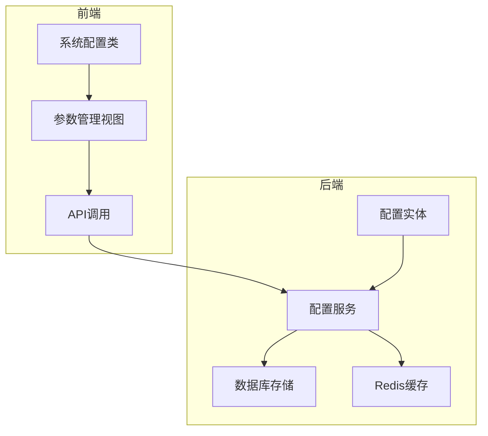
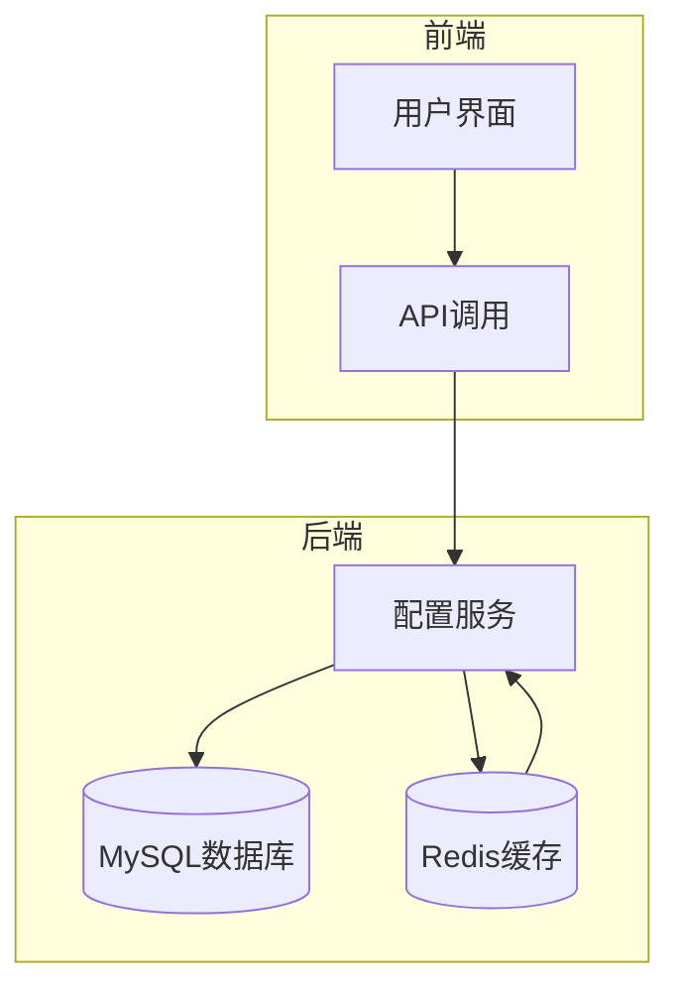
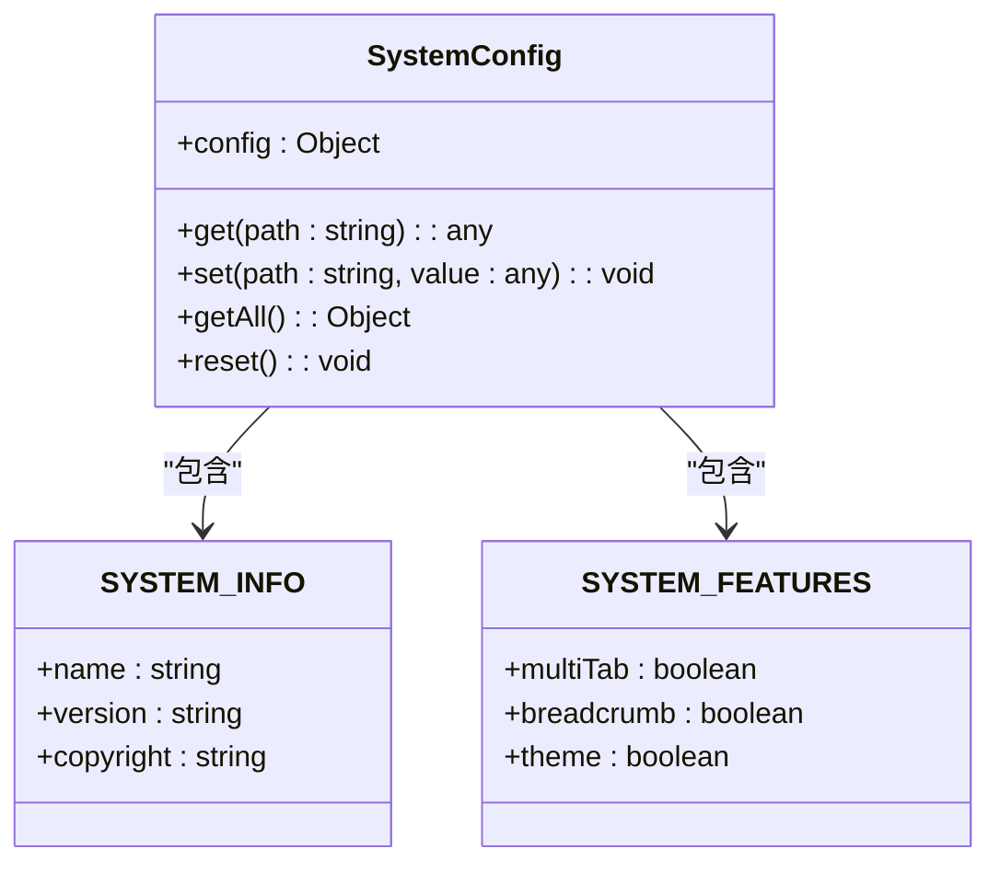
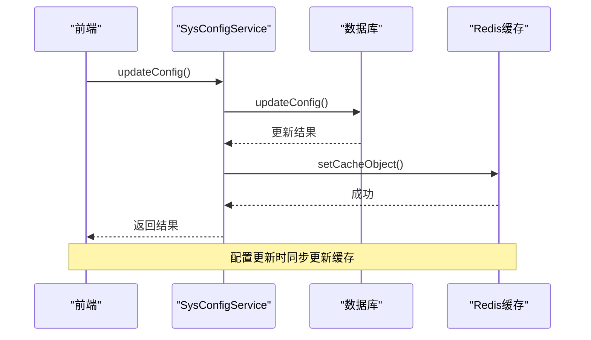
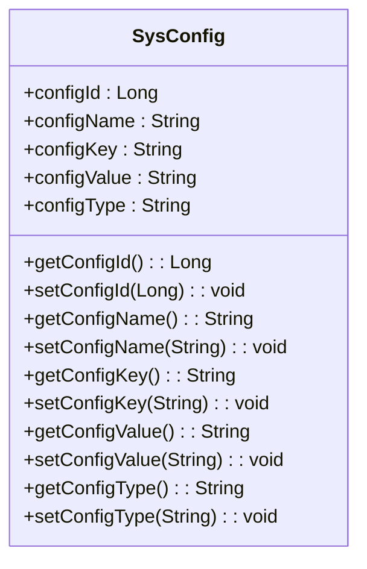
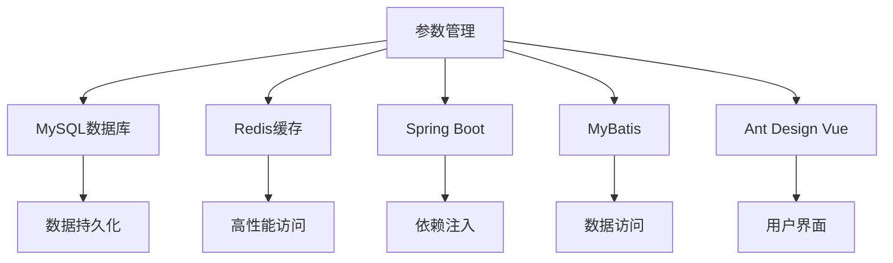

# 参数管理

<cite>
**本文档引用的文件**   
- [system.config.js](file://bear-jia-vue3/src/config/system.config.js)
- [config.js](file://bear-jia-vue3/src/api/system/config.js)
- [ProjectConfig.java](file://bearjia-admin-backend/src/main/java/com/javaxiaobear/base/framework/config/ProjectConfig.java)
- [SysConfigServiceImpl.java](file://bearjia-admin-backend/src/main/java/com/javaxiaobear/module/system/service/impl/SysConfigServiceImpl.java)
- [SysConfig.java](file://bearjia-admin-backend/src/main/java/com/javaxiaobear/module/system/domain/SysConfig.java)
- [CacheConstants.java](file://bearjia-admin-backend/src/main/java/com/javaxiaobear/base/common/constant/CacheConstants.java)
- [CacheController.java](file://bearjia-admin-backend/src/main/java/com/javaxiaobear/module/monitor/controller/CacheController.java)
- [index.vue](file://bear-jia-vue3/src/views/system/config/index.vue)
- [addUpdateModal.vue](file://bear-jia-vue3/src/views/system/config/addUpdateModal.vue)
- [detailModal.vue](file://bear-jia-vue3/src/views/system/config/detailModal.vue)
- [application.yml](file://bearjia-admin-backend/src/main/resources/application.yml)
</cite>

## 目录
1. [简介](#简介)
2. [项目结构](#项目结构)
3. [核心组件](#核心组件)
4. [架构概述](#架构概述)
5. [详细组件分析](#详细组件分析)
6. [依赖分析](#依赖分析)
7. [性能考虑](#性能考虑)
8. [故障排除指南](#故障排除指南)
9. [结论](#结论)

## 简介
本系统提供全面的参数管理功能，支持系统参数的增删改查、配置项分类、动态刷新和前端集成。系统通过`ProjectConfig`类加载配置参数，后端服务层实现配置的数据库存储与缓存同步。用户可以执行典型操作如修改系统标题、调整分页默认大小、刷新配置缓存等。参数管理与系统运行时行为紧密关联，如登录验证码开关、密码策略控制等。文档还包含常见问题排查和性能优化建议。

## 项目结构
系统参数管理功能分布在前后端多个模块中，前端位于`bear-jia-vue3`项目中，后端位于`bearjia-admin-backend`项目中。前端主要包含视图组件和API调用，后端包含服务实现、数据访问和配置管理。

**图表来源**
- [index.vue](file://bear-jia-vue3/src/views/system/config/index.vue)
- [config.js](file://bear-jia-vue3/src/api/system/config.js)
- [SysConfigServiceImpl.java](file://bearjia-admin-backend/src/main/java/com/javaxiaobear/module/system/service/impl/SysConfigServiceImpl.java)

**本节来源**
- [index.vue](file://bear-jia-vue3/src/views/system/config/index.vue)
- [config.js](file://bear-jia-vue3/src/api/system/config.js)

## 核心组件
系统参数管理的核心组件包括前端的`SystemConfig`类和后端的`SysConfigServiceImpl`服务。`SystemConfig`类提供统一的配置访问接口，支持通过路径获取和设置配置项。`SysConfigServiceImpl`服务负责数据库存储和Redis缓存同步，确保配置数据的一致性和高性能访问。

**本节来源**
- [system.config.js](file://bear-jia-vue3/src/config/system.config.js)
- [SysConfigServiceImpl.java](file://bearjia-admin-backend/src/main/java/com/javaxiaobear/module/system/service/impl/SysConfigServiceImpl.java)

## 架构概述
系统采用前后端分离架构，前端通过API调用与后端交互。后端使用Spring Boot框架，通过MyBatis访问MySQL数据库，并使用Redis作为缓存层。配置数据在系统启动时从数据库加载到Redis缓存中，后续访问直接从缓存读取，提高性能。

**图表来源**
- [config.js](file://bear-jia-vue3/src/api/system/config.js)
- [SysConfigServiceImpl.java](file://bearjia-admin-backend/src/main/java/com/javaxiaobear/module/system/service/impl/SysConfigServiceImpl.java)
- [SysConfig.java](file://bearjia-admin-backend/src/main/java/com/javaxiaobear/module/system/domain/SysConfig.java)

## 详细组件分析

### 前端配置管理分析
前端通过`SystemConfig`类管理配置，该类提供get、set、getAll等方法，支持通过点分路径访问嵌套配置。配置数据存储在内存中，支持动态更新和重置。

**图表来源**
- [system.config.js](file://bear-jia-vue3/src/config/system.config.js)

**本节来源**
- [system.config.js](file://bear-jia-vue3/src/config/system.config.js)

### 后端配置服务分析
后端`SysConfigServiceImpl`服务实现配置的增删改查和缓存同步。服务在启动时通过`@PostConstruct`注解初始化，将数据库中的配置加载到Redis缓存中。每次配置变更时，服务会同步更新缓存。

**图表来源**
- [SysConfigServiceImpl.java](file://bearjia-admin-backend/src/main/java/com/javaxiaobear/module/system/service/impl/SysConfigServiceImpl.java)

**本节来源**
- [SysConfigServiceImpl.java](file://bearjia-admin-backend/src/main/java/com/javaxiaobear/module/system/service/impl/SysConfigServiceImpl.java)

### 配置实体分析
`SysConfig`实体类定义了配置参数的数据结构，包括参数主键、名称、键名、键值和系统内置标志。实体通过MyBatis映射到数据库表`sys_config`。

**图表来源**
- [SysConfig.java](file://bearjia-admin-backend/src/main/java/com/javaxiaobear/module/system/domain/SysConfig.java)

**本节来源**
- [SysConfig.java](file://bearjia-admin-backend/src/main/java/com/javaxiaobear/module/system/domain/SysConfig.java)

## 依赖分析
参数管理功能依赖于多个系统组件，包括数据库、Redis缓存、Spring框架和前端UI组件。后端服务通过依赖注入获取数据库Mapper和Redis缓存实例，前端通过API调用与后端服务通信。

**图表来源**
- [SysConfigServiceImpl.java](file://bearjia-admin-backend/src/main/java/com/javaxiaobear/module/system/service/impl/SysConfigServiceImpl.java)
- [config.js](file://bear-jia-vue3/src/api/system/config.js)

**本节来源**
- [SysConfigServiceImpl.java](file://bearjia-admin-backend/src/main/java/com/javaxiaobear/module/system/service/impl/SysConfigServiceImpl.java)
- [config.js](file://bear-jia-vue3/src/api/system/config.js)

## 性能考虑
系统通过多级缓存机制优化参数访问性能。配置数据在系统启动时从数据库加载到Redis缓存中，后续访问直接从缓存读取。前端也实现了本地缓存，减少重复API调用。对于频繁访问的配置项，建议使用本地缓存和热更新机制。

**本节来源**
- [SysConfigServiceImpl.java](file://bearjia-admin-backend/src/main/java/com/javaxiaobear/module/system/service/impl/SysConfigServiceImpl.java)
- [system.config.js](file://bear-jia-vue3/src/config/system.config.js)

## 故障排除指南
### 配置修改后未生效
检查Redis缓存是否正确更新，确认`SysConfigServiceImpl`的缓存同步逻辑是否执行。可以通过缓存监控界面查看配置缓存状态。

### 缓存不同步
检查Redis连接配置，确保后端服务能正常访问Redis。查看日志确认缓存操作是否成功。

### 参数分类管理
系统通过`configType`字段区分系统内置参数和用户自定义参数，内置参数不允许删除，确保系统稳定性。

**本节来源**
- [SysConfigServiceImpl.java](file://bearjia-admin-backend/src/main/java/com/javaxiaobear/module/system/service/impl/SysConfigServiceImpl.java)
- [CacheController.java](file://bearjia-admin-backend/src/main/java/com/javaxiaobear/module/monitor/controller/CacheController.java)

## 结论
本系统提供了完整的参数管理解决方案，通过前后端协同工作，实现了配置的增删改查、分类管理、动态刷新和缓存同步。系统设计考虑了性能和稳定性，通过多级缓存机制确保高效访问，通过权限控制和内置参数保护确保系统安全。建议定期监控缓存状态，及时处理配置变更，确保系统稳定运行。