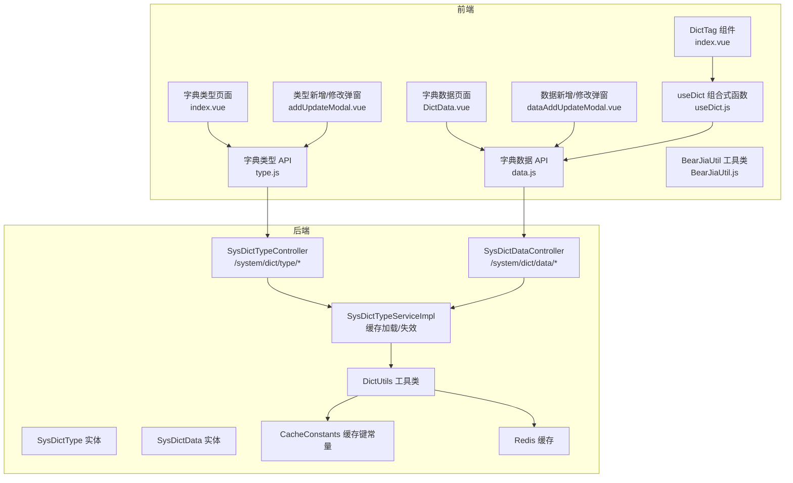
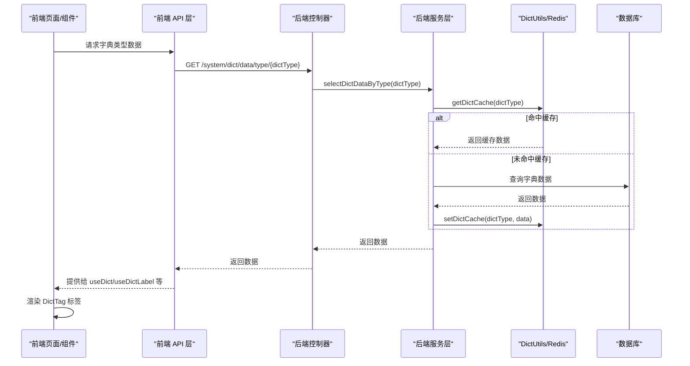
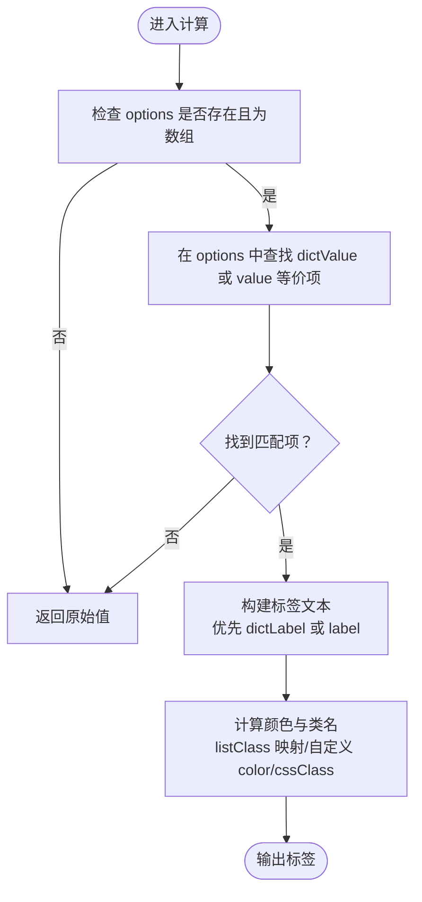
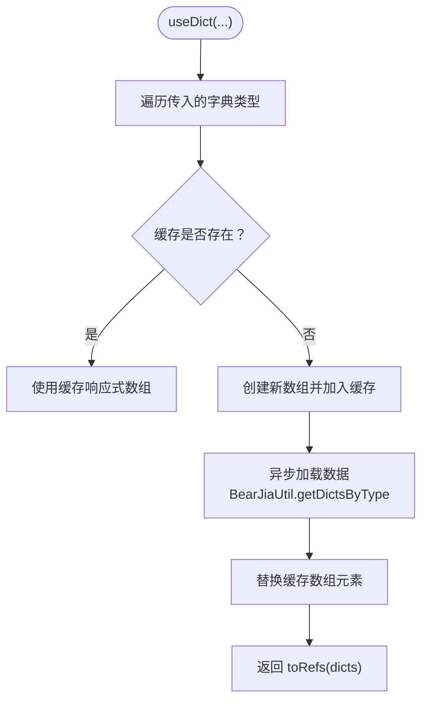
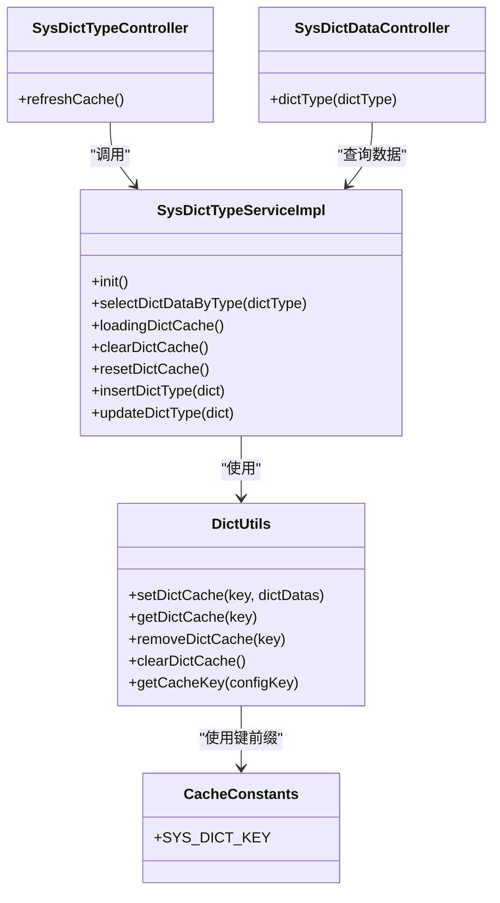
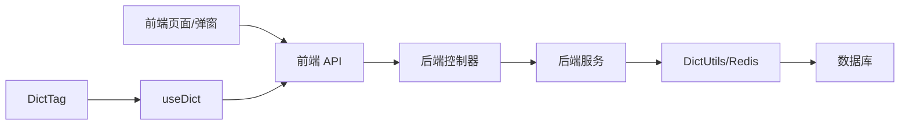
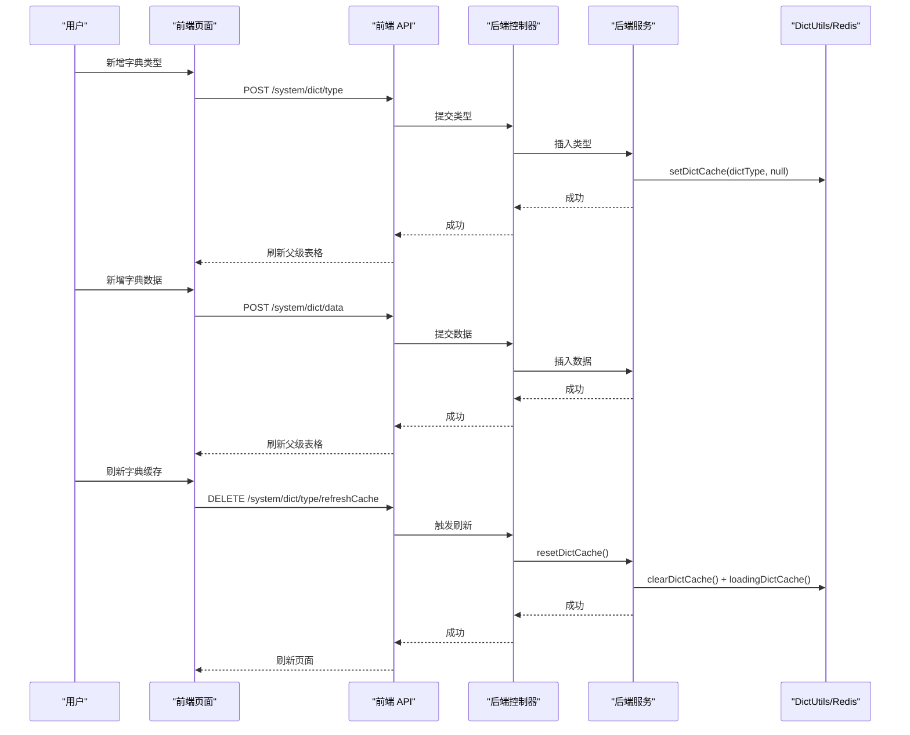

# 字典管理

<cite>
**本文引用的文件**
- [DictTag 组件](file://bear-jia-vue3/src/components/DictTag/index.vue)
- [useDict 组合式函数](file://bear-jia-vue3/src/composables/useDict.js)
- [字典数据 API](file://bear-jia-vue3/src/api/system/dict/data.js)
- [字典类型 API](file://bear-jia-vue3/src/api/system/dict/type.js)
- [字典类型页面](file://bear-jia-vue3/src/views/system/dict/index.vue)
- [字典数据页面](file://bear-jia-vue3/src/views/system/dict/DictData.vue)
- [字典类型新增/修改弹窗](file://bear-jia-vue3/src/views/system/dict/addUpdateModal.vue)
- [字典数据新增/修改弹窗](file://bear-jia-vue3/src/views/system/dict/dataAddUpdateModal.vue)
- [工具类 BearJiaUtil](file://bear-jia-vue3/src/utils/BearJiaUtil.js)
- [后端字典类型控制器](file://bearjia-admin-backend/src/main/java/com/javaxiaobear/module/system/controller/SysDictTypeController.java)
- [后端字典数据控制器](file://bearjia-admin-backend/src/main/java/com/javaxiaobear/module/system/controller/SysDictDataController.java)
- [后端字典类型服务实现](file://bearjia-admin-backend/src/main/java/com/javaxiaobear/module/system/service/impl/SysDictTypeServiceImpl.java)
- [后端字典类型实体](file://bearjia-admin-backend/src/main/java/com/javaxiaobear/module/system/domain/SysDictType.java)
- [后端字典数据实体](file://bearjia-admin-backend/src/main/java/com/javaxiaobear/module/system/domain/SysDictData.java)
- [后端字典工具类](file://bearjia-admin-backend/src/main/java/com/javaxiaobear/base/common/utils/DictUtils.java)
- [后端缓存常量](file://bearjia-admin-backend/src/main/java/com/javaxiaobear/base/common/constant/CacheConstants.java)
- [后端缓存监控控制器](file://bearjia-admin-backend/src/main/java/com/javaxiaobear/module/monitor/controller/CacheController.java)
</cite>

## 目录
1. [简介](#简介)
2. [项目结构](#项目结构)
3. [核心组件](#核心组件)
4. [架构总览](#架构总览)
5. [详细组件分析](#详细组件分析)
6. [依赖关系分析](#依赖关系分析)
7. [性能考虑](#性能考虑)
8. [故障排查指南](#故障排查指南)
9. [结论](#结论)

## 简介
本文件面向前端与后端工程师，系统性阐述“字典管理”能力，包括：
- 字典类型与字典数据的增删改查
- 字典数据的维护与前端渲染
- 字典缓存机制（Redis）与前端缓存策略
- DictTag 组件如何根据字典类型与值渲染标签样式
- 后端服务层如何将字典数据加载到 Redis 缓存
- 典型操作流程示例：创建字典类型与数据、表单字典选择器、刷新缓存
- 字典变更后的前端通知与更新策略
- 常见问题排查与性能优化建议

## 项目结构
前端采用 Vue3 + Ant Design Vue，后端采用 Spring Boot + Redis。字典管理涉及：
- 前端：组件层（DictTag）、组合式函数（useDict）、API 层、页面视图
- 后端：控制器（SysDictTypeController、SysDictDataController）、服务（SysDictTypeServiceImpl）、实体（SysDictType、SysDictData）、工具（DictUtils、CacheConstants）

图表来源
- [字典类型页面](file://bear-jia-vue3/src/views/system/dict/index.vue#L1-L129)
- [字典数据页面](file://bear-jia-vue3/src/views/system/dict/DictData.vue#L1-L140)
- [DictTag 组件](file://bear-jia-vue3/src/components/DictTag/index.vue#L1-L143)
- [useDict 组合式函数](file://bear-jia-vue3/src/composables/useDict.js#L1-L185)
- [字典类型 API](file://bear-jia-vue3/src/api/system/dict/type.js#L1-L61)
- [字典数据 API](file://bear-jia-vue3/src/api/system/dict/data.js#L1-L53)
- [工具类 BearJiaUtil](file://bear-jia-vue3/src/utils/BearJiaUtil.js#L178-L193)
- [后端字典类型控制器](file://bearjia-admin-backend/src/main/java/com/javaxiaobear/module/system/controller/SysDictTypeController.java#L1-L132)
- [后端字典数据控制器](file://bearjia-admin-backend/src/main/java/com/javaxiaobear/module/system/controller/SysDictDataController.java#L1-L122)
- [后端字典类型服务实现](file://bearjia-admin-backend/src/main/java/com/javaxiaobear/module/system/service/impl/SysDictTypeServiceImpl.java#L1-L224)
- [后端字典工具类](file://bearjia-admin-backend/src/main/java/com/javaxiaobear/base/common/utils/DictUtils.java#L1-L186)
- [后端缓存常量](file://bearjia-admin-backend/src/main/java/com/javaxiaobear/base/common/constant/CacheConstants.java#L1-L44)

章节来源
- [字典类型页面](file://bear-jia-vue3/src/views/system/dict/index.vue#L1-L129)
- [字典数据页面](file://bear-jia-vue3/src/views/system/dict/DictData.vue#L1-L140)
- [DictTag 组件](file://bear-jia-vue3/src/components/DictTag/index.vue#L1-L143)
- [useDict 组合式函数](file://bear-jia-vue3/src/composables/useDict.js#L1-L185)
- [字典类型 API](file://bear-jia-vue3/src/api/system/dict/type.js#L1-L61)
- [字典数据 API](file://bear-jia-vue3/src/api/system/dict/data.js#L1-L53)
- [工具类 BearJiaUtil](file://bear-jia-vue3/src/utils/BearJiaUtil.js#L178-L193)
- [后端字典类型控制器](file://bearjia-admin-backend/src/main/java/com/javaxiaobear/module/system/controller/SysDictTypeController.java#L1-L132)
- [后端字典数据控制器](file://bearjia-admin-backend/src/main/java/com/javaxiaobear/module/system/controller/SysDictDataController.java#L1-L122)
- [后端字典类型服务实现](file://bearjia-admin-backend/src/main/java/com/javaxiaobear/module/system/service/impl/SysDictTypeServiceImpl.java#L1-L224)
- [后端字典工具类](file://bearjia-admin-backend/src/main/java/com/javaxiaobear/base/common/utils/DictUtils.java#L1-L186)
- [后端缓存常量](file://bearjia-admin-backend/src/main/java/com/javaxiaobear/base/common/constant/CacheConstants.java#L1-L44)

## 核心组件
- DictTag 组件：根据传入的字典选项与值，渲染对应标签文本、颜色与样式类，支持多种数据结构兼容。
- useDict 组合式函数：统一加载与缓存字典数据，提供获取标签、值、样式类、标签类型等工具方法，并支持清理与刷新缓存。
- BearJiaUtil：封装按类型获取字典数据的 Promise 化接口，供 useDict 使用。
- 前端页面与弹窗：字典类型与数据的增删改查、表格展示、字典选择器、导出等。
- 后端控制器与服务：提供 REST 接口与缓存加载/失效逻辑；通过 DictUtils 与 Redis 交互。

章节来源
- [DictTag 组件](file://bear-jia-vue3/src/components/DictTag/index.vue#L1-L143)
- [useDict 组合式函数](file://bear-jia-vue3/src/composables/useDict.js#L1-L185)
- [工具类 BearJiaUtil](file://bear-jia-vue3/src/utils/BearJiaUtil.js#L178-L193)
- [字典类型页面](file://bear-jia-vue3/src/views/system/dict/index.vue#L1-L129)
- [字典数据页面](file://bear-jia-vue3/src/views/system/dict/DictData.vue#L1-L140)
- [字典类型新增/修改弹窗](file://bear-jia-vue3/src/views/system/dict/addUpdateModal.vue#L1-L127)
- [字典数据新增/修改弹窗](file://bear-jia-vue3/src/views/system/dict/dataAddUpdateModal.vue#L1-L205)
- [后端字典类型控制器](file://bearjia-admin-backend/src/main/java/com/javaxiaobear/module/system/controller/SysDictTypeController.java#L1-L132)
- [后端字典数据控制器](file://bearjia-admin-backend/src/main/java/com/javaxiaobear/module/system/controller/SysDictDataController.java#L1-L122)
- [后端字典类型服务实现](file://bearjia-admin-backend/src/main/java/com/javaxiaobear/module/system/service/impl/SysDictTypeServiceImpl.java#L1-L224)

## 架构总览
前端通过 API 层调用后端 REST 接口，后端控制器将请求委派给服务层；服务层从数据库读取字典数据，优先从 Redis 缓存命中，未命中则写入缓存；前端 useDict 在首次请求某字典类型时异步加载并缓存到本地响应式对象，后续渲染使用 DictTag 组件直接匹配选项。

图表来源
- [字典数据 API](file://bear-jia-vue3/src/api/system/dict/data.js#L1-L53)
- [后端字典数据控制器](file://bearjia-admin-backend/src/main/java/com/javaxiaobear/module/system/controller/SysDictDataController.java#L72-L84)
- [后端字典类型服务实现](file://bearjia-admin-backend/src/main/java/com/javaxiaobear/module/system/service/impl/SysDictTypeServiceImpl.java#L67-L88)
- [后端字典工具类](file://bearjia-admin-backend/src/main/java/com/javaxiaobear/base/common/utils/DictUtils.java#L1-L186)

## 详细组件分析

### DictTag 组件
- 功能要点
  - 支持两种数据结构：标准格式（dictValue/dictLabel）与兼容格式（value/label）
  - 根据 value 在 options 中查找匹配项，输出对应标签文本
  - 根据 listClass 或自定义 color 生成标签颜色；支持 cssClass 注入额外样式
  - 若无匹配或 options 缺失，默认回退为原始值
- 样式映射
  - listClass 到颜色映射：default/primary/success/info/warning/danger/error/processing 及直写颜色
  - 旧版默认映射：0/1/2 对应不同颜色
- 使用场景
  - 表格列渲染状态/类型等字段
  - 表单只读展示

图表来源
- [DictTag 组件](file://bear-jia-vue3/src/components/DictTag/index.vue#L1-L143)

章节来源
- [DictTag 组件](file://bear-jia-vue3/src/components/DictTag/index.vue#L1-L143)

### useDict 组合式函数
- 功能要点
  - 按需异步加载指定字典类型的数据，内部维护 dictCache 响应式对象
  - 首次加载完成后，后续访问直接使用缓存，避免重复请求
  - 提供 getDictLabel/getDictValue/getDictClass/getDictTagType 等辅助方法
  - 支持 clearDictCache(dictType?) 与 refreshDict(dictType) 清理/刷新缓存
- 性能特性
  - 前端本地缓存，减少网络请求
  - 通过 splice 替换数组元素，保持响应式引用稳定

图表来源
- [useDict 组合式函数](file://bear-jia-vue3/src/composables/useDict.js#L1-L185)
- [工具类 BearJiaUtil](file://bear-jia-vue3/src/utils/BearJiaUtil.js#L178-L193)

章节来源
- [useDict 组合式函数](file://bear-jia-vue3/src/composables/useDict.js#L1-L185)
- [工具类 BearJiaUtil](file://bear-jia-vue3/src/utils/BearJiaUtil.js#L178-L193)

### 前端页面与弹窗
- 字典类型页面（index.vue）
  - 展示字典类型列表，支持状态筛选、导出
  - 可展开行渲染对应字典数据子表
  - 使用 useDict 获取状态字典，渲染状态列
- 字典数据页面（DictData.vue）
  - 展示某字典类型下的数据列表，支持增删改查、导出
  - 使用 DictTag 渲染状态列
  - 通过 dataAddUpdateModal/dataDetailModal 管理数据
- 类型/数据弹窗
  - 提供表单校验、新增/修改、详情查看
  - 通过事件向父级触发刷新

章节来源
- [字典类型页面](file://bear-jia-vue3/src/views/system/dict/index.vue#L1-L129)
- [字典数据页面](file://bear-jia-vue3/src/views/system/dict/DictData.vue#L1-L140)
- [字典类型新增/修改弹窗](file://bear-jia-vue3/src/views/system/dict/addUpdateModal.vue#L1-L127)
- [字典数据新增/修改弹窗](file://bear-jia-vue3/src/views/system/dict/dataAddUpdateModal.vue#L1-L205)

### 后端服务层与缓存机制
- SysDictTypeServiceImpl
  - 启动时加载所有有效字典数据到 Redis 缓存（按 dictType 分组并排序）
  - 读取时优先从 Redis 命中，未命中再查数据库并写入缓存
  - 删除/修改字典类型时，清理对应缓存或重置缓存
- DictUtils
  - 提供 setDictCache/getDictCache/removeDictCache/clearDictCache 等方法
  - 使用 CacheConstants.SYS_DICT_KEY 作为前缀
- SysDictTypeController
  - 提供刷新缓存接口，调用服务层 resetDictCache
- SysDictDataController
  - 提供按类型查询字典数据接口，返回列表

图表来源
- [后端字典类型服务实现](file://bearjia-admin-backend/src/main/java/com/javaxiaobear/module/system/service/impl/SysDictTypeServiceImpl.java#L1-L224)
- [后端字典工具类](file://bearjia-admin-backend/src/main/java/com/javaxiaobear/base/common/utils/DictUtils.java#L1-L186)
- [后端缓存常量](file://bearjia-admin-backend/src/main/java/com/javaxiaobear/base/common/constant/CacheConstants.java#L1-L44)
- [后端字典类型控制器](file://bearjia-admin-backend/src/main/java/com/javaxiaobear/module/system/controller/SysDictTypeController.java#L110-L120)
- [后端字典数据控制器](file://bearjia-admin-backend/src/main/java/com/javaxiaobear/module/system/controller/SysDictDataController.java#L72-L84)

章节来源
- [后端字典类型服务实现](file://bearjia-admin-backend/src/main/java/com/javaxiaobear/module/system/service/impl/SysDictTypeServiceImpl.java#L1-L224)
- [后端字典工具类](file://bearjia-admin-backend/src/main/java/com/javaxiaobear/base/common/utils/DictUtils.java#L1-L186)
- [后端缓存常量](file://bearjia-admin-backend/src/main/java/com/javaxiaobear/base/common/constant/CacheConstants.java#L1-L44)
- [后端字典类型控制器](file://bearjia-admin-backend/src/main/java/com/javaxiaobear/module/system/controller/SysDictTypeController.java#L110-L120)
- [后端字典数据控制器](file://bearjia-admin-backend/src/main/java/com/javaxiaobear/module/system/controller/SysDictDataController.java#L72-L84)

## 依赖关系分析
- 前端依赖链
  - 页面/弹窗 -> API -> 控制器 -> 服务 -> 工具类/Redis -> 数据库
  - 组件渲染依赖 useDict 提供的响应式字典数据
- 后端依赖链
  - 控制器 -> 服务 -> Mapper -> 数据库
  - 服务 -> DictUtils -> Redis
- 关键耦合点
  - 前端通过 BearJiaUtil.getDictsByType 统一转换后端返回为 {value,label} 数组
  - useDict 与 BearJiaUtil 的配合，确保前后端数据结构一致
  - 后端通过 DictUtils 与 Redis 解耦，便于集中管理缓存

图表来源
- [字典类型 API](file://bear-jia-vue3/src/api/system/dict/type.js#L1-L61)
- [字典数据 API](file://bear-jia-vue3/src/api/system/dict/data.js#L1-L53)
- [工具类 BearJiaUtil](file://bear-jia-vue3/src/utils/BearJiaUtil.js#L178-L193)
- [后端字典类型控制器](file://bearjia-admin-backend/src/main/java/com/javaxiaobear/module/system/controller/SysDictTypeController.java#L1-L132)
- [后端字典数据控制器](file://bearjia-admin-backend/src/main/java/com/javaxiaobear/module/system/controller/SysDictDataController.java#L1-L122)
- [后端字典类型服务实现](file://bearjia-admin-backend/src/main/java/com/javaxiaobear/module/system/service/impl/SysDictTypeServiceImpl.java#L1-L224)
- [后端字典工具类](file://bearjia-admin-backend/src/main/java/com/javaxiaobear/base/common/utils/DictUtils.java#L1-L186)

章节来源
- [字典类型 API](file://bear-jia-vue3/src/api/system/dict/type.js#L1-L61)
- [字典数据 API](file://bear-jia-vue3/src/api/system/dict/data.js#L1-L53)
- [工具类 BearJiaUtil](file://bear-jia-vue3/src/utils/BearJiaUtil.js#L178-L193)
- [后端字典类型控制器](file://bearjia-admin-backend/src/main/java/com/javaxiaobear/module/system/controller/SysDictTypeController.java#L1-L132)
- [后端字典数据控制器](file://bearjia-admin-backend/src/main/java/com/javaxiaobear/module/system/controller/SysDictDataController.java#L1-L122)
- [后端字典类型服务实现](file://bearjia-admin-backend/src/main/java/com/javaxiaobear/module/system/service/impl/SysDictTypeServiceImpl.java#L1-L224)
- [后端字典工具类](file://bearjia-admin-backend/src/main/java/com/javaxiaobear/base/common/utils/DictUtils.java#L1-L186)

## 性能考虑
- 前端
  - useDict 的本地缓存避免重复请求，建议在路由切换或页面卸载时按需清理缓存
  - DictTag 仅做轻量匹配与映射，复杂列表建议分页与虚拟滚动
- 后端
  - 启动时批量加载字典到 Redis，按 dictType 分组并排序，减少运行时查询
  - 删除/修改字典类型时及时清理缓存，避免脏读
  - Redis 缓存键使用统一前缀，便于监控与清理
- 导航与导出
  - 列表导出使用后端 Excel 工具，避免前端大列表导出导致内存压力

[本节为通用指导，无需具体文件分析]

## 故障排查指南
- 字典数据未显示
  - 检查前端是否正确传入 options 与 value
  - 确认 useDict 是否已加载对应字典类型
  - 检查 BearJiaUtil.getDictsByType 返回的数据结构是否符合 {value,label}
- 缓存未更新
  - 后端：调用“刷新字典缓存”接口后，确认服务层 resetDictCache 是否执行
  - 前端：调用 refreshDict 或 clearDictCache 后，确认页面是否重新请求
- 字典变更后前端未更新
  - 建议在新增/修改/删除字典类型/数据后，主动触发刷新缓存流程
  - 页面级监听事件，收到刷新事件后重新加载 useDict

章节来源
- [useDict 组合式函数](file://bear-jia-vue3/src/composables/useDict.js#L146-L185)
- [后端字典类型控制器](file://bearjia-admin-backend/src/main/java/com/javaxiaobear/module/system/controller/SysDictTypeController.java#L110-L120)
- [后端字典类型服务实现](file://bearjia-admin-backend/src/main/java/com/javaxiaobear/module/system/service/impl/SysDictTypeServiceImpl.java#L134-L166)

## 典型操作流程示例

### 创建新的字典类型并添加字典数据
- 创建字典类型
  - 打开类型新增弹窗，填写类型与名称，提交后触发父级刷新
  - 后端校验唯一性，插入成功后可选择清理/重置缓存
- 添加字典数据
  - 在字典数据页面打开数据新增弹窗，填写 dictValue/dictLabel/dictSort/status 等
  - 提交后触发父级刷新，前端 useDict 缓存自动失效，下次渲染时重新加载
- 刷新字典缓存
  - 前端：调用刷新缓存接口或 useDict.refreshDict
  - 后端：调用“刷新字典缓存”接口，服务层清空并重新加载

图表来源
- [字典类型新增/修改弹窗](file://bear-jia-vue3/src/views/system/dict/addUpdateModal.vue#L1-L127)
- [字典数据新增/修改弹窗](file://bear-jia-vue3/src/views/system/dict/dataAddUpdateModal.vue#L1-L205)
- [字典类型页面](file://bear-jia-vue3/src/views/system/dict/index.vue#L1-L129)
- [字典数据页面](file://bear-jia-vue3/src/views/system/dict/DictData.vue#L1-L140)
- [字典类型 API](file://bear-jia-vue3/src/api/system/dict/type.js#L46-L52)
- [字典数据 API](file://bear-jia-vue3/src/api/system/dict/data.js#L28-L53)
- [后端字典类型控制器](file://bearjia-admin-backend/src/main/java/com/javaxiaobear/module/system/controller/SysDictTypeController.java#L110-L120)
- [后端字典类型服务实现](file://bearjia-admin-backend/src/main/java/com/javaxiaobear/module/system/service/impl/SysDictTypeServiceImpl.java#L134-L166)

## 结论
字典管理在本项目中实现了前后端协同的完整闭环：前端通过 useDict 与 DictTag 实现高性能、易用的字典渲染；后端通过 Redis 缓存与统一工具类实现高可用的字典数据读取与更新。建议在实际使用中：
- 严格规范字典数据结构，确保前后端一致
- 在字典变更后及时刷新缓存，保证一致性
- 对高频字典类型进行批量预热，提升首屏性能
- 在复杂场景下结合分页与虚拟滚动，控制渲染成本