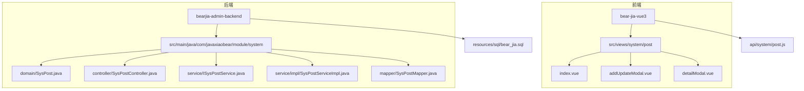
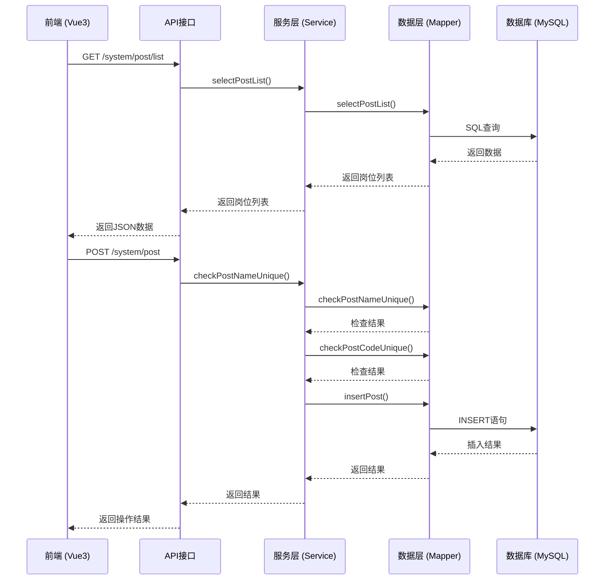
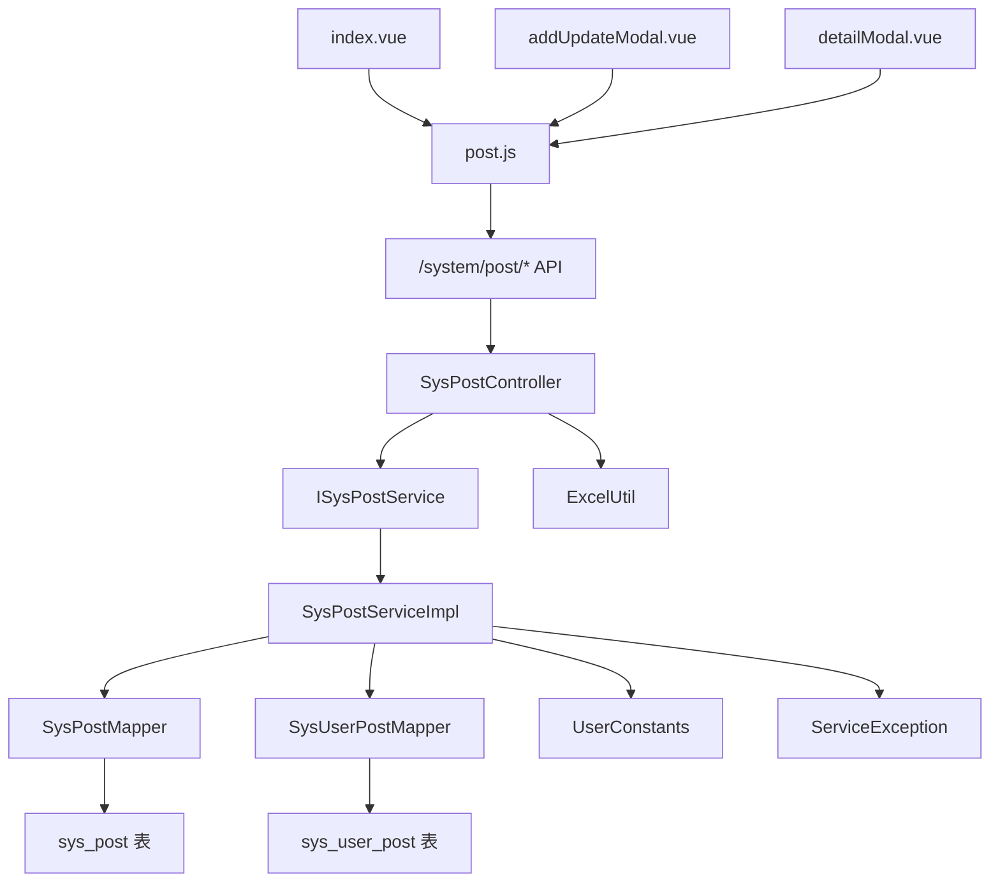

# 岗位管理

<cite>
**本文档引用文件**  
- [index.vue](file://bear-jia-vue3\src\views\system\post\index.vue)
- [addUpdateModal.vue](file://bear-jia-vue3\src\views\system\post\addUpdateModal.vue)
- [detailModal.vue](file://bear-jia-vue3\src\views\system\post\detailModal.vue)
- [post.js](file://bear-jia-vue3\src\api\system\post.js)
- [SysPost.java](file://bearjia-admin-backend\src\main\java\com\javaxiaobear\module\system\domain\SysPost.java)
- [SysPostController.java](file://bearjia-admin-backend\src\main\java\com\javaxiaobear\module\system\controller\SysPostController.java)
- [ISysPostService.java](file://bearjia-admin-backend\src\main\java\com\javaxiaobear\module\system\service\ISysPostService.java)
- [SysPostServiceImpl.java](file://bearjia-admin-backend\src\main\java\com\javaxiaobear\module\system\service\impl\SysPostServiceImpl.java)
- [SysPostMapper.java](file://bearjia-admin-backend\src\main\java\com\javaxiaobear\module\system\mapper\SysPostMapper.java)
- [SysUserPost.java](file://bearjia-admin-backend\src\main\java\com\javaxiaobear\module\system\domain\SysUserPost.java)
- [bear_jia.sql](file://bearjia-admin-backend\src\main\resources\sql\bear_jia.sql)
</cite>

## 目录
1. [简介](#简介)
2. [项目结构](#项目结构)
3. [核心组件](#核心组件)
4. [架构概览](#架构概览)
5. [详细组件分析](#详细组件分析)
6. [依赖分析](#依赖分析)
7. [性能考虑](#性能考虑)
8. [故障排除指南](#故障排除指南)
9. [结论](#结论)

## 简介
岗位管理功能是系统权限和组织架构的核心组成部分，提供对岗位的增删改查、状态管理、编码规范等功能。本系统实现了前后端分离架构，前端基于Vue3和Ant Design Vue组件库，后端采用Spring Boot框架。岗位信息通过岗位编码（postCode）和岗位名称（postName）进行唯一性约束，支持与用户之间的多对多关联。系统提供了完整的RESTful API接口，支持岗位数据的查询、新增、修改、删除和导出操作，并通过字典标签实现状态的可视化展示。

## 项目结构
岗位管理功能的文件分布在前后端两个主要目录中，前端文件位于`bear-jia-vue3/src/views/system/post/`目录下，后端文件位于`bearjia-admin-backend/src/main/java/com/javaxiaobear/module/system/`相关包中。



**图源**  
- [index.vue](file://bear-jia-vue3\src\views\system\post\index.vue)
- [SysPost.java](file://bearjia-admin-backend\src\main\java\com\javaxiaobear\module\system\domain\SysPost.java)
- [bear_jia.sql](file://bearjia-admin-backend\src\main\resources\sql\bear_jia.sql)

**本节来源**  
- [index.vue](file://bear-jia-vue3\src\views\system\post\index.vue)
- [SysPost.java](file://bearjia-admin-backend\src\main\java\com\javaxiaobear\module\system\domain\SysPost.java)

## 核心组件
岗位管理功能的核心组件包括前端的岗位列表页面（index.vue）、新增修改模态框（addUpdateModal.vue）和详情模态框（detailModal.vue），以及后端的岗位实体类（SysPost）、控制器（SysPostController）、服务接口（ISysPostService）和服务实现类（SysPostServiceImpl）。前端通过API调用与后端交互，实现了岗位数据的完整生命周期管理。后端通过MyBatis映射器（SysPostMapper）与数据库进行交互，确保数据的持久化存储。

**本节来源**  
- [index.vue](file://bear-jia-vue3\src\views\system\post\index.vue)
- [addUpdateModal.vue](file://bear-jia-vue3\src\views\system\post\addUpdateModal.vue)
- [detailModal.vue](file://bear-jia-vue3\src\views\system\post\detailModal.vue)
- [SysPost.java](file://bearjia-admin-backend\src\main\java\com\javaxiaobear\module\system\domain\SysPost.java)
- [SysPostController.java](file://bearjia-admin-backend\src\main\java\com\javaxiaobear\module\system\controller\SysPostController.java)

## 架构概览
岗位管理功能采用典型的前后端分离架构，前端负责用户界面展示和交互，后端提供RESTful API服务。前端通过Axios发送HTTP请求与后端通信，后端使用Spring Boot框架处理请求，通过Service层调用Mapper层与数据库交互。



**图源**  
- [SysPostController.java](file://bearjia-admin-backend\src\main\java\com\javaxiaobear\module\system\controller\SysPostController.java)
- [ISysPostService.java](file://bearjia-admin-backend\src\main\java\com\javaxiaobear\module\system\service\ISysPostService.java)
- [SysPostMapper.java](file://bearjia-admin-backend\src\main\java\com\javaxiaobear\module\system\mapper\SysPostMapper.java)

## 详细组件分析

### 前端组件分析
岗位管理的前端组件主要包括岗位列表页、新增修改模态框和详情模态框。列表页使用ProTable组件展示岗位数据，支持搜索、分页、导出等功能。新增修改模态框提供表单输入，包含岗位编码、岗位名称、显示顺序、岗位状态和备注等字段，并进行前端验证。

```mermaid
classDiagram
class PostIndex {
+tableApi : Object
+initialSearchParams : Object
+exportConfig : Object
+searchFields : Array
+columns : Array
+addUpdateModalRef : Ref
+detailModalRef : Ref
+openAddModal() : void
+openUpdateModal(record) : void
+openDetailModal(record) : void
}
class AddUpdateModal {
+pageDataObj : Reactive
+addUpdateFormObj : Reactive
+addUpdateFormRef : Ref
+openAddModal() : void
+openUpdateModal(record) : void
+clickModalOk() : void
+handleModalCancel() : void
}
class DetailModal {
+pageDataObj : Reactive
+detailFormObj : Reactive
+detailFormRef : Ref
+openModal(record) : void
}
PostIndex --> AddUpdateModal : 使用
PostIndex --> DetailModal : 使用
AddUpdateModal --> "post.js" : API调用
DetailModal --> "post.js" : API调用
```

**图源**  
- [index.vue](file://bear-jia-vue3\src\views\system\post\index.vue)
- [addUpdateModal.vue](file://bear-jia-vue3\src\views\system\post\addUpdateModal.vue)
- [detailModal.vue](file://bear-jia-vue3\src\views\system\post\detailModal.vue)

**本节来源**  
- [index.vue](file://bear-jia-vue3\src\views\system\post\index.vue)
- [addUpdateModal.vue](file://bear-jia-vue3\src\views\system\post\addUpdateModal.vue)
- [detailModal.vue](file://bear-jia-vue3\src\views\system\post\detailModal.vue)

### 后端服务层分析
后端服务层是岗位管理功能的核心，负责业务逻辑处理和数据校验。`ISysPostService`接口定义了岗位管理的所有操作方法，`SysPostServiceImpl`类实现了这些方法。服务层对岗位名称和岗位编码进行唯一性校验，确保数据的完整性。

```mermaid
classDiagram
class ISysPostService {
<<interface>>
+selectPostList(post : SysPost) : SysPost[]
+selectPostAll() : SysPost[]
+selectPostById(postId : Long) : SysPost
+checkPostNameUnique(post : SysPost) : boolean
+checkPostCodeUnique(post : SysPost) : boolean
+countUserPostById(postId : Long) : int
+deletePostById(postId : Long) : int
+deletePostByIds(postIds : Long[]) : int
+insertPost(post : SysPost) : int
+updatePost(post : SysPost) : int
}
class SysPostServiceImpl {
-postMapper : SysPostMapper
-userPostMapper : SysUserPostMapper
+selectPostList(post : SysPost) : SysPost[]
+selectPostAll() : SysPost[]
+selectPostById(postId : Long) : SysPost
+checkPostNameUnique(post : SysPost) : boolean
+checkPostCodeUnique(post : SysPost) : boolean
+countUserPostById(postId : Long) : int
+deletePostById(postId : Long) : int
+deletePostByIds(postIds : Long[]) : int
+insertPost(post : SysPost) : int
+updatePost(post : SysPost) : int
}
class SysPostMapper {
<<interface>>
+selectPostList(post : SysPost) : SysPost[]
+selectPostAll() : SysPost[]
+selectPostById(postId : Long) : SysPost
+checkPostNameUnique(postName : String) : SysPost
+checkPostCodeUnique(postCode : String) : SysPost
+deletePostById(postId : Long) : int
+deletePostByIds(postIds : Long[]) : int
+insertPost(post : SysPost) : int
+updatePost(post : SysPost) : int
}
SysPostServiceImpl ..|> ISysPostService
SysPostServiceImpl --> SysPostMapper : 依赖
SysPostServiceImpl --> "SysUserPostMapper" : 依赖
```

**图源**  
- [ISysPostService.java](file://bearjia-admin-backend\src\main\java\com\javaxiaobear\module\system\service\ISysPostService.java)
- [SysPostServiceImpl.java](file://bearjia-admin-backend\src\main\java\com\javaxiaobear\module\system\service\impl\SysPostServiceImpl.java)
- [SysPostMapper.java](file://bearjia-admin-backend\src\main\java\com\javaxiaobear\module\system\mapper\SysPostMapper.java)

**本节来源**  
- [ISysPostService.java](file://bearjia-admin-backend\src\main\java\com\javaxiaobear\module\system\service\ISysPostService.java)
- [SysPostServiceImpl.java](file://bearjia-admin-backend\src\main\java\com\javaxiaobear\module\system\service\impl\SysPostServiceImpl.java)
- [SysPostMapper.java](file://bearjia-admin-backend\src\main\java\com\javaxiaobear\module\system\mapper\SysPostMapper.java)

### 数据模型分析
岗位管理的数据模型主要包括岗位信息表（sys_post）和用户岗位关联表（sys_user_post）。岗位信息表存储岗位的基本信息，如岗位编码、岗位名称、显示顺序和状态。用户岗位关联表实现用户与岗位的多对多关系。

```mermaid
erDiagram
SYS_POST {
bigint post_id PK "岗位ID"
varchar(64) post_code "岗位编码"
varchar(50) post_name "岗位名称"
int post_sort "显示顺序"
char(1) status "状态0正常 1停用"
varchar(64) create_by "创建者"
datetime create_time "创建时间"
varchar(64) update_by "更新者"
datetime update_time "更新时间"
varchar(500) remark "备注"
}
SYS_USER_POST {
bigint user_id FK "用户ID"
bigint post_id FK "岗位ID"
}
SYS_USER {
bigint user_id PK "用户ID"
varchar(30) user_name "用户账号"
varchar(30) nick_name "用户昵称"
char(1) sex "用户性别"
varchar(50) email "用户邮箱"
varchar(11) phonenumber "手机号码"
}
SYS_POST ||--o{ SYS_USER_POST : "1:N"
SYS_USER ||--o{ SYS_USER_POST : "1:N"
```



**图源**  
- [SysPost.java](file://bearjia-admin-backend\src\main\java\com\javaxiaobear\module\system\domain\SysPost.java)
- [SysUserPost.java](file://bearjia-admin-backend\src\main\java\com\javaxiaobear\module\system\domain\SysUserPost.java)
- [bear_jia.sql](file://bearjia-admin-backend\src\main\resources\sql\bear_jia.sql)

**本节来源**  
- [SysPost.java](file://bearjia-admin-backend\src\main\java\com\javaxiaobear\module\system\domain\SysPost.java)
- [SysUserPost.java](file://bearjia-admin-backend\src\main\java\com\javaxiaobear\module\system\domain\SysUserPost.java)
- [bear_jia.sql](file://bearjia-admin-backend\src\main\resources\sql\bear_jia.sql)

## 依赖分析
岗位管理功能的依赖关系清晰，前端组件依赖于API服务，后端服务层依赖于数据访问层。系统通过Spring的依赖注入机制管理组件间的依赖关系，确保代码的松耦合和可维护性。



**图源**  
- [post.js](file://bear-jia-vue3\src\api\system\post.js)
- [SysPostController.java](file://bearjia-admin-backend\src\main\java\com\javaxiaobear\module\system\controller\SysPostController.java)
- [ISysPostService.java](file://bearjia-admin-backend\src\main\java\com\javaxiaobear\module\system\service\ISysPostService.java)
- [SysPostServiceImpl.java](file://bearjia-admin-backend\src\main\java\com\javaxiaobear\module\system\service\impl\SysPostServiceImpl.java)

**本节来源**  
- [post.js](file://bear-jia-vue3\src\api\system\post.js)
- [SysPostController.java](file://bearjia-admin-backend\src\main\java\com\javaxiaobear\module\system\controller\SysPostController.java)
- [ISysPostService.java](file://bearjia-admin-backend\src\main\java\com\javaxiaobear\module\system\service\ISysPostService.java)

## 性能考虑
岗位管理功能在性能方面进行了优化，主要体现在以下几个方面：首先，通过分页查询避免一次性加载大量数据，提高响应速度；其次，使用数据库索引优化查询性能，特别是在岗位编码和岗位名称字段上建立索引；再次，通过批量操作减少数据库交互次数，如批量删除和批量导入；最后，考虑引入缓存机制，将常用的岗位数据缓存在Redis中，减少数据库访问压力。

**本节来源**  
- [SysPostController.java](file://bearjia-admin-backend\src\main\java\com\javaxiaobear\module\system\controller\SysPostController.java)
- [SysPostMapper.java](file://bearjia-admin-backend\src\main\java\com\javaxiaobear\module\system\mapper\SysPostMapper.java)

## 故障排除指南
### 岗位无法删除
当尝试删除一个已被分配给用户的岗位时，系统会抛出异常："岗位已分配,不能删除"。这是因为系统在删除前会检查该岗位是否已被使用，如果`countUserPostById`方法返回值大于0，则不允许删除。解决方法是先解除该岗位与所有用户的关联，然后再进行删除操作。

**本节来源**  
- [SysPostServiceImpl.java](file://bearjia-admin-backend\src\main\java\com\javaxiaobear\module\system\service\impl\SysPostServiceImpl.java#L141-L153)

### 岗位编码重复
在新增或修改岗位时，如果输入的岗位编码已存在，系统会返回错误信息："岗位编码已存在"。这是因为`checkPostCodeUnique`方法会查询数据库中是否存在相同编码的岗位。解决方法是使用唯一的岗位编码。

**本节来源**  
- [SysPostController.java](file://bearjia-admin-backend\src\main\java\com\javaxiaobear\module\system\controller\SysPostController.java#L77-L84)
- [SysPostServiceImpl.java](file://bearjia-admin-backend\src\main\java\com\javaxiaobear\module\system\service\impl\SysPostServiceImpl.java#L100-L109)

### 批量导入岗位数据
批量导入岗位数据可以通过系统提供的导出功能反向实现。首先导出岗位模板，然后在Excel中填写数据，最后通过系统导入功能（需开发）将数据批量插入数据库。建议在导入前对数据进行校验，确保岗位编码和名称的唯一性。

**本节来源**  
- [SysPostController.java](file://bearjia-admin-backend\src\main\java\com\javaxiaobear\module\system\controller\SysPostController.java#L49-L57)
- [SysPostServiceImpl.java](file://bearjia-admin-backend\src\main\java\com\javaxiaobear\module\system\service\impl\SysPostServiceImpl.java#L161-L165)

### 岗位与用户关联
岗位与用户之间通过`sys_user_post`关联表实现多对多关系。一个用户可以拥有多个岗位，一个岗位也可以被多个用户拥有。在用户详情页面中，可以通过查询`sys_user_post`表获取用户的所有岗位信息，并展示在用户信息中。

**本节来源**  
- [SysUserPost.java](file://bearjia-admin-backend\src\main\java\com\javaxiaobear\module\system\domain\SysUserPost.java)
- [bear_jia.sql](file://bearjia-admin-backend\src\main\resources\sql\bear_jia.sql#L817-L830)

## 结论
岗位管理功能实现了完整的岗位生命周期管理，包括增删改查、状态管理和编码规范。系统通过前后端分离架构，提供了良好的用户体验和可维护性。前端组件设计合理，后端服务层逻辑清晰，数据模型规范。通过引入缓存机制和优化数据库查询，可以进一步提升系统性能。建议在未来的版本中增加批量导入功能，并完善岗位权限管理，以满足更复杂的业务需求。