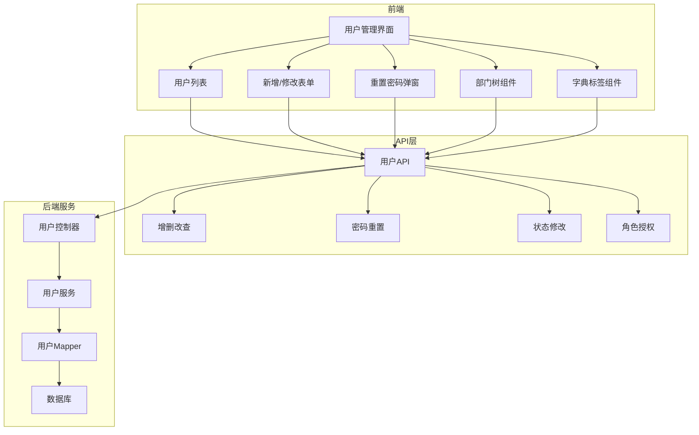
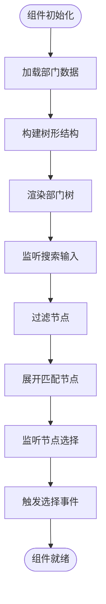
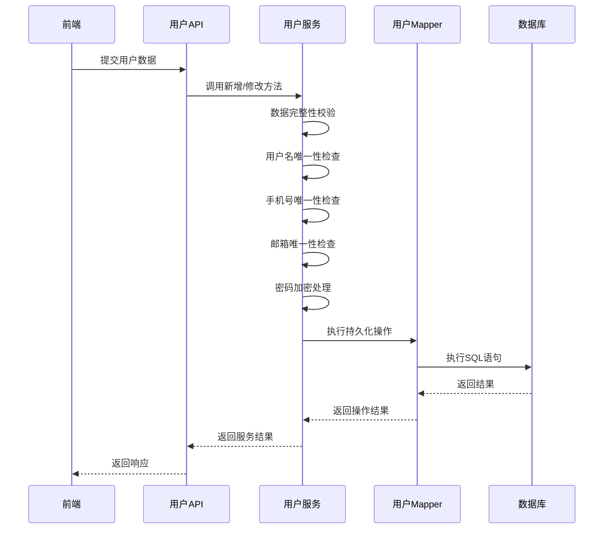
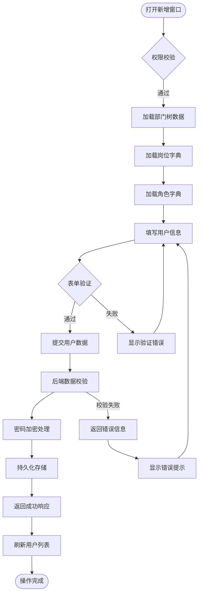
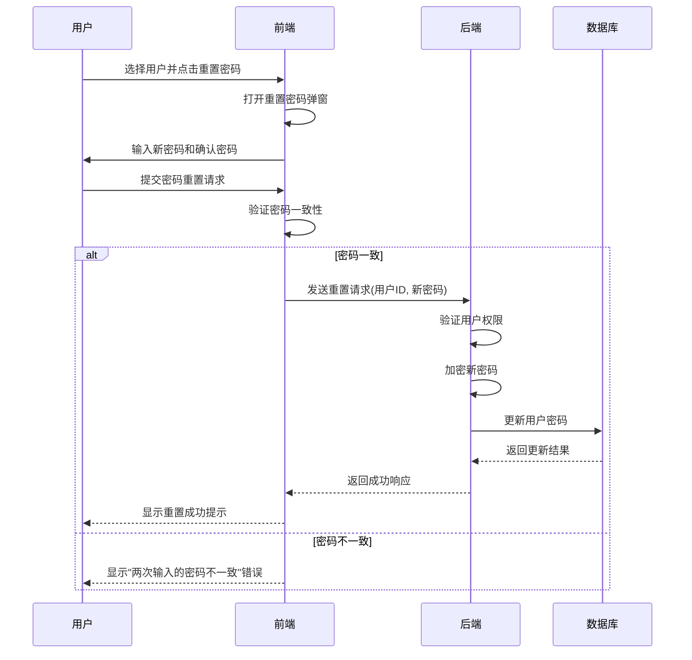
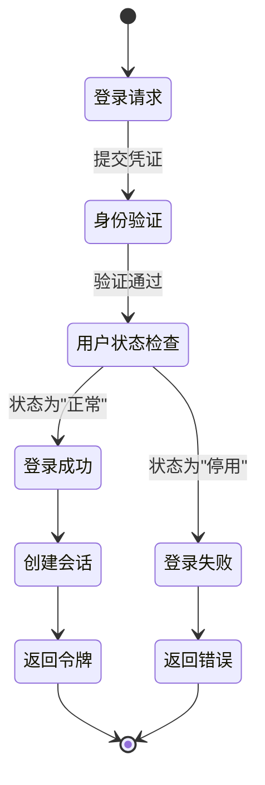
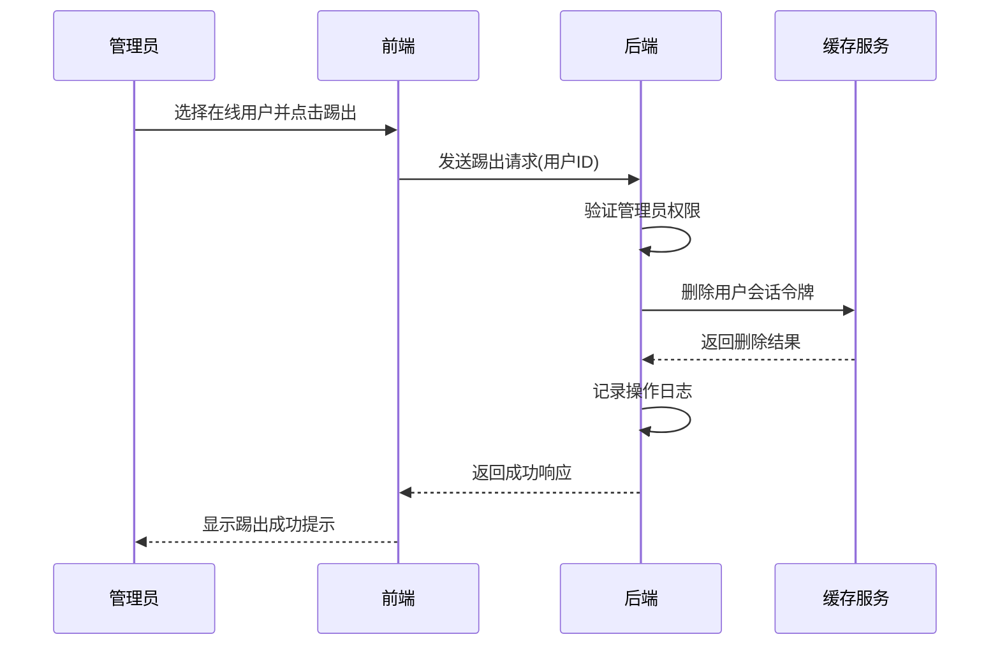
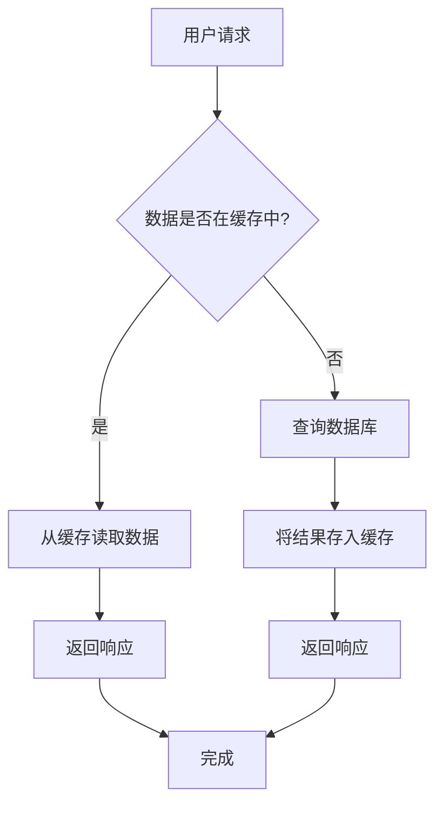

# 用户管理

<cite>
**本文档引用文件**  
- [index.vue](file://bear-jia-vue3\src\views\system\user\index.vue)
- [addUpdateModal.vue](file://bear-jia-vue3\src\views\system\user\addUpdateModal.vue)
- [useResetPassword.vue](file://bear-jia-vue3\src\views\system\user\useResetPassword.vue)
- [DeptTree.vue](file://bear-jia-vue3\src\views\system\user\DeptTree.vue)
- [DictTag\index.vue](file://bear-jia-vue3\src\components\DictTag\index.vue)
- [user.js](file://bear-jia-vue3\src\api\system\user.js)
- [BearJiaUtil.js](file://bear-jia-vue3\src\utils\BearJiaUtil.js)
- [hasPermi.js](file://bear-jia-vue3\src\directive\permission\hasPermi.js)
- [hasRole.js](file://bear-jia-vue3\src\directive\permission\hasRole.js)
- [SysUserMapper.xml](file://bearjia-admin-backend\src\main\resources\mybatis\system\SysUserMapper.xml)
- [application.yml](file://bearjia-admin-backend\src\main\resources\application.yml)
</cite>

## 目录
1. [项目结构](#项目结构)
2. [核心功能](#核心功能)
3. [前端组件分析](#前端组件分析)
4. [后端服务逻辑](#后端服务逻辑)
5. [典型操作流程](#典型操作流程)
6. [权限控制机制](#权限控制机制)
7. [状态管理与在线用户](#状态管理与在线用户)
8. [常见问题排查](#常见问题排查)
9. [性能优化建议](#性能优化建议)

## 项目结构



**图表来源**  
- [index.vue](file://bear-jia-vue3\src\views\system\user\index.vue)
- [user.js](file://bear-jia-vue3\src\api\system\user.js)
- [SysUserMapper.xml](file://bearjia-admin-backend\src\main\resources\mybatis\system\SysUserMapper.xml)

**本节来源**  
- [index.vue](file://bear-jia-vue3\src\views\system\user\index.vue)
- [user.js](file://bear-jia-vue3\src\api\system\user.js)

## 核心功能

用户管理模块提供完整的用户生命周期管理功能，包括用户的增删改查、状态控制、密码重置、部门分配和角色授权等核心功能。系统通过前后端分离架构实现，前端使用Vue3框架，后端采用Java Spring Boot技术栈。

系统支持通过部门树进行数据过滤，用户列表支持分页查询和数据导出功能。新增和修改用户时，表单包含用户基本信息、部门归属、岗位分配、角色授权等字段。密码重置功能独立为单独的弹窗组件，确保操作安全。

**本节来源**  
- [index.vue](file://bear-jia-vue3\src\views\system\user\index.vue)
- [addUpdateModal.vue](file://bear-jia-vue3\src\views\system\user\addUpdateModal.vue)
- [useResetPassword.vue](file://bear-jia-vue3\src\views\system\user\useResetPassword.vue)

## 前端组件分析

### 部门树组件 (DeptTree)

部门树组件提供部门层级结构的可视化展示和选择功能，支持搜索过滤和节点展开/折叠操作。组件通过API获取部门数据并构建树形结构，用户点击节点时触发事件，用于过滤用户列表数据。



**图表来源**  
- [DeptTree.vue](file://bear-jia-vue3\src\views\system\user\DeptTree.vue)

**本节来源**  
- [DeptTree.vue](file://bear-jia-vue3\src\views\system\user\DeptTree.vue)
- [index.vue](file://bear-jia-vue3\src\views\system\user\index.vue)

### 字典标签组件 (DictTag)

字典标签组件用于将数据字典值转换为可读的标签显示，支持颜色和样式自定义。组件根据字典配置自动映射颜色，如正常状态显示为绿色，停用状态显示为红色。

```mermaid
classDiagram
class DictTag {
+options : Array
+value : String|Number
+color : String
+className : String
-tagText : Computed
-tagColor : Computed
-tagClass : Computed
}
DictTag --> "1" "0..*" Dictionary : "使用"
Dictionary : +dictValue
Dictionary : +dictLabel
Dictionary : +listClass
Dictionary : +cssClass
```

**图表来源**  
- [DictTag\index.vue](file://bear-jia-vue3\src\components\DictTag\index.vue)

**本节来源**  
- [DictTag\index.vue](file://bear-jia-vue3\src\components\DictTag\index.vue)
- [index.vue](file://bear-jia-vue3\src\views\system\user\index.vue)

## 后端服务逻辑

### 用户数据校验与加密存储

后端服务在用户数据持久化前进行完整性校验，包括用户名唯一性、手机号码格式、邮箱格式等验证。密码采用加密存储机制，确保用户信息安全。



**图表来源**  
- [user.js](file://bear-jia-vue3\src\api\system\user.js)
- [SysUserMapper.xml](file://bearjia-admin-backend\src\main\resources\mybatis\system\SysUserMapper.xml)

**本节来源**  
- [user.js](file://bear-jia-vue3\src\api\system\user.js)
- [SysUserMapper.xml](file://bearjia-admin-backend\src\main\resources\mybatis\system\SysUserMapper.xml)
- [application.yml](file://bearjia-admin-backend\src\main\resources\application.yml)

## 典型操作流程

### 创建新用户并分配角色和部门

创建新用户的操作流程包括表单填写、数据验证、权限分配和持久化存储等步骤。



**图表来源**  
- [addUpdateModal.vue](file://bear-jia-vue3\src\views\system\user\addUpdateModal.vue)
- [user.js](file://bear-jia-vue3\src\api\system\user.js)

**本节来源**  
- [addUpdateModal.vue](file://bear-jia-vue3\src\views\system\user\addUpdateModal.vue)
- [user.js](file://bear-jia-vue3\src\api\system\user.js)

### 重置用户密码

重置用户密码流程包含密码一致性验证、加密处理和状态更新等关键步骤。



**图表来源**  
- [useResetPassword.vue](file://bear-jia-vue3\src\views\system\user\useResetPassword.vue)
- [SysUserMapper.xml](file://bearjia-admin-backend\src\main\resources\mybatis\system\SysUserMapper.xml)

**本节来源**  
- [useResetPassword.vue](file://bear-jia-vue3\src\views\system\user\useResetPassword.vue)
- [user.js](file://bear-jia-vue3\src\api\system\user.js)
- [SysUserMapper.xml](file://bearjia-admin-backend\src\main\resources\mybatis\system\SysUserMapper.xml)

## 权限控制机制

系统采用基于角色和操作权限的双重控制机制，确保用户只能执行被授权的操作。

```mermaid
classDiagram
class hasPermi {
+value : Array
+permissions : Array
+all_permission : "* : * : *"
}
class hasRole {
+value : Array
+roles : Array
+super_admin : "admin"
}
class UserStore {
+permissions : Array
+roles : Array
}
hasPermi --> UserStore : "读取"
hasRole --> UserStore : "读取"
UserStore : +getters.roles
UserStore : +permissions
note right of hasPermi
操作权限指令
检查用户是否具有
指定的操作权限
end note
note right of hasRole
角色权限指令
检查用户是否具有
指定的角色
end note
```

**图表来源**  
- [hasPermi.js](file://bear-jia-vue3\src\directive\permission\hasPermi.js)
- [hasRole.js](file://bear-jia-vue3\src\directive\permission\hasRole.js)
- [user.js](file://bear-jia-vue3\src\api\system\user.js)

**本节来源**  
- [hasPermi.js](file://bear-jia-vue3\src\directive\permission\hasPermi.js)
- [hasRole.js](file://bear-jia-vue3\src\directive\permission\hasRole.js)
- [user.js](file://bear-jia-vue3\src\api\system\user.js)

## 状态管理与在线用户

### 用户状态对登录权限的影响

用户状态（正常/停用）直接影响其登录系统的能力。系统在用户登录时检查其状态，停用状态的用户将被拒绝访问。



**图表来源**  
- [SysUserMapper.xml](file://bearjia-admin-backend\src\main\resources\mybatis\system\SysUserMapper.xml)
- [application.yml](file://bearjia-admin-backend\src\main\resources\application.yml)

**本节来源**  
- [SysUserMapper.xml](file://bearjia-admin-backend\src\main\resources\mybatis\system\SysUserMapper.xml)
- [application.yml](file://bearjia-admin-backend\src\main\resources\application.yml)

### 在线用户踢出功能

系统支持管理员踢出在线用户的功能，通过使用户会话失效来强制用户下线。



**图表来源**  
- [application.yml](file://bearjia-admin-backend\src\main\resources\application.yml)
- [SysUserMapper.xml](file://bearjia-admin-backend\src\main\resources\mybatis\system\SysUserMapper.xml)

**本节来源**  
- [application.yml](file://bearjia-admin-backend\src\main\resources\application.yml)
- [SysUserMapper.xml](file://bearjia-admin-backend\src\main\resources\mybatis\system\SysUserMapper.xml)

## 常见问题排查

### 用户无法登录

当用户无法登录时，可能的原因包括：

1. **账户状态问题**：用户账户可能被停用，检查用户状态是否为"正常"
2. **密码错误**：用户输入的密码不正确，系统有最大重试次数限制（默认5次）
3. **账户锁定**：密码错误次数超过限制后账户会被锁定（默认10分钟）
4. **网络问题**：前端与后端通信异常，检查网络连接和API端点
5. **令牌问题**：JWT令牌生成或验证失败，检查令牌密钥配置

### 角色权限不生效

角色权限不生效的可能原因：

1. **缓存问题**：用户权限信息可能被缓存，尝试刷新页面或重新登录
2. **权限分配未保存**：检查角色授权是否已正确保存到数据库
3. **前端指令问题**：v-hasPermi或v-hasRole指令使用不当
4. **后端数据同步**：用户角色关系表(sys_user_role)数据不一致
5. **权限刷新机制**：修改权限后未触发权限刷新

**本节来源**  
- [application.yml](file://bearjia-admin-backend\src\main\resources\application.yml)
- [hasPermi.js](file://bear-jia-vue3\src\directive\permission\hasPermi.js)
- [hasRole.js](file://bear-jia-vue3\src\directive\permission\hasRole.js)
- [SysUserMapper.xml](file://bearjia-admin-backend\src\main\resources\mybatis\system\SysUserMapper.xml)

## 性能优化建议

### 用户数据分页查询

为提高用户列表加载性能，建议采用以下优化策略：

1. **合理设置分页大小**：默认每页显示10-20条记录，避免一次性加载过多数据
2. **索引优化**：在数据库的常用查询字段（如用户名、手机号、部门ID）上创建索引
3. **延迟加载**：部门树等辅助组件采用异步加载，避免阻塞主界面渲染
4. **数据缓存**：对不经常变化的字典数据进行客户端缓存

### 缓存策略

实施有效的缓存策略以提升系统性能：

1. **Redis缓存**：使用Redis缓存用户会话和权限信息，减少数据库查询
2. **前端缓存**：在前端缓存部门树、字典数据等静态信息
3. **HTTP缓存**：对GET请求启用HTTP缓存，减少重复请求
4. **连接池优化**：合理配置数据库连接池参数，提高数据库访问效率



**图表来源**  
- [application.yml](file://bearjia-admin-backend\src\main\resources\application.yml)
- [BearJiaUtil.js](file://bear-jia-vue3\src\utils\BearJiaUtil.js)

**本节来源**  
- [application.yml](file://bearjia-admin-backend\src\main\resources\application.yml)
- [BearJiaUtil.js](file://bear-jia-vue3\src\utils\BearJiaUtil.js)