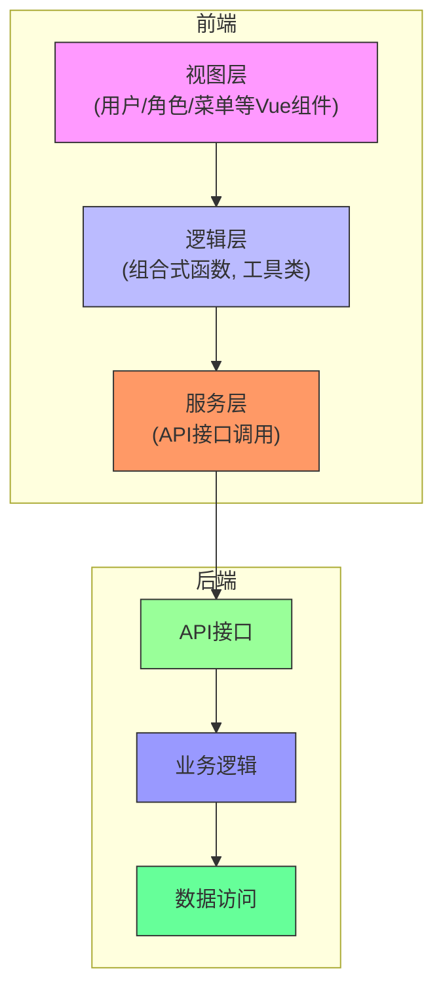
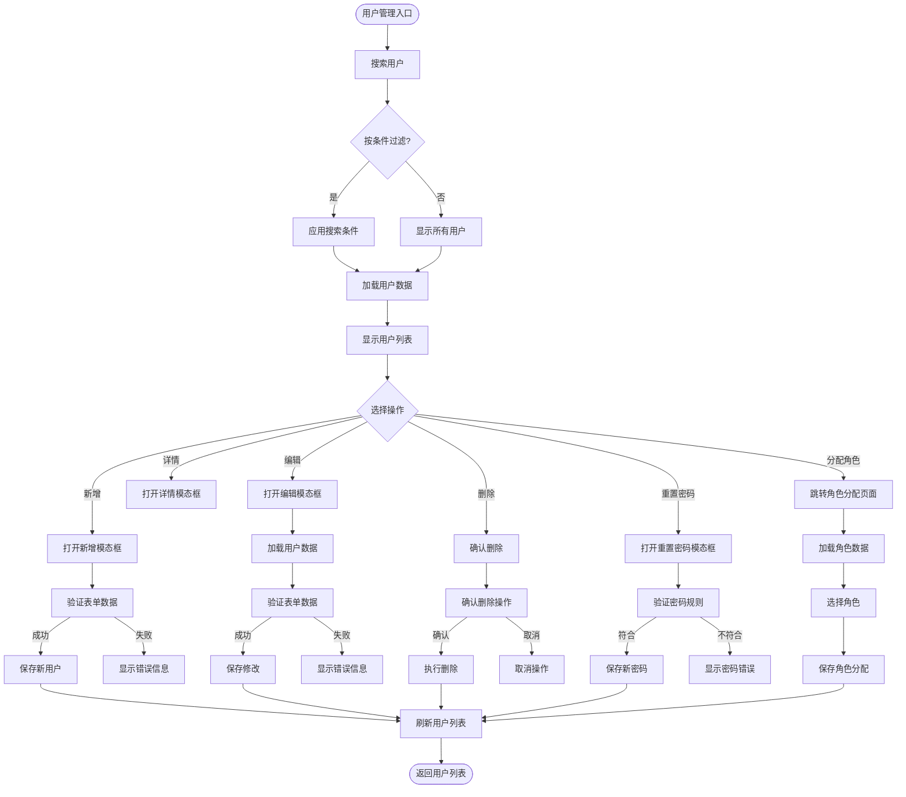
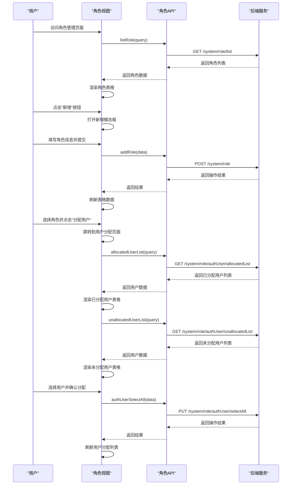
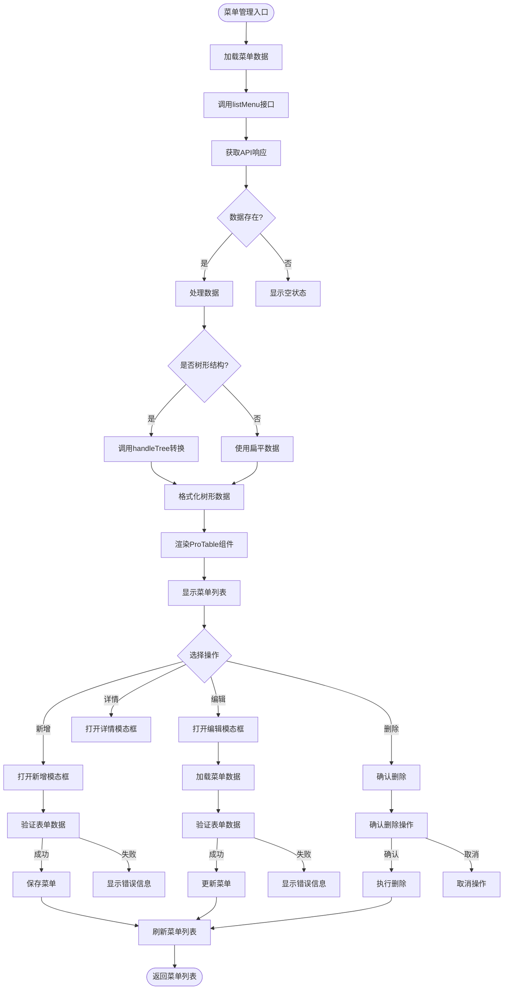
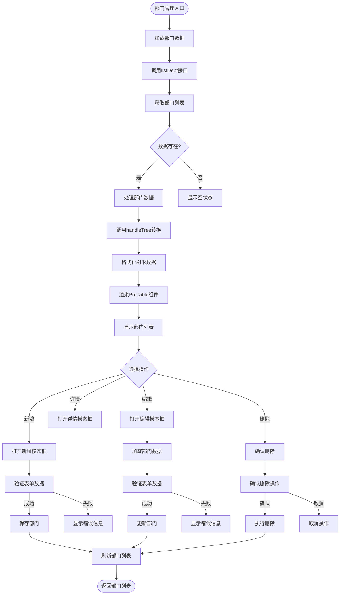
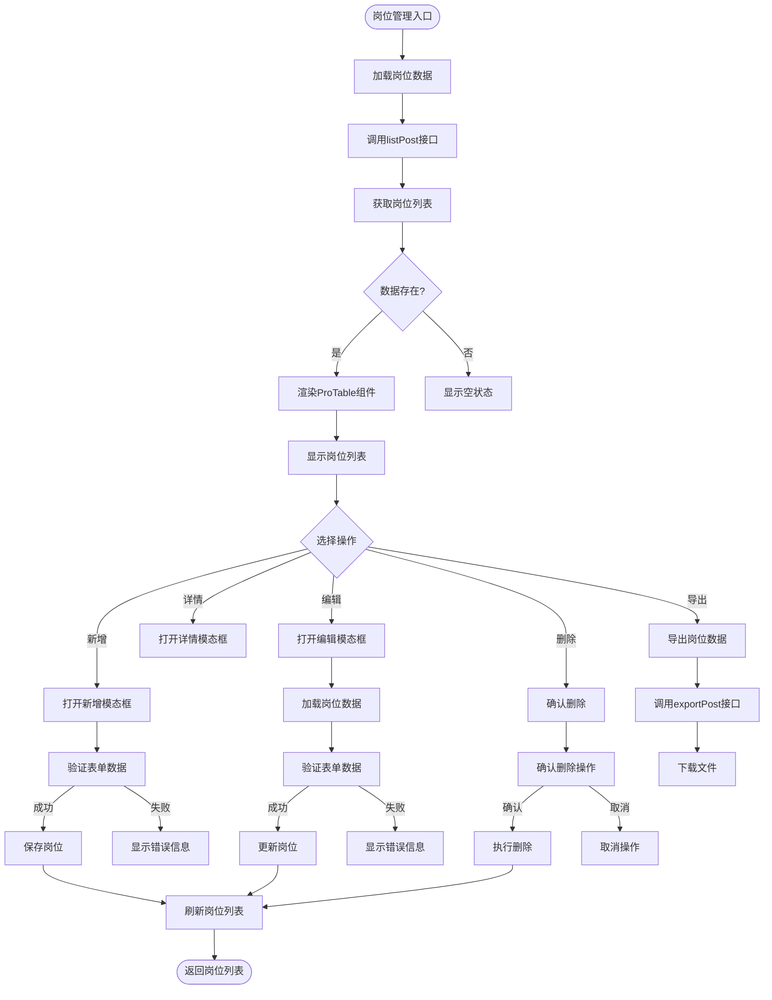
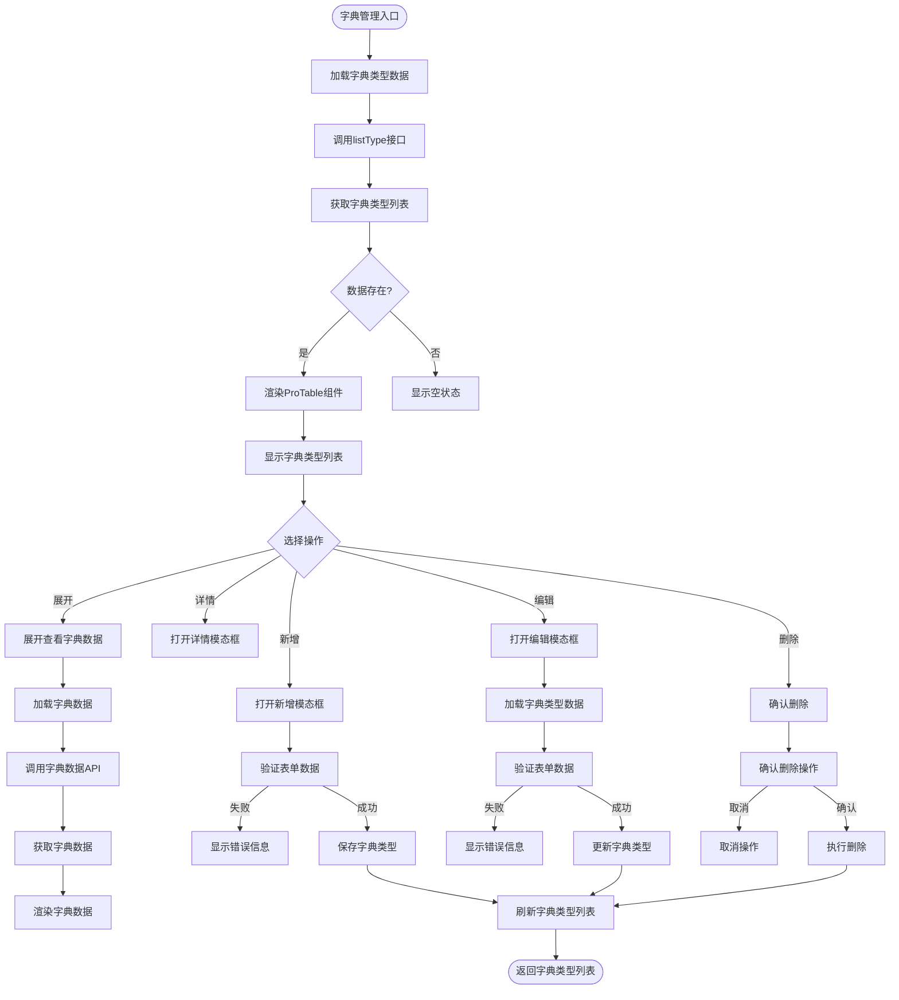
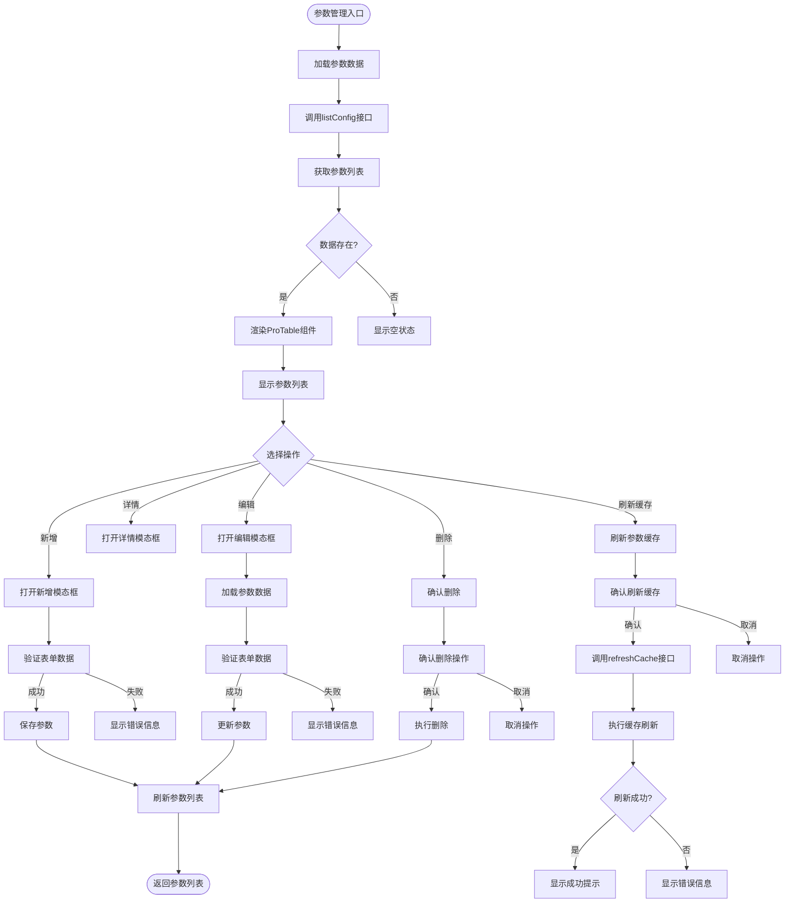

# 系统管理

<cite>
**本文档引用的文件**   
- [user.js](file://bear-jia-vue3/src/api/system/user.js)
- [role.js](file://bear-jia-vue3/src/api/system/role.js)
- [menu.js](file://bear-jia-vue3/src/api/system/menu.js)
- [dept.js](file://bear-jia-vue3/src/api/system/dept.js)
- [post.js](file://bear-jia-vue3/src/api/system/post.js)
- [type.js](file://bear-jia-vue3/src/api/system/dict/type.js)
- [config.js](file://bear-jia-vue3/src/api/system/config.js)
- [index.vue](file://bear-jia-vue3/src/views/system/user/index.vue)
- [index.vue](file://bear-jia-vue3/src/views/system/role/index.vue)
- [index.vue](file://bear-jia-vue3/src/views/system/menu/index.vue)
- [index.vue](file://bear-jia-vue3/src/views/system/dept/index.vue)
- [index.vue](file://bear-jia-vue3/src/views/system/post/index.vue)
- [index.vue](file://bear-jia-vue3/src/views/system/dict/index.vue)
- [index.vue](file://bear-jia-vue3/src/views/system/config/index.vue)
- [DictTag/index.vue](file://bear-jia-vue3/src/components/DictTag/index.vue)
- [useDict.js](file://bear-jia-vue3/src/composables/useDict.js)
- [BearJiaUtil.js](file://bear-jia-vue3/src/utils/BearJiaUtil.js)
- [hasPermi.js](file://bear-jia-vue3/src/directive/permission/hasPermi.js)
- [hasRole.js](file://bear-jia-vue3/src/directive/permission/hasRole.js)
</cite>

## 目录
1. [引言](#引言)
2. [项目结构](#项目结构)
3. [核心组件](#核心组件)
4. [架构概述](#架构概述)
5. [详细组件分析](#详细组件分析)
6. [依赖分析](#依赖分析)
7. [性能考虑](#性能考虑)
8. [故障排除指南](#故障排除指南)
9. [结论](#结论)

## 引言
系统管理模块是后台管理系统的核心功能，负责用户、角色、菜单、部门、岗位、字典和参数的统一管理。该模块通过精细化的权限控制和灵活的配置管理，为系统提供安全、可扩展的管理能力。本文档将详细阐述各子模块的业务目的、核心功能、数据关联及典型操作流程。

## 项目结构
系统管理模块采用前后端分离架构，前端基于Vue3和Ant Design Vue实现，后端提供RESTful API接口。模块按功能划分为用户、角色、菜单、部门、岗位、字典和参数七个子模块，每个子模块包含独立的API接口、视图组件和业务逻辑。

```mermaid
graph TB
subgraph "前端"
UserView["用户管理 (user/index.vue)"]
RoleView["角色管理 (role/index.vue)"]
MenuView["菜单管理 (menu/index.vue)"]
DeptView["部门管理 (dept/index.vue)"]
PostView["岗位管理 (post/index.vue)"]
DictView["字典管理 (dict/index.vue)"]
ConfigView["参数管理 (config/index.vue)"]
end
subgraph "API接口"
UserAPI["用户API (user.js)"]
RoleAPI["角色API (role.js)"]
MenuAPI["菜单API (menu.js)"]
DeptAPI["部门API (dept.js)"]
PostAPI["岗位API (post.js)"]
DictAPI["字典API (type.js)"]
ConfigAPI["参数API (config.js)"]
end
subgraph "共享组件"
DictTag["字典标签 (DictTag/index.vue)"]
ProTable["表格组件 (ProTable)"]
TableActionBar["操作栏 (TableActionBar)"]
end
subgraph "工具与组合式函数"
BearJiaUtil["工具类 (BearJiaUtil.js)"]
UseDict["组合式函数 (useDict.js)"]
end
subgraph "权限指令"
HasPermi["权限指令 (hasPermi.js)"]
HasRole["角色指令 (hasRole.js)"]
end
UserView --> UserAPI
RoleView --> RoleAPI
MenuView --> MenuAPI
DeptView --> DeptAPI
PostView --> PostAPI
DictView --> DictAPI
ConfigView --> ConfigAPI
UserView --> DictTag
RoleView --> DictTag
MenuView --> DictTag
DeptView --> DictTag
PostView --> DictTag
DictView --> DictTag
ConfigView --> DictTag
UserView --> ProTable
RoleView --> ProTable
MenuView --> ProTable
DeptView --> ProTable
PostView --> ProTable
DictView --> ProTable
ConfigView --> ProTable
UserView --> TableActionBar
RoleView --> TableActionBar
MenuView --> TableActionBar
DeptView --> TableActionBar
PostView --> TableActionBar
DictView --> TableActionBar
ConfigView --> TableActionBar
UserView --> BearJiaUtil
RoleView --> BearJiaUtil
MenuView --> BearJiaUtil
DeptView --> BearJiaUtil
PostView --> BearJiaUtil
DictView --> BearJiaUtil
ConfigView --> BearJiaUtil
UserView --> UseDict
RoleView --> UseDict
MenuView --> UseDict
DeptView --> UseDict
PostView --> UseDict
DictView --> UseDict
ConfigView --> UseDict
UserView --> HasPermi
RoleView --> HasPermi
MenuView --> HasPermi
DeptView --> HasPermi
PostView --> HasPermi
DictView --> HasPermi
ConfigView --> HasPermi
UserView --> HasRole
RoleView --> HasRole
MenuView --> HasRole
DeptView --> HasRole
PostView --> HasRole
DictView --> HasRole
ConfigView --> HasRole
```



**图源**
- [index.vue](file://bear-jia-vue3/src/views/system/user/index.vue)
- [index.vue](file://bear-jia-vue3/src/views/system/role/index.vue)
- [index.vue](file://bear-jia-vue3/src/views/system/menu/index.vue)
- [index.vue](file://bear-jia-vue3/src/views/system/dept/index.vue)
- [index.vue](file://bear-jia-vue3/src/views/system/post/index.vue)
- [index.vue](file://bear-jia-vue3/src/views/system/dict/index.vue)
- [index.vue](file://bear-jia-vue3/src/views/system/config/index.vue)
- [user.js](file://bear-jia-vue3/src/api/system/user.js)
- [role.js](file://bear-jia-vue3/src/api/system/role.js)
- [menu.js](file://bear-jia-vue3/src/api/system/menu.js)
- [dept.js](file://bear-jia-vue3/src/api/system/dept.js)
- [post.js](file://bear-jia-vue3/src/api/system/post.js)
- [type.js](file://bear-jia-vue3/src/api/system/dict/type.js)
- [config.js](file://bear-jia-vue3/src/api/system/config.js)
- [DictTag/index.vue](file://bear-jia-vue3/src/components/DictTag/index.vue)
- [BearJiaUtil.js](file://bear-jia-vue3/src/utils/BearJiaUtil.js)
- [useDict.js](file://bear-jia-vue3/src/composables/useDict.js)
- [hasPermi.js](file://bear-jia-vue3/src/directive/permission/hasPermi.js)
- [hasRole.js](file://bear-jia-vue3/src/directive/permission/hasRole.js)

**章节源**
- [index.vue](file://bear-jia-vue3/src/views/system/user/index.vue)
- [index.vue](file://bear-jia-vue3/src/views/system/role/index.vue)
- [index.vue](file://bear-jia-vue3/src/views/system/menu/index.vue)
- [index.vue](file://bear-jia-vue3/src/views/system/dept/index.vue)
- [index.vue](file://bear-jia-vue3/src/views/system/post/index.vue)
- [index.vue](file://bear-jia-vue3/src/views/system/dict/index.vue)
- [index.vue](file://bear-jia-vue3/src/views/system/config/index.vue)

## 核心组件
系统管理模块的核心组件包括用户管理、角色管理、菜单管理、部门管理、岗位管理、字典管理和参数管理。每个组件都遵循统一的设计模式，使用ProTable组件进行数据展示，通过API接口与后端交互，并利用字典标签组件实现数据字典的可视化展示。

**章节源**
- [index.vue](file://bear-jia-vue3/src/views/system/user/index.vue)
- [index.vue](file://bear-jia-vue3/src/views/system/role/index.vue)
- [index.vue](file://bear-jia-vue3/src/views/system/menu/index.vue)
- [index.vue](file://bear-jia-vue3/src/views/system/dept/index.vue)
- [index.vue](file://bear-jia-vue3/src/views/system/post/index.vue)
- [index.vue](file://bear-jia-vue3/src/views/system/dict/index.vue)
- [index.vue](file://bear-jia-vue3/src/views/system/config/index.vue)

## 架构概述
系统管理模块采用分层架构设计，前端视图层通过API服务层与后端进行数据交互。前端使用组合式API（Composition API）组织业务逻辑，通过自定义指令实现权限控制，利用共享组件提高代码复用性。



**图源**
- [index.vue](file://bear-jia-vue3/src/views/system/user/index.vue)
- [user.js](file://bear-jia-vue3/src/api/system/user.js)
- [BearJiaUtil.js](file://bear-jia-vue3/src/utils/BearJiaUtil.js)
- [useDict.js](file://bear-jia-vue3/src/composables/useDict.js)

## 详细组件分析

### 用户管理分析
用户管理模块负责系统用户的全生命周期管理，包括用户的增删改查、状态控制、密码重置和权限分配等功能。

#### 用户管理类图
```mermaid
classDiagram
class UserManagement {
+string userName
+string nickName
+string phonenumber
+string email
+string sex
+string status
+number deptId
+array roleIds
+addUser(data)
+updateUser(data)
+delUser(userId)
+resetUserPwd(userId, password)
+changeUserStatus(userId, status)
+getAuthRole(userId)
+updateAuthRole(data)
}
class UserView {
-ProTable proTableRef
-DeptTree deptTreeRef
-AddUpdateModal addUpdateModalRef
-DetailModal detailModalRef
-UseResetPassword useResetPasswordRef
+openAddModal()
+openUpdateModal(record)
+openDetailModal(record)
+openResetPasswordModal(record)
+clickDeptNode(keys)
}
class UserAPI {
+listUser(query)
+getUser(userId)
+addUser(data)
+updateUser(data)
+delUser(userId)
+resetUserPwd(userId, password)
+changeUserStatus(userId, status)
+getUserProfile()
+updateUserProfile(data)
+updateUserPwd(oldPassword, newPassword)
+uploadAvatar(data)
+getAuthRole(userId)
+updateAuthRole(data)
}
UserView --> UserAPI : "调用"
UserView --> ProTable : "使用"
UserView --> DeptTree : "使用"
UserView --> AddUpdateModal : "使用"
UserView --> DetailModal : "使用"
UserView --> UseResetPassword : "使用"
UserAPI --> "后端API" : "HTTP请求"
```

**图源**
- [index.vue](file://bear-jia-vue3/src/views/system/user/index.vue)
- [user.js](file://bear-jia-vue3/src/api/system/user.js)

#### 用户管理操作流程


**图源**
- [index.vue](file://bear-jia-vue3/src/views/system/user/index.vue)
- [user.js](file://bear-jia-vue3/src/api/system/user.js)

**章节源**
- [index.vue](file://bear-jia-vue3/src/views/system/user/index.vue)
- [user.js](file://bear-jia-vue3/src/api/system/user.js)

### 角色管理分析
角色管理模块负责系统角色的创建、修改、删除和权限分配，通过角色与菜单的权限映射实现细粒度的权限控制。

#### 角色管理类图
```mermaid
classDiagram
class RoleManagement {
+string roleName
+string roleKey
+string status
+string dataScope
+array menuIds
+addRole(data)
+updateRole(data)
+delRole(roleId)
+changeRoleStatus(roleId, status)
+dataScope(data)
+allocatedUserList(query)
+unallocatedUserList(query)
+authUserCancel(data)
+authUserCancelAll(data)
+authUserSelectAll(data)
}
class RoleView {
-ProTable proTableRef
-AddUpdateModal addUpdateModalRef
-DetailModal detailModalRef
+openAddModal()
+openUpdateModal(record)
+openDetailModal(record)
+handleAuthUser(row)
}
class RoleAPI {
+listRole(query)
+getRole(roleId)
+addRole(data)
+updateRole(data)
+dataScope(data)
+changeRoleStatus(roleId, status)
+delRole(roleId)
+allocatedUserList(query)
+unallocatedUserList(query)
+authUserCancel(data)
+authUserCancelAll(data)
+authUserSelectAll(data)
}
RoleView --> RoleAPI : "调用"
RoleView --> ProTable : "使用"
RoleView --> AddUpdateModal : "使用"
RoleView --> DetailModal : "使用"
RoleAPI --> "后端API" : "HTTP请求"
```

**图源**
- [index.vue](file://bear-jia-vue3/src/views/system/role/index.vue)
- [role.js](file://bear-jia-vue3/src/api/system/role.js)

#### 角色管理操作流程


**图源**
- [index.vue](file://bear-jia-vue3/src/views/system/role/index.vue)
- [role.js](file://bear-jia-vue3/src/api/system/role.js)

**章节源**
- [index.vue](file://bear-jia-vue3/src/views/system/role/index.vue)
- [role.js](file://bear-jia-vue3/src/api/system/role.js)

### 菜单管理分析
菜单管理模块负责系统菜单的创建、修改、删除和权限绑定，通过树形结构展示菜单层级关系，并与角色权限进行关联。

#### 菜单管理类图
```mermaid
classDiagram
class MenuManagement {
+string menuName
+string path
+string component
+string perms
+string menuType
+string visible
+string status
+number parentId
+addMenu(data)
+updateMenu(data)
+delMenu(menuId)
+getRouters()
+treeselect()
+roleMenuTreeselect(roleId)
}
class MenuView {
-ProTable proTableRef
-MenuAddUpdateModal menuAddUpdateModalRef
-MenuDetailModal menuDetailModalRef
+openMenuAddModal()
+openMenuUpdateModal(record)
+openMenuDetailModal(record)
}
class MenuAPI {
+getRouters()
+listMenu(query)
+getMenu(menuId)
+treeselect()
+roleMenuTreeselect(roleId)
+addMenu(data)
+updateMenu(data)
+delMenu(menuId)
}
MenuView --> MenuAPI : "调用"
MenuView --> ProTable : "使用"
MenuView --> MenuAddUpdateModal : "使用"
MenuView --> MenuDetailModal : "使用"
MenuAPI --> "后端API" : "HTTP请求"
```

**图源**
- [index.vue](file://bear-jia-vue3/src/views/system/menu/index.vue)
- [menu.js](file://bear-jia-vue3/src/api/system/menu.js)

#### 菜单管理数据处理流程


**图源**
- [index.vue](file://bear-jia-vue3/src/views/system/menu/index.vue)
- [menu.js](file://bear-jia-vue3/src/api/system/menu.js)
- [BearJiaUtil.js](file://bear-jia-vue3/src/utils/BearJiaUtil.js)

**章节源**
- [index.vue](file://bear-jia-vue3/src/views/system/menu/index.vue)
- [menu.js](file://bear-jia-vue3/src/api/system/menu.js)

### 部门管理分析
部门管理模块负责组织架构的维护，通过树形结构展示部门层级关系，支持部门的增删改查和状态控制。

#### 部门管理类图
```mermaid
classDiagram
class DeptManagement {
+string deptName
+number orderNum
+string leader
+string phone
+string email
+string status
+number parentId
+addDept(data)
+updateDept(data)
+delDept(deptId)
+listDept(query)
+getDept(deptId)
+treeselect()
+roleDeptTreeselect(roleId)
+listDeptExcludeChild(deptId)
}
class DeptView {
-ProTable proTableRef
-DeptAddUpdateModal deptAddUpdateModalRef
-DeptDetailModal deptDetailModalRef
+openDeptAddModal()
+openDeptUpdateModal(record)
+openDeptDetailModal(record)
+handleDeleteSuccess()
}
class DeptAPI {
+listDept(query)
+getDept(deptId)
+treeselect()
+roleDeptTreeselect(roleId)
+listDeptExcludeChild(deptId)
+addDept(data)
+updateDept(data)
+delDept(deptId)
}
DeptView --> DeptAPI : "调用"
DeptView --> ProTable : "使用"
DeptView --> DeptAddUpdateModal : "使用"
DeptView --> DeptDetailModal : "使用"
DeptAPI --> "后端API" : "HTTP请求"
```

**图源**
- [index.vue](file://bear-jia-vue3/src/views/system/dept/index.vue)
- [dept.js](file://bear-jia-vue3/src/api/system/dept.js)

#### 部门管理树形结构处理


**图源**
- [index.vue](file://bear-jia-vue3/src/views/system/dept/index.vue)
- [dept.js](file://bear-jia-vue3/src/api/system/dept.js)
- [BearJiaUtil.js](file://bear-jia-vue3/src/utils/BearJiaUtil.js)

**章节源**
- [index.vue](file://bear-jia-vue3/src/views/system/dept/index.vue)
- [dept.js](file://bear-jia-vue3/src/api/system/dept.js)

### 岗位管理分析
岗位管理模块负责系统岗位的维护，支持岗位的增删改查和状态控制，为用户分配岗位提供基础数据支持。

#### 岗位管理类图
```mermaid
classDiagram
class PostManagement {
+string postCode
+string postName
+number postSort
+string status
+addPost(data)
+updatePost(data)
+delPost(postId)
+listPost(query)
+getPost(postId)
+exportPost(query)
}
class PostView {
-ProTable proTableRef
-AddUpdateModal addUpdateModalRef
-DetailModal detailModalRef
+openAddModal()
+openUpdateModal(record)
+openDetailModal(record)
}
class PostAPI {
+listPost(query)
+getPost(postId)
+addPost(data)
+updatePost(data)
+delPost(postId)
+exportPost(query)
}
PostView --> PostAPI : "调用"
PostView --> ProTable : "使用"
PostView --> AddUpdateModal : "使用"
PostView --> DetailModal : "使用"
PostAPI --> "后端API" : "HTTP请求"
```

**图源**
- [index.vue](file://bear-jia-vue3/src/views/system/post/index.vue)
- [post.js](file://bear-jia-vue3/src/api/system/post.js)

#### 岗位管理操作流程


**图源**
- [index.vue](file://bear-jia-vue3/src/views/system/post/index.vue)
- [post.js](file://bear-jia-vue3/src/api/system/post.js)

**章节源**
- [index.vue](file://bear-jia-vue3/src/views/system/post/index.vue)
- [post.js](file://bear-jia-vue3/src/api/system/post.js)

### 字典管理分析
字典管理模块负责系统字典数据的统一维护，通过字典类型和字典数据的两级结构实现数据字典的灵活配置。

#### 字典管理类图
```mermaid
classDiagram
class DictManagement {
+string dictName
+string dictType
+string status
+string createBy
+string remark
+addType(data)
+updateType(data)
+delType(dictId)
+listType(query)
+getType(dictId)
+refreshCache()
+optionselect()
}
class DictView {
-ProTable proTableRef
-TypeAddUpdateModal typeAddUpdateModalRef
-TypeDetailModal typeDetailModalRef
-DictData dictDataComponent
+openTypeAddModal()
+openTypeUpdateModal(record)
+openTypeDetailModal(record)
+expandedRowRender(record)
+onRowSelect(record, selected)
}
class DictAPI {
+listType(query)
+getType(dictId)
+addType(data)
+updateType(data)
+delType(dictId)
+refreshCache()
+optionselect()
}
DictView --> DictAPI : "调用"
DictView --> ProTable : "使用"
DictView --> TypeAddUpdateModal : "使用"
DictView --> TypeDetailModal : "使用"
DictView --> DictData : "使用"
DictAPI --> "后端API" : "HTTP请求"
```

**图源**
- [index.vue](file://bear-jia-vue3/src/views/system/dict/index.vue)
- [type.js](file://bear-jia-vue3/src/api/system/dict/type.js)

#### 字典管理数据关联流程


**图源**
- [index.vue](file://bear-jia-vue3/src/views/system/dict/index.vue)
- [type.js](file://bear-jia-vue3/src/api/system/dict/type.js)

**章节源**
- [index.vue](file://bear-jia-vue3/src/views/system/dict/index.vue)
- [type.js](file://bear-jia-vue3/src/api/system/dict/type.js)

### 参数管理分析
参数管理模块负责系统参数的动态配置，支持参数的增删改查和缓存刷新，为系统提供灵活的配置管理能力。

#### 参数管理类图
```mermaid
classDiagram
class ConfigManagement {
+string configName
+string configKey
+string configValue
+string configType
+string createBy
+string remark
+addConfig(data)
+updateConfig(data)
+delConfig(configId)
+listConfig(query)
+getConfig(configId)
+getConfigKey(configKey)
+refreshCache()
}
class ConfigView {
-ProTable proTableRef
-AddUpdateModal addUpdateModalRef
-DetailModal detailModalRef
+openAddModal()
+openUpdateModal(record)
+openDetailModal(record)
}
class ConfigAPI {
+listConfig(query)
+getConfig(configId)
+getConfigKey(configKey)
+addConfig(data)
+updateConfig(data)
+delConfig(configId)
+refreshCache()
}
ConfigView --> ConfigAPI : "调用"
ConfigView --> ProTable : "使用"
ConfigView --> AddUpdateModal : "使用"
ConfigView --> DetailModal : "使用"
ConfigAPI --> "后端API" : "HTTP请求"
```

**图源**
- [index.vue](file://bear-jia-vue3/src/views/system/config/index.vue)
- [config.js](file://bear-jia-vue3/src/api/system/config.js)

#### 参数管理操作流程


**图源**
- [index.vue](file://bear-jia-vue3/src/views/system/config/index.vue)
- [config.js](file://bear-jia-vue3/src/api/system/config.js)

**章节源**
- [index.vue](file://bear-jia-vue3/src/views/system/config/index.vue)
- [config.js](file://bear-jia-vue3/src/api/system/config.js)

## 依赖分析
系统管理模块各组件之间存在紧密的数据关联和依赖关系，通过统一的工具类和组合式函数实现代码复用和功能共享。

```mermaid
graph TD
subgraph "核心组件"
User["用户管理"]
Role["角色管理"]
Menu["菜单管理"]
Dept["部门管理"]
Post["岗位管理"]
Dict["字典管理"]
Config["参数管理"]
end
subgraph "共享资源"
DictTag["字典标签组件"]
ProTable["表格组件"]
TableActionBar["操作栏组件"]
BearJiaUtil["工具类"]
UseDict["组合式函数"]
HasPermi["权限指令"]
HasRole["角色指令"]
end
User --> DictTag
Role --> DictTag
Menu --> DictTag
Dept --> DictTag
Post --> DictTag
Dict --> DictTag
Config --> DictTag
User --> ProTable
Role --> ProTable
Menu --> ProTable
Dept --> ProTable
Post --> ProTable
Dict --> ProTable
Config --> ProTable
User --> TableActionBar
Role --> TableActionBar
Menu --> TableActionBar
Dept --> TableActionBar
Post --> TableActionBar
Dict --> TableActionBar
Config --> TableActionBar
User --> BearJiaUtil
Role --> BearJiaUtil
Menu --> BearJiaUtil
Dept --> BearJiaUtil
Post --> BearJiaUtil
Dict --> BearJiaUtil
Config --> BearJiaUtil
User --> UseDict
Role --> UseDict
Menu --> UseDict
Dept --> UseDict
Post --> UseDict
Dict --> UseDict
Config --> UseDict
User --> HasPermi
Role --> HasPermi
Menu --> HasPermi
Dept --> HasPermi
Post --> HasPermi
Dict --> HasPermi
Config --> HasPermi
User --> HasRole
Role --> HasRole
Menu --> HasRole
Dept --> HasRole
Post --> HasRole
Dict --> HasRole
Config --> HasRole
style User fill:#f9f,stroke:#333
style Role fill:#f9f,stroke:#333
style Menu fill:#f9f,stroke:#333
style Dept fill:#f9f,stroke:#333
style Post fill:#f9f,stroke:#333
style Dict fill:#f9f,stroke:#333
style Config fill:#f9f,stroke:#333
style DictTag fill:#bbf,stroke:#333
style ProTable fill:#bbf,stroke:#333
style TableActionBar fill:#bbf,stroke:#333
style BearJiaUtil fill:#bbf,stroke:#333
style UseDict fill:#bbf,stroke:#333
style HasPermi fill:#bbf,stroke:#333
style HasRole fill:#bbf,stroke:#333
```



**图源**
- [index.vue](file://bear-jia-vue3/src/views/system/user/index.vue)
- [index.vue](file://bear-jia-vue3/src/views/system/role/index.vue)
- [index.vue](file://bear-jia-vue3/src/views/system/menu/index.vue)
- [index.vue](file://bear-jia-vue3/src/views/system/dept/index.vue)
- [index.vue](file://bear-jia-vue3/src/views/system/post/index.vue)
- [index.vue](file://bear-jia-vue3/src/views/system/dict/index.vue)
- [index.vue](file://bear-jia-vue3/src/views/system/config/index.vue)
- [DictTag/index.vue](file://bear-jia-vue3/src/components/DictTag/index.vue)
- [BearJiaUtil.js](file://bear-jia-vue3/src/utils/BearJiaUtil.js)
- [useDict.js](file://bear-jia-vue3/src/composables/useDict.js)
- [hasPermi.js](file://bear-jia-vue3/src/directive/permission/hasPermi.js)
- [hasRole.js](file://bear-jia-vue3/src/directive/permission/hasRole.js)

**章节源**
- [index.vue](file://bear-jia-vue3/src/views/system/user/index.vue)
- [index.vue](file://bear-jia-vue3/src/views/system/role/index.vue)
- [index.vue](file://bear-jia-vue3/src/views/system/menu/index.vue)
- [index.vue](file://bear-jia-vue3/src/views/system/dept/index.vue)
- [index.vue](file://bear-jia-vue3/src/views/system/post/index.vue)
- [index.vue](file://bear-jia-vue3/src/views/system/dict/index.vue)
- [index.vue](file://bear-jia-vue3/src/views/system/config/index.vue)

## 性能考虑
系统管理模块在设计时考虑了性能优化，通过数据缓存、懒加载和批量操作等技术手段提升用户体验。

1. **字典数据缓存**：使用`useDict`组合式函数对字典数据进行缓存，避免重复请求。
2. **树形结构处理**：通过`BearJiaUtil.handleTree`方法在前端处理树形结构，减少后端计算压力。
3. **分页加载**：所有列表数据均采用分页加载，避免一次性加载大量数据。
4. **权限指令优化**：权限指令在组件挂载时进行权限检查，避免运行时频繁计算。
5. **API批量操作**：提供批量删除、批量分配等API，减少网络请求次数。

**章节源**
- [useDict.js](file://bear-jia-vue3/src/composables/useDict.js)
- [BearJiaUtil.js](file://bear-jia-vue3/src/utils/BearJiaUtil.js)

## 故障排除指南
本节提供系统管理模块常见问题的排查方法和解决方案。

### 权限不生效问题
**问题描述**：用户无法看到有权限的菜单或操作按钮。

**排查步骤**：
1. 检查用户角色是否正确分配。
2. 检查角色的菜单权限是否正确配置。
3. 检查前端权限指令`v-hasPermi`的权限值是否正确。
4. 清除浏览器缓存，重新登录系统。

**解决方案**：
- 确保角色与菜单的权限映射正确。
- 检查API返回的用户权限列表是否包含所需权限。
- 使用`useUserStore().permissions`检查当前用户的权限。

### 数据未刷新问题
**问题描述**：执行增删改操作后，页面数据未及时更新。

**排查步骤**：
1. 检查API调用是否成功。
2. 检查操作成功后是否调用了刷新方法。
3. 检查ProTable组件的刷新机制是否正常工作。

**解决方案**：
- 确保在操作成功回调中调用`proTableRef.refresh()`方法。
- 检查API返回的状态码是否为200。
- 使用浏览器开发者工具检查网络请求和响应。

### 字典数据不显示问题
**问题描述**：字典标签组件未正确显示字典值对应的标签。

**排查步骤**：
1. 检查字典类型是否正确配置。
2. 检查字典数据是否已加载。
3. 检查`DictTag`组件的`options`属性是否正确传递。

**解决方案**：
- 使用`useDict`组合式函数确保字典数据已加载。
- 检查字典值与字典选项的匹配关系。
- 确保字典数据格式符合`{value, label}`结构。

**章节源**
- [hasPermi.js](file://bear-jia-vue3/src/directive/permission/hasPermi.js)
- [useDict.js](file://bear-jia-vue3/src/composables/useDict.js)
- [DictTag/index.vue](file://bear-jia-vue3/src/components/DictTag/index.vue)

## 结论
系统管理模块通过用户、角色、菜单、部门、岗位、字典和参数七个子模块的协同工作，实现了完整的系统管理功能。模块采用现代化的前端技术栈，具有良好的可维护性和扩展性。通过统一的组件库和工具类，提高了开发效率和代码质量。建议在实际使用中注意权限配置的准确性，定期清理缓存数据，以确保系统的稳定运行。