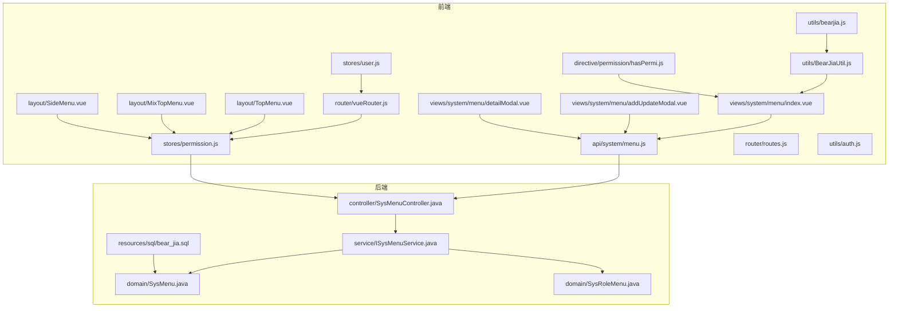
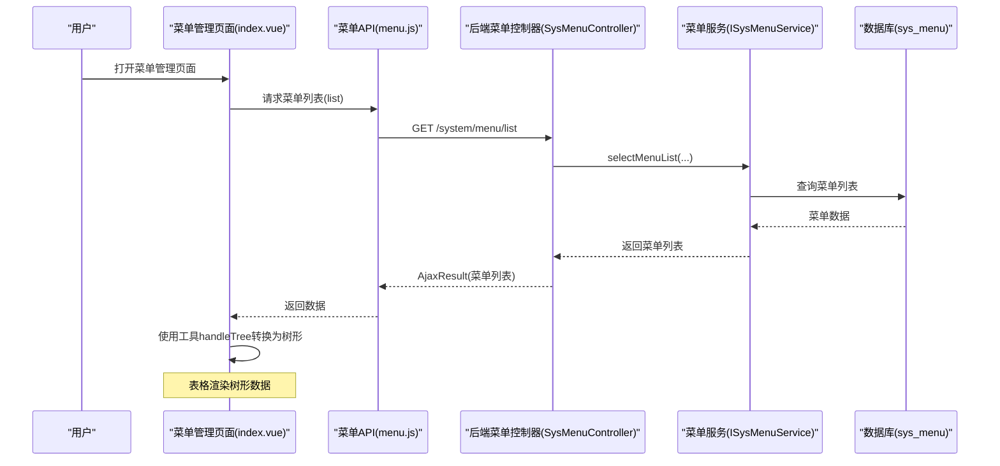
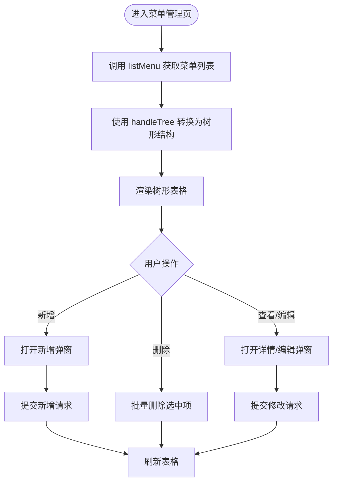
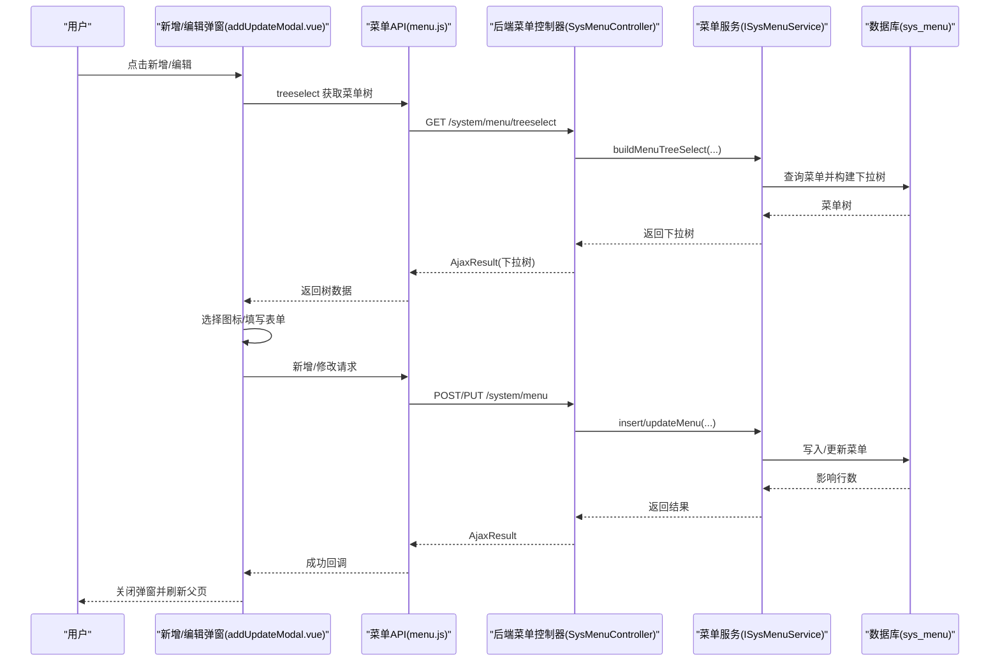
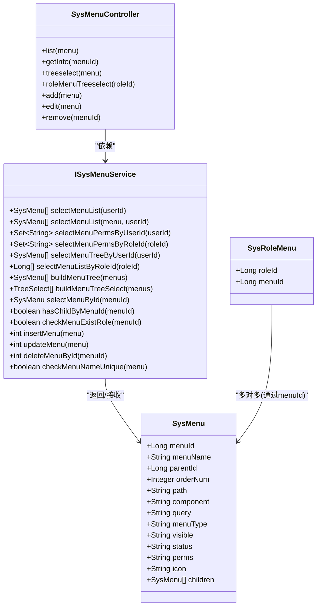
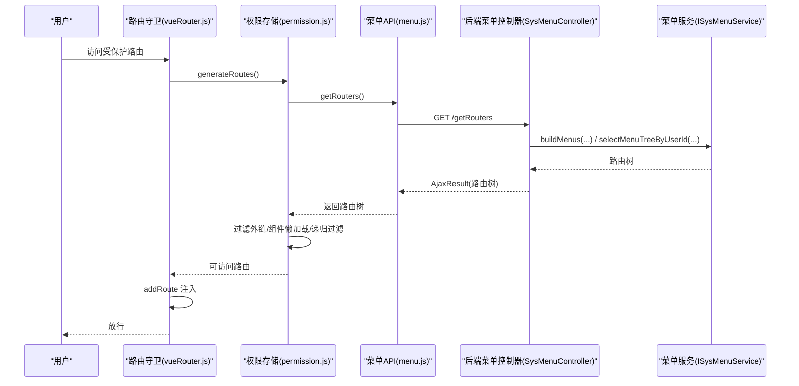
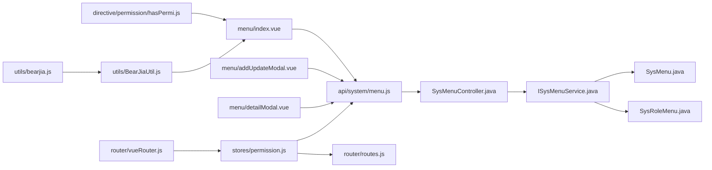

# 菜单管理

<cite>
**本文引用的文件**
- [bear-jia-vue3/src/views/system/menu/index.vue](file://bear-jia-vue3/src/views/system/menu/index.vue)
- [bear-jia-vue3/src/views/system/menu/addUpdateModal.vue](file://bear-jia-vue3/src/views/system/menu/addUpdateModal.vue)
- [bear-jia-vue3/src/views/system/menu/detailModal.vue](file://bear-jia-vue3/src/views/system/menu/detailModal.vue)
- [bear-jia-vue3/src/api/system/menu.js](file://bear-jia-vue3/src/api/system/menu.js)
- [bear-jia-vue3/src/stores/permission.js](file://bear-jia-vue3/src/stores/permission.js)
- [bear-jia-vue3/src/stores/user.js](file://bear-jia-vue3/src/stores/user.js)
- [bear-jia-vue3/src/router/vueRouter.js](file://bear-jia-vue3/src/router/vueRouter.js)
- [bear-jia-vue3/src/router/routes.js](file://bear-jia-vue3/src/router/routes.js)
- [bear-jia-vue3/src/utils/BearJiaUtil.js](file://bear-jia-vue3/src/utils/BearJiaUtil.js)
- [bear-jia-vue3/src/utils/bearjia.js](file://bear-jia-vue3/src/utils/bearjia.js)
- [bear-jia-vue3/src/directive/permission/hasPermi.js](file://bear-jia-vue3/src/directive/permission/hasPermi.js)
- [bear-jia-vue3/src/utils/auth.js](file://bear-jia-vue3/src/utils/auth.js)
- [bear-jia-vue3/src/layout/MixTopMenu.vue](file://bear-jia-vue3/src/layout/MixTopMenu.vue)
- [bear-jia-vue3/src/layout/TopMenu.vue](file://bear-jia-vue3/src/layout/TopMenu.vue)
- [bear-jia-vue3/src/layout/SideMenu.vue](file://bear-jia-vue3/src/layout/SideMenu.vue)
- [bear-jia-vue3/src/components/BearJiaProTable/index.vue](file://bear-jia-vue3/src/components/BearJiaProTable/index.vue)
- [bear-jia-vue3/src/components/TableActionBar/index.vue](file://bear-jia-vue3/src/components/TableActionBar/index.vue)
- [bear-jia-vue3/src/components/IconSelector/index.vue](file://bear-jia-vue3/src/components/IconSelector/index.vue)
- [bear-jia-vue3/src/components/IconSelector/icons.js](file://bear-jia-vue3/src/components/IconSelector/icons.js)
- [bear-jia-vue3/src/components/SvgIcon/index.vue](file://bear-jia-vue3/src/components/SvgIcon/index.vue)
- [bear-jia-vue3/src/views/system/role/addUpdateModal.vue](file://bear-jia-vue3/src/views/system/role/addUpdateModal.vue)
- [bear-jia-admin-backend/src/main/java/com/javaxiaobear/module/system/controller/SysMenuController.java](file://bear-jia-admin-backend/src/main/java/com/javaxiaobear/module/system/controller/SysMenuController.java)
- [bear-jia-admin-backend/src/main/java/com/javaxiaobear/module/system/service/ISysMenuService.java](file://bear-jia-admin-backend/src/main/java/com/javaxiaobear/module/system/service/ISysMenuService.java)
- [bear-jia-admin-backend/src/main/java/com/javaxiaobear/module/system/domain/SysMenu.java](file://bear-jia-admin-backend/src/main/java/com/javaxiaobear/module/system/domain/SysMenu.java)
- [bear-jia-admin-backend/src/main/java/com/javaxiaobear/module/system/domain/SysRoleMenu.java](file://bear-jia-admin-backend/src/main/java/com/javaxiaobear/module/system/domain/SysRoleMenu.java)
- [bear-jia-admin-backend/src/main/resources/sql/bear_jia.sql](file://bear-jia-admin-backend/src/main/resources/sql/bear_jia.sql)
</cite>

## 目录
1. [简介](#简介)
2. [项目结构](#项目结构)
3. [核心组件](#核心组件)
4. [架构总览](#架构总览)
5. [详细组件分析](#详细组件分析)
6. [依赖关系分析](#依赖关系分析)
7. [性能考虑](#性能考虑)
8. [故障排查指南](#故障排查指南)
9. [结论](#结论)
10. [附录](#附录)

## 简介
本文件面向“菜单管理”功能，覆盖菜单的增删改查、层级结构维护、路由配置、权限标识绑定与显示控制。文档解释前端组件中树形表格（TreeTable）的渲染逻辑，以及后端服务层如何构建菜单树并过滤用户无权限的菜单项。同时提供典型操作流程示例（新增顶部菜单与子菜单、配置菜单路由路径与组件路径、设置按钮级别权限标识），说明菜单与角色之间的权限映射关系，以及菜单变更后前端路由的动态更新机制。最后给出常见问题排查与性能优化建议（菜单树递归查询优化与Redis缓存策略）。

## 项目结构
菜单管理功能主要分布在前端系统模块与后端系统模块：
- 前端：系统菜单页面、弹窗、API封装、权限与路由存储、通用工具与指令、布局组件（顶部/侧边菜单）
- 后端：菜单控制器、服务接口与实现、领域模型、数据库脚本

图表来源
- [bear-jia-vue3/src/views/system/menu/index.vue](file://bear-jia-vue3/src/views/system/menu/index.vue#L1-L143)
- [bear-jia-vue3/src/views/system/menu/addUpdateModal.vue](file://bear-jia-vue3/src/views/system/menu/addUpdateModal.vue#L1-L501)
- [bear-jia-vue3/src/views/system/menu/detailModal.vue](file://bear-jia-vue3/src/views/system/menu/detailModal.vue#L1-L136)
- [bear-jia-vue3/src/api/system/menu.js](file://bear-jia-vue3/src/api/system/menu.js#L1-L68)
- [bear-jia-vue3/src/stores/permission.js](file://bear-jia-vue3/src/stores/permission.js#L1-L264)
- [bear-jia-vue3/src/stores/user.js](file://bear-jia-vue3/src/stores/user.js#L1-L83)
- [bear-jia-vue3/src/router/vueRouter.js](file://bear-jia-vue3/src/router/vueRouter.js#L1-L130)
- [bear-jia-vue3/src/router/routes.js](file://bear-jia-vue3/src/router/routes.js#L1-L100)
- [bear-jia-vue3/src/utils/BearJiaUtil.js](file://bear-jia-vue3/src/utils/BearJiaUtil.js#L1-L452)
- [bear-jia-vue3/src/utils/bearjia.js](file://bear-jia-vue3/src/utils/bearjia.js#L150-L238)
- [bear-jia-vue3/src/directive/permission/hasPermi.js](file://bear-jia-vue3/src/directive/permission/hasPermi.js#L1-L35)
- [bear-jia-vue3/src/utils/auth.js](file://bear-jia-vue3/src/utils/auth.js#L1-L16)
- [bear-jia-vue3/src/layout/TopMenu.vue](file://bear-jia-vue3/src/layout/TopMenu.vue)
- [bear-jia-vue3/src/layout/MixTopMenu.vue](file://bear-jia-vue3/src/layout/MixTopMenu.vue)
- [bear-jia-vue3/src/layout/SideMenu.vue](file://bear-jia-vue3/src/layout/SideMenu.vue)
- [bear-jia-admin-backend/src/main/java/com/javaxiaobear/module/system/controller/SysMenuController.java](file://bear-jia-admin-backend/src/main/java/com/javaxiaobear/module/system/controller/SysMenuController.java#L1-L142)
- [bear-jia-admin-backend/src/main/java/com/javaxiaobear/module/system/service/ISysMenuService.java](file://bear-jia-admin-backend/src/main/java/com/javaxiaobear/module/system/service/ISysMenuService.java#L1-L145)
- [bear-jia-admin-backend/src/main/java/com/javaxiaobear/module/system/domain/SysMenu.java](file://bear-jia-admin-backend/src/main/java/com/javaxiaobear/module/system/domain/SysMenu.java#L173-L240)
- [bear-jia-admin-backend/src/main/java/com/javaxiaobear/module/system/domain/SysRoleMenu.java](file://bear-jia-admin-backend/src/main/java/com/javaxiaobear/module/system/domain/SysRoleMenu.java#L1-L46)
- [bear-jia-admin-backend/src/main/resources/sql/bear_jia.sql](file://bear-jia-admin-backend/src/main/resources/sql/bear_jia.sql#L419-L436)

章节来源
- [bear-jia-vue3/src/views/system/menu/index.vue](file://bear-jia-vue3/src/views/system/menu/index.vue#L1-L143)
- [bear-jia-vue3/src/api/system/menu.js](file://bear-jia-vue3/src/api/system/menu.js#L1-L68)
- [bear-jia-vue3/src/stores/permission.js](file://bear-jia-vue3/src/stores/permission.js#L1-L264)
- [bear-jia-vue3/src/router/vueRouter.js](file://bear-jia-vue3/src/router/vueRouter.js#L1-L130)
- [bear-jia-admin-backend/src/main/java/com/javaxiaobear/module/system/controller/SysMenuController.java](file://bear-jia-admin-backend/src/main/java/com/javaxiaobear/module/system/controller/SysMenuController.java#L1-L142)

## 核心组件
- 菜单列表页：负责展示树形表格、搜索、批量操作、字典渲染与权限控制
- 新增/编辑弹窗：负责菜单表单校验、父子级选择、图标选择器、提交保存
- 详情弹窗：负责菜单信息查看与上级菜单名称解析
- API封装：统一菜单接口（列表、详情、树形、角色树形、增删改）
- 权限与路由存储：从后端获取路由树，过滤外链，按角色/权限生成可访问路由
- 路由守卫：登录态校验、动态路由注入、刷新后恢复
- 工具与指令：树形构造、权限指令、通用工具函数

章节来源
- [bear-jia-vue3/src/views/system/menu/index.vue](file://bear-jia-vue3/src/views/system/menu/index.vue#L1-L143)
- [bear-jia-vue3/src/views/system/menu/addUpdateModal.vue](file://bear-jia-vue3/src/views/system/menu/addUpdateModal.vue#L1-L501)
- [bear-jia-vue3/src/views/system/menu/detailModal.vue](file://bear-jia-vue3/src/views/system/menu/detailModal.vue#L1-L136)
- [bear-jia-vue3/src/api/system/menu.js](file://bear-jia-vue3/src/api/system/menu.js#L1-L68)
- [bear-jia-vue3/src/stores/permission.js](file://bear-jia-vue3/src/stores/permission.js#L1-L264)
- [bear-jia-vue3/src/router/vueRouter.js](file://bear-jia-vue3/src/router/vueRouter.js#L1-L130)
- [bear-jia-vue3/src/utils/BearJiaUtil.js](file://bear-jia-vue3/src/utils/BearJiaUtil.js#L1-L452)
- [bear-jia-vue3/src/directive/permission/hasPermi.js](file://bear-jia-vue3/src/directive/permission/hasPermi.js#L1-L35)

## 架构总览
前端通过菜单API获取后端返回的菜单树，前端在表格层将扁平数据转换为树形结构；同时，前端还会向后端请求“路由树”，后端返回前端可直接使用的路由配置。权限方面，前端基于用户的角色/权限集合与路由元信息进行过滤，最终生成可访问的路由表并注入到路由器中。

图表来源
- [bear-jia-vue3/src/views/system/menu/index.vue](file://bear-jia-vue3/src/views/system/menu/index.vue#L104-L113)
- [bear-jia-vue3/src/api/system/menu.js](file://bear-jia-vue3/src/api/system/menu.js#L12-L18)
- [bear-jia-admin-backend/src/main/java/com/javaxiaobear/module/system/controller/SysMenuController.java](file://bear-jia-admin-backend/src/main/java/com/javaxiaobear/module/system/controller/SysMenuController.java#L36-L45)
- [bear-jia-admin-backend/src/main/java/com/javaxiaobear/module/system/service/ISysMenuService.java](file://bear-jia-admin-backend/src/main/java/com/javaxiaobear/module/system/service/ISysMenuService.java#L22-L31)
- [bear-jia-admin-backend/src/main/resources/sql/bear_jia.sql](file://bear-jia-admin-backend/src/main/resources/sql/bear_jia.sql#L419-L436)

## 详细组件分析

### 菜单列表页（TreeTable 渲染）
- 使用 ProTable 组件，开启 isTreeTable，通过 processListData 将后端返回的扁平菜单列表转换为树形结构
- 字段包括：菜单名称、路由地址、权限标识、菜单类型、是否显示、菜单状态、操作列
- 操作列支持查看、编辑、删除；权限控制通过 v-hasPermi 指令
- 支持搜索“菜单名称”，并提供新增/删除按钮

图表来源
- [bear-jia-vue3/src/views/system/menu/index.vue](file://bear-jia-vue3/src/views/system/menu/index.vue#L104-L131)
- [bear-jia-vue3/src/utils/bearjia.js](file://bear-jia-vue3/src/utils/bearjia.js#L150-L238)
- [bear-jia-vue3/src/directive/permission/hasPermi.js](file://bear-jia-vue3/src/directive/permission/hasPermi.js#L1-L35)

章节来源
- [bear-jia-vue3/src/views/system/menu/index.vue](file://bear-jia-vue3/src/views/system/menu/index.vue#L1-L143)
- [bear-jia-vue3/src/components/BearJiaProTable/index.vue](file://bear-jia-vue3/src/components/BearJiaProTable/index.vue)
- [bear-jia-vue3/src/components/TableActionBar/index.vue](file://bear-jia-vue3/src/components/TableActionBar/index.vue)

### 新增/编辑弹窗（父子级选择与图标选择）
- 表单字段覆盖：菜单名称、上级菜单（树形下拉）、显示顺序、路由地址、组件路径、路由参数、是否外链、菜单类型、是否显示、菜单状态、权限标识、图标、备注
- 上级菜单使用 treeselect 接口返回的树形数据，前端再用 handleTree 转换为树形供 TreeSelect 使用
- 图标选择器支持 Ant Design 图标与自定义 SVG 图标，支持搜索过滤
- 提交时根据 operateType 区分新增/修改，成功后触发父页面刷新

图表来源
- [bear-jia-vue3/src/views/system/menu/addUpdateModal.vue](file://bear-jia-vue3/src/views/system/menu/addUpdateModal.vue#L380-L449)
- [bear-jia-vue3/src/api/system/menu.js](file://bear-jia-vue3/src/api/system/menu.js#L28-L42)
- [bear-jia-admin-backend/src/main/java/com/javaxiaobear/module/system/controller/SysMenuController.java](file://bear-jia-admin-backend/src/main/java/com/javaxiaobear/module/system/controller/SysMenuController.java#L56-L78)
- [bear-jia-admin-backend/src/main/java/com/javaxiaobear/module/system/service/ISysMenuService.java](file://bear-jia-admin-backend/src/main/java/com/javaxiaobear/module/system/service/ISysMenuService.java#L79-L88)

章节来源
- [bear-jia-vue3/src/views/system/menu/addUpdateModal.vue](file://bear-jia-vue3/src/views/system/menu/addUpdateModal.vue#L1-L501)
- [bear-jia-vue3/src/components/IconSelector/index.vue](file://bear-jia-vue3/src/components/IconSelector/index.vue)
- [bear-jia-vue3/src/components/IconSelector/icons.js](file://bear-jia-vue3/src/components/IconSelector/icons.js)

### 详情弹窗（上级菜单名称解析）
- 详情弹窗在打开时加载菜单详情与菜单树，使用工具方法将上级菜单ID解析为“父/子”层级名称
- 字段展示与新增弹窗一致，便于核对

章节来源
- [bear-jia-vue3/src/views/system/menu/detailModal.vue](file://bear-jia-vue3/src/views/system/menu/detailModal.vue#L1-L136)
- [bear-jia-vue3/src/utils/BearJiaUtil.js](file://bear-jia-vue3/src/utils/BearJiaUtil.js#L92-L119)

### 后端服务层与数据库模型
- 控制器提供菜单列表、详情、树形、角色树形、增删改等接口
- 服务层提供菜单树构建、下拉树构建、权限查询、菜单校验等能力
- 领域模型 SysMenu 定义菜单字段（名称、父级、排序、路径、组件、参数、类型、状态、权限标识、图标等）
- 角色与菜单关联模型 SysRoleMenu 实现菜单与角色的映射

图表来源
- [bear-jia-admin-backend/src/main/java/com/javaxiaobear/module/system/controller/SysMenuController.java](file://bear-jia-admin-backend/src/main/java/com/javaxiaobear/module/system/controller/SysMenuController.java#L1-L142)
- [bear-jia-admin-backend/src/main/java/com/javaxiaobear/module/system/service/ISysMenuService.java](file://bear-jia-admin-backend/src/main/java/com/javaxiaobear/module/system/service/ISysMenuService.java#L1-L145)
- [bear-jia-admin-backend/src/main/java/com/javaxiaobear/module/system/domain/SysMenu.java](file://bear-jia-admin-backend/src/main/java/com/javaxiaobear/module/system/domain/SysMenu.java#L173-L240)
- [bear-jia-admin-backend/src/main/java/com/javaxiaobear/module/system/domain/SysRoleMenu.java](file://bear-jia-admin-backend/src/main/java/com/javaxiaobear/module/system/domain/SysRoleMenu.java#L1-L46)
- [bear-jia-admin-backend/src/main/resources/sql/bear_jia.sql](file://bear-jia-admin-backend/src/main/resources/sql/bear_jia.sql#L419-L436)

章节来源
- [bear-jia-admin-backend/src/main/java/com/javaxiaobear/module/system/controller/SysMenuController.java](file://bear-jia-admin-backend/src/main/java/com/javaxiaobear/module/system/controller/SysMenuController.java#L1-L142)
- [bear-jia-admin-backend/src/main/java/com/javaxiaobear/module/system/service/ISysMenuService.java](file://bear-jia-admin-backend/src/main/java/com/javaxiaobear/module/system/service/ISysMenuService.java#L1-L145)
- [bear-jia-admin-backend/src/main/java/com/javaxiaobear/module/system/domain/SysMenu.java](file://bear-jia-admin-backend/src/main/java/com/javaxiaobear/module/system/domain/SysMenu.java#L173-L240)
- [bear-jia-admin-backend/src/main/java/com/javaxiaobear/module/system/domain/SysRoleMenu.java](file://bear-jia-admin-backend/src/main/java/com/javaxiaobear/module/system/domain/SysRoleMenu.java#L1-L46)
- [bear-jia-admin-backend/src/main/resources/sql/bear_jia.sql](file://bear-jia-admin-backend/src/main/resources/sql/bear_jia.sql#L419-L436)

### 权限与路由生成
- 用户登录后，从后端获取路由树（getRouters），前端将其转换为可访问路由
- 生成过程会过滤外链，将组件路径解析为懒加载函数，构建侧边栏/顶部菜单可用的路由
- 路由守卫在首次登录或刷新后检测当前路由是否已注入，若缺失则重新生成并注入

图表来源
- [bear-jia-vue3/src/router/vueRouter.js](file://bear-jia-vue3/src/router/vueRouter.js#L37-L99)
- [bear-jia-vue3/src/stores/permission.js](file://bear-jia-vue3/src/stores/permission.js#L234-L261)
- [bear-jia-vue3/src/api/system/menu.js](file://bear-jia-vue3/src/api/system/menu.js#L1-L9)
- [bear-jia-admin-backend/src/main/java/com/javaxiaobear/module/system/controller/SysMenuController.java](file://bear-jia-admin-backend/src/main/java/com/javaxiaobear/module/system/controller/SysMenuController.java#L1-L142)
- [bear-jia-admin-backend/src/main/java/com/javaxiaobear/module/system/service/ISysMenuService.java](file://bear-jia-admin-backend/src/main/java/com/javaxiaobear/module/system/service/ISysMenuService.java#L65-L78)

章节来源
- [bear-jia-vue3/src/stores/permission.js](file://bear-jia-vue3/src/stores/permission.js#L1-L264)
- [bear-jia-vue3/src/router/vueRouter.js](file://bear-jia-vue3/src/router/vueRouter.js#L1-L130)
- [bear-jia-vue3/src/router/routes.js](file://bear-jia-vue3/src/router/routes.js#L1-L100)

### 菜单与角色权限映射
- 角色授权用户弹窗中，先获取菜单树，再通过角色ID查询该角色已授权的菜单ID集合，用于勾选
- 选中菜单ID数组直接写入表单，无需复杂叶子节点处理
- 后端通过角色与菜单关联表维护映射关系

章节来源
- [bear-jia-vue3/src/views/system/role/addUpdateModal.vue](file://bear-jia-vue3/src/views/system/role/addUpdateModal.vue#L219-L248)
- [bear-jia-admin-backend/src/main/java/com/javaxiaobear/module/system/domain/SysRoleMenu.java](file://bear-jia-admin-backend/src/main/java/com/javaxiaobear/module/system/domain/SysRoleMenu.java#L1-L46)

## 依赖关系分析
- 前端菜单页面依赖 API 封装与工具函数；权限指令用于按钮级权限控制
- 权限存储依赖用户信息与后端路由树；路由守卫依赖权限存储与常量路由
- 后端控制器依赖服务接口；服务接口依赖领域模型与数据库

图表来源
- [bear-jia-vue3/src/views/system/menu/index.vue](file://bear-jia-vue3/src/views/system/menu/index.vue#L1-L143)
- [bear-jia-vue3/src/views/system/menu/addUpdateModal.vue](file://bear-jia-vue3/src/views/system/menu/addUpdateModal.vue#L1-L501)
- [bear-jia-vue3/src/views/system/menu/detailModal.vue](file://bear-jia-vue3/src/views/system/menu/detailModal.vue#L1-L136)
- [bear-jia-vue3/src/api/system/menu.js](file://bear-jia-vue3/src/api/system/menu.js#L1-L68)
- [bear-jia-vue3/src/stores/permission.js](file://bear-jia-vue3/src/stores/permission.js#L1-L264)
- [bear-jia-vue3/src/router/vueRouter.js](file://bear-jia-vue3/src/router/vueRouter.js#L1-L130)
- [bear-jia-vue3/src/router/routes.js](file://bear-jia-vue3/src/router/routes.js#L1-L100)
- [bear-jia-vue3/src/directive/permission/hasPermi.js](file://bear-jia-vue3/src/directive/permission/hasPermi.js#L1-L35)
- [bear-jia-vue3/src/utils/BearJiaUtil.js](file://bear-jia-vue3/src/utils/BearJiaUtil.js#L1-L452)
- [bear-jia-vue3/src/utils/bearjia.js](file://bear-jia-vue3/src/utils/bearjia.js#L150-L238)
- [bear-jia-admin-backend/src/main/java/com/javaxiaobear/module/system/controller/SysMenuController.java](file://bear-jia-admin-backend/src/main/java/com/javaxiaobear/module/system/controller/SysMenuController.java#L1-L142)
- [bear-jia-admin-backend/src/main/java/com/javaxiaobear/module/system/service/ISysMenuService.java](file://bear-jia-admin-backend/src/main/java/com/javaxiaobear/module/system/service/ISysMenuService.java#L1-L145)
- [bear-jia-admin-backend/src/main/java/com/javaxiaobear/module/system/domain/SysMenu.java](file://bear-jia-admin-backend/src/main/java/com/javaxiaobear/module/system/domain/SysMenu.java#L173-L240)
- [bear-jia-admin-backend/src/main/java/com/javaxiaobear/module/system/domain/SysRoleMenu.java](file://bear-jia-admin-backend/src/main/java/com/javaxiaobear/module/system/domain/SysRoleMenu.java#L1-L46)

章节来源
- [bear-jia-vue3/src/router/vueRouter.js](file://bear-jia-vue3/src/router/vueRouter.js#L1-L130)
- [bear-jia-vue3/src/stores/permission.js](file://bear-jia-vue3/src/stores/permission.js#L1-L264)

## 性能考虑
- 菜单树递归查询优化
  - 前端 handleTree 使用哈希表与一次遍历构建父子映射，时间复杂度 O(n)，空间复杂度 O(n)
  - 建议后端在数据库层面建立索引（如 parent_id、menu_id），减少查询成本
- 路由懒加载
  - 前端通过 import.meta.glob 预加载视图组件，避免重复加载
  - 组件路径需与实际目录一致，避免 404
- 缓存策略
  - 前端：菜单树与路由树可在用户登录后缓存，刷新时优先使用缓存，失败再回源
  - 后端：菜单树与权限集合可缓存至 Redis，结合版本号或过期策略，降低数据库压力
- 分页与虚拟滚动
  - 大型菜单树建议配合虚拟滚动与分页，减少一次性渲染的数据量

章节来源
- [bear-jia-vue3/src/utils/bearjia.js](file://bear-jia-vue3/src/utils/bearjia.js#L150-L238)
- [bear-jia-vue3/src/stores/permission.js](file://bear-jia-vue3/src/stores/permission.js#L38-L41)
- [bear-jia-admin-backend/src/main/resources/sql/bear_jia.sql](file://bear-jia-admin-backend/src/main/resources/sql/bear_jia.sql#L419-L436)

## 故障排查指南
- 菜单不显示
  - 检查菜单状态与是否显示字段；确认权限指令 v-hasPermi 与用户权限集合匹配
  - 检查路由是否被过滤（外链不会注入路由，但可能出现在菜单树中）
- 路由跳转失败
  - 检查组件路径是否与实际目录一致；组件名大小写与文件名是否匹配
  - 检查路由守卫是否成功注入路由；刷新后是否重新生成
- 图标不生效
  - Ant Design 图标需使用组件形式渲染；自定义 SVG 图标需在图标选择器中正确选择
- 菜单树层级异常
  - 确认 parentId 与 menuId 的一致性；后端数据库中 parent_id 与 menu_id 必须正确
- 权限标识无效
  - 检查权限标识 perms 是否与用户权限集合一致；按钮级权限需在 v-hasPermi 中正确配置

章节来源
- [bear-jia-vue3/src/directive/permission/hasPermi.js](file://bear-jia-vue3/src/directive/permission/hasPermi.js#L1-L35)
- [bear-jia-vue3/src/stores/permission.js](file://bear-jia-vue3/src/stores/permission.js#L193-L208)
- [bear-jia-vue3/src/router/vueRouter.js](file://bear-jia-vue3/src/router/vueRouter.js#L37-L99)
- [bear-jia-vue3/src/views/system/menu/addUpdateModal.vue](file://bear-jia-vue3/src/views/system/menu/addUpdateModal.vue#L140-L171)
- [bear-jia-admin-backend/src/main/resources/sql/bear_jia.sql](file://bear-jia-admin-backend/src/main/resources/sql/bear_jia.sql#L419-L436)

## 结论
菜单管理功能通过前后端协同实现：前端负责树形表格渲染、表单交互与权限控制，后端负责菜单树构建与权限过滤。通过统一的 API 与权限存储，系统实现了菜单的增删改查、层级维护、路由配置与权限标识绑定，并在用户登录后动态注入可访问路由。针对性能与稳定性，建议优化递归查询、启用组件懒加载与缓存策略，并完善故障排查流程。

## 附录
- 典型操作流程示例
  - 添加顶部菜单：在新增弹窗中选择“目录”类型，填写路径与组件路径，设置是否显示与状态
  - 添加子菜单：在新增弹窗中选择上级菜单为顶部菜单，填写子菜单信息
  - 配置路由路径与组件路径：确保组件路径与 views 目录结构一致，避免 404
  - 设置按钮级别权限标识：在菜单类型为“按钮”时填写 perms，用于按钮级权限控制
- 菜单与角色映射
  - 在角色授权用户弹窗中，勾选菜单ID即可完成映射；后端通过 SysRoleMenu 维护关系

章节来源
- [bear-jia-vue3/src/views/system/menu/addUpdateModal.vue](file://bear-jia-vue3/src/views/system/menu/addUpdateModal.vue#L380-L449)
- [bear-jia-vue3/src/views/system/role/addUpdateModal.vue](file://bear-jia-vue3/src/views/system/role/addUpdateModal.vue#L219-L248)
- [bear-jia-admin-backend/src/main/java/com/javaxiaobear/module/system/domain/SysRoleMenu.java](file://bear-jia-admin-backend/src/main/java/com/javaxiaobear/module/system/domain/SysRoleMenu.java#L1-L46)