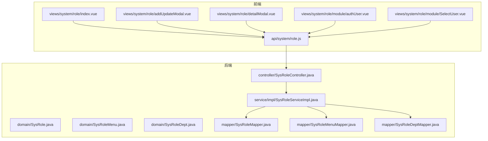
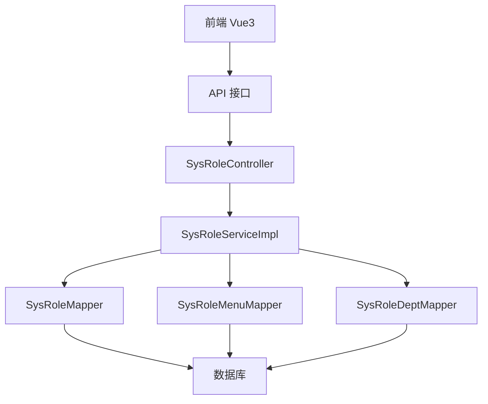
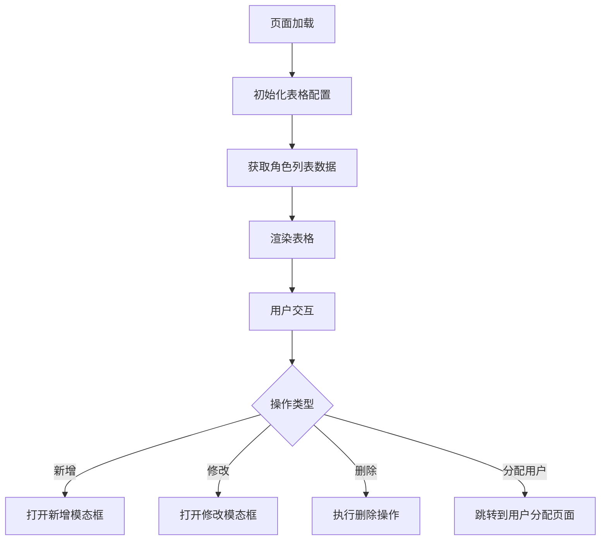
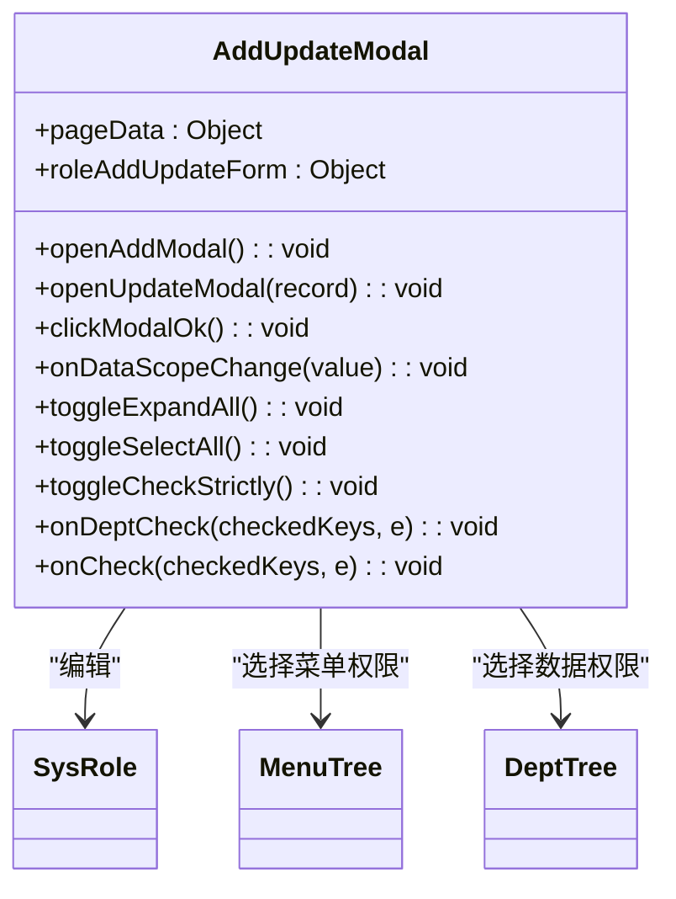
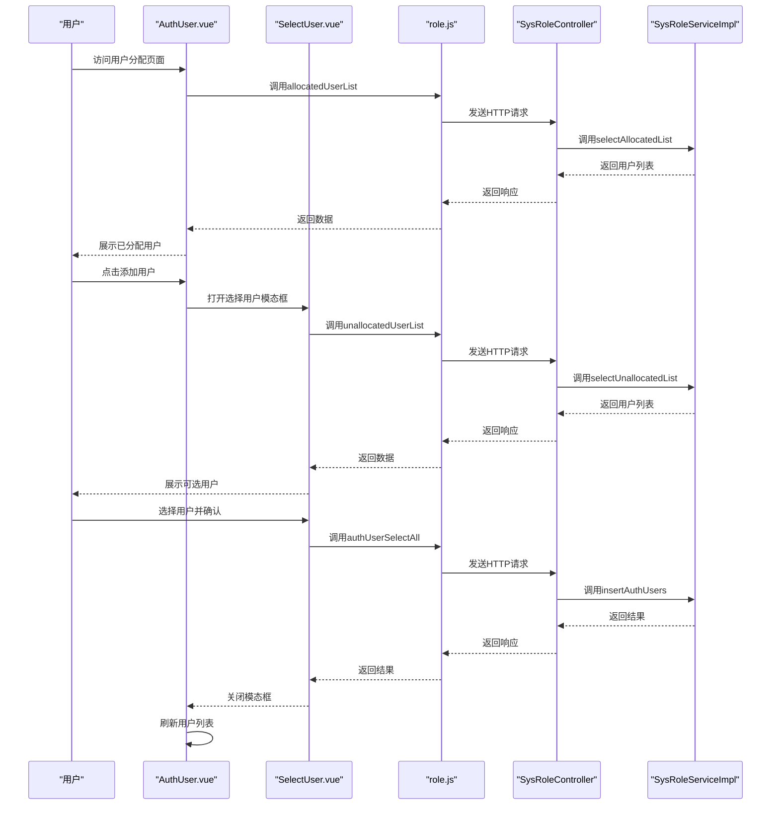
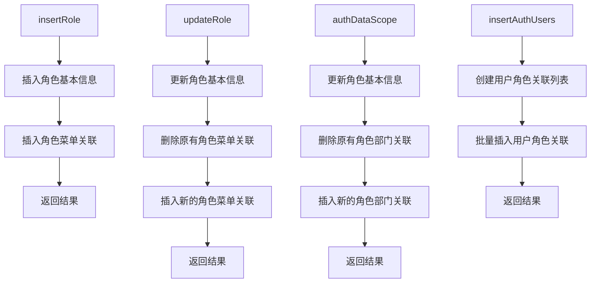
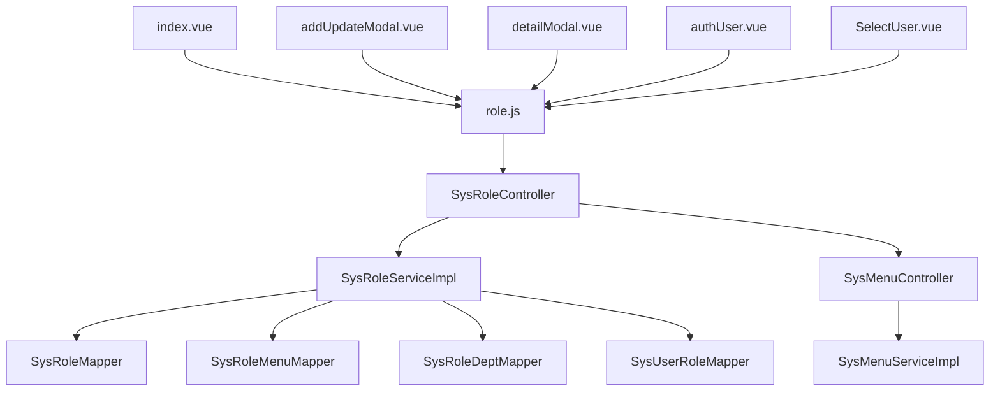

# 角色管理

<cite>
**本文档引用文件**  
- [index.vue](file://bear-jia-vue3\src\views\system\role\index.vue)
- [addUpdateModal.vue](file://bear-jia-vue3\src\views\system\role\addUpdateModal.vue)
- [detailModal.vue](file://bear-jia-vue3\src\views\system\role\detailModal.vue)
- [role.js](file://bear-jia-vue3\src\api\system\role.js)
- [authUser.vue](file://bear-jia-vue3\src\views\system\role\module\authUser.vue)
- [SelectUser.vue](file://bear-jia-vue3\src\views\system\role\module\SelectUser.vue)
- [SysRoleController.java](file://bearjia-admin-backend\src\main\java\com\javaxiaobear\module\system\controller\SysRoleController.java)
- [SysRole.java](file://bearjia-admin-backend\src\main\java\com\javaxiaobear\module\system\domain\SysRole.java)
- [SysRoleMenu.java](file://bearjia-admin-backend\src\main\java\com\javaxiaobear\module\system\domain\SysRoleMenu.java)
- [SysRoleDept.java](file://bearjia-admin-backend\src\main\java\com\javaxiaobear\module\system\domain\SysRoleDept.java)
- [SysRoleServiceImpl.java](file://bearjia-admin-backend\src\main\java\com\javaxiaobear\module\system\service\impl\SysRoleServiceImpl.java)
- [SysMenuController.java](file://bearjia-admin-backend\src\main\java\com\javaxiaobear\module\system\controller\SysMenuController.java)
- [menu.js](file://bear-jia-vue3\src\api\system\menu.js)
</cite>

## 目录
1. [简介](#简介)
2. [项目结构](#项目结构)
3. [核心组件](#核心组件)
4. [架构概览](#架构概览)
5. [详细组件分析](#详细组件分析)
6. [依赖分析](#依赖分析)
7. [性能考虑](#性能考虑)
8. [故障排除指南](#故障排除指南)
9. [结论](#结论)

## 简介
本系统提供了一套完整的角色管理功能，支持角色的增删改查、权限分配、数据权限设置和状态管理。系统采用前后端分离架构，前端基于Vue3和Ant Design Vue实现，后端基于Spring Boot框架。角色管理功能通过角色与菜单权限、数据权限的关联存储，实现了灵活的权限控制机制。系统还支持角色与用户之间的多对多关系维护，以及权限变更后的实时刷新。

## 项目结构
角色管理功能主要分布在前端和后端两个部分。前端代码位于`bear-jia-vue3`项目中，主要包含视图组件和API调用；后端代码位于`bearjia-admin-backend`项目中，主要包含控制器、服务层和数据访问层。

**图表来源**
- [index.vue](file://bear-jia-vue3\src\views\system\role\index.vue)
- [addUpdateModal.vue](file://bear-jia-vue3\src\views\system\role\addUpdateModal.vue)
- [detailModal.vue](file://bear-jia-vue3\src\views\system\role\detailModal.vue)
- [authUser.vue](file://bear-jia-vue3\src\views\system\role\module\authUser.vue)
- [SelectUser.vue](file://bear-jia-vue3\src\views\system\role\module\SelectUser.vue)
- [role.js](file://bear-jia-vue3\src\api\system\role.js)
- [SysRoleController.java](file://bearjia-admin-backend\src\main\java\com\javaxiaobear\module\system\controller\SysRoleController.java)
- [SysRole.java](file://bearjia-admin-backend\src\main\java\com\javaxiaobear\module\system\domain\SysRole.java)
- [SysRoleMenu.java](file://bearjia-admin-backend\src\main\java\com\javaxiaobear\module\system\domain\SysRoleMenu.java)
- [SysRoleDept.java](file://bearjia-admin-backend\src\main\java\com\javaxiaobear\module\system\domain\SysRoleDept.java)
- [SysRoleServiceImpl.java](file://bearjia-admin-backend\src\main\java\com\javaxiaobear\module\system\service\impl\SysRoleServiceImpl.java)

**章节来源**
- [index.vue](file://bear-jia-vue3\src\views\system\role\index.vue#L1-L129)
- [addUpdateModal.vue](file://bear-jia-vue3\src\views\system\role\addUpdateModal.vue#L1-L477)
- [SysRoleController.java](file://bearjia-admin-backend\src\main\java\com\javaxiaobear\module\system\controller\SysRoleController.java#L1-L264)

## 核心组件
角色管理功能的核心组件包括角色列表展示、角色增删改查、权限分配和数据权限设置。前端通过`index.vue`组件展示角色列表，提供新增、删除、导出等操作按钮。`addUpdateModal.vue`组件用于角色的新增和修改，包含角色基本信息、菜单权限和数据权限的设置。`detailModal.vue`组件用于查看角色的详细信息。

后端通过`SysRoleController`提供RESTful API接口，处理角色相关的增删改查请求。`SysRoleServiceImpl`服务层实现具体的业务逻辑，包括角色信息的持久化、权限关联的维护等。系统通过`SysRoleMenu`和`SysRoleDept`实体类实现角色与菜单、角色与部门的多对多关系。

**章节来源**
- [index.vue](file://bear-jia-vue3\src\views\system\role\index.vue#L1-L129)
- [addUpdateModal.vue](file://bear-jia-vue3\src\views\system\role\addUpdateModal.vue#L1-L477)
- [detailModal.vue](file://bear-jia-vue3\src\views\system\role\detailModal.vue#L1-L118)
- [SysRoleController.java](file://bearjia-admin-backend\src\main\java\com\javaxiaobear\module\system\controller\SysRoleController.java#L1-L264)
- [SysRoleServiceImpl.java](file://bearjia-admin-backend\src\main\java\com\javaxiaobear\module\system\service\impl\SysRoleServiceImpl.java#L1-L431)

## 架构概览
系统采用典型的三层架构：表现层、业务逻辑层和数据访问层。前端作为表现层，负责用户界面的展示和用户交互；后端的控制器和服务层构成业务逻辑层，处理具体的业务规则和流程；Mapper层和数据库构成数据访问层，负责数据的持久化存储。

**图表来源**
- [SysRoleController.java](file://bearjia-admin-backend\src\main\java\com\javaxiaobear\module\system\controller\SysRoleController.java#L1-L264)
- [SysRoleServiceImpl.java](file://bearjia-admin-backend\src\main\java\com\javaxiaobear\module\system\service\impl\SysRoleServiceImpl.java#L1-L431)
- [SysRoleMapper.java](file://bearjia-admin-backend\src\main\java\com\javaxiaobear\module\system\mapper\SysRoleMapper.java)
- [SysRoleMenuMapper.java](file://bearjia-admin-backend\src\main\java\com\javaxiaobear\module\system\mapper\SysRoleMenuMapper.java)
- [SysRoleDeptMapper.java](file://bearjia-admin-backend\src\main\java\com\javaxiaobear\module\system\mapper\SysRoleDeptMapper.java)

**章节来源**
- [SysRoleController.java](file://bearjia-admin-backend\src\main\java\com\javaxiaobear\module\system\controller\SysRoleController.java#L1-L264)
- [SysRoleServiceImpl.java](file://bearjia-admin-backend\src\main\java\com\javaxiaobear\module\system\service\impl\SysRoleServiceImpl.java#L1-L431)

## 详细组件分析

### 角色列表组件分析
角色列表组件`index.vue`使用`ProTable`组件展示角色数据，支持分页、搜索和导出功能。组件通过`v-hasPermi`指令控制操作按钮的显示权限，确保用户只能执行其被授权的操作。

**图表来源**
- [index.vue](file://bear-jia-vue3\src\views\system\role\index.vue#L1-L129)

**章节来源**
- [index.vue](file://bear-jia-vue3\src\views\system\role\index.vue#L1-L129)

### 角色编辑组件分析
角色编辑组件`addUpdateModal.vue`提供了一个完整的表单界面，用于角色的新增和修改。组件包含角色基本信息、菜单权限和数据权限的设置。

**图表来源**
- [addUpdateModal.vue](file://bear-jia-vue3\src\views\system\role\addUpdateModal.vue#L1-L477)

**章节来源**
- [addUpdateModal.vue](file://bear-jia-vue3\src\views\system\role\addUpdateModal.vue#L1-L477)

### 权限分配组件分析
权限分配功能通过`authUser.vue`和`SelectUser.vue`两个组件实现。`authUser.vue`展示已分配给角色的用户列表，`SelectUser.vue`用于选择要分配给角色的用户。

**图表来源**
- [authUser.vue](file://bear-jia-vue3\src\views\system\role\module\authUser.vue#L1-L224)
- [SelectUser.vue](file://bear-jia-vue3\src\views\system\role\module\SelectUser.vue#L1-L180)
- [role.js](file://bear-jia-vue3\src\api\system\role.js#L1-L112)
- [SysRoleController.java](file://bearjia-admin-backend\src\main\java\com\javaxiaobear\module\system\controller\SysRoleController.java#L1-L264)
- [SysRoleServiceImpl.java](file://bearjia-admin-backend\src\main\java\com\javaxiaobear\module\system\service\impl\SysRoleServiceImpl.java#L1-L431)

**章节来源**
- [authUser.vue](file://bear-jia-vue3\src\views\system\role\module\authUser.vue#L1-L224)
- [SelectUser.vue](file://bear-jia-vue3\src\views\system\role\module\SelectUser.vue#L1-L180)

### 后端服务层分析
后端服务层`SysRoleServiceImpl`实现了角色管理的核心业务逻辑，包括角色的增删改查、权限分配和数据权限设置。

**图表来源**
- [SysRoleServiceImpl.java](file://bearjia-admin-backend\src\main\java\com\javaxiaobear\module\system\service\impl\SysRoleServiceImpl.java#L1-L431)

**章节来源**
- [SysRoleServiceImpl.java](file://bearjia-admin-backend\src\main\java\com\javaxiaobear\module\system\service\impl\SysRoleServiceImpl.java#L1-L431)

## 依赖分析
角色管理功能涉及多个组件之间的依赖关系。前端组件依赖于API服务，API服务依赖于后端控制器，控制器依赖于服务层，服务层依赖于数据访问层。

**图表来源**
- [index.vue](file://bear-jia-vue3\src\views\system\role\index.vue#L1-L129)
- [addUpdateModal.vue](file://bear-jia-vue3\src\views\system\role\addUpdateModal.vue#L1-L477)
- [detailModal.vue](file://bear-jia-vue3\src\views\system\role\detailModal.vue#L1-L118)
- [authUser.vue](file://bear-jia-vue3\src\views\system\role\module\authUser.vue#L1-L224)
- [SelectUser.vue](file://bear-jia-vue3\src\views\system\role\module\SelectUser.vue#L1-L180)
- [role.js](file://bear-jia-vue3\src\api\system\role.js#L1-L112)
- [SysRoleController.java](file://bearjia-admin-backend\src\main\java\com\javaxiaobear\module\system\controller\SysRoleController.java#L1-L264)
- [SysRoleServiceImpl.java](file://bearjia-admin-backend\src\main\java\com\javaxiaobear\module\system\service\impl\SysRoleServiceImpl.java#L1-L431)
- [SysMenuController.java](file://bearjia-admin-backend\src\main\java\com\javaxiaobear\module\system\controller\SysMenuController.java#L1-L142)

**章节来源**
- [role.js](file://bear-jia-vue3\src\api\system\role.js#L1-L112)
- [SysRoleController.java](file://bearjia-admin-backend\src\main\java\com\javaxiaobear\module\system\controller\SysRoleController.java#L1-L264)
- [SysRoleServiceImpl.java](file://bearjia-admin-backend\src\main\java\com\javaxiaobear\module\system\service\impl\SysRoleServiceImpl.java#L1-L431)

## 性能考虑
系统在设计时考虑了多个性能优化点。首先，权限树采用了懒加载机制，只有在用户展开节点时才加载子节点数据，减少了初始加载时间。其次，系统使用了缓存机制，将常用的字典数据和权限信息缓存在内存中，避免了频繁的数据库查询。

在数据权限设置方面，系统提供了全选/全不选、展开/折叠等快捷操作，提高了用户操作效率。后端服务层使用了事务管理，确保角色信息和权限关联的原子性操作，避免了数据不一致的问题。

对于大规模用户的角色分配，系统提供了批量操作接口，可以一次性处理多个用户的角色分配，减少了网络请求次数。

## 故障排除指南

### 权限分配后不生效
当权限分配后不生效时，可能的原因包括：
1. 缓存未及时更新：检查用户登录缓存是否已刷新
2. 数据库事务未提交：检查后端日志是否有事务回滚记录
3. 前端未刷新：确认前端是否调用了刷新方法

解决方案：
- 检查`SysRoleController`的`edit`方法中是否有更新缓存用户的逻辑
- 确认`LoginUser`对象的权限是否已重新加载
- 检查前端`addUpdateModal.vue`的`clickModalOk`方法是否正确调用了刷新

**章节来源**
- [SysRoleController.java](file://bearjia-admin-backend\src\main\java\com\javaxiaobear\module\system\controller\SysRoleController.java#L130-L140)
- [addUpdateModal.vue](file://bear-jia-vue3\src\views\system\role\addUpdateModal.vue#L280-L284)

### 数据权限过滤异常
数据权限过滤异常可能由以下原因引起：
1. 数据范围设置错误：检查角色的数据范围配置是否正确
2. 部门关联数据缺失：确认`SysRoleDept`表中是否有正确的部门关联记录
3. SQL查询条件错误：检查数据权限相关的SQL查询是否正确应用了过滤条件

解决方案：
- 检查`SysRole`实体类的`dataScope`字段值是否正确
- 确认`SysRoleServiceImpl`的`authDataScope`方法是否正确更新了部门关联
- 检查`@DataScope`注解是否正确应用在相关查询方法上

**章节来源**
- [SysRole.java](file://bearjia-admin-backend\src\main\java\com\javaxiaobear\module\system\domain\SysRole.java#L38-L40)
- [SysRoleServiceImpl.java](file://bearjia-admin-backend\src\main\java\com\javaxiaobear\module\system\service\impl\SysRoleServiceImpl.java#L274-L284)
- [SysRoleController.java](file://bearjia-admin-backend\src\main\java\com\javaxiaobear\module\system\controller\SysRoleController.java#L148-L156)

## 结论
本系统提供了一套完整且灵活的角色管理解决方案，通过前后端协同工作，实现了角色的增删改查、权限分配、数据权限设置和状态管理等功能。系统采用模块化设计，各组件职责清晰，易于维护和扩展。通过合理的架构设计和性能优化，系统能够高效地处理角色管理相关的各种操作，为用户提供良好的使用体验。