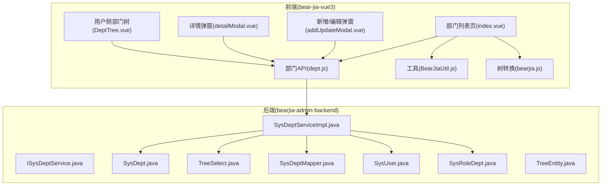
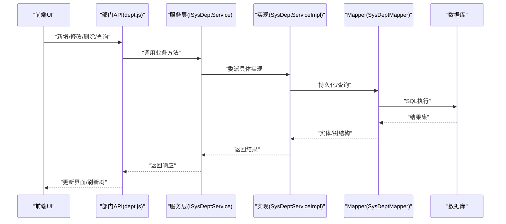
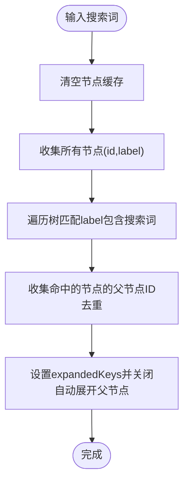
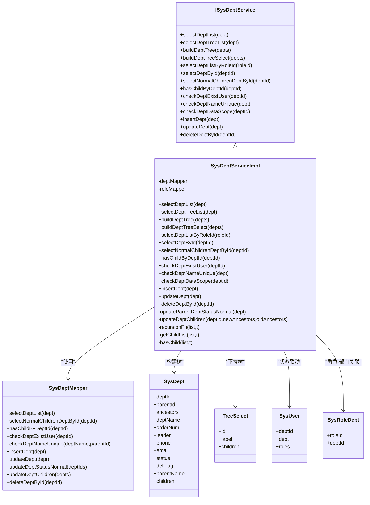
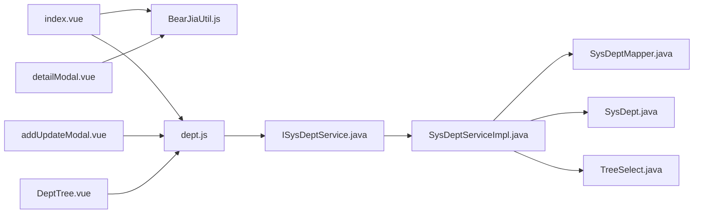

# 部门管理

<cite>
**本文引用的文件**
- [index.vue](file://bear-jia-vue3/src/views/system/dept/index.vue)
- [addUpdateModal.vue](file://bear-jia-vue3/src/views/system/dept/addUpdateModal.vue)
- [detailModal.vue](file://bear-jia-vue3/src/views/system/dept/detailModal.vue)
- [DeptTree.vue](file://bear-jia-vue3/src/views/system/user/DeptTree.vue)
- [dept.js](file://bear-jia-vue3/src/api/system/dept.js)
- [BearJiaUtil.js](file://bear-jia-vue3/src/utils/BearJiaUtil.js)
- [bearjia.js](file://bear-jia-vue3/src/utils/bearjia.js)
- [ISysDeptService.java](file://bearjia-admin-backend/src/main/java/com/javaxiaobear/module/system/service/ISysDeptService.java)
- [SysDeptServiceImpl.java](file://bearjia-admin-backend/src/main/java/com/javaxiaobear/module/system/service/impl/SysDeptServiceImpl.java)
- [SysDept.java](file://bearjia-admin-backend/src/main/java/com/javaxiaobear/module/system/domain/SysDept.java)
- [TreeSelect.java](file://bearjia-admin-backend/src/main/java/com/javaxiaobear/base/framework/web/domain/TreeSelect.java)
- [SysDeptMapper.java](file://bearjia-admin-backend/src/main/java/com/javaxiaobear/module/system/mapper/SysDeptMapper.java)
- [SysUser.java](file://bearjia-admin-backend/src/main/java/com/javaxiaobear/module/system/domain/SysUser.java)
- [SysRoleDept.java](file://bearjia-admin-backend/src/main/java/com/javaxiaobear/module/system/domain/SysRoleDept.java)
- [TreeEntity.java](file://bearjia-admin-backend/src/main/java/com/javaxiaobear/base/framework/web/domain/TreeEntity.java)
</cite>

## 目录
1. [简介](#简介)
2. [项目结构](#项目结构)
3. [核心组件](#核心组件)
4. [架构总览](#架构总览)
5. [详细组件分析](#详细组件分析)
6. [依赖关系分析](#依赖关系分析)
7. [性能考虑](#性能考虑)
8. [故障排查指南](#故障排查指南)
9. [结论](#结论)
10. [附录](#附录)

## 简介
本文件系统性阐述“部门管理”功能，覆盖前端增删改查、层级结构维护、负责人指定与状态管理；同时解释前端部门树（DeptTree）的展示逻辑与选择行为，以及后端服务层如何构建部门树并处理层级关系。文档还提供典型操作流程示例、部门与用户的归属关系维护机制、部门状态对用户状态的影响、常见问题排查与性能优化建议（如懒加载与缓存）。

## 项目结构
- 前端模块位于 bear-jia-vue3：
  - 视图与交互：部门列表页、新增/编辑弹窗、详情弹窗、用户侧部门树组件
  - API 层：部门接口封装
  - 工具层：通用工具、树形转换工具
- 后端模块位于 bearjia-admin-backend：
  - 领域模型：部门、用户、角色-部门关联
  - 服务层：部门树构建、父子关系维护、状态联动
  - Mapper 层：数据库访问与约束校验

图表来源
- [index.vue](file://bear-jia-vue3/src/views/system/dept/index.vue#L1-L130)
- [addUpdateModal.vue](file://bear-jia-vue3/src/views/system/dept/addUpdateModal.vue#L1-L150)
- [detailModal.vue](file://bear-jia-vue3/src/views/system/dept/detailModal.vue#L1-L88)
- [DeptTree.vue](file://bear-jia-vue3/src/views/system/user/DeptTree.vue#L1-L166)
- [dept.js](file://bear-jia-vue3/src/api/system/dept.js#L1-L68)
- [BearJiaUtil.js](file://bear-jia-vue3/src/utils/BearJiaUtil.js#L1-L200)
- [bearjia.js](file://bear-jia-vue3/src/utils/bearjia.js#L173-L216)
- [ISysDeptService.java](file://bearjia-admin-backend/src/main/java/com/javaxiaobear/module/system/service/ISysDeptService.java#L1-L56)
- [SysDeptServiceImpl.java](file://bearjia-admin-backend/src/main/java/com/javaxiaobear/module/system/service/impl/SysDeptServiceImpl.java#L1-L339)
- [SysDept.java](file://bearjia-admin-backend/src/main/java/com/javaxiaobear/module/system/domain/SysDept.java#L1-L204)
- [TreeSelect.java](file://bearjia-admin-backend/src/main/java/com/javaxiaobear/base/framework/web/domain/TreeSelect.java#L1-L57)
- [SysDeptMapper.java](file://bearjia-admin-backend/src/main/java/com/javaxiaobear/module/system/mapper/SysDeptMapper.java#L49-L118)
- [SysUser.java](file://bearjia-admin-backend/src/main/java/com/javaxiaobear/module/system/domain/SysUser.java#L1-L274)
- [SysRoleDept.java](file://bearjia-admin-backend/src/main/java/com/javaxiaobear/module/system/domain/SysRoleDept.java#L1-L46)
- [TreeEntity.java](file://bearjia-admin-backend/src/main/java/com/javaxiaobear/base/framework/web/domain/TreeEntity.java#L1-L79)

章节来源
- [index.vue](file://bear-jia-vue3/src/views/system/dept/index.vue#L1-L130)
- [dept.js](file://bear-jia-vue3/src/api/system/dept.js#L1-L68)
- [BearJiaUtil.js](file://bear-jia-vue3/src/utils/BearJiaUtil.js#L1-L200)

## 核心组件
- 部门列表页：负责表格展示、树形处理、删除后的树刷新
- 新增/编辑弹窗：负责表单校验、提交、触发树刷新
- 详情弹窗：负责只读展示部门信息
- 用户侧部门树：负责树形展示、搜索、选择事件
- 部门 API：封装部门 CRUD、树结构查询
- 工具层：部门树数据获取、树形转换、消息提示

章节来源
- [index.vue](file://bear-jia-vue3/src/views/system/dept/index.vue#L1-L130)
- [addUpdateModal.vue](file://bear-jia-vue3/src/views/system/dept/addUpdateModal.vue#L1-L150)
- [detailModal.vue](file://bear-jia-vue3/src/views/system/dept/detailModal.vue#L1-L88)
- [DeptTree.vue](file://bear-jia-vue3/src/views/system/user/DeptTree.vue#L1-L166)
- [dept.js](file://bear-jia-vue3/src/api/system/dept.js#L1-L68)
- [BearJiaUtil.js](file://bear-jia-vue3/src/utils/BearJiaUtil.js#L1-L200)

## 架构总览
前端通过 API 层调用后端服务，后端以领域模型承载部门层级关系（祖先链、父子关系），服务层负责构建树结构、维护父子关系与状态联动，Mapper 层执行数据库约束与查询。

图表来源
- [dept.js](file://bear-jia-vue3/src/api/system/dept.js#L1-L68)
- [ISysDeptService.java](file://bearjia-admin-backend/src/main/java/com/javaxiaobear/module/system/service/ISysDeptService.java#L1-L56)
- [SysDeptServiceImpl.java](file://bearjia-admin-backend/src/main/java/com/javaxiaobear/module/system/service/impl/SysDeptServiceImpl.java#L1-L339)
- [SysDeptMapper.java](file://bearjia-admin-backend/src/main/java/com/javaxiaobear/module/system/mapper/SysDeptMapper.java#L49-L118)

## 详细组件分析

### 前端：部门列表页（index.vue）
- 功能要点
  - 表格配置：树形表格、行选择、列渲染（状态字典标签）
  - 数据处理：将后端扁平数据转换为树形结构
  - 删除回调：删除成功后刷新部门树与表格
- 关键实现路径
  - 表格 API 配置与树形转换：[index.vue](file://bear-jia-vue3/src/views/system/dept/index.vue#L86-L95)
  - 刷新树与表格：[index.vue](file://bear-jia-vue3/src/views/system/dept/index.vue#L121-L126)

章节来源
- [index.vue](file://bear-jia-vue3/src/views/system/dept/index.vue#L1-L130)
- [bearjia.js](file://bear-jia-vue3/src/utils/bearjia.js#L173-L216)

### 前端：新增/编辑弹窗（addUpdateModal.vue）
- 功能要点
  - 上级部门选择：使用部门树下拉（tree-select）
  - 表单校验：必填字段校验
  - 提交流程：新增/修改后触发树刷新与表格刷新
- 关键实现路径
  - 打开新增/编辑弹窗与表单赋值：[addUpdateModal.vue](file://bear-jia-vue3/src/views/system/dept/addUpdateModal.vue#L86-L103)
  - 提交新增/修改并刷新树：[addUpdateModal.vue](file://bear-jia-vue3/src/views/system/dept/addUpdateModal.vue#L105-L131)

章节来源
- [addUpdateModal.vue](file://bear-jia-vue3/src/views/system/dept/addUpdateModal.vue#L1-L150)
- [dept.js](file://bear-jia-vue3/src/api/system/dept.js#L44-L68)

### 前端：详情弹窗（detailModal.vue）
- 功能要点
  - 只读展示部门信息
  - 上级部门名称解析（根据树数据映射）
- 关键实现路径
  - 打开详情并解析上级部门名称：[detailModal.vue](file://bear-jia-vue3/src/views/system/dept/detailModal.vue#L73-L79)

章节来源
- [detailModal.vue](file://bear-jia-vue3/src/views/system/dept/detailModal.vue#L1-L88)
- [BearJiaUtil.js](file://bear-jia-vue3/src/utils/BearJiaUtil.js#L66-L91)

### 前端：用户侧部门树（DeptTree.vue）
- 展示逻辑
  - 字段映射：children、title、key、value
  - 展开与自动展开父节点
  - 搜索过滤：按标签匹配，展开相关父节点
- 选择行为
  - 选择事件向外抛出，供父组件消费
- 关键实现路径
  - 字段映射与事件绑定：[DeptTree.vue](file://bear-jia-vue3/src/views/system/user/DeptTree.vue#L10-L17)
  - 搜索过滤与展开父节点：[DeptTree.vue](file://bear-jia-vue3/src/views/system/user/DeptTree.vue#L74-L90)
  - 选择事件：[DeptTree.vue](file://bear-jia-vue3/src/views/system/user/DeptTree.vue#L92-L96)
  - 展开事件：[DeptTree.vue](file://bear-jia-vue3/src/views/system/user/DeptTree.vue#L97-L101)

图表来源
- [DeptTree.vue](file://bear-jia-vue3/src/views/system/user/DeptTree.vue#L63-L101)

章节来源
- [DeptTree.vue](file://bear-jia-vue3/src/views/system/user/DeptTree.vue#L1-L166)

### 后端：服务层（ISysDeptService、SysDeptServiceImpl）
- 树构建
  - 构建树结构：从全量部门中识别根节点并递归组装子树
  - 下拉树构建：将树结构映射为 TreeSelect
- 层级维护
  - 新增：校验父部门状态，设置祖先链 ancestors
  - 修改：变更父级时更新 ancestors 与子节点的祖先链，必要时启用上级部门
  - 删除：直接删除（由 Mapper 校验是否存在用户/子节点）
- 状态联动
  - 启用部门时，自动启用其祖先链上的所有部门
- 关键实现路径
  - 树构建与下拉树构建：[SysDeptServiceImpl.java](file://bearjia-admin-backend/src/main/java/com/javaxiaobear/module/system/service/impl/SysDeptServiceImpl.java#L70-L102)
  - 新增保存：[SysDeptServiceImpl.java](file://bearjia-admin-backend/src/main/java/com/javaxiaobear/module/system/service/impl/SysDeptServiceImpl.java#L211-L222)
  - 修改保存与祖先链更新：[SysDeptServiceImpl.java](file://bearjia-admin-backend/src/main/java/com/javaxiaobear/module/system/service/impl/SysDeptServiceImpl.java#L231-L250)
  - 子节点祖先链批量替换：[SysDeptServiceImpl.java](file://bearjia-admin-backend/src/main/java/com/javaxiaobear/module/system/service/impl/SysDeptServiceImpl.java#L271-L282)
  - 启用部门时启用上级：[SysDeptServiceImpl.java](file://bearjia-admin-backend/src/main/java/com/javaxiaobear/module/system/service/impl/SysDeptServiceImpl.java#L252-L262)
  - 递归构建子树：[SysDeptServiceImpl.java](file://bearjia-admin-backend/src/main/java/com/javaxiaobear/module/system/service/impl/SysDeptServiceImpl.java#L299-L339)

图表来源
- [ISysDeptService.java](file://bearjia-admin-backend/src/main/java/com/javaxiaobear/module/system/service/ISysDeptService.java#L1-L56)
- [SysDeptServiceImpl.java](file://bearjia-admin-backend/src/main/java/com/javaxiaobear/module/system/service/impl/SysDeptServiceImpl.java#L1-L339)
- [SysDept.java](file://bearjia-admin-backend/src/main/java/com/javaxiaobear/module/system/domain/SysDept.java#L1-L204)
- [TreeSelect.java](file://bearjia-admin-backend/src/main/java/com/javaxiaobear/base/framework/web/domain/TreeSelect.java#L1-L57)
- [SysDeptMapper.java](file://bearjia-admin-backend/src/main/java/com/javaxiaobear/module/system/mapper/SysDeptMapper.java#L49-L118)
- [SysUser.java](file://bearjia-admin-backend/src/main/java/com/javaxiaobear/module/system/domain/SysUser.java#L1-L274)
- [SysRoleDept.java](file://bearjia-admin-backend/src/main/java/com/javaxiaobear/module/system/domain/SysRoleDept.java#L1-L46)

章节来源
- [ISysDeptService.java](file://bearjia-admin-backend/src/main/java/com/javaxiaobear/module/system/service/ISysDeptService.java#L1-L56)
- [SysDeptServiceImpl.java](file://bearjia-admin-backend/src/main/java/com/javaxiaobear/module/system/service/impl/SysDeptServiceImpl.java#L1-L339)
- [SysDept.java](file://bearjia-admin-backend/src/main/java/com/javaxiaobear/module/system/domain/SysDept.java#L1-L204)
- [TreeSelect.java](file://bearjia-admin-backend/src/main/java/com/javaxiaobear/base/framework/web/domain/TreeSelect.java#L1-L57)
- [SysDeptMapper.java](file://bearjia-admin-backend/src/main/java/com/javaxiaobear/module/system/mapper/SysDeptMapper.java#L49-L118)
- [SysUser.java](file://bearjia-admin-backend/src/main/java/com/javaxiaobear/module/system/domain/SysUser.java#L1-L274)
- [SysRoleDept.java](file://bearjia-admin-backend/src/main/java/com/javaxiaobear/module/system/domain/SysRoleDept.java#L1-L46)

### 典型操作流程示例

#### 创建新部门并设置上级部门
- 前端
  - 打开新增弹窗，选择上级部门（tree-select），填写基本信息，提交
  - 提交成功后触发树刷新与表格刷新
- 后端
  - 校验父部门状态，设置祖先链 ancestors，插入新部门
- 关键实现路径
  - 新增提交与树刷新：[addUpdateModal.vue](file://bear-jia-vue3/src/views/system/dept/addUpdateModal.vue#L105-L131)
  - 新增保存与祖先链设置：[SysDeptServiceImpl.java](file://bearjia-admin-backend/src/main/java/com/javaxiaobear/module/system/service/impl/SysDeptServiceImpl.java#L211-L222)

章节来源
- [addUpdateModal.vue](file://bear-jia-vue3/src/views/system/dept/addUpdateModal.vue#L105-L131)
- [SysDeptServiceImpl.java](file://bearjia-admin-backend/src/main/java/com/javaxiaobear/module/system/service/impl/SysDeptServiceImpl.java#L211-L222)

#### 调整部门层级结构（变更父级）
- 前端
  - 在新增/编辑弹窗中修改上级部门
- 后端
  - 更新父级时，重新计算 ancestors 并批量替换子节点祖先链，必要时启用上级部门
- 关键实现路径
  - 修改保存与祖先链更新：[SysDeptServiceImpl.java](file://bearjia-admin-backend/src/main/java/com/javaxiaobear/module/system/service/impl/SysDeptServiceImpl.java#L231-L250)
  - 子节点祖先链批量替换：[SysDeptServiceImpl.java](file://bearjia-admin-backend/src/main/java/com/javaxiaobear/module/system/service/impl/SysDeptServiceImpl.java#L271-L282)
  - 启用上级部门：[SysDeptServiceImpl.java](file://bearjia-admin-backend/src/main/java/com/javaxiaobear/module/system/service/impl/SysDeptServiceImpl.java#L252-L262)

章节来源
- [SysDeptServiceImpl.java](file://bearjia-admin-backend/src/main/java/com/javaxiaobear/module/system/service/impl/SysDeptServiceImpl.java#L231-L282)

#### 指定部门负责人
- 前端
  - 在新增/编辑弹窗中填写负责人字段
- 后端
  - 仅持久化负责人字段，不涉及层级或状态联动
- 关键实现路径
  - 表单字段与提交：[addUpdateModal.vue](file://bear-jia-vue3/src/views/system/dept/addUpdateModal.vue#L22-L51)

章节来源
- [addUpdateModal.vue](file://bear-jia-vue3/src/views/system/dept/addUpdateModal.vue#L22-L51)

#### 部门状态与用户状态的关系
- 部门状态影响
  - 启用部门会自动启用其祖先链上的所有部门
- 用户状态影响
  - 用户状态与部门状态无直接耦合；用户状态由用户表字段控制
- 关键实现路径
  - 启用部门时启用上级：[SysDeptServiceImpl.java](file://bearjia-admin-backend/src/main/java/com/javaxiaobear/module/system/service/impl/SysDeptServiceImpl.java#L252-L262)
  - 用户模型字段：[SysUser.java](file://bearjia-admin-backend/src/main/java/com/javaxiaobear/module/system/domain/SysUser.java#L1-L274)

章节来源
- [SysDeptServiceImpl.java](file://bearjia-admin-backend/src/main/java/com/javaxiaobear/module/system/service/impl/SysDeptServiceImpl.java#L252-L262)
- [SysUser.java](file://bearjia-admin-backend/src/main/java/com/javaxiaobear/module/system/domain/SysUser.java#L1-L274)

## 依赖关系分析
- 前端
  - index.vue 依赖 BearJiaUtil.handleTree 进行树形转换
  - addUpdateModal.vue 依赖 dept.js 的新增/修改接口
  - detailModal.vue 依赖 BearJiaUtil.getDeptNameByDeptId 解析上级部门名称
  - DeptTree.vue 依赖 dept.js 的 treeselect 接口
- 后端
  - ISysDeptService 定义树构建与业务契约
  - SysDeptServiceImpl 实现树构建、祖先链维护、状态联动
  - SysDeptMapper 执行数据库约束与查询

图表来源
- [index.vue](file://bear-jia-vue3/src/views/system/dept/index.vue#L86-L95)
- [addUpdateModal.vue](file://bear-jia-vue3/src/views/system/dept/addUpdateModal.vue#L105-L131)
- [detailModal.vue](file://bear-jia-vue3/src/views/system/dept/detailModal.vue#L73-L79)
- [DeptTree.vue](file://bear-jia-vue3/src/views/system/user/DeptTree.vue#L10-L17)
- [dept.js](file://bear-jia-vue3/src/api/system/dept.js#L1-L68)
- [BearJiaUtil.js](file://bear-jia-vue3/src/utils/BearJiaUtil.js#L66-L91)
- [ISysDeptService.java](file://bearjia-admin-backend/src/main/java/com/javaxiaobear/module/system/service/ISysDeptService.java#L1-L56)
- [SysDeptServiceImpl.java](file://bearjia-admin-backend/src/main/java/com/javaxiaobear/module/system/service/impl/SysDeptServiceImpl.java#L1-L339)
- [SysDeptMapper.java](file://bearjia-admin-backend/src/main/java/com/javaxiaobear/module/system/mapper/SysDeptMapper.java#L49-L118)
- [SysDept.java](file://bearjia-admin-backend/src/main/java/com/javaxiaobear/module/system/domain/SysDept.java#L1-L204)
- [TreeSelect.java](file://bearjia-admin-backend/src/main/java/com/javaxiaobear/base/framework/web/domain/TreeSelect.java#L1-L57)

章节来源
- [index.vue](file://bear-jia-vue3/src/views/system/dept/index.vue#L86-L95)
- [dept.js](file://bear-jia-vue3/src/api/system/dept.js#L1-L68)
- [BearJiaUtil.js](file://bear-jia-vue3/src/utils/BearJiaUtil.js#L66-L91)
- [SysDeptServiceImpl.java](file://bearjia-admin-backend/src/main/java/com/javaxiaobear/module/system/service/impl/SysDeptServiceImpl.java#L1-L339)

## 性能考虑
- 部门树懒加载与缓存
  - 前端：DeptTree.vue 支持按需展开，避免一次性加载整棵树；可结合 BearJiaUtil.getDeptTreeData 缓存树数据，减少重复请求
  - 后端：树构建采用递归与流式处理，避免重复扫描；Mapper 层提供下拉树专用查询
- 列表页树形转换
  - index.vue 使用 BearJiaUtil.handleTree 将后端扁平数据转换为树形，建议在大数据量场景下分页或延迟转换
- 搜索过滤
  - DeptTree.vue 的搜索会收集所有节点并回溯父链，建议限制树规模或增加搜索阈值

章节来源
- [DeptTree.vue](file://bear-jia-vue3/src/views/system/user/DeptTree.vue#L74-L101)
- [BearJiaUtil.js](file://bear-jia-vue3/src/utils/BearJiaUtil.js#L175-L177)
- [bearjia.js](file://bear-jia-vue3/src/utils/bearjia.js#L173-L216)
- [SysDeptServiceImpl.java](file://bearjia-admin-backend/src/main/java/com/javaxiaobear/module/system/service/impl/SysDeptServiceImpl.java#L70-L102)

## 故障排查指南
- 部门树加载缓慢
  - 检查 DeptTree.vue 是否一次性收集所有节点；建议限制树规模或启用懒加载
  - 前端缓存树数据，避免重复请求 treeselect
  - 后端确保 Mapper 查询索引完善，避免全表扫描
- 部门删除失败
  - 后端 Mapper 校验是否存在用户或子节点；需先迁移用户归属或删除子部门
  - 关键实现路径：[SysDeptMapper.java](file://bearjia-admin-backend/src/main/java/com/javaxiaobear/module/system/mapper/SysDeptMapper.java#L63-L70)
- 修改父级导致层级异常
  - 确认 ancestors 更新逻辑已正确替换子节点祖先链
  - 关键实现路径：[SysDeptServiceImpl.java](file://bearjia-admin-backend/src/main/java/com/javaxiaobear/module/system/service/impl/SysDeptServiceImpl.java#L271-L282)
- 启用部门未联动启用上级
  - 确认 status 为启用且 ancestors 非空；服务层会自动启用祖先链
  - 关键实现路径：[SysDeptServiceImpl.java](file://bearjia-admin-backend/src/main/java/com/javaxiaobear/module/system/service/impl/SysDeptServiceImpl.java#L244-L262)

章节来源
- [SysDeptMapper.java](file://bearjia-admin-backend/src/main/java/com/javaxiaobear/module/system/mapper/SysDeptMapper.java#L63-L70)
- [SysDeptServiceImpl.java](file://bearjia-admin-backend/src/main/java/com/javaxiaobear/module/system/service/impl/SysDeptServiceImpl.java#L244-L282)

## 结论
本方案通过前后端协同实现了完整的部门管理能力：前端提供直观的树形展示与交互，后端以祖先链与递归算法保证层级一致性与状态联动。通过合理的懒加载与缓存策略，可在大规模组织架构下保持良好性能。删除与层级变更等关键路径均具备完善的约束与回退保障。

## 附录
- API 定义（节选）
  - 查询部门列表：GET /system/dept/list
  - 查询部门列表（排除节点）：GET /system/dept/list/exclude/{deptId}
  - 查询部门详情：GET /system/dept/{deptId}
  - 查询部门下拉树：GET /system/user/deptTree
  - 新增部门：POST /system/dept
  - 修改部门：PUT /system/dept
  - 删除部门：DELETE /system/dept/{deptId}

章节来源
- [dept.js](file://bear-jia-vue3/src/api/system/dept.js#L1-L68)