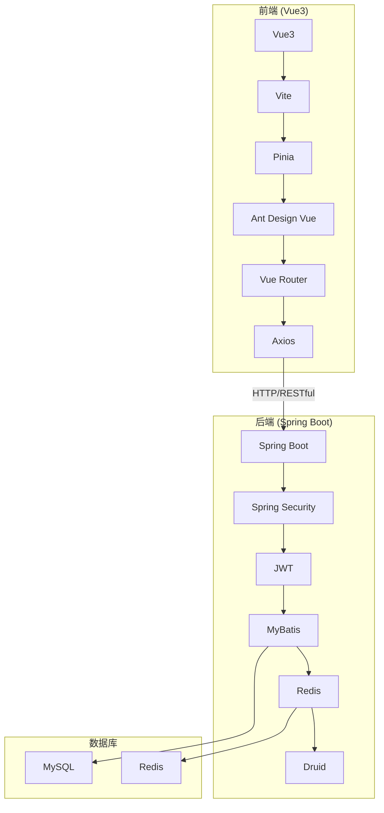
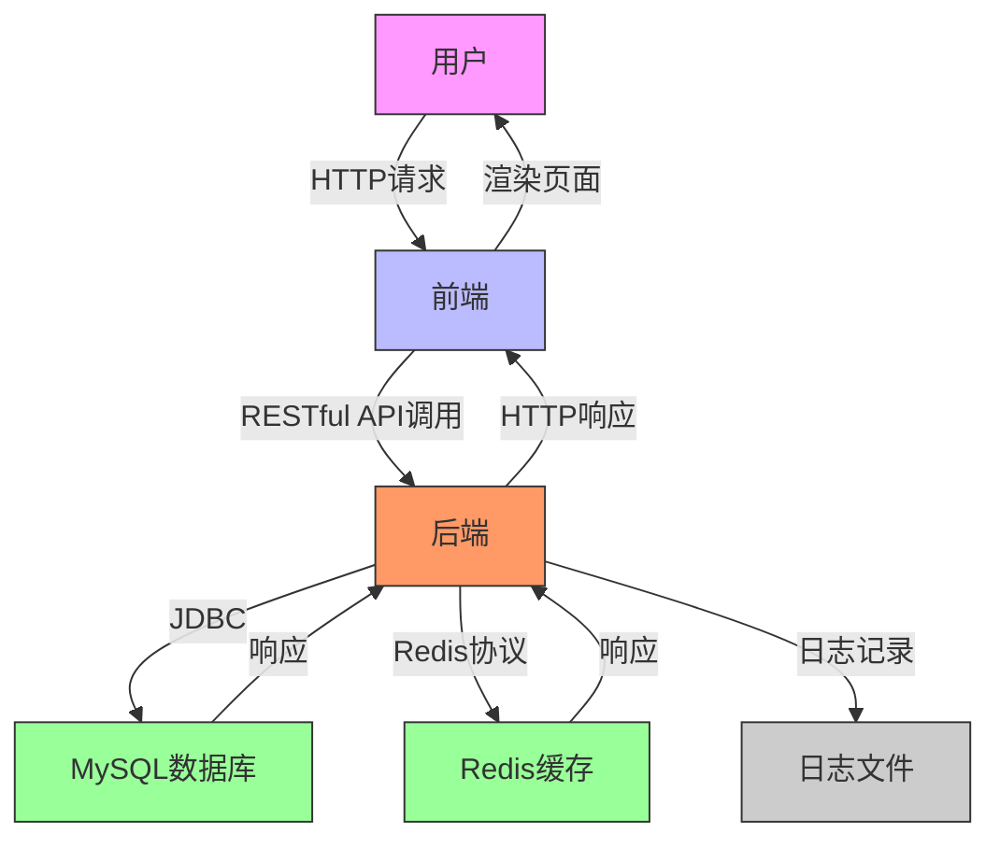
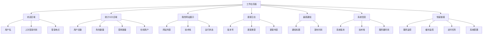

# 系统概述

<cite>
**本文档引用的文件**   
- [bear-jia-vue3\package.json](file://bear-jia-vue3/package.json)
- [bearjia-admin-backend\pom.xml](file://bearjia-admin-backend/pom.xml)
- [bear-jia-vue3\README.md](file://bear-jia-vue3/README.md)
- [bearjia-admin-backend\README.md](file://bearjia-admin-backend/README.md)
- [h5\manifest.json](file://h5/manifest.json)
- [h5\README.md](file://h5/README.md)
- [bear-jia-vue3\src\router\routes.js](file://bear-jia-vue3/src/router/routes.js)
- [bear-jia-vue3\src\stores\permission.js](file://bear-jia-vue3/src/stores/permission.js)
- [bear-jia-vue3\src\api\system\user.js](file://bear-jia-vue3/src/api/system/user.js)
- [bearjia-admin-backend\src\main\resources\application.yml](file://bearjia-admin-backend/src/main/resources/application.yml)
- [bearjia-admin-backend\src\main\resources\sql\bear_jia.sql](file://bearjia-admin-backend/src/main/resources/sql/bear_jia.sql)
- [bearjia-admin-backend\src\main\java\com\javaxiaobear\module\monitor\controller\ServerController.java](file://bearjia-admin-backend/src/main/java/com/javaxiaobear/module/monitor/controller/ServerController.java)
- [bear-jia-vue3\src\views\workbench\WorkbenchPage.vue](file://bear-jia-vue3/src/views/workbench/WorkbenchPage.vue)
- [bear-jia-vue3\src\views\monitor\server\index.vue](file://bear-jia-vue3/src/views/monitor/server/index.vue)
</cite>

## 目录
1. [项目简介](#项目简介)
2. [技术栈](#技术栈)
3. [系统架构](#系统架构)
4. [核心功能模块](#核心功能模块)
5. [系统上下文图](#系统上下文图)
6. [主要使用场景与目标用户](#主要使用场景与目标用户)
7. [工作台界面预览](#工作台界面预览)
8. [开发目标与设计哲学](#开发目标与设计哲学)

## 项目简介

qms-vue项目是一个基于Vue3和SpringBoot的企业级全栈后台管理系统，采用现代化的前后端分离架构。该项目由三个子项目构成：前端（bear-jia-vue3）、后端（bearjia-admin-backend）和移动端（h5），形成了一个完整的多端解决方案。

前端项目基于Vue3、Vite和Ant Design Vue构建，提供了现代化的开发体验和高性能的用户界面。后端项目采用Spring Boot框架，集成了MyBatis、Redis、Druid等主流技术，提供了稳定可靠的后端服务。移动端项目基于UniApp框架开发，实现了"一次开发，多端运行"的目标，支持APP、小程序和H5等多种终端。

该项目旨在为开发者提供一个功能完整、易于扩展、开箱即用的企业级管理系统解决方案。通过模块化架构设计和组件化开发模式，系统内置了完善的权限管理体系、系统监控功能和代码生成工具等核心功能模块，同时支持多主题切换、响应式布局等特性，能够满足从快速原型开发到大型企业应用构建的各种需求。

**Section sources**
- [bear-jia-vue3\README.md](file://bear-jia-vue3/README.md)
- [bearjia-admin-backend\README.md](file://bearjia-admin-backend/README.md)
- [h5\README.md](file://h5/README.md)

## 技术栈

qms-vue项目采用了当前主流的前后端技术栈，确保了系统的先进性、稳定性和可维护性。

前端技术栈主要包括：
- **Vue3**：基于Vue 3.4.21版本，利用Composition API和`<script setup>`语法糖，提供现代化的开发体验
- **Vite**：采用Vite 5.1.4作为构建工具，提供极速的开发服务器启动和热更新功能
- **Pinia**：使用Pinia 2.1.7作为状态管理方案，提供简洁的API和优秀的TypeScript支持
- **Ant Design Vue**：基于Ant Design Vue 4.1.2构建用户界面，提供丰富的企业级UI组件
- **Vue Router**：使用Vue Router 4.3.0进行路由管理，支持动态路由和懒加载
- **Axios**：采用Axios 1.6.7作为HTTP客户端，处理前后端通信
- **WangEditor**：集成WangEditor 5.1.23富文本编辑器，支持图片上传和视频嵌入

后端技术栈主要包括：
- **Spring Boot**：基于Spring Boot 2.7.18构建，提供自动配置和快速开发能力
- **MyBatis**：使用MyBatis 3.5.x作为持久层框架，配合PageHelper实现分页查询
- **Spring Security**：集成Spring Security进行安全认证和权限控制
- **JWT**：采用JWT Token进行无状态认证，确保系统的安全性
- **Redis**：使用Redis 6.0+作为缓存和会话存储，提升系统性能
- **Druid**：集成Druid 1.2.23作为数据库连接池，提供监控和防护功能
- **Quartz**：使用Quartz 2.3.x实现定时任务调度
- **FastJSON**：采用FastJSON 2.0.47进行JSON序列化和反序列化

数据库方面，系统主要使用MySQL 8.0+作为主数据存储，同时利用Redis作为缓存层，形成了高效的存储架构。

**Section sources**
- [bear-jia-vue3\package.json](file://bear-jia-vue3/package.json)
- [bearjia-admin-backend\pom.xml](file://bearjia-admin-backend/pom.xml)
- [bear-jia-vue3\README.md](file://bear-jia-vue3/README.md)

## 系统架构

qms-vue项目采用前后端分离的架构设计，将前端、后端和移动端作为独立的子项目进行开发和部署，通过RESTful API进行通信。这种架构模式具有高内聚、低耦合的特点，便于团队协作和独立部署。

系统采用组件化开发模式，前端项目通过模块化的目录结构组织代码，包括API接口层、公共组件库、组合式函数、布局组件、路由配置、状态管理、工具函数和页面组件等核心目录。这种结构使得代码组织清晰，便于维护和扩展。

在路由管理方面，系统实现了模块化路由设计，通过`routes.js`文件定义静态路由，并结合后端返回的动态路由实现权限控制。权限系统基于RBAC（基于角色的访问控制）模型，支持菜单权限、按钮权限和数据权限的精细化控制。

状态管理采用Pinia方案，通过`stores`目录下的多个store文件管理应用状态，包括用户信息、权限信息、标签页状态等。这种集中式状态管理方式使得状态变更可预测，便于调试和测试。

后端架构采用典型的分层设计，包括表现层（Controller）、业务逻辑层（Service）、数据访问层（Mapper）和基础框架层。通过Spring Boot的自动配置和依赖注入机制，各层之间松耦合，便于单元测试和功能扩展。

**Diagram sources **
- [bear-jia-vue3\package.json](file://bear-jia-vue3/package.json)
- [bearjia-admin-backend\pom.xml](file://bearjia-admin-backend/pom.xml)
- [bearjia-admin-backend\src\main\resources\application.yml](file://bearjia-admin-backend/src/main/resources/application.yml)

**Section sources**
- [bearjia-admin-backend\README.md](file://bearjia-admin-backend/README.md)
- [bear-jia-vue3\src\router\routes.js](file://bear-jia-vue3/src/router/routes.js)
- [bear-jia-vue3\src\stores\permission.js](file://bear-jia-vue3/src/stores/permission.js)

## 核心功能模块

qms-vue项目主要包含系统管理、系统监控和系统工具三大核心功能模块，每个模块都提供了丰富的功能来满足企业级应用的需求。

### 系统管理

系统管理模块是整个系统的基础，提供了用户、角色、菜单、部门、岗位等核心管理功能。用户管理功能支持用户信息维护、角色分配、状态管理和批量操作；角色管理功能支持角色权限配置、数据权限设置和角色分配；菜单管理功能支持动态菜单配置、权限控制和图标管理；部门管理功能支持组织架构管理、树形结构展示和层级管理；岗位管理功能支持岗位信息维护、人员分配和岗位层级管理。

此外，系统管理还包含字典管理和参数管理功能。字典管理用于维护数据字典，为下拉选项提供配置，并支持字典缓存以提升性能；参数管理用于配置系统参数，支持动态参数管理和配置热更新，无需重启服务即可生效。

### 系统监控

系统监控模块提供了全面的系统运行状态监控功能，帮助管理员及时发现和解决系统问题。在线用户功能可以实时监控在线用户，支持强制下线和会话管理；服务监控功能可以监控服务器性能、JVM状态和系统信息，提供CPU、内存、磁盘等关键指标的实时数据；缓存监控功能可以监控Redis缓存状态，进行缓存管理和性能统计；操作日志功能记录用户操作记录和系统访问日志，支持日志分析和审计；登录日志功能记录用户登录记录，支持异常登录监控和IP地址追踪。

### 系统工具

系统工具模块提供了提高开发效率和系统可维护性的实用工具。代码生成功能支持一键生成前后端代码，支持自定义模板和预览功能，大大减少了重复性编码工作；系统接口功能集成Swagger3，自动生成API文档并支持在线测试；定时任务功能集成Quartz，支持任务调度管理和执行结果日志查看；通知公告功能支持系统通知发布、富文本编辑和消息推送，便于系统管理员向用户传达重要信息。

**Section sources**
- [bearjia-admin-backend\README.md](file://bearjia-admin-backend/README.md)
- [bearjia-admin-backend\src\main\resources\sql\bear_jia.sql](file://bearjia-admin-backend/src/main/resources/sql/bear_jia.sql)
- [bearjia-admin-backend\src\main\java\com\javaxiaobear\module\monitor\controller\ServerController.java](file://bearjia-admin-backend/src/main/java/com/javaxiaobear/module/monitor/controller/ServerController.java)

## 系统上下文图

系统上下文图展示了qms-vue项目中前端、后端、数据库和用户之间的交互关系。该图清晰地描绘了系统的边界和外部实体，以及它们之间的主要交互方式。

**Diagram sources **
- [bearjia-admin-backend\src\main\resources\application.yml](file://bearjia-admin-backend/src/main/resources/application.yml)
- [bearjia-admin-backend\README.md](file://bearjia-admin-backend/README.md)

## 主要使用场景与目标用户

qms-vue项目主要面向企业级后台管理系统的开发和使用，适用于多种业务场景。其主要使用场景包括：

1. **企业内部管理系统**：适用于企业的人力资源管理、客户关系管理、项目管理等内部业务系统的开发，提供完整的用户权限管理和数据安全控制。

2. **SaaS平台后台**：作为SaaS（软件即服务）平台的管理后台，支持多租户管理和租户隔离，满足不同客户的需求。

3. **电商平台管理**：适用于电商平台的后台管理，支持商品管理、订单管理、用户管理、营销活动管理等功能。

4. **内容管理系统**：作为内容管理系统的后台，支持文章发布、栏目管理、评论管理、SEO设置等功能。

5. **物联网平台管理**：适用于物联网平台的设备管理、数据监控、告警管理等功能。

目标用户群体主要包括：

- **系统管理员**：负责系统的日常运维、用户管理和权限配置，需要使用系统管理、系统监控等功能。
- **开发人员**：负责系统的功能开发和维护，可以利用代码生成工具提高开发效率。
- **业务管理人员**：负责业务数据的录入、查询和分析，需要友好的用户界面和高效的数据处理能力。
- **企业决策者**：需要通过系统获取业务数据和运营指标，进行决策分析。

系统的设计充分考虑了不同用户群体的需求，提供了直观的用户界面、完善的权限控制和灵活的配置选项，确保各类用户都能高效地使用系统。

**Section sources**
- [bearjia-admin-backend\README.md](file://bearjia-admin-backend/README.md)
- [bear-jia-vue3\README.md](file://bear-jia-vue3/README.md)

## 工作台界面预览

工作台是qms-vue项目的核心页面，为用户提供了一个直观、高效的工作入口。工作台页面采用响应式布局设计，能够适配不同尺寸的屏幕，确保在桌面端、平板和手机等设备上都有良好的用户体验。

页面主要分为以下几个功能区域：

1. **欢迎区域**：显示用户的欢迎信息，包括用户名、上次登录时间和登录地点，让用户快速了解自己的登录状态。

2. **统计卡片区域**：以卡片形式展示关键业务指标，如用户总数、角色数量、菜单数量和在线用户数。每个卡片都支持点击，可以直接跳转到相应的管理页面。

3. **我的网站展示**：展示用户管理的网站列表，包括网站名称、描述、技术栈和运行状态，方便用户快速访问自己的项目。

4. **更新日志**：显示系统的更新历史，包括版本号、更新类型、更新日期和具体更新内容，帮助用户了解系统的新功能和改进。

5. **最新通知**：显示系统发布的最新通知和公告，支持点击查看详细内容。

6. **系统信息**：显示系统的版本信息、技术栈和服务器时间，帮助管理员了解系统的基本情况。

7. **快速链接**：提供常用功能的快捷入口，如服务监控、缓存监控、定时任务和系统配置，提高用户的操作效率。

工作台页面的设计遵循了现代Web应用的设计原则，采用清晰的视觉层次、一致的交互模式和流畅的动画效果，为用户提供了愉悦的操作体验。

**Diagram sources **
- [bear-jia-vue3\src\views\workbench\WorkbenchPage.vue](file://bear-jia-vue3/src/views/workbench/WorkbenchPage.vue)
- [bear-jia-vue3\src\views\monitor\server\index.vue](file://bear-jia-vue3/src/views/monitor/server/index.vue)

## 开发目标与设计哲学

qms-vue项目的开发目标是创建一个现代化、高性能、易扩展的企业级后台管理系统框架。系统的设计哲学体现在以下几个方面：

### 代码生成

系统内置了强大的代码生成功能，支持一键生成前后端代码。通过配置数据库表结构和生成模板，可以自动生成实体类、Mapper接口、Service层、Controller层和前端页面代码，大大减少了重复性编码工作，提高了开发效率。代码生成器支持自定义模板，开发者可以根据项目需求调整生成代码的格式和内容。

### 主题定制

系统支持多主题切换，包括亮色主题和暗色主题，并支持自定义主题色。通过主题配置功能，用户可以根据个人喜好或企业品牌形象调整系统的视觉风格。主题系统采用CSS变量和动态样式注入技术，确保主题切换的平滑性和性能。

### 权限控制

系统采用基于RBAC（基于角色的访问控制）的权限模型，支持菜单权限、按钮权限和数据权限的精细化控制。权限配置通过可视化界面完成，管理员可以轻松地为不同角色分配不同的权限。权限验证在前端和后端同时进行，确保系统的安全性。

### 响应式设计

系统采用响应式设计，能够适配不同尺寸的屏幕，包括桌面端、平板和手机。通过CSS媒体查询和弹性布局，页面元素能够根据屏幕尺寸自动调整布局和大小，确保在各种设备上都有良好的用户体验。

### 模块化架构

系统采用模块化架构设计，将功能划分为独立的模块，每个模块都有清晰的职责和接口。这种设计使得系统易于维护和扩展，新功能可以作为独立模块添加，不影响现有功能。

### 性能优化

系统在性能方面进行了多项优化，包括组件懒加载、路由懒加载、图片懒加载、Redis缓存、数据库连接池等。这些优化措施确保了系统在高并发场景下的稳定性和响应速度。

通过这些设计哲学，qms-vue项目不仅提供了一个功能完整的后台管理系统，还为开发者提供了一个可扩展、可定制的开发框架，能够满足不同规模和复杂度的项目需求。

**Section sources**
- [bear-jia-vue3\README.md](file://bear-jia-vue3/README.md)
- [bearjia-admin-backend\README.md](file://bearjia-admin-backend/README.md)
- [bearjia-admin-backend\src\main\resources\application.yml](file://bearjia-admin-backend/src/main/resources/application.yml)