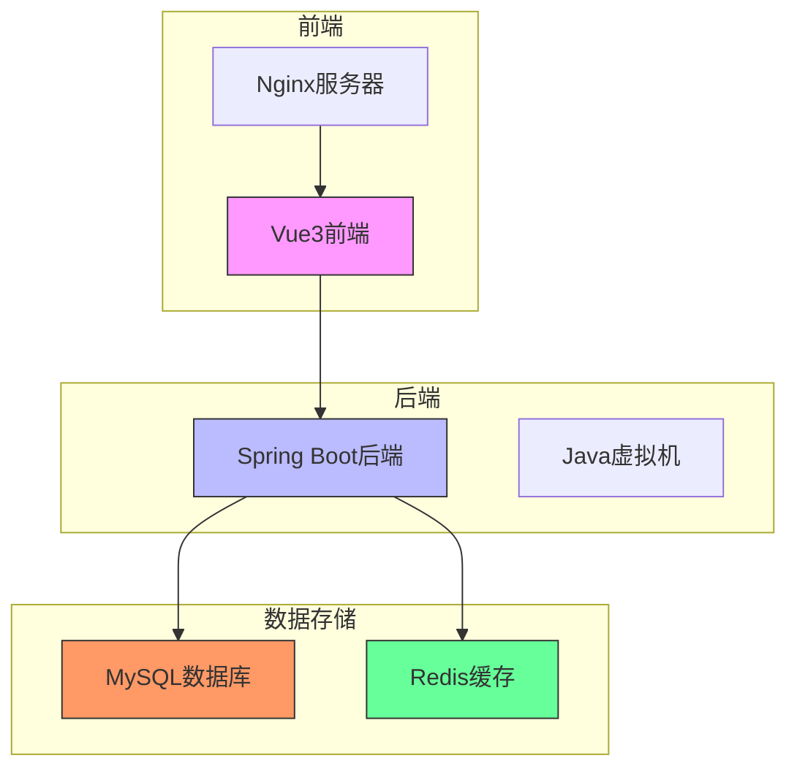
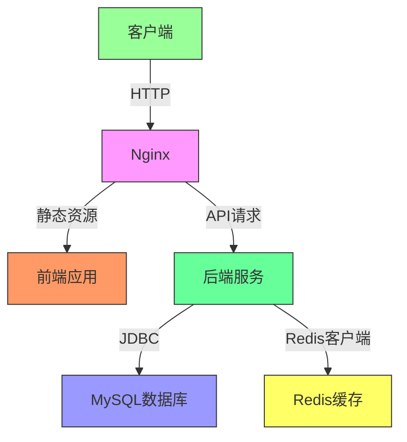
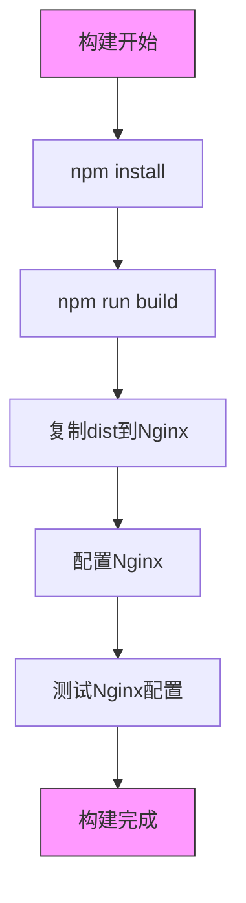
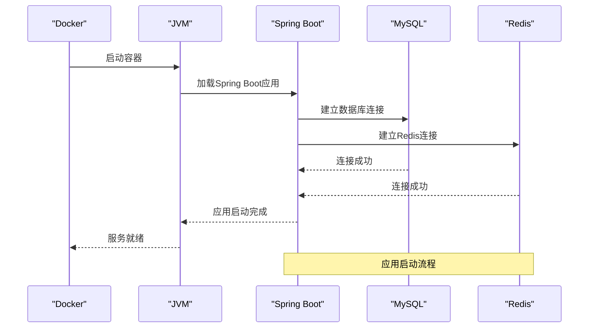
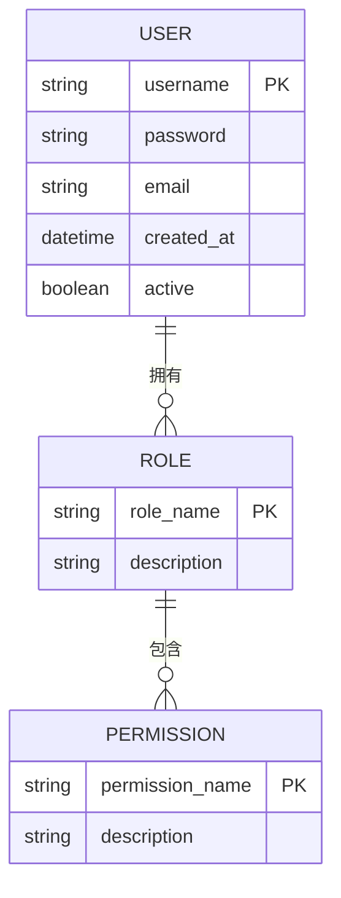
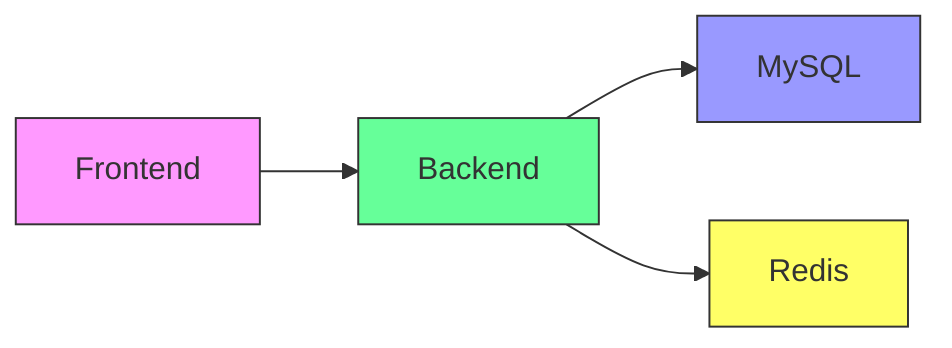

# Docker容器化部署

<cite>
**本文档引用的文件**
- [package.json](file://bear-jia-vue3/package.json)
- [vite.config.js](file://bear-jia-vue3/vite.config.js)
- [pom.xml](file://bearjia-admin-backend/pom.xml)
- [application.yml](file://bearjia-admin-backend/src/main/resources/application.yml)
- [application-druid.yml](file://bearjia-admin-backend/src/main/resources/application-druid.yml)
- [JavaXiaoBearApplication.java](file://bearjia-admin-backend/src/main/java/com/javaxiaobear/JavaXiaoBearApplication.java)
</cite>

## 目录
1. [简介](#简介)
2. [项目结构](#项目结构)
3. [核心组件](#核心组件)
4. [架构概述](#架构概述)
5. [详细组件分析](#详细组件分析)
6. [依赖分析](#依赖分析)
7. [性能考虑](#性能考虑)
8. [故障排除指南](#故障排除指南)
9. [结论](#结论)

## 简介
本文档提供了完整的Docker容器化部署方案，涵盖前端、后端、MySQL和Redis服务的容器化配置。通过Docker Compose统一管理所有服务，实现一键构建和部署。文档详细说明了Dockerfile配置、环境变量管理、数据持久化、网络配置等关键内容，并提供了运维命令和常见问题排查方法。

## 项目结构
项目包含前端Vue3应用、后端Spring Boot应用、MySQL数据库和Redis缓存服务。前端基于Vite构建，后端使用Spring Boot框架，通过Docker Compose进行服务编排。

**图表来源**
- [package.json](file://bear-jia-vue3/package.json)
- [pom.xml](file://bearjia-admin-backend/pom.xml)

**章节来源**
- [package.json](file://bear-jia-vue3/package.json)
- [pom.xml](file://bearjia-admin-backend/pom.xml)

## 核心组件
系统由四个核心服务组成：前端服务、后端服务、MySQL数据库和Redis缓存。前端服务基于Nginx提供静态文件服务，后端服务运行在Java 8环境中，MySQL提供持久化存储，Redis提供缓存功能。

**章节来源**
- [package.json](file://bear-jia-vue3/package.json)
- [pom.xml](file://bearjia-admin-backend/pom.xml)

## 架构概述
系统采用前后端分离架构，前端通过API与后端通信，后端服务连接MySQL数据库进行数据持久化，并使用Redis进行缓存优化。所有服务通过Docker Compose进行编排和管理。

**图表来源**
- [application.yml](file://bearjia-admin-backend/src/main/resources/application.yml)
- [application-druid.yml](file://bearjia-admin-backend/src/main/resources/application-druid.yml)

## 详细组件分析

### 前端服务分析
前端服务基于Vue3和Vite构建，使用Nginx作为Web服务器。构建后的静态文件部署到Nginx容器中，通过反向代理将API请求转发到后端服务。

**图表来源**
- [package.json](file://bear-jia-vue3/package.json)
- [vite.config.js](file://bear-jia-vue3/vite.config.js)

### 后端服务分析
后端服务基于Spring Boot框架，使用Java 8运行时环境。通过Maven打包为可执行JAR文件，配置JVM启动参数以优化性能。

**图表来源**
- [pom.xml](file://bearjia-admin-backend/pom.xml)
- [JavaXiaoBearApplication.java](file://bearjia-admin-backend/src/main/java/com/javaxiaobear/JavaXiaoBearApplication.java)

### 数据库服务分析
MySQL服务配置了数据持久化卷，确保数据在容器重启后不会丢失。通过环境变量配置数据库连接信息，支持不同环境的灵活配置。

**图表来源**
- [application-druid.yml](file://bearjia-admin-backend/src/main/resources/application-druid.yml)

**章节来源**
- [application-druid.yml](file://bearjia-admin-backend/src/main/resources/application-druid.yml)

## 依赖分析
系统各组件之间的依赖关系清晰，前端依赖后端API，后端依赖数据库和缓存服务。通过Docker Compose的depends_on配置确保服务启动顺序。

**图表来源**
- [pom.xml](file://bearjia-admin-backend/pom.xml)
- [package.json](file://bear-jia-vue3/package.json)

**章节来源**
- [pom.xml](file://bearjia-admin-backend/pom.xml)
- [package.json](file://bear-jia-vue3/package.json)

## 性能考虑
系统在容器化部署时考虑了多项性能优化措施，包括JVM参数调优、数据库连接池配置、Redis缓存策略等，确保在生产环境中的稳定运行。

## 故障排除指南
提供常见问题的排查方法，包括容器启动失败、网络连接问题、数据库连接异常等，帮助运维人员快速定位和解决问题。

**章节来源**
- [application.yml](file://bearjia-admin-backend/src/main/resources/application.yml)
- [application-druid.yml](file://bearjia-admin-backend/src/main/resources/application-druid.yml)

## 结论
本文档提供了完整的Docker容器化部署方案，涵盖了从构建到部署的全过程。通过合理的配置和优化，确保系统在容器环境中的稳定运行，为生产部署提供了可靠的基础。