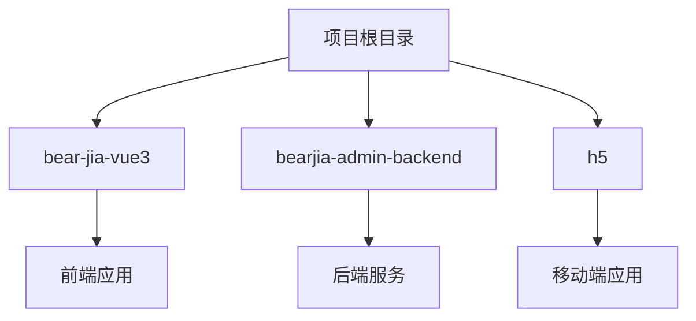
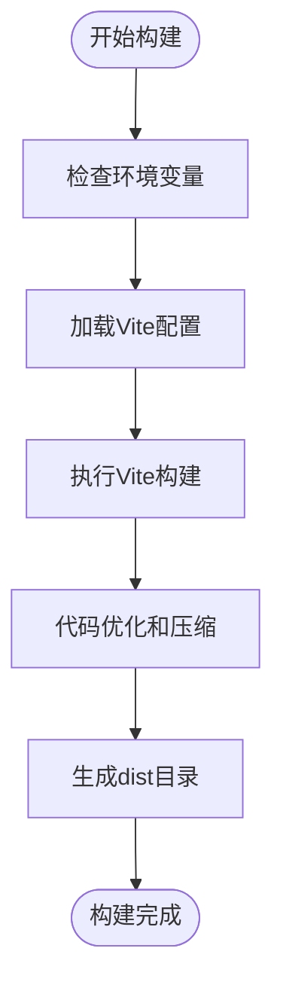
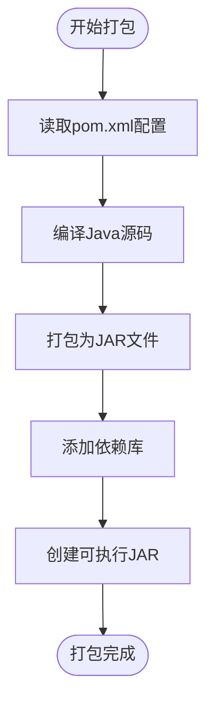
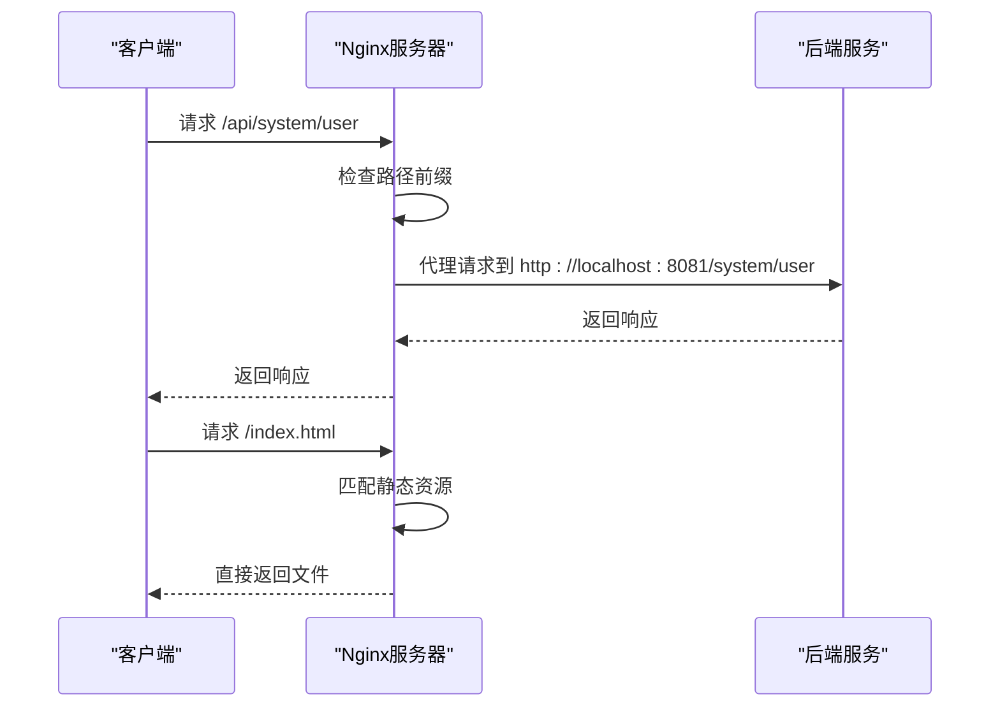
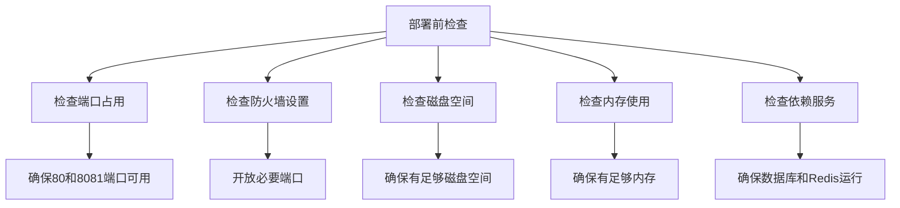

# 传统部署

<cite>
**本文档中引用的文件**  
- [vite.config.js](file://bear-jia-vue3/vite.config.js)
- [package.json](file://bear-jia-vue3/package.json)
- [pom.xml](file://bearjia-admin-backend/pom.xml)
- [application.yml](file://bearjia-admin-backend/src/main/resources/application.yml)
- [application-druid.yml](file://bearjia-admin-backend/src/main/resources/application-druid.yml)
- [JavaXiaoBearApplication.java](file://bearjia-admin-backend/src/main/java/com/javaxiaobear/JavaXiaoBearApplication.java)
- [getViteConfig.js](file://bear-jia-vue3/config/vite/index.js)
- [build.js](file://bear-jia-vue3/config/vite/build.js)
- [.env](file://bear-jia-vue3/.env)
- [.env.test](file://bear-jia-vue3/.env.test)
</cite>

## 目录
1. [介绍](#介绍)
2. [项目结构](#项目结构)
3. [前端部署](#前端部署)
4. [后端部署](#后端部署)
5. [Nginx配置](#nginx配置)
6. [环境配置管理](#环境配置管理)
7. [服务守护](#服务守护)
8. [完整部署清单](#完整部署清单)
9. [结论](#结论)

## 介绍
本文档详细说明了如何将前端和后端分别部署到生产环境。前端使用Vite构建生产版本，配置静态资源路径，并将dist目录文件部署到Nginx服务器。后端使用Maven打包项目为JAR文件，配置application.yml中的数据库连接、Redis连接等生产环境参数，通过java -jar命令运行服务。Nginx配置详细说明了反向代理设置，将/api前缀的请求代理到后端服务，静态资源由Nginx直接服务。文档还涵盖了环境配置管理、服务守护等内容，并提供了完整的部署步骤清单。

## 项目结构
本项目包含三个主要部分：前端（bear-jia-vue3）、后端（bearjia-admin-backend）和移动端（h5）。前端使用Vue 3和Vite构建，后端基于Spring Boot框架，使用Maven进行项目管理。



**图示来源**
- [vite.config.js](file://bear-jia-vue3/vite.config.js)
- [pom.xml](file://bearjia-admin-backend/pom.xml)

**本节来源**
- [project_structure](file://project_structure)

## 前端部署
前端部署涉及使用Vite构建生产版本、配置静态资源路径，并将生成的dist目录文件部署到Nginx服务器。

### 构建生产版本
使用Vite构建生产版本，通过package.json中的脚本命令执行构建过程。构建配置在vite.config.js中定义，通过模块化配置实现。



**图示来源**
- [vite.config.js](file://bear-jia-vue3/vite.config.js)
- [package.json](file://bear-jia-vue3/package.json)
- [build.js](file://bear-jia-vue3/config/vite/build.js)

**本节来源**
- [vite.config.js](file://bear-jia-vue3/vite.config.js#L1-L9)
- [package.json](file://bear-jia-vue3/package.json#L5-L8)
- [build.js](file://bear-jia-vue3/config/vite/build.js#L1-L289)

### 静态资源路径配置
Vite构建配置中包含了详细的静态资源文件名配置，确保不同类型的资源被正确分类和命名。

```javascript
export function getAssetFileNames(assetInfo) {
  const info = assetInfo.name.split('.');
  let extType = info[info.length - 1];
  
  if (/\.(png|jpe?g|gif|svg|webp|ico)$/i.test(assetInfo.name)) {
    extType = 'img';
  } else if (/\.(woff2?|eot|ttf|otf)$/i.test(assetInfo.name)) {
    extType = 'fonts';
  } else if (/\.css$/i.test(assetInfo.name)) {
    extType = 'css';
  }
  
  return `${extType}/[name]-[hash].[ext]`;
}
```

此配置确保图片资源存放在img目录，字体文件存放在fonts目录，CSS文件存放在css目录，实现了资源的有序管理。

**本节来源**
- [build.js](file://bear-jia-vue3/config/vite/build.js#L44-L57)

## 后端部署
后端部署涉及使用Maven打包项目为JAR文件，配置生产环境参数，并通过java -jar命令运行服务。

### Maven打包
通过pom.xml文件配置Maven打包过程，将项目打包为可执行的JAR文件。打包配置包括项目基本信息、依赖管理和构建插件。



**图示来源**
- [pom.xml](file://bearjia-admin-backend/pom.xml)
- [JavaXiaoBearApplication.java](file://bearjia-admin-backend/src/main/java/com/javaxiaobear/JavaXiaoBearApplication.java)

**本节来源**
- [pom.xml](file://bearjia-admin-backend/pom.xml#L1-L257)
- [JavaXiaoBearApplication.java](file://bearjia-admin-backend/src/main/java/com/javaxiaobear/JavaXiaoBearApplication.java#L1-L22)

### 生产环境配置
后端服务的生产环境配置主要在application.yml和application-druid.yml文件中定义，包括服务器端口、数据库连接、Redis配置等。

#### 服务器配置
```yaml
server:
  port: 8081
  servlet:
    context-path: /
  tomcat:
    uri-encoding: UTF-8
    accept-count: 1000
    threads:
      max: 800
      min-spare: 100
```

#### 数据库配置
数据库配置使用Druid连接池，支持主从配置，并通过环境变量实现生产环境的安全配置。

```yaml
spring:
    datasource:
        type: com.alibaba.druid.pool.DruidDataSource
        driverClassName: com.mysql.cj.jdbc.Driver
        druid:
            master:
                url: ${DB_URL:jdbc:mysql://localhost:3306/bear_jia?useUnicode=true&characterEncoding=utf8&zeroDateTimeBehavior=convertToNull&useSSL=true&serverTimezone=GMT%2B8}
                username: ${DB_USERNAME:root}
                password: ${DB_PASSWORD:123456}
```

使用环境变量（如DB_URL、DB_USERNAME、DB_PASSWORD）可以避免在配置文件中硬编码敏感信息，提高安全性。

**本节来源**
- [application.yml](file://bearjia-admin-backend/src/main/resources/application.yml#L1-L134)
- [application-druid.yml](file://bearjia-admin-backend/src/main/resources/application-druid.yml#L1-L63)

## Nginx配置
Nginx配置是前后端分离部署的关键，负责反向代理后端API请求和直接服务前端静态资源。

### 反向代理设置
Nginx配置将/api前缀的请求代理到后端服务，实现前后端的无缝集成。



**图示来源**
- [application.yml](file://bearjia-admin-backend/src/main/resources/application.yml#L18-L24)
- [vite.config.js](file://bear-jia-vue3/vite.config.js)

**本节来源**
- [application.yml](file://bearjia-admin-backend/src/main/resources/application.yml#L18-L24)
- [vite.config.js](file://bear-jia-vue3/vite.config.js#L5-L9)

### 静态资源服务
Nginx直接服务前端构建生成的静态资源，提高访问性能和响应速度。

```nginx
server {
    listen 80;
    server_name localhost;
    
    location / {
        root /usr/share/nginx/html;
        try_files $uri $uri/ /index.html;
        expires 1y;
        add_header Cache-Control "public, immutable";
    }
    
    location /api {
        proxy_pass http://localhost:8081;
        proxy_set_header Host $host;
        proxy_set_header X-Real-IP $remote_addr;
        proxy_set_header X-Forwarded-For $proxy_add_x_forwarded_for;
    }
}
```

此配置确保所有非API请求都尝试匹配静态文件，如果找不到则返回index.html，支持前端路由的history模式。

## 环境配置管理
项目通过多种方式管理不同环境的配置，确保开发、测试和生产环境的隔离和安全性。

### 前端环境配置
前端使用.env文件管理不同环境的配置，通过Vite的loadEnv函数加载相应的环境变量。

```javascript
export function getViteConfig({ mode }) {
  const isProd = mode === 'prod';
  const cwd = process.cwd();
  const env = loadEnv(mode, cwd);
  // ... 其他配置
}
```

项目中包含多个环境配置文件：
- .env：开发环境配置
- .env.test：测试环境配置
- .env.prod：生产环境配置（未显示）

这些文件定义了不同环境下的API地址、端口等配置。

**本节来源**
- [getViteConfig.js](file://bear-jia-vue3/config/vite/index.js#L12-L29)
- [.env](file://bear-jia-vue3/.env)
- [.env.test](file://bear-jia-vue3/.env.test)

### 后端环境配置
后端使用Spring Profile机制管理不同环境的配置，通过application-{profile}.yml文件实现配置分离。

```yaml
spring:
  profiles:
    active: druid
```

项目中包含：
- application.yml：基础配置
- application-druid.yml：Druid数据源配置

通过环境变量可以动态激活不同的配置文件，实现灵活的环境管理。

**本节来源**
- [application.yml](file://bearjia-admin-backend/src/main/resources/application.yml#L50-L57)
- [application-druid.yml](file://bearjia-admin-backend/src/main/resources/application-druid.yml)

## 服务守护
为确保后端服务持续运行，需要使用系统级的服务守护工具。

### systemd配置
使用systemd创建系统服务，确保后端服务在系统启动时自动运行，并在崩溃时自动重启。

```ini
[Unit]
Description=BearJia Admin Backend
After=network.target

[Service]
Type=simple
User=appuser
ExecStart=/usr/bin/java -jar /opt/bearjia-admin/bearjia-admin.jar
Restart=always
RestartSec=10

[Install]
WantedBy=multi-user.target
```

### supervisor配置
使用supervisor作为替代方案，提供类似的功能。

```ini
[program:bearjia-admin]
command=java -jar /opt/bearjia-admin/bearjia-admin.jar
directory=/opt/bearjia-admin
user=appuser
autostart=true
autorestart=true
redirect_stderr=true
stdout_logfile=/var/log/bearjia-admin.log
```

**本节来源**
- [pom.xml](file://bearjia-admin-backend/pom.xml#L219-L230)
- [JavaXiaoBearApplication.java](file://bearjia-admin-backend/src/main/java/com/javaxiaobear/JavaXiaoBearApplication.java)

## 完整部署清单
提供完整的部署步骤清单，确保部署过程的完整性和可靠性。

### 部署前检查


**本节来源**
- [application.yml](file://bearjia-admin-backend/src/main/resources/application.yml#L18-L20)
- [application-druid.yml](file://bearjia-admin-backend/src/main/resources/application-druid.yml#L9-L11)

### 部署步骤
1. 构建前端应用：`npm run build:prod`
2. 复制dist目录到Nginx根目录
3. 打包后端应用：`mvn clean package`
4. 复制JAR文件到服务器
5. 配置环境变量
6. 启动后端服务
7. 配置并启动Nginx
8. 验证服务运行状态

### 服务启动验证
```bash
# 检查后端服务
curl http://localhost:8081/monitor/server

# 检查前端服务
curl http://localhost/

# 检查API代理
curl http://localhost/api/monitor/server
```

## 结论
本文档详细介绍了前后端分离架构下的传统部署方案。前端使用Vite构建生产版本，通过Nginx服务静态资源；后端使用Maven打包为JAR文件，通过java -jar命令运行。Nginx配置实现了反向代理，将/api请求转发到后端服务。环境配置通过环境变量和配置文件分离实现，确保了不同环境的安全性和灵活性。服务守护使用systemd或supervisor确保服务的持续运行。完整的部署清单提供了详细的步骤，确保部署过程的可靠性和可重复性。