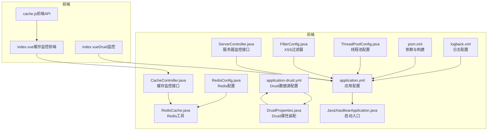
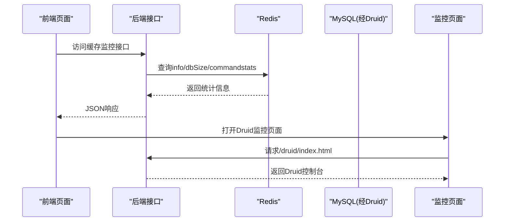
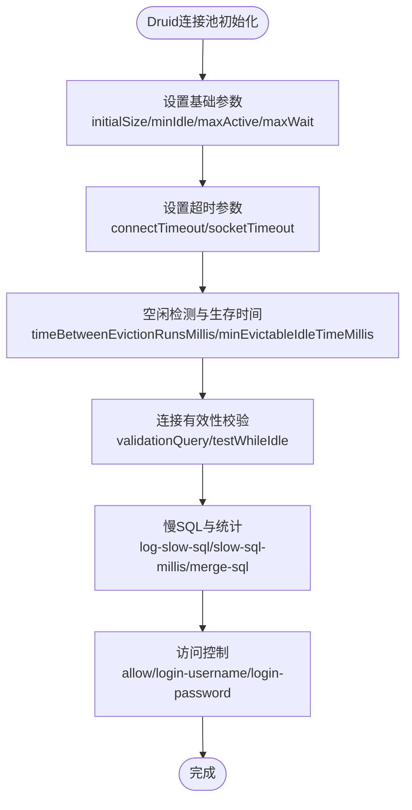
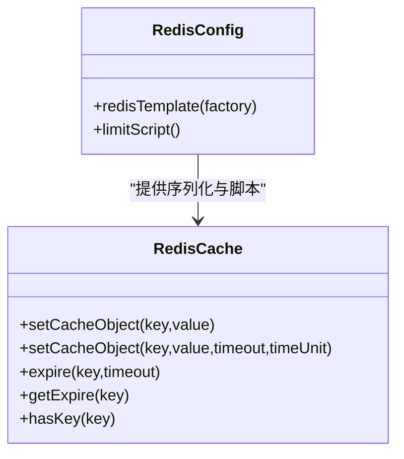
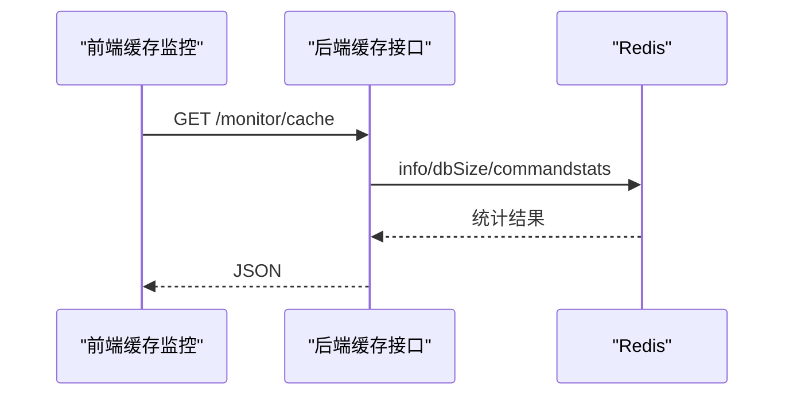
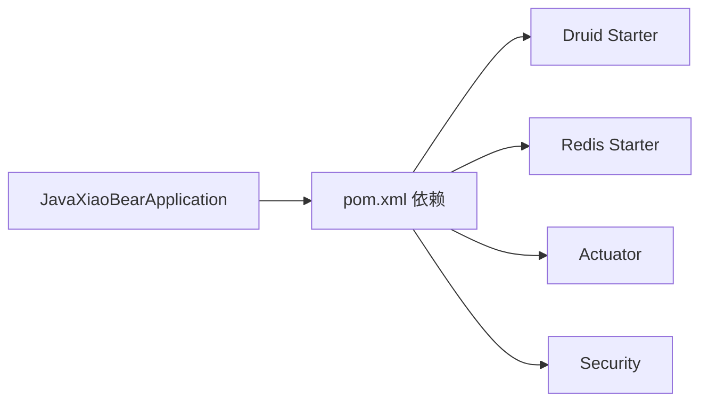

# 生产环境优化

<cite>
**本文引用的文件**
- [application.yml](file://bearjia-admin-backend/src/main/resources/application.yml)
- [application-druid.yml](file://bearjia-admin-backend/src/main/resources/application-druid.yml)
- [logback.xml](file://bearjia-admin-backend/src/main/resources/logback.xml)
- [pom.xml](file://bearjia-admin-backend/pom.xml)
- [JavaXiaoBearApplication.java](file://bearjia-admin-backend/src/main/java/com/javaxiaobear/JavaXiaoBearApplication.java)
- [ThreadPoolConfig.java](file://bearjia-admin-backend/src/main/java/com/javaxiaobear/base/framework/config/ThreadPoolConfig.java)
- [RedisConfig.java](file://bearjia-admin-backend/src/main/java/com/javaxiaobear/base/framework/config/RedisConfig.java)
- [RedisCache.java](file://bearjia-admin-backend/src/main/java/com/javaxiaobear/base/framework/redis/RedisCache.java)
- [DruidProperties.java](file://bearjia-admin-backend/src/main/java/com/javaxiaobear/base/framework/config/properties/DruidProperties.java)
- [FilterConfig.java](file://bearjia-admin-backend/src/main/java/com/javaxiaobear/base/framework/config/FilterConfig.java)
- [CacheController.java](file://bearjia-admin-backend/src/main/java/com/javaxiaobear/module/monitor/controller/CacheController.java)
- [ServerController.java](file://bearjia-admin-backend/src/main/java/com/javaxiaobear/module/monitor/controller/ServerController.java)
- [index.vue（Druid监控）](file://bear-jia-vue3/src/views/monitor/druid/index.vue)
- [index.vue（缓存监控前端）](file://bear-jia-vue3/src/views/monitor/cache/index.vue)
- [cache.js（前端API）](file://bear-jia-vue3/src/api/monitor/cache.js)
- [messages.properties](file://bearjia-admin-backend/src/main/resources/i18n/messages.properties)
- [spring-devtools.properties](file://bearjia-admin-backend/src/main/resources/META-INF/spring-devtools.properties)
</cite>

## 目录
1. [简介](#简介)
2. [项目结构](#项目结构)
3. [核心组件](#核心组件)
4. [架构总览](#架构总览)
5. [详细组件分析](#详细组件分析)
6. [依赖关系分析](#依赖关系分析)
7. [性能考虑](#性能考虑)
8. [故障排查指南](#故障排查指南)
9. [结论](#结论)
10. [附录：生产环境检查清单](#附录生产环境检查清单)

## 简介
本指南面向生产环境，聚焦于性能调优与安全加固，结合仓库现有配置与实现，给出可落地的优化建议与最佳实践。内容涵盖：
- JVM调优：堆内存与GC参数建议、JVM运行参数配置要点
- 数据库连接池：基于Druid的连接池参数与监控配置
- 日志优化：logback配置与滚动策略
- 安全配置：HTTPS、安全响应头、防火墙与访问控制
- 监控集成：Druid监控页面访问权限、系统监控指标
- 缓存优化：Redis连接池与超时配置
- 生产检查清单：性能测试、安全扫描、备份策略

## 项目结构
后端采用Spring Boot工程，配置集中在resources目录，前端位于bear-jia-vue3。生产环境优化涉及后端配置文件、线程池、Redis、Druid、日志与监控接口等。

图表来源
- [application.yml](file://bearjia-admin-backend/src/main/resources/application.yml#L1-L134)
- [application-druid.yml](file://bearjia-admin-backend/src/main/resources/application-druid.yml#L1-L63)
- [logback.xml](file://bearjia-admin-backend/src/main/resources/logback.xml#L1-L93)
- [pom.xml](file://bearjia-admin-backend/pom.xml#L1-L257)
- [ThreadPoolConfig.java](file://bearjia-admin-backend/src/main/java/com/javaxiaobear/base/framework/config/ThreadPoolConfig.java#L1-L63)
- [RedisConfig.java](file://bearjia-admin-backend/src/main/java/com/javaxiaobear/base/framework/config/RedisConfig.java#L1-L69)
- [RedisCache.java](file://bearjia-admin-backend/src/main/java/com/javaxiaobear/base/framework/redis/RedisCache.java#L1-L95)
- [DruidProperties.java](file://bearjia-admin-backend/src/main/java/com/javaxiaobear/base/framework/config/properties/DruidProperties.java#L43-L74)
- [FilterConfig.java](file://bearjia-admin-backend/src/main/java/com/javaxiaobear/base/framework/config/FilterConfig.java#L37-L58)
- [CacheController.java](file://bearjia-admin-backend/src/main/java/com/javaxiaobear/module/monitor/controller/CacheController.java#L1-L94)
- [ServerController.java](file://bearjia-admin-backend/src/main/java/com/javaxiaobear/module/monitor/controller/ServerController.java#L1-L27)
- [JavaXiaoBearApplication.java](file://bearjia-admin-backend/src/main/java/com/javaxiaobear/JavaXiaoBearApplication.java#L1-L22)
- [index.vue（Druid监控）](file://bear-jia-vue3/src/views/monitor/druid/index.vue#L1-L107)
- [index.vue（缓存监控前端）](file://bear-jia-vue3/src/views/monitor/cache/index.vue#L1-L26)
- [cache.js（前端API）](file://bear-jia-vue3/src/api/monitor/cache.js#L1-L57)

章节来源
- [application.yml](file://bearjia-admin-backend/src/main/resources/application.yml#L1-L134)
- [pom.xml](file://bearjia-admin-backend/pom.xml#L1-L257)

## 核心组件
- 应用配置与环境变量：通过profile、端口、Tomcat线程池、日志级别、Redis连接池、JWT密钥、XSS防护等集中管理。
- Druid连接池：主从库、初始/最小/最大连接数、等待/连接/网络超时、空闲检测、慢SQL记录、白名单与登录凭据。
- 日志系统：按级别滚动、按日期归档、控制台输出与文件输出分离。
- 线程池：核心/最大/队列容量/存活时间、拒绝策略。
- Redis：序列化策略、连接工厂、限流脚本、缓存工具类。
- 监控接口：缓存监控、服务器监控、Druid监控页面集成。
- 安全过滤：XSS过滤器、JWT密钥、国际化错误消息。

章节来源
- [application.yml](file://bearjia-admin-backend/src/main/resources/application.yml#L1-L134)
- [application-druid.yml](file://bearjia-admin-backend/src/main/resources/application-druid.yml#L1-L63)
- [logback.xml](file://bearjia-admin-backend/src/main/resources/logback.xml#L1-L93)
- [ThreadPoolConfig.java](file://bearjia-admin-backend/src/main/java/com/javaxiaobear/base/framework/config/ThreadPoolConfig.java#L1-L63)
- [RedisConfig.java](file://bearjia-admin-backend/src/main/java/com/javaxiaobear/base/framework/config/RedisConfig.java#L1-L69)
- [RedisCache.java](file://bearjia-admin-backend/src/main/java/com/javaxiaobear/base/framework/redis/RedisCache.java#L1-L95)
- [CacheController.java](file://bearjia-admin-backend/src/main/java/com/javaxiaobear/module/monitor/controller/CacheController.java#L1-L94)
- [ServerController.java](file://bearjia-admin-backend/src/main/java/com/javaxiaobear/module/monitor/controller/ServerController.java#L1-L27)
- [FilterConfig.java](file://bearjia-admin-backend/src/main/java/com/javaxiaobear/base/framework/config/FilterConfig.java#L37-L58)
- [messages.properties](file://bearjia-admin-backend/src/main/resources/i18n/messages.properties#L1-L39)

## 架构总览
后端通过Spring Boot启动，加载多套配置文件，整合Druid连接池、Redis缓存、线程池与监控能力。前端通过API访问后端监控接口，Druid监控页面通过iframe嵌入。

图表来源
- [CacheController.java](file://bearjia-admin-backend/src/main/java/com/javaxiaobear/module/monitor/controller/CacheController.java#L1-L94)
- [RedisCache.java](file://bearjia-admin-backend/src/main/java/com/javaxiaobear/base/framework/redis/RedisCache.java#L1-L95)
- [index.vue（Druid监控）](file://bear-jia-vue3/src/views/monitor/druid/index.vue#L1-L107)

## 详细组件分析

### JVM调优
- 当前运行参数：通过JVM输入参数查看运行时参数，便于评估是否需要调整堆大小与GC策略。
- 建议：
  - 堆内存：根据业务峰值QPS与对象分配速率，设定合理的-Xms与-Xmx，避免频繁Full GC。
  - GC：优先选用G1或ZGC（JDK 11+），结合-XX:+UseStringDeduplication、-XX:+UseNUMA等参数优化。
  - 其他：开启-XX:+PrintGCApplicationStoppedTime、-XX:+PrintGCApplicationConcurrentTime，配合日志滚动分析GC停顿。
- 参考实现位置：JVM信息采集用于监控。

章节来源
- [Jvm.java](file://bearjia-admin-backend/src/main/java/com/javaxiaobear/base/framework/web/domain/server/Jvm.java#L1-L130)
- [Server.java](file://bearjia-admin-backend/src/main/java/com/javaxiaobear/base/framework/web/domain/server/Server.java#L42-L227)

### 数据库连接池（Druid）
- 关键参数（摘自配置）：
  - 初始连接数、最小空闲、最大活跃、最大等待、连接超时、socket超时、空闲检测间隔、最小/最大空闲生存时间、校验查询、白名单、登录凭据、慢SQL记录阈值。
- 建议：
  - 最大活跃连接数应与数据库最大连接数相匹配，并留有余量。
  - 合理设置maxWait与connectTimeout，避免请求堆积。
  - 启用testWhileIdle并配置validationQuery，确保连接有效性。
  - 慢SQL记录开启，定期审计慢查询。
  - 白名单仅允许内网访问，登录凭据务必通过环境变量注入。
- 参考实现位置：Druid属性装配与监控页面。

图表来源
- [application-druid.yml](file://bearjia-admin-backend/src/main/resources/application-druid.yml#L1-L63)
- [DruidProperties.java](file://bearjia-admin-backend/src/main/java/com/javaxiaobear/base/framework/config/properties/DruidProperties.java#L43-L74)

章节来源
- [application-druid.yml](file://bearjia-admin-backend/src/main/resources/application-druid.yml#L1-L63)
- [DruidProperties.java](file://bearjia-admin-backend/src/main/java/com/javaxiaobear/base/framework/config/properties/DruidProperties.java#L43-L74)

### 日志优化（logback）
- 当前策略：
  - 控制台输出与文件输出分离，按级别过滤（INFO/ERROR）。
  - 按日期滚动，保留历史天数。
  - 多个日志文件（系统、错误、用户操作）。
- 建议：
  - 生产环境将root日志级别提升至WARN或ERROR，减少IO压力。
  - 对热点模块单独降级到DEBUG，其他模块保持INFO。
  - 限制单文件大小与保留天数，避免磁盘膨胀。
  - 使用异步Appender（如Async）提升吞吐。
- 参考实现位置：logback.xml配置。

章节来源
- [logback.xml](file://bearjia-admin-backend/src/main/resources/logback.xml#L1-L93)

### 线程池优化
- 当前配置：
  - 核心线程池大小、最大线程池大小、队列容量、空闲存活时间、拒绝策略。
- 建议：
  - IO密集型任务适当提高最大线程数，CPU密集型降低最大线程数。
  - 队列容量与拒绝策略需结合业务峰值与SLA，避免长时间排队。
  - 监控线程池拒绝次数与队列长度，动态扩容或限流。
- 参考实现位置：线程池配置类。

章节来源
- [ThreadPoolConfig.java](file://bearjia-admin-backend/src/main/java/com/javaxiaobear/base/framework/config/ThreadPoolConfig.java#L1-L63)

### 缓存优化（Redis）
- 当前配置：
  - 连接超时、连接池最小/最大空闲、最大连接数、最大等待时间。
  - RedisTemplate序列化策略、限流脚本。
- 建议：
  - 根据实例容量与并发，合理设置max-active与max-wait，避免阻塞。
  - 为不同场景设置过期策略与淘汰策略，避免内存溢出。
  - 对热点Key设置短TTL，配合预热与双写策略。
  - 使用pipeline批量操作，减少RTT。
- 参考实现位置：Redis配置与缓存工具类。

图表来源
- [RedisConfig.java](file://bearjia-admin-backend/src/main/java/com/javaxiaobear/base/framework/config/RedisConfig.java#L1-L69)
- [RedisCache.java](file://bearjia-admin-backend/src/main/java/com/javaxiaobear/base/framework/redis/RedisCache.java#L1-L95)

章节来源
- [application.yml](file://bearjia-admin-backend/src/main/resources/application.yml#L70-L91)
- [RedisConfig.java](file://bearjia-admin-backend/src/main/java/com/javaxiaobear/base/framework/config/RedisConfig.java#L1-L69)
- [RedisCache.java](file://bearjia-admin-backend/src/main/java/com/javaxiaobear/base/framework/redis/RedisCache.java#L1-L95)

### 安全配置
- HTTPS与安全头：建议在网关或Tomcat层启用HTTPS，配置安全响应头（如X-Content-Type-Options、X-Frame-Options、Strict-Transport-Security、Content-Security-Policy）。
- 访问控制：Druid监控页面白名单仅允许内网访问，登录凭据通过环境变量注入。
- XSS防护：已启用XSS过滤器，URL匹配范围与排除列表需结合业务调整。
- JWT密钥：生产环境通过环境变量设置更复杂的密钥。
- 参考实现位置：XSS过滤器、Druid监控配置、JWT配置。

章节来源
- [application-druid.yml](file://bearjia-admin-backend/src/main/resources/application-druid.yml#L44-L63)
- [FilterConfig.java](file://bearjia-admin-backend/src/main/java/com/javaxiaobear/base/framework/config/FilterConfig.java#L37-L58)
- [application.yml](file://bearjia-admin-backend/src/main/resources/application.yml#L92-L100)

### 监控集成
- Druid监控页面：通过iframe嵌入前端页面，登录凭据与白名单由后端配置。
- 缓存监控：后端提供缓存信息、命令统计、键名查询与清理接口，前端展示Redis基本信息。
- 服务器监控：后端采集CPU、内存、JVM、磁盘等信息。
- 参考实现位置：Druid前端页面、缓存与服务器监控控制器。

图表来源
- [index.vue（缓存监控前端）](file://bear-jia-vue3/src/views/monitor/cache/index.vue#L1-L26)
- [cache.js（前端API）](file://bear-jia-vue3/src/api/monitor/cache.js#L1-L57)
- [CacheController.java](file://bearjia-admin-backend/src/main/java/com/javaxiaobear/module/monitor/controller/CacheController.java#L1-L94)

章节来源
- [index.vue（Druid监控）](file://bear-jia-vue3/src/views/monitor/druid/index.vue#L1-L107)
- [CacheController.java](file://bearjia-admin-backend/src/main/java/com/javaxiaobear/module/monitor/controller/CacheController.java#L1-L94)
- [ServerController.java](file://bearjia-admin-backend/src/main/java/com/javaxiaobear/module/monitor/controller/ServerController.java#L1-L27)

## 依赖关系分析
- 启动入口排除数据源自动配置，结合Druid Starter使用自定义配置。
- Actuator已引入，可用于暴露健康检查与指标端点。
- Maven依赖包含Druid、Redis、JWT、分页插件等。

图表来源
- [JavaXiaoBearApplication.java](file://bearjia-admin-backend/src/main/java/com/javaxiaobear/JavaXiaoBearApplication.java#L1-L22)
- [pom.xml](file://bearjia-admin-backend/pom.xml#L1-L257)

章节来源
- [JavaXiaoBearApplication.java](file://bearjia-admin-backend/src/main/java/com/javaxiaobear/JavaXiaoBearApplication.java#L1-L22)
- [pom.xml](file://bearjia-admin-backend/pom.xml#L1-L257)

## 性能考虑
- JVM：根据业务特征选择合适GC，设置堆大小与GC日志，结合监控指标持续优化。
- 数据库：合理设置连接池参数，启用慢SQL监控与SQL审计，定期优化索引。
- 缓存：热点数据预热、合理TTL、批量操作、pipeline与连接池优化。
- 线程池：根据任务类型调整核心/最大线程数与队列容量，关注拒绝策略与队列长度。
- 日志：生产环境降低日志级别与文件大小，必要时使用异步Appender。
- 监控：启用Actuator端点，结合外部监控平台（如Prometheus/Grafana）采集指标。

## 故障排查指南
- Druid监控页面无法访问：
  - 检查后端是否启用statViewServlet与白名单配置。
  - 确认登录凭据与访问路径。
  - 前端iframe加载失败时，检查后端端口与上下文路径。
- 缓存监控异常：
  - 检查Redis连接配置与连通性。
  - 查看后端缓存接口返回的info/dbSize/commandstats。
- 日志过大：
  - 检查logback滚动策略与保留天数。
  - 提升root日志级别，减少INFO/DEBUG输出。
- 线程池拒绝：
  - 观察拒绝次数与队列长度，评估扩容或限流策略。
- XSS防护导致请求被拦截：
  - 检查URL匹配范围与排除列表，避免误伤业务接口。

章节来源
- [application-druid.yml](file://bearjia-admin-backend/src/main/resources/application-druid.yml#L44-L63)
- [index.vue（Druid监控）](file://bear-jia-vue3/src/views/monitor/druid/index.vue#L1-L107)
- [CacheController.java](file://bearjia-admin-backend/src/main/java/com/javaxiaobear/module/monitor/controller/CacheController.java#L1-L94)
- [logback.xml](file://bearjia-admin-backend/src/main/resources/logback.xml#L1-L93)
- [ThreadPoolConfig.java](file://bearjia-admin-backend/src/main/java/com/javaxiaobear/base/framework/config/ThreadPoolConfig.java#L1-L63)
- [FilterConfig.java](file://bearjia-admin-backend/src/main/java/com/javaxiaobear/base/framework/config/FilterConfig.java#L37-L58)

## 结论
本指南基于现有配置与实现，提出生产环境优化建议。建议在上线前完成JVM参数评估、连接池与缓存参数校准、日志策略收敛、安全访问控制与监控集成，并制定性能测试与安全扫描计划，确保系统稳定、可观测、可扩展。

## 附录：生产环境检查清单
- JVM
  - 是否设置合理的-Xms/-Xmx与GC策略
  - 是否开启GC日志与停顿分析
- 数据库
  - Druid连接池参数是否与数据库最大连接匹配
  - 是否启用慢SQL记录与SQL审计
  - 白名单与登录凭据是否通过环境变量注入
- 缓存
  - Redis连接池参数是否满足并发需求
  - 是否设置合理的TTL与淘汰策略
  - 是否使用pipeline与批量操作
- 日志
  - 生产环境日志级别是否降至WARN/ERROR
  - 是否启用异步Appender与滚动策略
- 安全
  - 是否启用HTTPS与安全响应头
  - 是否配置防火墙与访问控制
  - XSS过滤器URL匹配是否覆盖关键路径
- 监控
  - Druid监控页面白名单与登录凭据
  - 缓存与服务器监控接口是否可用
  - Actuator端点是否受控开放
- 测试与备份
  - 是否完成性能压测与容量规划
  - 是否完成安全扫描与渗透测试
  - 是否制定数据备份与恢复演练