# 部署指南

<cite>
**本文档引用的文件**  
- [package.json](file://bear-jia-vue3/package.json)
- [vite.config.js](file://bear-jia-vue3/vite.config.js)
- [.env](file://bear-jia-vue3/.env)
- [.env.test](file://bear-jia-vue3/.env.test)
- [application.yml](file://bearjia-admin-backend/src/main/resources/application.yml)
- [application-druid.yml](file://bearjia-admin-backend/src/main/resources/application-druid.yml)
- [pom.xml](file://bearjia-admin-backend/pom.xml)
- [JavaXiaoBearApplication.java](file://bearjia-admin-backend/src/main/java/com/javaxiaobear/JavaXiaoBearApplication.java)
- [ruoyi-usage.md](file://bear-jia-vue3/docs/ruoyi-usage.md)
</cite>

## 目录
1. [简介](#简介)
2. [项目结构](#项目结构)
3. [传统部署方案](#传统部署方案)
4. [Docker容器化部署](#docker容器化部署)
5. [Nginx配置](#nginx配置)
6. [生产环境配置](#生产环境配置)
7. [环境变量管理](#环境变量管理)
8. [监控和日志](#监控和日志)
9. [安全加固](#安全加固)
10. [部署检查清单](#部署检查清单)
11. [故障排查指南](#故障排查指南)

## 简介
本部署指南为BearJia管理系统提供从开发环境到生产环境的完整部署方案。系统由前端Vue3应用和后端Spring Boot应用组成，支持传统部署和Docker容器化部署两种方式。前端使用Vite构建，后端基于Spring Boot框架，通过Nginx实现反向代理和静态资源服务。

**Section sources**
- [ruoyi-usage.md](file://bear-jia-vue3/docs/ruoyi-usage.md#L616-L663)

## 项目结构
项目包含三个主要模块：前端Vue3应用、后端Spring Boot应用和H5移动端应用。前端应用位于`bear-jia-vue3`目录，后端应用位于`bearjia-admin-backend`目录。

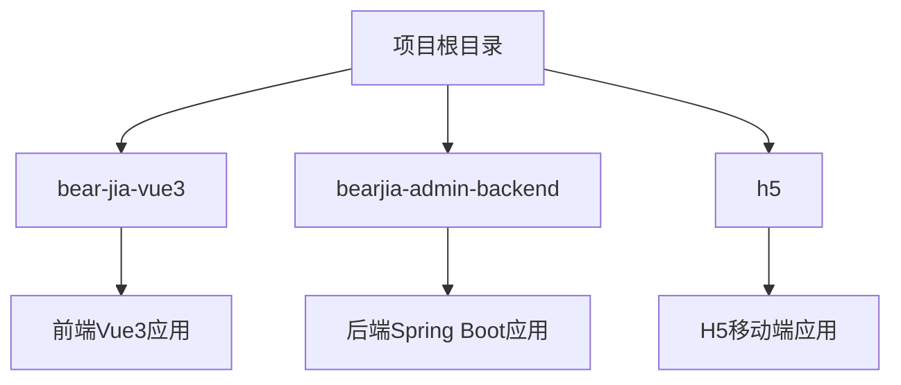

**Diagram sources**
- [bear-jia-vue3](file://bear-jia-vue3)
- [bearjia-admin-backend](file://bearjia-admin-backend)

## 传统部署方案
传统部署方案包括前端静态文件部署到Nginx和后端打包为JAR文件运行。

### 前端部署
前端使用Vite构建工具，通过npm脚本进行构建和部署。

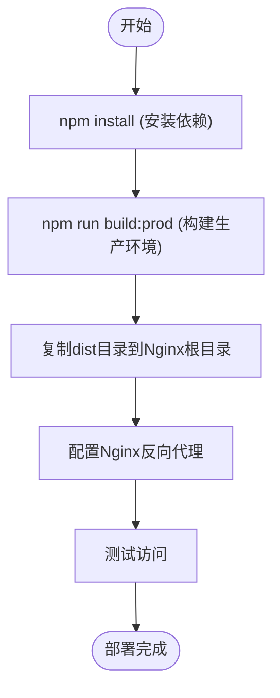

**Diagram sources**
- [package.json](file://bear-jia-vue3/package.json#L1-L64)
- [vite.config.js](file://bear-jia-vue3/vite.config.js#L1-L9)

### 后端部署
后端使用Maven打包为可执行JAR文件，通过Java命令运行。

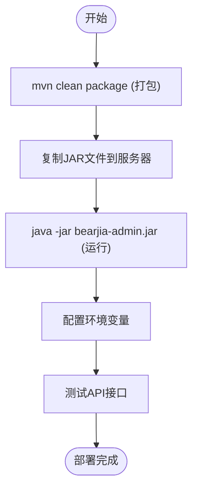

**Diagram sources**
- [pom.xml](file://bearjia-admin-backend/pom.xml#L1-L257)
- [JavaXiaoBearApplication.java](file://bearjia-admin-backend/src/main/java/com/javaxiaobear/JavaXiaoBearApplication.java#L1-L22)

**Section sources**
- [pom.xml](file://bearjia-admin-backend/pom.xml#L1-L257)
- [JavaXiaoBearApplication.java](file://bearjia-admin-backend/src/main/java/com/javaxiaobear/JavaXiaoBearApplication.java#L1-L22)

## Docker容器化部署
Docker容器化部署使用Dockerfile构建前端和后端镜像，并通过docker-compose管理多容器应用。

### Dockerfile配置
为前端和后端分别创建Dockerfile。

```mermaid
classDiagram
class FrontendDockerfile {
+FROM node : 16-alpine
+WORKDIR /app
+COPY package*.json ./
+RUN npm install
+COPY . .
+RUN npm run build : prod
+FROM nginx : alpine
+COPY --from=builder /app/dist /usr/share/nginx/html
+COPY nginx.conf /etc/nginx/nginx.conf
}
class BackendDockerfile {
+FROM openjdk : 8-jdk-alpine
+VOLUME /tmp
+ARG JAR_FILE=target/*.jar
+COPY ${JAR_FILE} app.jar
+ENTRYPOINT ["java","-Djava.security.egd=file : /dev/./urandom","-jar","/app.jar"]
}
class DockerCompose {
+version : '3.8'
+services :
+frontend :
+ build : ./bear-jia-vue3
+ ports : 80 : 80
+backend :
+ build : ./bearjia-admin-backend
+ ports : 8081 : 8081
+ environment :
+ - DB_URL
+ - DB_USERNAME
+ - DB_PASSWORD
}
```

**Diagram sources**
- [package.json](file://bear-jia-vue3/package.json#L1-L64)
- [pom.xml](file://bearjia-admin-backend/pom.xml#L1-L257)

### docker-compose配置
使用docker-compose.yml文件管理多容器应用。

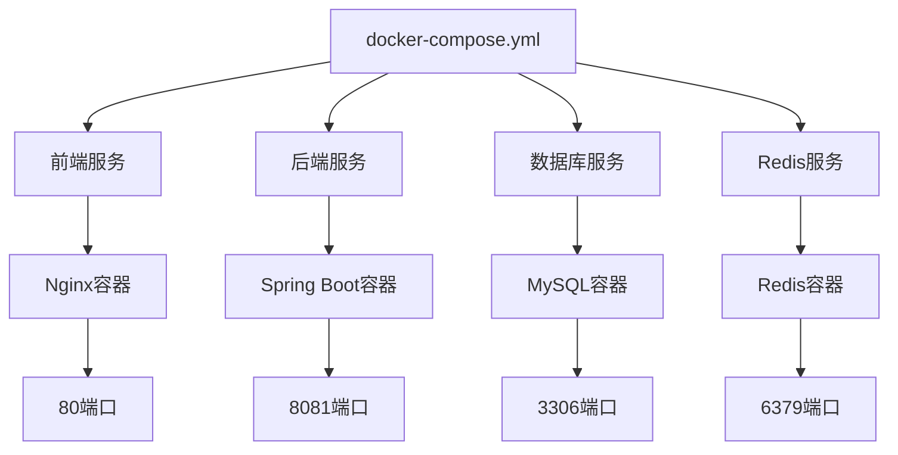

**Diagram sources**
- [application.yml](file://bearjia-admin-backend/src/main/resources/application.yml#L1-L134)
- [application-druid.yml](file://bearjia-admin-backend/src/main/resources/application-druid.yml#L1-L63)

**Section sources**
- [application.yml](file://bearjia-admin-backend/src/main/resources/application.yml#L1-L134)
- [application-druid.yml](file://bearjia-admin-backend/src/main/resources/application-druid.yml#L1-L63)

## Nginx配置
Nginx配置包括反向代理设置、静态资源服务和负载均衡配置。

### 反向代理配置
配置Nginx反向代理，将前端请求转发到后端服务。

```nginx
server {
    listen 80;
    server_name your-domain.com;
    root /var/www/bear-jia-vue3/dist;

    location / {
        try_files $uri $uri/ /index.html;
    }

    location /prod-api/ {
        proxy_pass http://localhost:8081/;
        proxy_set_header Host $host;
    }
}
```

**Section sources**
- [ruoyi-usage.md](file://bear-jia-vue3/docs/ruoyi-usage.md#L616-L633)

### 负载均衡配置
配置Nginx负载均衡，分发请求到多个后端实例。

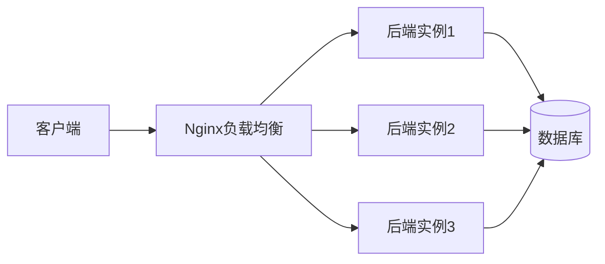

**Diagram sources**
- [application.yml](file://bearjia-admin-backend/src/main/resources/application.yml#L1-L134)

## 生产环境配置
生产环境配置包括数据库连接池调优、JVM参数设置和日志级别配置。

### 数据库连接池调优
在`application-druid.yml`中配置Druid连接池参数。

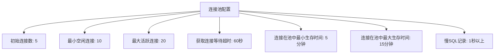

**Diagram sources**
- [application-druid.yml](file://bearjia-admin-backend/src/main/resources/application-druid.yml#L1-L63)

### JVM参数设置
设置JVM参数以优化性能和内存使用。

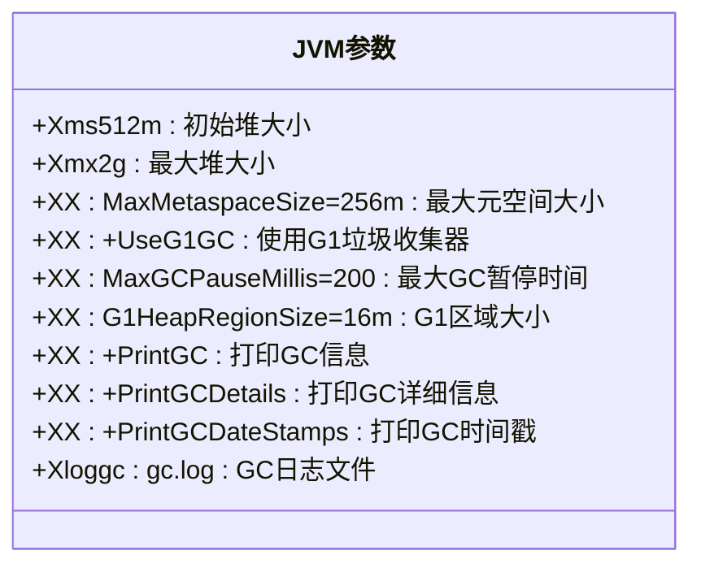

**Diagram sources**
- [pom.xml](file://bearjia-admin-backend/pom.xml#L1-L257)

### 日志级别配置
在`application.yml`中配置日志级别。

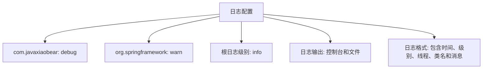

**Diagram sources**
- [application.yml](file://bearjia-admin-backend/src/main/resources/application.yml#L35-L40)

**Section sources**
- [application.yml](file://bearjia-admin-backend/src/main/resources/application.yml#L35-L40)

## 环境变量管理
通过环境变量管理不同环境（开发、测试、生产）的配置差异。

### 环境变量配置
使用`.env`文件管理不同环境的配置。

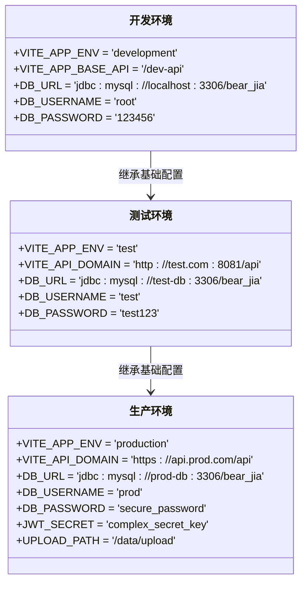

**Diagram sources**
- [.env](file://bear-jia-vue3/.env#L1-L7)
- [.env.test](file://bear-jia-vue3/.env.test#L1-L6)
- [application.yml](file://bearjia-admin-backend/src/main/resources/application.yml#L1-L134)

**Section sources**
- [.env](file://bear-jia-vue3/.env#L1-L7)
- [.env.test](file://bear-jia-vue3/.env.test#L1-L6)

## 监控和日志
集成系统监控、日志收集和分析功能。

### 监控配置
使用Spring Boot Actuator和Druid监控。

```mermaid
graph TD
A[监控系统] --> B[Spring Boot Actuator]
A --> C[Druid监控]
A --> D[Prometheus]
A --> E[Grafana]
B --> F[/actuator/health]
B --> G[/actuator/metrics]
B --> H[/actuator/info]
C --> I[SQL监控]
C --> J[连接池监控]
C --> K[Web应用监控]
D --> L[指标收集]
E --> M[可视化展示]
```

**Diagram sources**
- [pom.xml](file://bearjia-admin-backend/pom.xml#L205-L209)
- [application-druid.yml](file://bearjia-admin-backend/src/main/resources/application-druid.yml#L44-L54)

### 日志收集
配置日志收集和分析。

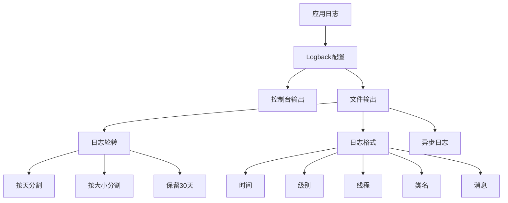

**Diagram sources**
- [application.yml](file://bearjia-admin-backend/src/main/resources/application.yml#L35-L40)
- [logback.xml](file://bearjia-admin-backend/src/main/resources/logback.xml)

## 安全加固
实施安全加固措施，包括防火墙设置、HTTPS配置和安全头设置。

### 安全配置
实施全面的安全加固措施。

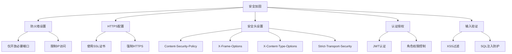

**Diagram sources**
- [application.yml](file://bearjia-admin-backend/src/main/resources/application.yml#L116-L123)
- [pom.xml](file://bearjia-admin-backend/pom.xml#L74-L78)

**Section sources**
- [application.yml](file://bearjia-admin-backend/src/main/resources/application.yml#L116-L123)

## 部署检查清单
提供完整的部署检查清单，确保部署过程的完整性和正确性。

### 检查清单
```mermaid
flowchart TD
A[部署检查清单] --> B[端口开放]
A --> C[服务启动]
A --> D[健康检查]
A --> E[配置验证]
A --> F[安全检查]
B --> G[前端: 80端口]
B --> H[后端: 8081端口]
B --> I[数据库: 3306端口]
B --> J[Redis: 6379端口]
C --> K[前端服务运行]
C --> L[后端服务运行]
C --> M[数据库服务运行]
C --> N[Redis服务运行]
D --> O[/health接口返回200]
D --> P[数据库连接正常]
D --> Q[Redis连接正常]
E --> R[环境变量正确]
E --> S[数据库配置正确]
E --> T[日志配置正确]
F --> U[防火墙规则正确]
F --> V[HTTPS配置正确]
F --> W[安全头设置正确]
```

**Diagram sources**
- [application.yml](file://bearjia-admin-backend/src/main/resources/application.yml#L18-L24)
- [pom.xml](file://bearjia-admin-backend/pom.xml#L205-L209)

## 故障排查指南
提供常见部署问题的解决方案。

### 常见问题
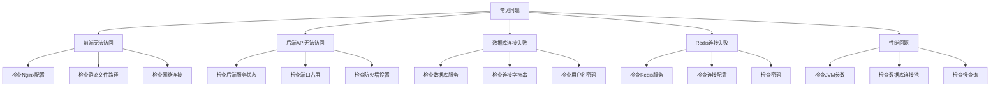

**Diagram sources**
- [application.yml](file://bearjia-admin-backend/src/main/resources/application.yml#L70-L91)
- [application-druid.yml](file://bearjia-admin-backend/src/main/resources/application-druid.yml#L22-L38)

**Section sources**
- [application.yml](file://bearjia-admin-backend/src/main/resources/application.yml#L70-L91)
- [application-druid.yml](file://bearjia-admin-backend/src/main/resources/application-druid.yml#L22-L38)